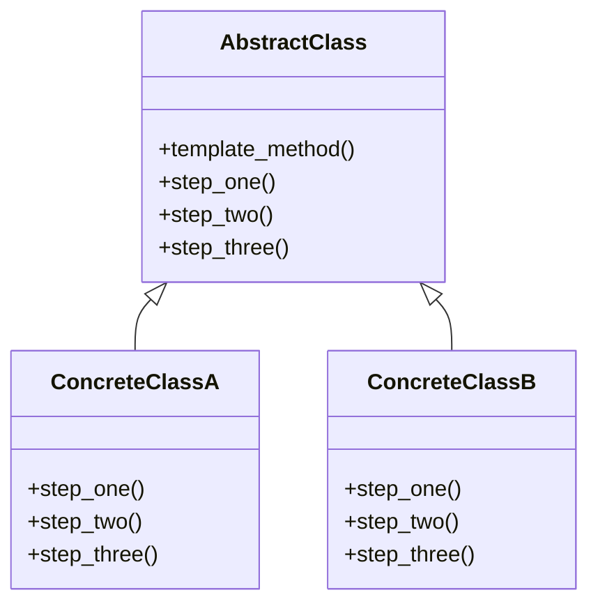

## 6.10 Template Method Pattern

### Introduction

The Template Method Pattern is a behavioral design pattern that defines the skeleton of an algorithm in a method, deferring some steps to subclasses. This pattern allows subclasses to redefine certain steps of an algorithm without changing its structure. It is particularly useful for code reuse and enforcing method sequences, ensuring that the overall algorithm remains consistent while allowing flexibility in specific steps.

### Intent

The primary intent of the Template Method Pattern is to define the outline of an algorithm in a base class and allow subclasses to implement specific steps. This pattern promotes code reuse by encapsulating the invariant parts of an algorithm in a base class and deferring the variant parts to subclasses.

### Problem Addressed

In software development, it is common to encounter scenarios where multiple classes share a similar algorithmic structure but differ in specific steps. Without a structured approach, this can lead to code duplication and maintenance challenges. The Template Method Pattern addresses these issues by:

- **Encapsulating Invariant Steps**: It defines the common steps of an algorithm in a base class, ensuring consistency across different implementations.
- **Allowing Customization**: Subclasses can override specific steps, providing flexibility without altering the overall algorithm.
- **Promoting Code Reuse**: By centralizing the common logic, the pattern reduces code duplication and enhances maintainability.

### Implementing the Template Method Pattern in Ruby

Ruby's dynamic nature and support for object-oriented programming make it an ideal language for implementing the Template Method Pattern. Let's explore how to implement this pattern using Ruby's inheritance and modules.

#### Defining Abstract Methods

In Ruby, abstract methods are typically defined by raising a `NotImplementedError` in the base class. This signals that subclasses must implement these methods.

```ruby
class AbstractClass
  def template_method
    step_one
    step_two
    step_three
  end

  def step_one
    raise NotImplementedError, "#{self.class} has not implemented method '#{__method__}'"
  end

  def step_two
    raise NotImplementedError, "#{self.class} has not implemented method '#{__method__}'"
  end

  def step_three
    raise NotImplementedError, "#{self.class} has not implemented method '#{__method__}'"
  end
end
```

#### Subclassing to Implement Specific Steps

Subclasses inherit from the base class and implement the abstract methods.

```ruby
class ConcreteClassA < AbstractClass
  def step_one
    puts "ConcreteClassA: Step One"
  end

  def step_two
    puts "ConcreteClassA: Step Two"
  end

  def step_three
    puts "ConcreteClassA: Step Three"
  end
end

class ConcreteClassB < AbstractClass
  def step_one
    puts "ConcreteClassB: Step One"
  end

  def step_two
    puts "ConcreteClassB: Step Two"
  end

  def step_three
    puts "ConcreteClassB: Step Three"
  end
end
```

#### Using Modules for Reusability

Ruby modules can be used to define shared behavior, allowing multiple classes to include the same template method logic.

```ruby
module TemplateMethod
  def template_method
    step_one
    step_two
    step_three
  end
end

class ConcreteClassC
  include TemplateMethod

  def step_one
    puts "ConcreteClassC: Step One"
  end

  def step_two
    puts "ConcreteClassC: Step Two"
  end

  def step_three
    puts "ConcreteClassC: Step Three"
  end
end
```

### Benefits of the Template Method Pattern

The Template Method Pattern offers several benefits:

- **Code Reuse**: By defining the common algorithm in a base class, code duplication is minimized, and maintenance becomes easier.
- **Enforcing Method Sequences**: The pattern ensures that the algorithm's steps are executed in a specific order, maintaining consistency across different implementations.
- **Flexibility**: Subclasses can customize specific steps, allowing for variations without altering the overall structure.

### Visualizing the Template Method Pattern

To better understand the Template Method Pattern, let's visualize it using a class diagram.



**Diagram Description**: The diagram illustrates the relationship between the `AbstractClass` and its subclasses `ConcreteClassA` and `ConcreteClassB`. The `template_method` is defined in the `AbstractClass`, while the subclasses implement the specific steps.

### Ruby Unique Features

Ruby's dynamic nature and metaprogramming capabilities offer unique advantages when implementing the Template Method Pattern:

- **Dynamic Method Definition**: Ruby allows methods to be defined and redefined at runtime, providing flexibility in implementing abstract methods.
- **Modules and Mixins**: Ruby modules can be used to share behavior across classes, enhancing code reuse and reducing duplication.
- **Duck Typing**: Ruby's duck typing allows objects to be used interchangeably if they implement the required methods, providing flexibility in subclass implementations.

### Differences and Similarities with Other Patterns

The Template Method Pattern is often compared to other behavioral patterns, such as the Strategy Pattern. While both patterns allow for variations in behavior, the Template Method Pattern defines the algorithm's structure in a base class, whereas the Strategy Pattern encapsulates the algorithm in separate strategy classes.

### Try It Yourself

To deepen your understanding of the Template Method Pattern, try modifying the code examples:

- **Add New Steps**: Introduce additional steps in the algorithm and implement them in the subclasses.
- **Use Modules**: Refactor the code to use modules for shared behavior.
- **Experiment with Duck Typing**: Create new subclasses that implement the required methods without inheriting from the base class.

### Knowledge Check

- **What is the primary intent of the Template Method Pattern?**
- **How does the Template Method Pattern promote code reuse?**
- **What are the benefits of using modules in Ruby for the Template Method Pattern?**

### Conclusion

The Template Method Pattern is a powerful tool for defining the skeleton of an algorithm while allowing subclasses to customize specific steps. By leveraging Ruby's unique features, such as dynamic method definition and modules, developers can implement this pattern effectively, promoting code reuse and maintaining consistency across implementations. Remember, this is just the beginning. As you progress, you'll build more complex and interactive applications. Keep experimenting, stay curious, and enjoy the journey!

## Quiz: Template Method Pattern



### What is the primary intent of the Template Method Pattern?

- [x] To define the skeleton of an algorithm in a method, deferring some steps to subclasses.
- [ ] To encapsulate algorithms in separate strategy classes.
- [ ] To allow objects to be used interchangeably if they implement the required methods.
- [ ] To define a family of algorithms and make them interchangeable.

> **Explanation:** The Template Method Pattern defines the skeleton of an algorithm in a method, allowing subclasses to redefine certain steps without changing the algorithm's structure.

### How does the Template Method Pattern promote code reuse?

- [x] By encapsulating the invariant parts of an algorithm in a base class.
- [ ] By allowing subclasses to implement specific steps.
- [ ] By defining the algorithm's structure in separate strategy classes.
- [ ] By using modules to share behavior across classes.

> **Explanation:** The Template Method Pattern promotes code reuse by encapsulating the common logic in a base class, reducing code duplication.

### What is a benefit of using modules in Ruby for the Template Method Pattern?

- [x] Enhancing code reuse and reducing duplication.
- [ ] Allowing methods to be defined and redefined at runtime.
- [ ] Providing flexibility in subclass implementations.
- [ ] Allowing objects to be used interchangeably.

> **Explanation:** Modules in Ruby can be used to share behavior across classes, enhancing code reuse and reducing duplication.

### Which of the following is a key feature of Ruby that aids in implementing the Template Method Pattern?

- [x] Dynamic Method Definition
- [ ] Encapsulation
- [ ] Inheritance
- [ ] Polymorphism

> **Explanation:** Ruby's dynamic method definition allows methods to be defined and redefined at runtime, providing flexibility in implementing abstract methods.

### What is the difference between the Template Method Pattern and the Strategy Pattern?

- [x] The Template Method Pattern defines the algorithm's structure in a base class, while the Strategy Pattern encapsulates the algorithm in separate strategy classes.
- [ ] The Template Method Pattern encapsulates algorithms in separate strategy classes, while the Strategy Pattern defines the algorithm's structure in a base class.
- [ ] The Template Method Pattern allows objects to be used interchangeably, while the Strategy Pattern does not.
- [ ] The Template Method Pattern uses modules to share behavior, while the Strategy Pattern does not.

> **Explanation:** The Template Method Pattern defines the algorithm's structure in a base class, whereas the Strategy Pattern encapsulates the algorithm in separate strategy classes.

### What is the role of the `template_method` in the Template Method Pattern?

- [x] To define the skeleton of the algorithm.
- [ ] To implement specific steps of the algorithm.
- [ ] To encapsulate the algorithm in a separate class.
- [ ] To allow objects to be used interchangeably.

> **Explanation:** The `template_method` defines the skeleton of the algorithm, with specific steps deferred to subclasses.

### How can Ruby's duck typing be utilized in the Template Method Pattern?

- [x] By allowing objects to be used interchangeably if they implement the required methods.
- [ ] By defining methods at runtime.
- [ ] By sharing behavior across classes using modules.
- [ ] By encapsulating the algorithm in separate strategy classes.

> **Explanation:** Ruby's duck typing allows objects to be used interchangeably if they implement the required methods, providing flexibility in subclass implementations.

### What is a common pitfall when using the Template Method Pattern?

- [x] Overcomplicating the base class with too many abstract methods.
- [ ] Encapsulating algorithms in separate strategy classes.
- [ ] Using modules to share behavior across classes.
- [ ] Allowing objects to be used interchangeably.

> **Explanation:** A common pitfall is overcomplicating the base class with too many abstract methods, which can make the pattern difficult to maintain.

### True or False: The Template Method Pattern allows subclasses to change the algorithm's structure.

- [ ] True
- [x] False

> **Explanation:** False. The Template Method Pattern allows subclasses to redefine specific steps, but the overall algorithm's structure remains unchanged.

### Which Ruby feature allows for the implementation of abstract methods in the Template Method Pattern?

- [x] Raising a `NotImplementedError` in the base class.
- [ ] Using modules to share behavior.
- [ ] Defining methods at runtime.
- [ ] Encapsulating algorithms in separate strategy classes.

> **Explanation:** Abstract methods in Ruby are typically implemented by raising a `NotImplementedError` in the base class, signaling that subclasses must implement these methods.


