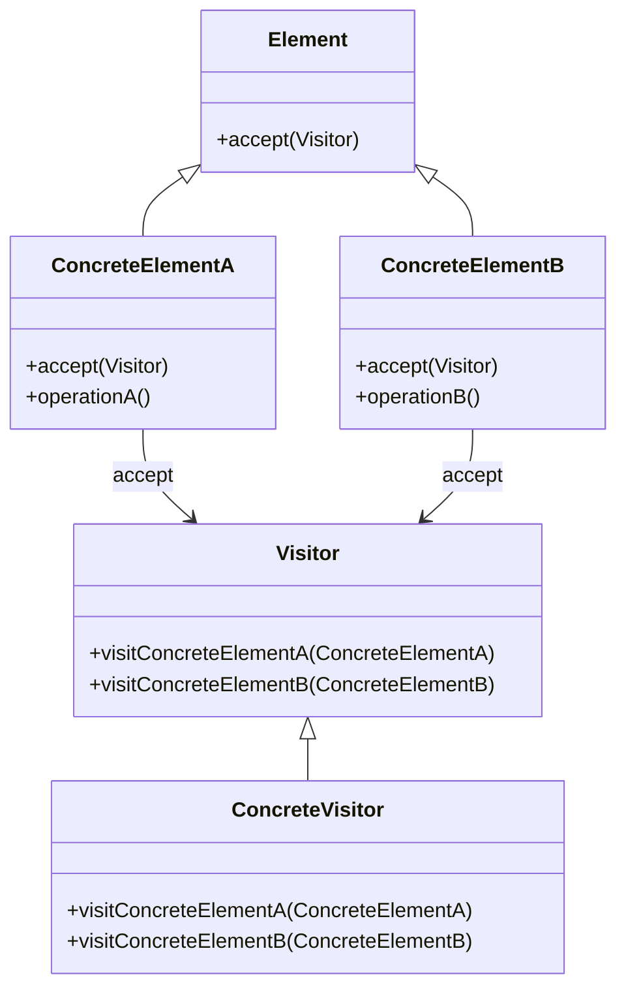

## 6.11 Visitor Pattern

The Visitor pattern is a powerful behavioral design pattern that allows you to define new operations on a set of objects without changing the objects themselves. This pattern is particularly useful when you want to perform operations across a complex object structure, such as a composite pattern, and wish to keep the operations separate from the object structure.

### Intent

The primary intent of the Visitor pattern is to separate an algorithm from the object structure on which it operates. This separation allows you to add new operations without modifying the classes of the elements on which it operates, adhering to the Open/Closed Principle.

### Problem Addressed

In object-oriented programming, adding new functionality to an existing class hierarchy can be challenging, especially if you want to avoid modifying existing classes. The Visitor pattern addresses this problem by allowing you to define new operations externally, thus keeping the class hierarchy stable and unchanged.

### Key Participants

- **Visitor**: Declares a visit operation for each class of ConcreteElement in the object structure.
- **ConcreteVisitor**: Implements each operation declared by Visitor.
- **Element**: Defines an accept operation that takes a visitor as an argument.
- **ConcreteElement**: Implements the accept operation.
- **Object Structure**: Can enumerate its elements and may provide a high-level interface to allow the visitor to visit its elements.

### Applicability

Use the Visitor pattern when:

- You need to perform operations on objects in a complex object structure.
- You want to keep related operations together by defining them in one class.
- The object structure rarely changes, but you often need to define new operations on the structure.

### Diagram



### Implementation in Ruby

In Ruby, the Visitor pattern can be implemented by leveraging its dynamic typing capabilities. Let's explore how to implement this pattern with a practical example.

#### Example: File System Visitor

Imagine a file system where you have different types of files and directories. You want to perform various operations on these files, such as calculating the total size or listing all files. The Visitor pattern can help you achieve this without modifying the file and directory classes.

```ruby
# Define the Visitor interface
class Visitor
  def visit_file(file)
    raise NotImplementedError, 'You must implement the visit_file method'
  end

  def visit_directory(directory)
    raise NotImplementedError, 'You must implement the visit_directory method'
  end
end

# Define the Element interface
class Element
  def accept(visitor)
    raise NotImplementedError, 'You must implement the accept method'
  end
end

# ConcreteElement: File
class File < Element
  attr_reader :name, :size

  def initialize(name, size)
    @name = name
    @size = size
  end

  def accept(visitor)
    visitor.visit_file(self)
  end
end

# ConcreteElement: Directory
class Directory < Element
  attr_reader :name, :elements

  def initialize(name)
    @name = name
    @elements = []
  end

  def add_element(element)
    @elements << element
  end

  def accept(visitor)
    visitor.visit_directory(self)
  end
end

# ConcreteVisitor: SizeCalculator
class SizeCalculator < Visitor
  def visit_file(file)
    file.size
  end

  def visit_directory(directory)
    directory.elements.reduce(0) do |total_size, element|
      total_size + element.accept(self)
    end
  end
end

# ConcreteVisitor: FileLister
class FileLister < Visitor
  def visit_file(file)
    [file.name]
  end

  def visit_directory(directory)
    directory.elements.flat_map do |element|
      element.accept(self)
    end
  end
end

# Usage
root = Directory.new('root')
file1 = File.new('file1.txt', 100)
file2 = File.new('file2.txt', 200)
sub_dir = Directory.new('sub_dir')
sub_file = File.new('sub_file.txt', 50)

root.add_element(file1)
root.add_element(file2)
root.add_element(sub_dir)
sub_dir.add_element(sub_file)

size_calculator = SizeCalculator.new
file_lister = FileLister.new

puts "Total size: #{root.accept(size_calculator)} bytes"
puts "Files: #{root.accept(file_lister).join(', ')}"
```

### Trade-offs

The Visitor pattern offers flexibility by allowing new operations to be added without modifying existing classes. However, it comes with trade-offs:

- **Complexity**: The pattern can increase the complexity of the codebase, especially if there are many different types of visitors and elements.
- **Double Dispatch**: The pattern relies on double dispatch, which can be less intuitive for developers unfamiliar with the concept.
- **Element Stability**: The pattern is best suited for scenarios where the element classes are stable and do not change frequently.

### Benefits

- **Adherence to Open/Closed Principle**: The Visitor pattern allows you to add new functionality without altering existing code, thus adhering to the Open/Closed Principle.
- **Separation of Concerns**: By separating operations from the object structure, the pattern promotes cleaner and more maintainable code.
- **Flexibility**: New operations can be added easily by creating new visitor classes.

### Ruby Unique Features

Ruby's dynamic typing and flexible method dispatch make it particularly well-suited for implementing the Visitor pattern. The use of `accept` methods and dynamic method calls allows for a clean and concise implementation.

### Differences and Similarities

The Visitor pattern is often compared to the Strategy pattern. While both patterns allow for the separation of algorithms, the Visitor pattern is specifically designed for operations on object structures, whereas the Strategy pattern is more general-purpose.

### Try It Yourself

Experiment with the provided code example by adding new visitor classes, such as a `FileCounter` that counts the number of files in the directory structure. Modify the existing visitors to add new functionality, such as filtering files by extension.

### Knowledge Check

- Explain the primary intent of the Visitor pattern.
- Describe a scenario where the Visitor pattern would be beneficial.
- Implement a new visitor class in the provided code example.

## Quiz: Visitor Pattern



### What is the primary intent of the Visitor pattern?

- [x] To separate an algorithm from the object structure on which it operates
- [ ] To encapsulate a request as an object
- [ ] To define a family of algorithms
- [ ] To provide a way to access elements of an aggregate object sequentially

> **Explanation:** The Visitor pattern's primary intent is to separate an algorithm from the object structure on which it operates, allowing new operations to be added without modifying the structure.

### Which of the following is a key participant in the Visitor pattern?

- [x] Visitor
- [ ] Adapter
- [ ] Singleton
- [ ] Proxy

> **Explanation:** The Visitor pattern includes key participants such as Visitor, ConcreteVisitor, Element, and ConcreteElement.

### What is a trade-off of using the Visitor pattern?

- [x] Increased complexity
- [ ] Reduced flexibility
- [ ] Difficulty in adding new operations
- [ ] Lack of separation of concerns

> **Explanation:** The Visitor pattern can increase complexity due to the need for multiple visitor and element classes.

### How does the Visitor pattern adhere to the Open/Closed Principle?

- [x] By allowing new operations to be added without modifying existing classes
- [ ] By encapsulating object creation
- [ ] By providing a unified interface to a set of interfaces
- [ ] By allowing subclasses to alter the type of objects that will be created

> **Explanation:** The Visitor pattern adheres to the Open/Closed Principle by allowing new operations to be added without modifying existing classes.

### In Ruby, what feature makes implementing the Visitor pattern easier?

- [x] Dynamic typing
- [ ] Static typing
- [ ] Strong typing
- [ ] Weak typing

> **Explanation:** Ruby's dynamic typing allows for flexible method dispatch, making the implementation of the Visitor pattern easier.

### Which pattern is often compared to the Visitor pattern?

- [x] Strategy pattern
- [ ] Singleton pattern
- [ ] Adapter pattern
- [ ] Proxy pattern

> **Explanation:** The Visitor pattern is often compared to the Strategy pattern, as both allow for the separation of algorithms.

### What is double dispatch in the context of the Visitor pattern?

- [x] A technique where a function call is dispatched to different methods depending on the runtime types of two objects
- [ ] A method of dispatching requests to a single method
- [ ] A way to encapsulate a request as an object
- [ ] A technique to provide a way to access elements of an aggregate object sequentially

> **Explanation:** Double dispatch is a technique where a function call is dispatched to different methods depending on the runtime types of two objects, used in the Visitor pattern.

### What is a benefit of using the Visitor pattern?

- [x] Separation of concerns
- [ ] Increased coupling
- [ ] Reduced flexibility
- [ ] Difficulty in adding new operations

> **Explanation:** The Visitor pattern promotes separation of concerns by keeping operations separate from the object structure.

### Which of the following is a scenario where the Visitor pattern is beneficial?

- [x] When you need to perform operations on objects in a complex object structure
- [ ] When you need to encapsulate a request as an object
- [ ] When you need to define a family of algorithms
- [ ] When you need to provide a way to access elements of an aggregate object sequentially

> **Explanation:** The Visitor pattern is beneficial when you need to perform operations on objects in a complex object structure.

### True or False: The Visitor pattern is best suited for scenarios where the element classes change frequently.

- [ ] True
- [x] False

> **Explanation:** The Visitor pattern is best suited for scenarios where the element classes are stable and do not change frequently.



Remember, this is just the beginning. As you progress, you'll build more complex and interactive applications using the Visitor pattern. Keep experimenting, stay curious, and enjoy the journey!

---
