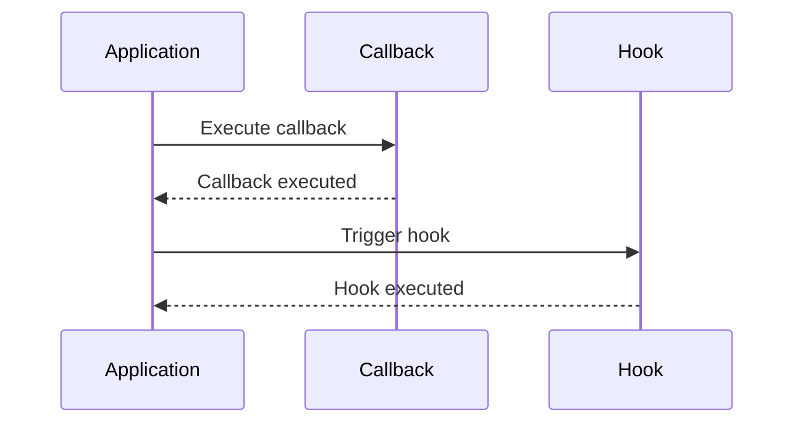

## 6.12 Callback and Hook Patterns

Callback and Hook patterns are essential tools in the Ruby developer's toolkit, offering powerful mechanisms to defer or delegate behavior, customize functionality, and extend applications at designated points. These patterns are particularly useful in scenarios where flexibility and extensibility are paramount.

### Understanding Callbacks and Hooks

#### What are Callbacks?

Callbacks are methods or blocks of code that are passed as arguments to other methods, allowing the receiving method to execute the callback at a specific point in its execution. In Ruby, callbacks can be implemented using blocks, Procs, or lambdas. They are commonly used in event-driven programming, asynchronous operations, and frameworks like Rails to execute code in response to certain events or conditions.

#### What are Hooks?

Hooks are predefined points in a class or module where additional behavior can be inserted. They allow developers to "hook into" the lifecycle of an object or a process, providing a way to execute custom code at specific times, such as before or after an object is initialized, or when a method is called. Hooks are often used in frameworks to allow customization without modifying the core codebase.

#### Differences Between Callbacks and Hooks

While both callbacks and hooks provide mechanisms for extending and customizing behavior, they differ in their implementation and use cases:

- **Callbacks** are more flexible and can be defined at runtime, allowing dynamic behavior changes. They are often used for event handling and asynchronous operations.
- **Hooks** are typically predefined in the class or module, providing fixed points for customization. They are used for lifecycle management and ensuring certain actions occur at specific times.

### Implementing Callbacks in Ruby

Callbacks in Ruby can be implemented using blocks, Procs, and lambdas. Each of these constructs has its own characteristics and use cases.

#### Using Blocks

Blocks are the simplest way to implement callbacks in Ruby. They are anonymous pieces of code that can be passed to methods and executed within the method's context.

```ruby
def perform_task
  puts "Starting task..."
  yield if block_given?
  puts "Task completed."
end

perform_task do
  puts "Executing callback..."
end
```

In this example, the `perform_task` method accepts a block and executes it using the `yield` keyword. The block acts as a callback, allowing custom behavior to be injected into the method.

#### Using Procs

Procs are objects that encapsulate blocks, allowing them to be stored in variables and passed around like any other object.

```ruby
callback = Proc.new { puts "Executing callback..." }

def perform_task(callback)
  puts "Starting task..."
  callback.call
  puts "Task completed."
end

perform_task(callback)
```

Here, the `callback` is a Proc object that can be passed to the `perform_task` method and executed using the `call` method.

#### Using Lambdas

Lambdas are similar to Procs but have stricter argument checking and return behavior, making them more suitable for certain use cases.

```ruby
callback = lambda { puts "Executing callback..." }

def perform_task(callback)
  puts "Starting task..."
  callback.call
  puts "Task completed."
end

perform_task(callback)
```

Lambdas provide a more predictable behavior compared to Procs, particularly in how they handle return statements and argument mismatches.

### Implementing Hooks in Ruby

Hooks in Ruby are often implemented using methods that are called at specific points in a class or module's lifecycle. Ruby provides several built-in hooks, such as `initialize`, `method_missing`, and `included`.

#### Using Lifecycle Hooks

Lifecycle hooks allow developers to execute code at specific points in an object's lifecycle, such as during initialization or destruction.

```ruby
class MyClass
  def initialize
    puts "Object initialized."
  end

  def self.inherited(subclass)
    puts "#{subclass} inherited from MyClass."
  end
end

class SubClass < MyClass
end
```

In this example, the `initialize` method acts as a hook that is called when a new instance of `MyClass` is created. The `inherited` method is a class-level hook that is called when a subclass is created.

#### Using Method Hooks

Method hooks allow developers to intercept method calls and execute additional code before or after the method is executed.

```ruby
class MyClass
  def my_method
    puts "Original method."
  end

  def self.method_added(method_name)
    puts "Method #{method_name} was added."
  end
end

class MyClass
  def new_method
    puts "New method."
  end
end
```

The `method_added` hook is called whenever a new method is defined in the class, allowing developers to track method definitions and execute custom code.

### Applications of Callback and Hook Patterns

#### Event Handling

Callbacks are commonly used in event-driven programming to execute code in response to specific events. For example, in a web application, callbacks can be used to handle user interactions, such as button clicks or form submissions.

```ruby
class Button
  def initialize(&callback)
    @callback = callback
  end

  def click
    puts "Button clicked."
    @callback.call if @callback
  end
end

button = Button.new { puts "Button callback executed." }
button.click
```

In this example, the `Button` class accepts a callback block that is executed when the button is clicked.

#### Lifecycle Methods

Hooks are often used to manage the lifecycle of objects, ensuring that certain actions are performed at specific times. This is particularly useful in frameworks like Rails, where hooks can be used to manage database transactions, validate data, and more.

```ruby
class User
  def initialize(name)
    @name = name
    puts "User #{@name} created."
  end

  def self.before_create
    puts "Before create hook."
  end

  def self.after_create
    puts "After create hook."
  end
end

User.before_create
user = User.new("Alice")
User.after_create
```

In this example, the `before_create` and `after_create` hooks are used to execute code before and after a `User` object is created.

### Benefits of Callback and Hook Patterns

- **Extensibility**: Callbacks and hooks allow developers to extend and customize behavior without modifying the core codebase, making it easier to add new features and functionality.
- **Flexibility**: By deferring behavior to callbacks and hooks, developers can create more flexible and adaptable code that can respond to changing requirements and conditions.
- **Separation of Concerns**: Callbacks and hooks promote a clean separation of concerns by allowing different parts of the application to handle specific tasks, reducing coupling and improving maintainability.

### Ruby Unique Features

Ruby's dynamic nature and support for blocks, Procs, and lambdas make it particularly well-suited for implementing callback and hook patterns. The language's flexibility allows developers to create powerful and expressive code that can be easily extended and customized.

### Differences and Similarities

Callbacks and hooks are often confused due to their similar purposes, but they serve different roles in a Ruby application. Callbacks are more dynamic and flexible, while hooks provide predefined points for customization. Understanding these differences is crucial for effectively using these patterns in your applications.

### Try It Yourself

Experiment with the code examples provided in this section. Try modifying the callbacks and hooks to see how they affect the behavior of the application. Consider creating your own classes and methods that utilize these patterns to gain a deeper understanding of their capabilities.

### Visualizing Callback and Hook Patterns



This sequence diagram illustrates the interaction between an application, a callback, and a hook. The application executes the callback and triggers the hook, demonstrating the flow of control in these patterns.

## Quiz: Callback and Hook Patterns



### What is a callback in Ruby?

- [x] A method or block passed to another method to be executed later
- [ ] A predefined point in a class for customization
- [ ] A type of exception handling
- [ ] A method that returns a value

> **Explanation:** A callback is a method or block passed to another method to be executed at a specific point in its execution.

### How are hooks typically used in Ruby?

- [x] To execute code at specific points in a class or module's lifecycle
- [ ] To handle exceptions
- [ ] To manage memory allocation
- [ ] To optimize performance

> **Explanation:** Hooks are used to execute code at specific points in a class or module's lifecycle, such as during initialization or method calls.

### Which construct is NOT used to implement callbacks in Ruby?

- [ ] Blocks
- [ ] Procs
- [ ] Lambdas
- [x] Classes

> **Explanation:** Callbacks in Ruby are implemented using blocks, Procs, and lambdas, not classes.

### What is the primary benefit of using callback and hook patterns?

- [x] Extensibility and flexibility in code execution
- [ ] Improved memory management
- [ ] Faster execution speed
- [ ] Simplified syntax

> **Explanation:** Callback and hook patterns provide extensibility and flexibility, allowing developers to customize and extend behavior.

### How do lambdas differ from Procs in Ruby?

- [x] Lambdas have stricter argument checking and return behavior
- [ ] Lambdas are faster than Procs
- [ ] Lambdas cannot be passed as arguments
- [ ] Lambdas are a type of class

> **Explanation:** Lambdas have stricter argument checking and return behavior compared to Procs, making them more predictable.

### What is the `yield` keyword used for in Ruby?

- [x] To execute a block passed to a method
- [ ] To define a new class
- [ ] To handle exceptions
- [ ] To allocate memory

> **Explanation:** The `yield` keyword is used to execute a block passed to a method, acting as a callback.

### Which of the following is a lifecycle hook in Ruby?

- [x] `initialize`
- [ ] `catch`
- [ ] `throw`
- [ ] `rescue`

> **Explanation:** `initialize` is a lifecycle hook in Ruby, called when a new object is created.

### What is the purpose of the `method_added` hook?

- [x] To execute code when a new method is defined in a class
- [ ] To handle exceptions
- [ ] To optimize performance
- [ ] To manage memory

> **Explanation:** The `method_added` hook is called whenever a new method is defined in a class, allowing developers to execute custom code.

### Can callbacks be defined at runtime in Ruby?

- [x] True
- [ ] False

> **Explanation:** Callbacks can be defined at runtime in Ruby, allowing dynamic behavior changes.

### Are hooks more dynamic than callbacks?

- [ ] True
- [x] False

> **Explanation:** Hooks are less dynamic than callbacks, as they are predefined points in a class or module.



Remember, this is just the beginning. As you progress, you'll build more complex and interactive applications using callback and hook patterns. Keep experimenting, stay curious, and enjoy the journey!
