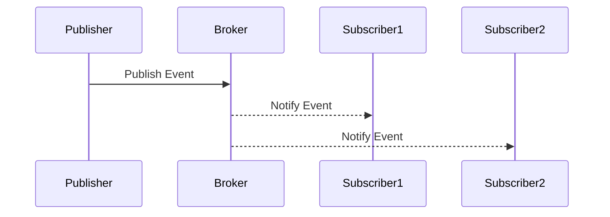

## 6.13 Event Handling with Publish/Subscribe

In the world of software design, the Publish/Subscribe (Pub/Sub) pattern stands out as a robust solution for building scalable and maintainable applications. This pattern is particularly useful in event-driven architectures, where it facilitates communication between components without them being tightly coupled. In this section, we'll delve into the intricacies of the Publish/Subscribe pattern, explore its implementation in Ruby, and highlight its benefits and use cases.

### Understanding the Publish/Subscribe Pattern

**Definition and Intent**: The Publish/Subscribe pattern is a messaging pattern where senders of messages, called publishers, do not send messages directly to specific receivers, known as subscribers. Instead, messages are published to a channel or topic, and subscribers express interest in one or more channels. This decouples the components, allowing them to operate independently and scale more easily.

**Key Characteristics**:
- **Decoupling**: Publishers and subscribers are not aware of each other. This separation allows for independent development and deployment.
- **Scalability**: The pattern supports a scalable architecture where new subscribers can be added without modifying the publishers.
- **Flexibility**: Subscribers can choose which events to listen to, allowing for dynamic and flexible systems.

### Publish/Subscribe vs. Observer Pattern

While both the Publish/Subscribe and Observer patterns deal with event handling, they differ in their approach and use cases:

- **Observer Pattern**: This pattern involves a one-to-many dependency between objects, where a subject notifies observers directly when a state change occurs. It is typically used within a single application or process.
  
- **Publish/Subscribe Pattern**: This pattern is more suitable for distributed systems. It uses an intermediary (like a message broker) to manage the communication between publishers and subscribers, allowing for greater decoupling and scalability.

### Implementing Publish/Subscribe in Ruby

Let's explore how to implement a basic Publish/Subscribe system in Ruby. We'll start with a simple in-memory implementation and then look at using external libraries like RabbitMQ and Redis for more robust solutions.

#### Basic In-Memory Implementation

```ruby
# Define a simple Pub/Sub system
class PubSub
  def initialize
    @subscribers = {}
  end

  def subscribe(event, &block)
    @subscribers[event] ||= []
    @subscribers[event] << block
  end

  def publish(event, data)
    return unless @subscribers[event]

    @subscribers[event].each do |subscriber|
      subscriber.call(data)
    end
  end
end

# Usage example
pubsub = PubSub.new

# Subscribe to an event
pubsub.subscribe('user_created') do |user|
  puts "User created: #{user[:name]}"
end

# Publish an event
pubsub.publish('user_created', { name: 'Alice' })
```

In this example, we define a `PubSub` class with methods to subscribe to events and publish them. Subscribers are stored in a hash, and when an event is published, all subscribers are notified.

#### Using RabbitMQ for Publish/Subscribe

RabbitMQ is a popular message broker that supports the Publish/Subscribe pattern. Here's how you can use it in a Ruby application:

1. **Install the Bunny Gem**: Bunny is a popular RabbitMQ client for Ruby.

   ```bash
   gem install bunny
   ```

2. **Publish/Subscribe with RabbitMQ**:

```ruby
require 'bunny'

# Establish a connection to RabbitMQ
connection = Bunny.new
connection.start

channel = connection.create_channel

# Declare a fanout exchange
exchange = channel.fanout('events')

# Publish a message
exchange.publish('User created: Alice')

# Subscribe to the exchange
queue = channel.queue('', exclusive: true)
queue.bind(exchange)

puts 'Waiting for messages...'
queue.subscribe(block: true) do |_delivery_info, _properties, body|
  puts "Received: #{body}"
end
```

In this setup, we create a fanout exchange, which broadcasts messages to all queues bound to it. This is ideal for the Publish/Subscribe pattern, where multiple subscribers may be interested in the same event.

#### Using Redis for Publish/Subscribe

Redis is another powerful tool that can be used for implementing the Publish/Subscribe pattern. Here's a basic example:

1. **Install the Redis Gem**:

   ```bash
   gem install redis
   ```

2. **Publish/Subscribe with Redis**:

```ruby
require 'redis'

# Publisher
publisher = Redis.new
publisher.publish('notifications', 'User created: Alice')

# Subscriber
subscriber = Redis.new
subscriber.subscribe('notifications') do |on|
  on.message do |_channel, message|
    puts "Received: #{message}"
  end
end
```

Redis provides a simple and efficient way to implement the Publish/Subscribe pattern, especially for applications that already use Redis for other purposes.

### Use Cases in Event-Driven Architectures

The Publish/Subscribe pattern is widely used in event-driven architectures. Here are some common use cases:

- **Microservices Communication**: In a microservices architecture, services can publish events when significant actions occur, and other services can subscribe to these events to perform related tasks.
- **Real-Time Notifications**: Applications can use the pattern to send real-time notifications to users, such as chat messages or alerts.
- **Data Processing Pipelines**: Events can trigger data processing tasks, allowing for scalable and efficient data workflows.

### Benefits of the Publish/Subscribe Pattern

- **Decoupling**: By decoupling publishers and subscribers, the pattern allows for independent development and scaling of components.
- **Scalability**: New subscribers can be added without affecting existing publishers, making it easy to scale the system.
- **Flexibility**: Subscribers can dynamically choose which events to listen to, allowing for flexible and adaptable systems.

### Design Considerations

When implementing the Publish/Subscribe pattern, consider the following:

- **Message Broker**: Choose a suitable message broker based on your application's needs. RabbitMQ and Redis are popular choices, but others like Kafka may be more appropriate for high-throughput systems.
- **Error Handling**: Implement robust error handling to deal with message delivery failures or network issues.
- **Security**: Ensure that your message broker is configured securely to prevent unauthorized access.

### Ruby Unique Features

Ruby's dynamic nature and rich ecosystem make it an excellent choice for implementing the Publish/Subscribe pattern. The language's support for blocks and lambdas allows for elegant and concise subscriber definitions, while gems like Bunny and Redis provide powerful tools for building robust systems.

### Differences and Similarities

While the Publish/Subscribe and Observer patterns share similarities in event handling, they differ in their scope and implementation. The Publish/Subscribe pattern is more suited for distributed systems and decoupled architectures, while the Observer pattern is typically used within a single application or process.

### Try It Yourself

To deepen your understanding, try modifying the code examples provided:

- **Add More Events**: Extend the in-memory implementation to handle multiple event types and subscribers.
- **Integrate with a Web Application**: Use RabbitMQ or Redis to implement real-time notifications in a Ruby on Rails application.
- **Experiment with Error Handling**: Implement error handling strategies in your Publish/Subscribe system to deal with network failures or message delivery issues.

### Visualizing the Publish/Subscribe Pattern

To better understand the flow of the Publish/Subscribe pattern, let's visualize it using a sequence diagram:



In this diagram, the publisher sends an event to the broker, which then notifies all subscribers. This illustrates the decoupling between publishers and subscribers, as they communicate through the broker.

### Knowledge Check

- **What is the main advantage of using the Publish/Subscribe pattern?**
- **How does the Publish/Subscribe pattern differ from the Observer pattern?**
- **What are some common use cases for the Publish/Subscribe pattern?**

### Embrace the Journey

Remember, mastering the Publish/Subscribe pattern is just one step in building scalable and maintainable applications. As you continue to explore Ruby design patterns, you'll discover new ways to enhance your applications and improve your skills. Keep experimenting, stay curious, and enjoy the journey!

## Quiz: Event Handling with Publish/Subscribe



### What is the primary benefit of the Publish/Subscribe pattern?

- [x] Decoupling publishers from subscribers
- [ ] Direct communication between components
- [ ] Reducing the number of messages
- [ ] Increasing the complexity of the system

> **Explanation:** The Publish/Subscribe pattern decouples publishers from subscribers, allowing for independent development and scaling.

### How does the Publish/Subscribe pattern differ from the Observer pattern?

- [x] It uses an intermediary for communication
- [ ] It requires direct communication between objects
- [ ] It is only used in single-threaded applications
- [ ] It does not support multiple subscribers

> **Explanation:** The Publish/Subscribe pattern uses an intermediary, such as a message broker, to manage communication, unlike the Observer pattern.

### Which of the following is a common use case for the Publish/Subscribe pattern?

- [x] Real-time notifications
- [ ] Single-threaded applications
- [ ] Direct method calls
- [ ] Static data processing

> **Explanation:** Real-time notifications are a common use case for the Publish/Subscribe pattern, as it allows for dynamic and flexible communication.

### What is a key characteristic of the Publish/Subscribe pattern?

- [x] Scalability
- [ ] Tight coupling
- [ ] Direct method invocation
- [ ] Single subscriber support

> **Explanation:** Scalability is a key characteristic of the Publish/Subscribe pattern, as it supports adding new subscribers without affecting existing publishers.

### Which tool can be used to implement the Publish/Subscribe pattern in Ruby?

- [x] RabbitMQ
- [x] Redis
- [ ] SQLite
- [ ] Nokogiri

> **Explanation:** RabbitMQ and Redis are popular tools for implementing the Publish/Subscribe pattern in Ruby.

### What is the role of a message broker in the Publish/Subscribe pattern?

- [x] It manages communication between publishers and subscribers
- [ ] It directly connects publishers to subscribers
- [ ] It stores messages permanently
- [ ] It reduces the number of subscribers

> **Explanation:** A message broker manages communication between publishers and subscribers, decoupling them.

### What is a benefit of using Redis for Publish/Subscribe?

- [x] Simplicity and efficiency
- [ ] Complex configuration
- [ ] High latency
- [ ] Limited scalability

> **Explanation:** Redis provides a simple and efficient way to implement the Publish/Subscribe pattern, especially for applications already using Redis.

### What should be considered when implementing the Publish/Subscribe pattern?

- [x] Error handling
- [x] Security
- [ ] Direct method calls
- [ ] Tight coupling

> **Explanation:** Error handling and security are important considerations when implementing the Publish/Subscribe pattern.

### What is a common use case for RabbitMQ in the Publish/Subscribe pattern?

- [x] Microservices communication
- [ ] Single-threaded applications
- [ ] Direct database access
- [ ] Static file serving

> **Explanation:** RabbitMQ is commonly used for microservices communication in the Publish/Subscribe pattern.

### True or False: The Publish/Subscribe pattern is only suitable for single-threaded applications.

- [ ] True
- [x] False

> **Explanation:** False. The Publish/Subscribe pattern is suitable for distributed systems and supports multiple subscribers.


