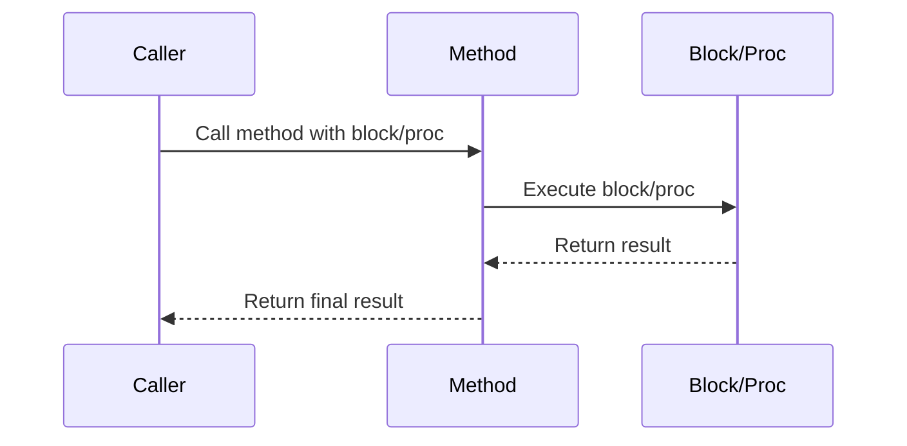

## 6.14 Using Blocks and Procs in Behavioral Patterns

Ruby's blocks and Procs are powerful tools that allow developers to write flexible and maintainable code. They are particularly useful in implementing behavioral design patterns, which focus on the interaction and responsibility of objects. In this section, we will explore the role of blocks and Procs in Ruby, demonstrate how they can be used to implement behavioral patterns, and discuss the advantages of using closures for encapsulating behavior.

### Understanding Blocks and Procs in Ruby

#### What are Blocks?

Blocks in Ruby are anonymous pieces of code that can be passed to methods. They are enclosed in either curly braces `{}` or `do...end` and can take parameters. Blocks are not objects, but they can be converted into objects of class `Proc`.

```ruby
# Example of a block
3.times { |i| puts "This is iteration number #{i}" }
```

#### What are Procs?

Procs are objects that encapsulate blocks of code, allowing them to be stored in variables, passed as arguments, and reused. They are created using `Proc.new`, `proc`, or the `lambda` method.

```ruby
# Example of a Proc
my_proc = Proc.new { |name| puts "Hello, #{name}!" }
my_proc.call("Alice")
```

#### Differences Between Blocks and Procs

- **Blocks**: Implicitly passed to methods and cannot be stored in variables.
- **Procs**: Explicitly created, can be stored in variables, and reused.

### Implementing Behavioral Patterns with Blocks and Procs

Behavioral design patterns focus on how objects interact and communicate. Ruby's blocks and Procs provide a concise way to implement these patterns by allowing behavior to be passed as arguments and executed dynamically.

#### Strategy Pattern

The Strategy Pattern defines a family of algorithms, encapsulates each one, and makes them interchangeable. Blocks and Procs can be used to define and switch between different strategies.

```ruby
# Strategy Pattern using Procs
class Context
  attr_accessor :strategy

  def initialize(strategy)
    @strategy = strategy
  end

  def execute_strategy(a, b)
    @strategy.call(a, b)
  end
end

addition = Proc.new { |a, b| a + b }
multiplication = Proc.new { |a, b| a * b }

context = Context.new(addition)
puts context.execute_strategy(5, 3) # Output: 8

context.strategy = multiplication
puts context.execute_strategy(5, 3) # Output: 15
```

#### Template Method Pattern

The Template Method Pattern defines the skeleton of an algorithm in a method, deferring some steps to subclasses. Blocks can be used to customize these steps.

```ruby
# Template Method Pattern using Blocks
class Report
  def initialize(&formatter)
    @formatter = formatter
  end

  def generate
    data = "Report Data"
    @formatter.call(data)
  end
end

html_formatter = Proc.new { |data| "<html><body>#{data}</body></html>" }
plain_text_formatter = Proc.new { |data| "Plain Text: #{data}" }

report = Report.new(&html_formatter)
puts report.generate # Output: <html><body>Report Data</body></html>

report = Report.new(&plain_text_formatter)
puts report.generate # Output: Plain Text: Report Data
```

### Advantages of Using Closures

Closures, such as blocks and Procs, capture the surrounding context in which they are defined. This allows them to access variables from their enclosing scope, making them powerful tools for encapsulating behavior.

#### Benefits of Closures

1. **Encapsulation**: Closures can encapsulate behavior and state, reducing dependencies and improving modularity.
2. **Flexibility**: They allow behavior to be passed as arguments, enabling dynamic execution and customization.
3. **Reusability**: Procs can be stored and reused, promoting code reuse and reducing duplication.

### Leveraging Ruby's Functional Programming Features

Ruby's support for functional programming concepts, such as first-class functions and closures, enhances the implementation of behavioral patterns. By using blocks and Procs, developers can write more expressive and flexible code.

#### Functional Programming Concepts in Ruby

- **First-Class Functions**: Functions can be treated as first-class citizens, allowing them to be passed as arguments and returned from other functions.
- **Higher-Order Functions**: Functions that take other functions as arguments or return them as results.
- **Immutability**: Encourages the use of immutable data structures, reducing side effects and improving predictability.

### Try It Yourself

Experiment with the code examples provided by modifying the strategies or formatters. Try creating new strategies or formatters and see how they can be seamlessly integrated into the existing code.

### Visualizing Blocks and Procs

To better understand how blocks and Procs work, let's visualize their interaction with methods using a sequence diagram.



### Key Takeaways

- **Blocks and Procs**: Essential tools for implementing behavioral patterns in Ruby.
- **Strategy and Template Method Patterns**: Simplified using blocks and Procs.
- **Closures**: Provide encapsulation, flexibility, and reusability.
- **Functional Programming**: Enhances the expressiveness and flexibility of Ruby code.

### Further Reading

- [Ruby Blocks and Procs](https://ruby-doc.org/core-2.7.0/Proc.html)
- [Functional Programming in Ruby](https://www.rubyguides.com/2018/10/functional-programming-in-ruby/)

## Quiz: Using Blocks and Procs in Behavioral Patterns



### What is a block in Ruby?

- [x] An anonymous piece of code that can be passed to methods
- [ ] A named function that can be reused
- [ ] A class that encapsulates behavior
- [ ] A method that returns a Proc

> **Explanation:** A block is an anonymous piece of code that can be passed to methods in Ruby.

### How do you create a Proc in Ruby?

- [x] Using `Proc.new`
- [x] Using `proc`
- [ ] Using `block`
- [ ] Using `lambda`

> **Explanation:** Procs can be created using `Proc.new` or `proc`.

### What is the main difference between a block and a Proc?

- [x] A block is not an object, while a Proc is an object.
- [ ] A block can be stored in a variable, while a Proc cannot.
- [ ] A block can be reused, while a Proc cannot.
- [ ] A block is a subclass of Proc.

> **Explanation:** A block is not an object, whereas a Proc is an object that can be stored in variables and reused.

### Which pattern is implemented using blocks in the provided example?

- [ ] Observer Pattern
- [ ] Command Pattern
- [x] Template Method Pattern
- [ ] Chain of Responsibility Pattern

> **Explanation:** The Template Method Pattern is implemented using blocks in the provided example.

### What is a closure in Ruby?

- [x] A function that captures its surrounding context
- [ ] A class that encapsulates behavior
- [ ] A method that returns a block
- [ ] A variable that stores a Proc

> **Explanation:** A closure is a function that captures its surrounding context, allowing it to access variables from its enclosing scope.

### What is the benefit of using closures in Ruby?

- [x] Encapsulation of behavior and state
- [x] Flexibility in passing behavior as arguments
- [ ] Increased complexity
- [ ] Reduced code readability

> **Explanation:** Closures encapsulate behavior and state, providing flexibility in passing behavior as arguments.

### How can blocks and Procs enhance the implementation of behavioral patterns?

- [x] By allowing behavior to be passed as arguments
- [x] By enabling dynamic execution and customization
- [ ] By increasing code complexity
- [ ] By reducing code readability

> **Explanation:** Blocks and Procs allow behavior to be passed as arguments, enabling dynamic execution and customization.

### What is a higher-order function in Ruby?

- [x] A function that takes other functions as arguments or returns them
- [ ] A function that is defined inside a class
- [ ] A function that is called multiple times
- [ ] A function that returns a block

> **Explanation:** A higher-order function is a function that takes other functions as arguments or returns them.

### How does Ruby's support for functional programming enhance behavioral patterns?

- [x] By allowing first-class functions and closures
- [ ] By increasing code complexity
- [ ] By reducing code readability
- [ ] By limiting the use of Procs

> **Explanation:** Ruby's support for first-class functions and closures enhances the implementation of behavioral patterns.

### True or False: Procs can be stored in variables and reused.

- [x] True
- [ ] False

> **Explanation:** Procs can be stored in variables and reused, making them versatile tools for encapsulating behavior.



Remember, this is just the beginning. As you progress, you'll build more complex and interactive applications using Ruby's powerful features. Keep experimenting, stay curious, and enjoy the journey!
