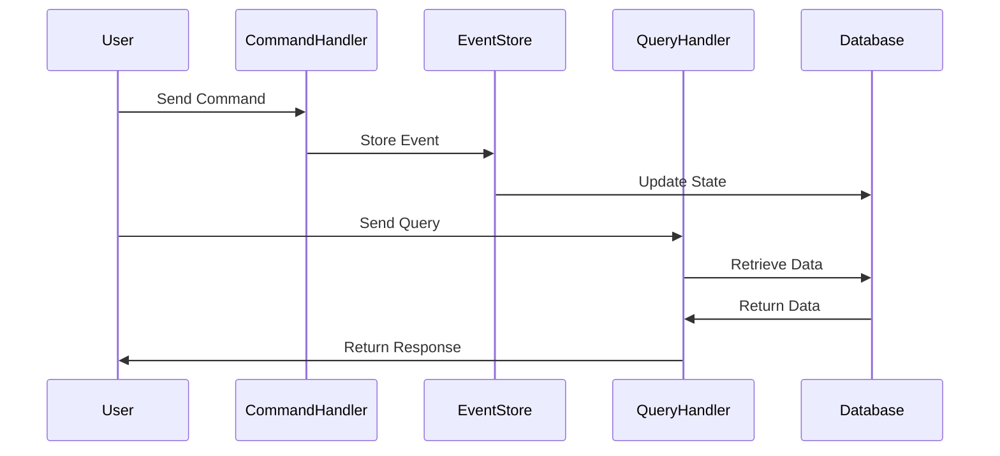

## 6.15 Command Query Responsibility Segregation (CQRS)

Command Query Responsibility Segregation (CQRS) is a powerful architectural pattern that separates the read and write operations of a system into distinct models. This separation allows for optimized query performance and efficient command handling, particularly in complex systems where scalability and maintainability are critical.

### Understanding CQRS

#### Definition and Intent

CQRS is an architectural pattern that divides the responsibilities of handling commands (write operations) and queries (read operations) into separate models. The primary intent of CQRS is to optimize the performance and scalability of applications by allowing each model to be tailored to its specific use case. This separation can lead to more efficient data handling, as each model can be independently optimized and scaled.

#### Problems Addressed by CQRS

1. **Scalability**: In traditional architectures, a single model often handles both read and write operations, which can lead to performance bottlenecks as the system scales. CQRS addresses this by allowing separate scaling strategies for read and write operations.

2. **Complexity in Data Models**: Complex systems often require different data representations for reading and writing. CQRS allows for distinct models, reducing the complexity of each and making them easier to manage.

3. **Performance Optimization**: By separating read and write operations, each can be optimized independently. For example, read models can be denormalized for faster query performance, while write models can focus on maintaining data integrity.

4. **Maintainability**: With distinct models, changes to one do not necessarily impact the other, leading to easier maintenance and evolution of the system.

### Implementing CQRS in Ruby

Implementing CQRS in a Ruby application involves creating separate models and services for handling commands and queries. Let's explore how to achieve this with a practical example.

#### Step-by-Step Implementation

1. **Define the Domain**

   Start by defining the domain of your application. Identify the commands (actions that change state) and queries (requests for information) that your system needs to handle.

2. **Create Separate Models**

   Develop distinct models for handling commands and queries. In Ruby, this often involves creating separate classes or modules for each responsibility.

3. **Implement Command Handlers**

   Command handlers are responsible for executing commands and updating the state of the system. These handlers should be designed to process commands efficiently and ensure data integrity.

4. **Implement Query Handlers**

   Query handlers are responsible for retrieving data. These handlers can be optimized for performance, often using denormalized data structures or caching mechanisms.

5. **Integrate with Messaging Systems**

   CQRS often benefits from integration with messaging systems, allowing commands and events to be processed asynchronously. This can enhance scalability and responsiveness.

#### Example: CQRS in a Ruby Web Application

Consider a simple e-commerce application where customers can place orders and view their order history. We'll implement CQRS to separate the handling of order placement (commands) from order retrieval (queries).

```ruby
# Command: PlaceOrder
class PlaceOrderCommand
  attr_reader :customer_id, :order_details

  def initialize(customer_id, order_details)
    @customer_id = customer_id
    @order_details = order_details
  end
end

# Command Handler: PlaceOrderHandler
class PlaceOrderHandler
  def execute(command)
    # Validate and process the order
    order = Order.new(command.customer_id, command.order_details)
    order.save
    # Publish an event for order placed
    EventBus.publish(OrderPlacedEvent.new(order.id))
  end
end

# Query: GetOrderHistory
class GetOrderHistoryQuery
  attr_reader :customer_id

  def initialize(customer_id)
    @customer_id = customer_id
  end
end

# Query Handler: OrderHistoryHandler
class OrderHistoryHandler
  def execute(query)
    # Retrieve and return order history for the customer
    Order.where(customer_id: query.customer_id).all
  end
end
```

In this example, the `PlaceOrderCommand` and `PlaceOrderHandler` are responsible for handling the order placement, while the `GetOrderHistoryQuery` and `OrderHistoryHandler` manage the retrieval of order history.

### Integration with Event Sourcing and Messaging Systems

CQRS is often used in conjunction with event sourcing and messaging systems to enhance its capabilities.

#### Event Sourcing

Event sourcing involves storing the state of a system as a sequence of events. This approach complements CQRS by providing a reliable way to reconstruct the state of the system from events. In Ruby, you can implement event sourcing by creating event classes and an event store.

```ruby
# Event: OrderPlacedEvent
class OrderPlacedEvent
  attr_reader :order_id

  def initialize(order_id)
    @order_id = order_id
  end
end

# Event Store
class EventStore
  def initialize
    @events = []
  end

  def save(event)
    @events << event
  end

  def all_events
    @events
  end
end
```

#### Messaging Systems

Messaging systems, such as RabbitMQ or Kafka, can be used to handle asynchronous communication between components. In a CQRS architecture, commands and events can be published to a message broker, allowing for decoupled processing.

### Benefits of CQRS

1. **Improved Performance**: By separating read and write operations, each can be optimized for its specific use case, leading to better overall performance.

2. **Enhanced Scalability**: CQRS allows for independent scaling of read and write models, making it easier to handle increased load.

3. **Greater Flexibility**: With separate models, changes to one do not necessarily impact the other, allowing for more flexible system evolution.

4. **Better Maintainability**: The separation of concerns leads to cleaner, more maintainable code.

### Visualizing CQRS

To better understand the flow of data in a CQRS architecture, let's visualize the process using a sequence diagram.



This diagram illustrates the separation of command and query handling, with events being stored and the database being updated accordingly.

### Design Considerations

When implementing CQRS, consider the following:

- **Consistency**: Ensure eventual consistency between the read and write models, as they may not always be in sync.
- **Complexity**: Be mindful of the added complexity that comes with maintaining separate models and potential integration with messaging systems.
- **Use Cases**: CQRS is best suited for complex systems with high scalability and performance requirements.

### Ruby Unique Features

Ruby's dynamic nature and metaprogramming capabilities make it well-suited for implementing CQRS. The language's flexibility allows for easy creation of command and query handlers, as well as integration with event sourcing and messaging systems.

### Differences and Similarities

CQRS is often confused with event sourcing, but they are distinct patterns. While CQRS focuses on separating read and write operations, event sourcing is about storing the state of a system as a sequence of events. However, they complement each other well and are often used together.

### Try It Yourself

To deepen your understanding of CQRS, try modifying the example code to add new commands and queries. Experiment with integrating a messaging system or implementing event sourcing to see how these patterns work together.

### Knowledge Check

- What are the primary benefits of using CQRS in a Ruby application?
- How does CQRS improve scalability and performance?
- What are some potential challenges when implementing CQRS?

### Embrace the Journey

Remember, mastering CQRS is just one step in building scalable and maintainable applications. As you continue to explore Ruby design patterns, you'll gain the skills needed to tackle even more complex challenges. Keep experimenting, stay curious, and enjoy the journey!

## Quiz: Command Query Responsibility Segregation (CQRS)



### What is the primary intent of CQRS?

- [x] To separate read and write operations into distinct models
- [ ] To combine read and write operations into a single model
- [ ] To enhance security by encrypting data
- [ ] To reduce the number of database queries

> **Explanation:** CQRS separates read and write operations into distinct models to optimize performance and scalability.

### How does CQRS improve scalability?

- [x] By allowing independent scaling of read and write models
- [ ] By combining all operations into a single model
- [ ] By reducing the number of servers needed
- [ ] By increasing the complexity of the system

> **Explanation:** CQRS allows for independent scaling of read and write models, making it easier to handle increased load.

### What is a potential challenge of implementing CQRS?

- [x] Ensuring eventual consistency between models
- [ ] Reducing the number of database queries
- [ ] Increasing the speed of data retrieval
- [ ] Simplifying the system architecture

> **Explanation:** Ensuring eventual consistency between the read and write models can be a challenge in CQRS.

### Which pattern is often used in conjunction with CQRS?

- [x] Event Sourcing
- [ ] Singleton Pattern
- [ ] Factory Method Pattern
- [ ] Adapter Pattern

> **Explanation:** Event sourcing is often used with CQRS to store the state of a system as a sequence of events.

### What is the role of a command handler in CQRS?

- [x] To execute commands and update the system state
- [ ] To retrieve data from the database
- [ ] To handle user authentication
- [ ] To manage network connections

> **Explanation:** Command handlers execute commands and update the system state in a CQRS architecture.

### How can messaging systems benefit a CQRS architecture?

- [x] By allowing asynchronous processing of commands and events
- [ ] By reducing the number of database queries
- [ ] By simplifying the system architecture
- [ ] By increasing the speed of data retrieval

> **Explanation:** Messaging systems allow for asynchronous processing of commands and events, enhancing scalability and responsiveness.

### What is the main advantage of separating read and write models?

- [x] Improved performance and maintainability
- [ ] Reduced complexity of the system
- [ ] Increased security of data
- [ ] Simplified user interface design

> **Explanation:** Separating read and write models leads to improved performance and maintainability.

### In CQRS, what is the purpose of a query handler?

- [x] To retrieve data and return responses
- [ ] To execute commands and update the system state
- [ ] To manage user sessions
- [ ] To handle network connections

> **Explanation:** Query handlers retrieve data and return responses in a CQRS architecture.

### True or False: CQRS is best suited for simple systems with low scalability requirements.

- [ ] True
- [x] False

> **Explanation:** CQRS is best suited for complex systems with high scalability and performance requirements.

### What is a key consideration when implementing CQRS?

- [x] Ensuring eventual consistency between models
- [ ] Reducing the number of database queries
- [ ] Increasing the speed of data retrieval
- [ ] Simplifying the system architecture

> **Explanation:** Ensuring eventual consistency between the read and write models is a key consideration in CQRS.




