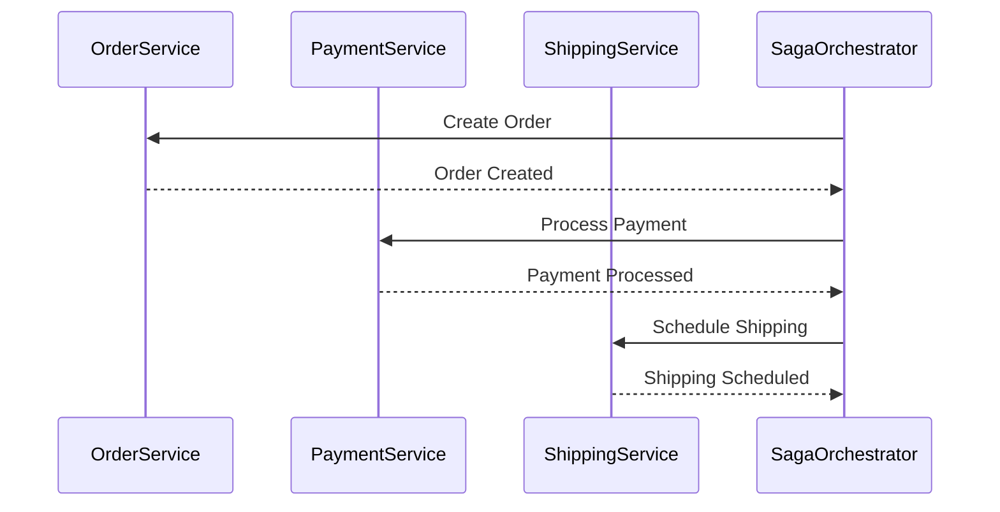

## 6.16 Saga Pattern

In the world of microservices and distributed systems, ensuring data consistency across multiple services is a challenging task. The Saga pattern is a design pattern that addresses this challenge by breaking down a large transaction into a series of smaller, manageable steps, each of which can be compensated if something goes wrong. This section will delve into the Saga pattern, its implementation in Ruby, and its role in maintaining data integrity across distributed systems.

### Intent of the Saga Pattern

The primary intent of the Saga pattern is to manage distributed transactions in a way that ensures data consistency without relying on traditional two-phase commit protocols, which can be complex and resource-intensive. By decomposing a transaction into a sequence of smaller, independent operations, the Saga pattern allows each step to be executed and, if necessary, compensated independently.

### Problem Addressed by the Saga Pattern

In a microservices architecture, a single business transaction often spans multiple services. For instance, an e-commerce order might involve services for inventory, payment, and shipping. Ensuring that all these services remain consistent in the face of failures is a significant challenge. Traditional database transactions are not feasible across multiple services due to the lack of a shared transaction context.

The Saga pattern addresses this by:

- **Breaking down transactions** into a series of steps, each with a corresponding compensating action.
- **Ensuring eventual consistency** across services by executing these steps in a defined sequence.
- **Handling failures** gracefully by invoking compensating actions to undo partial changes.

### Implementing Sagas in Ruby

There are two primary approaches to implementing the Saga pattern: **Choreography** and **Orchestration**. Each approach has its own advantages and trade-offs.

#### Choreography-Based Sagas

In a choreography-based saga, each service involved in the transaction is responsible for executing its own steps and triggering the next step. This approach is decentralized and relies on event-driven communication.

**Example:**

```ruby
# Service A: Order Service
class OrderService
  def create_order(order_details)
    # Perform order creation logic
    publish_event(:order_created, order_details)
  end

  def compensate_order(order_details)
    # Logic to compensate order creation
  end
end

# Service B: Payment Service
class PaymentService
  def handle_order_created(event)
    # Perform payment processing
    publish_event(:payment_processed, event.data)
  end

  def compensate_payment(event)
    # Logic to compensate payment processing
  end
end

# Event Bus
class EventBus
  def publish_event(event_type, data)
    # Logic to publish event to subscribers
  end
end
```

In this example, the `OrderService` creates an order and publishes an `order_created` event. The `PaymentService` listens for this event and processes the payment, publishing a `payment_processed` event upon success.

#### Orchestration-Based Sagas

In an orchestration-based saga, a central orchestrator service manages the sequence of steps. This approach provides more control and visibility over the transaction flow.

**Example:**

```ruby
# Orchestrator Service
class SagaOrchestrator
  def execute_saga(order_details)
    begin
      order_id = OrderService.create_order(order_details)
      payment_id = PaymentService.process_payment(order_id)
      ShippingService.schedule_shipping(order_id, payment_id)
    rescue => e
      compensate_saga(order_details)
    end
  end

  def compensate_saga(order_details)
    # Logic to compensate the entire saga
  end
end

# Order Service
class OrderService
  def self.create_order(order_details)
    # Perform order creation logic
  end
end

# Payment Service
class PaymentService
  def self.process_payment(order_id)
    # Perform payment processing logic
  end
end

# Shipping Service
class ShippingService
  def self.schedule_shipping(order_id, payment_id)
    # Perform shipping scheduling logic
  end
end
```

Here, the `SagaOrchestrator` coordinates the entire transaction, invoking each service in sequence and handling compensation if any step fails.

### Challenges in Implementing Sagas

Implementing the Saga pattern comes with its own set of challenges:

- **Error Handling**: Designing effective compensating actions for each step is crucial. These actions must be idempotent and capable of undoing partial changes.
- **Complexity**: As the number of services and steps increases, managing the saga's flow and compensations can become complex.
- **Latency**: The asynchronous nature of sagas can introduce latency, as each step may involve network communication and processing time.

### Benefits of the Saga Pattern

Despite its challenges, the Saga pattern offers several benefits:

- **Scalability**: By avoiding distributed locks and two-phase commits, sagas can scale more effectively across services.
- **Resilience**: The ability to compensate for failures enhances the system's resilience and fault tolerance.
- **Flexibility**: Sagas can be adapted to various business processes and workflows, making them a versatile choice for distributed transactions.

### Visualizing the Saga Pattern

To better understand the flow of a saga, let's visualize a simple saga using a sequence diagram.



This diagram illustrates the orchestration approach, where the `SagaOrchestrator` coordinates the transaction flow across services.

### Ruby Unique Features

Ruby's dynamic nature and support for metaprogramming make it well-suited for implementing sagas. Features like blocks, procs, and lambdas can be used to define compensating actions succinctly. Additionally, Ruby's event-driven libraries, such as `EventMachine`, can facilitate the implementation of choreography-based sagas.

### Differences and Similarities with Other Patterns

The Saga pattern is often compared to the **Command** and **Observer** patterns due to its event-driven nature. However, unlike the Command pattern, which focuses on encapsulating requests, the Saga pattern emphasizes managing distributed transactions. Similarly, while the Observer pattern deals with notifying observers of state changes, the Saga pattern coordinates a sequence of actions across services.

### Try It Yourself

To deepen your understanding of the Saga pattern, try modifying the provided examples:

- Implement a new service, such as a notification service, and integrate it into the saga.
- Experiment with different compensation strategies for each service.
- Use Ruby's `EventMachine` to implement an event-driven saga.

### Conclusion

The Saga pattern is a powerful tool for managing distributed transactions in microservices architectures. By breaking down transactions into smaller, compensatable steps, it ensures data consistency and resilience across services. While implementing sagas can be complex, the benefits of scalability, flexibility, and fault tolerance make it a valuable pattern for modern distributed systems.

## Quiz: Saga Pattern



### What is the primary intent of the Saga pattern?

- [x] To manage distributed transactions and ensure data consistency across services
- [ ] To encapsulate requests as objects
- [ ] To notify observers of state changes
- [ ] To provide a unified interface to a set of interfaces

> **Explanation:** The Saga pattern is designed to manage distributed transactions by breaking them down into smaller, compensatable steps, ensuring data consistency across services.

### Which of the following is a key benefit of the Saga pattern?

- [x] Scalability
- [ ] Centralized control
- [ ] Immediate consistency
- [ ] Reduced latency

> **Explanation:** The Saga pattern enhances scalability by avoiding distributed locks and two-phase commits, allowing services to operate independently.

### In a choreography-based saga, how are the steps coordinated?

- [x] Each service is responsible for executing its own steps and triggering the next step
- [ ] A central orchestrator manages the sequence of steps
- [ ] Steps are executed in parallel without coordination
- [ ] Steps are coordinated through a shared database

> **Explanation:** In choreography-based sagas, each service listens for events and executes its own steps, triggering subsequent steps through event-driven communication.

### What is a common challenge when implementing the Saga pattern?

- [x] Designing effective compensating actions
- [ ] Ensuring immediate consistency
- [ ] Centralizing control
- [ ] Reducing network latency

> **Explanation:** Designing compensating actions that can effectively undo partial changes is a key challenge in implementing the Saga pattern.

### Which Ruby feature is particularly useful for defining compensating actions in sagas?

- [x] Blocks, Procs, and Lambdas
- [ ] Class inheritance
- [ ] Module mixins
- [ ] Singleton methods

> **Explanation:** Ruby's blocks, procs, and lambdas allow for concise and flexible definition of compensating actions in sagas.

### How does the Saga pattern differ from the Command pattern?

- [x] The Saga pattern manages distributed transactions, while the Command pattern encapsulates requests
- [ ] The Saga pattern focuses on notifying observers, while the Command pattern manages transactions
- [ ] The Saga pattern provides a unified interface, while the Command pattern coordinates steps
- [ ] The Saga pattern reduces latency, while the Command pattern ensures consistency

> **Explanation:** The Saga pattern is focused on managing distributed transactions, whereas the Command pattern is about encapsulating requests as objects.

### What is the role of the SagaOrchestrator in an orchestration-based saga?

- [x] To coordinate the sequence of steps across services
- [ ] To execute each service's steps independently
- [ ] To notify services of state changes
- [ ] To provide a unified interface to services

> **Explanation:** In orchestration-based sagas, the SagaOrchestrator is responsible for coordinating the sequence of steps across services.

### Which approach to implementing sagas is decentralized?

- [x] Choreography-based sagas
- [ ] Orchestration-based sagas
- [ ] Centralized sagas
- [ ] Distributed sagas

> **Explanation:** Choreography-based sagas are decentralized, with each service responsible for executing its own steps and triggering the next step.

### What is a compensating action in the context of the Saga pattern?

- [x] An action that undoes the effects of a previous step in case of failure
- [ ] An action that encapsulates a request as an object
- [ ] An action that notifies observers of state changes
- [ ] An action that provides a unified interface to services

> **Explanation:** A compensating action is designed to undo the effects of a previous step in the saga if a failure occurs.

### True or False: The Saga pattern ensures immediate consistency across services.

- [ ] True
- [x] False

> **Explanation:** The Saga pattern ensures eventual consistency, not immediate consistency, by coordinating a sequence of compensatable steps across services.



Remember, mastering the Saga pattern is just one step in building robust and scalable distributed systems. Keep exploring, experimenting, and applying these concepts to real-world scenarios to deepen your understanding and skills.
