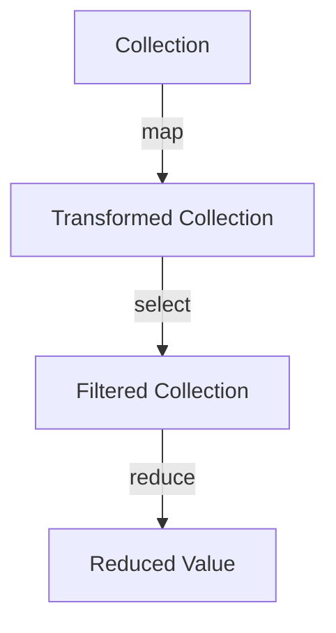

## 6.17 Functional Patterns with Enumerables

In the world of Ruby programming, Enumerables provide a powerful way to handle collections of data. By leveraging functional programming patterns, we can write code that is not only concise and expressive but also efficient and maintainable. In this section, we will explore how functional programming concepts apply to Enumerables in Ruby, demonstrate the use of methods like `map`, `reduce`, `select`, and more, and discuss the benefits of declarative code and the avoidance of side effects.

### Introduction to Functional Programming with Enumerables

Functional programming is a paradigm that treats computation as the evaluation of mathematical functions and avoids changing state or mutable data. In Ruby, Enumerables are a perfect fit for this paradigm because they provide a set of methods that allow us to process collections in a functional style.

#### Key Concepts

- **Immutability**: Functional programming emphasizes immutability, meaning that data should not be changed once created. This leads to more predictable and bug-free code.
- **First-Class Functions**: Functions are treated as first-class citizens, meaning they can be passed as arguments, returned from other functions, and assigned to variables.
- **Higher-Order Functions**: Functions that take other functions as arguments or return them as results.
- **Declarative Code**: Focuses on what to do rather than how to do it, leading to clearer and more concise code.

### Core Enumerable Methods

Ruby's Enumerable module provides a plethora of methods that enable functional programming patterns. Let's explore some of the most commonly used methods.

#### `map`

The `map` method transforms each element of a collection according to a block of code and returns a new array with the transformed elements.

```ruby
# Example: Doubling each number in an array
numbers = [1, 2, 3, 4, 5]
doubled = numbers.map { |n| n * 2 }
puts doubled.inspect
# Output: [2, 4, 6, 8, 10]
```

#### `reduce`

The `reduce` method (also known as `inject`) combines all elements of a collection by applying a binary operation, specified by a block or a symbol.

```ruby
# Example: Summing all numbers in an array
numbers = [1, 2, 3, 4, 5]
sum = numbers.reduce(0) { |acc, n| acc + n }
puts sum
# Output: 15
```

#### `select`

The `select` method filters elements of a collection based on a condition specified in a block, returning a new array with elements that match the condition.

```ruby
# Example: Selecting even numbers from an array
numbers = [1, 2, 3, 4, 5]
evens = numbers.select { |n| n.even? }
puts evens.inspect
# Output: [2, 4]
```

#### `reject`

The `reject` method is the opposite of `select`, returning a new array with elements that do not match the condition.

```ruby
# Example: Rejecting even numbers from an array
numbers = [1, 2, 3, 4, 5]
odds = numbers.reject { |n| n.even? }
puts odds.inspect
# Output: [1, 3, 5]
```

#### `find`

The `find` method returns the first element that matches a condition specified in a block.

```ruby
# Example: Finding the first even number in an array
numbers = [1, 2, 3, 4, 5]
first_even = numbers.find { |n| n.even? }
puts first_even
# Output: 2
```

#### `all?`, `any?`, `none?`

These methods return boolean values based on whether all, any, or none of the elements match a condition.

```ruby
# Example: Checking if all numbers are positive
numbers = [1, 2, 3, 4, 5]
all_positive = numbers.all? { |n| n > 0 }
puts all_positive
# Output: true
```

### Solving Problems with Functional Patterns

Let's explore how we can solve common programming problems using functional patterns with Enumerables.

#### Problem: Calculating Factorials

A factorial of a number is the product of all positive integers less than or equal to that number. We can use `reduce` to calculate factorials.

```ruby
def factorial(n)
  (1..n).reduce(1, :*)
end

puts factorial(5)
# Output: 120
```

#### Problem: Finding Prime Numbers

We can use `select` to filter out prime numbers from a range.

```ruby
require 'prime'

def prime_numbers(range)
  range.select { |n| Prime.prime?(n) }
end

puts prime_numbers(1..10).inspect
# Output: [2, 3, 5, 7]
```

#### Problem: Grouping Elements

We can use `group_by` to group elements based on a condition.

```ruby
# Example: Grouping numbers by even and odd
numbers = [1, 2, 3, 4, 5]
grouped = numbers.group_by { |n| n.even? ? 'Even' : 'Odd' }
puts grouped.inspect
# Output: {"Odd"=>[1, 3, 5], "Even"=>[2, 4]}
```

### Benefits of Declarative Code

Declarative code allows us to express the logic of a computation without describing its control flow. This leads to several benefits:

- **Readability**: Code is easier to read and understand.
- **Maintainability**: Easier to maintain and modify.
- **Less Error-Prone**: Reduces the likelihood of bugs by avoiding mutable state and side effects.

### Avoidance of Side Effects

Functional programming emphasizes the avoidance of side effects, which are changes in state that do not depend on the function inputs. By avoiding side effects, we can write more predictable and reliable code.

### Performance Considerations

While functional patterns with Enumerables are powerful, they can have performance implications, especially with large data sets. Here are some considerations:

- **Lazy Evaluation**: Use lazy enumerators to avoid processing the entire collection at once.
- **Memory Usage**: Be mindful of memory usage when chaining multiple Enumerable methods.
- **Algorithm Complexity**: Consider the complexity of the operations being performed.

### Visualizing Functional Patterns

To better understand how functional patterns work with Enumerables, let's visualize the flow of data through these methods.



This diagram illustrates how data flows through a series of functional transformations, starting with a collection, applying a transformation with `map`, filtering with `select`, and finally reducing to a single value with `reduce`.

### Try It Yourself

Now that we've explored functional patterns with Enumerables, try modifying the examples above to solve different problems. For instance, try using `map` to convert an array of strings to uppercase, or use `reduce` to find the product of an array of numbers.

### Conclusion

Functional patterns with Enumerables in Ruby provide a powerful way to process collections in a concise, expressive, and efficient manner. By leveraging methods like `map`, `reduce`, and `select`, we can write declarative code that is easy to read and maintain. Remember to consider performance implications when working with large data sets and embrace the functional programming paradigm to avoid side effects and mutable state.

## Quiz: Functional Patterns with Enumerables



### Which method is used to transform each element of a collection in Ruby?

- [x] map
- [ ] reduce
- [ ] select
- [ ] find

> **Explanation:** The `map` method is used to transform each element of a collection according to a block of code.

### What does the `reduce` method do in Ruby?

- [x] Combines all elements of a collection by applying a binary operation
- [ ] Filters elements based on a condition
- [ ] Transforms each element of a collection
- [ ] Finds the first element that matches a condition

> **Explanation:** The `reduce` method combines all elements of a collection by applying a binary operation, specified by a block or a symbol.

### Which method would you use to filter elements of a collection based on a condition?

- [ ] map
- [x] select
- [ ] reduce
- [ ] find

> **Explanation:** The `select` method filters elements of a collection based on a condition specified in a block.

### What is the opposite of the `select` method?

- [ ] map
- [ ] reduce
- [x] reject
- [ ] find

> **Explanation:** The `reject` method is the opposite of `select`, returning a new array with elements that do not match the condition.

### Which method returns the first element that matches a condition?

- [ ] map
- [ ] reduce
- [ ] select
- [x] find

> **Explanation:** The `find` method returns the first element that matches a condition specified in a block.

### What is a key benefit of declarative code?

- [x] Readability
- [ ] Complexity
- [ ] Mutability
- [ ] Side effects

> **Explanation:** Declarative code is easier to read and understand, making it more maintainable.

### What is emphasized in functional programming to avoid bugs?

- [ ] Mutable state
- [x] Immutability
- [ ] Side effects
- [ ] Complexity

> **Explanation:** Functional programming emphasizes immutability and the avoidance of side effects to reduce bugs.

### What should be considered when working with large data sets in Ruby?

- [x] Performance implications
- [ ] Readability
- [ ] Mutability
- [ ] Side effects

> **Explanation:** Performance implications should be considered when working with large data sets, especially when chaining multiple Enumerable methods.

### What is a higher-order function?

- [x] A function that takes other functions as arguments or returns them as results
- [ ] A function that transforms each element of a collection
- [ ] A function that filters elements based on a condition
- [ ] A function that combines all elements of a collection

> **Explanation:** A higher-order function is one that takes other functions as arguments or returns them as results.

### True or False: Functional programming in Ruby encourages the use of mutable state.

- [ ] True
- [x] False

> **Explanation:** Functional programming in Ruby discourages the use of mutable state, emphasizing immutability and the avoidance of side effects.



Remember, this is just the beginning. As you progress, you'll build more complex and interactive applications using functional patterns with Enumerables. Keep experimenting, stay curious, and enjoy the journey!
