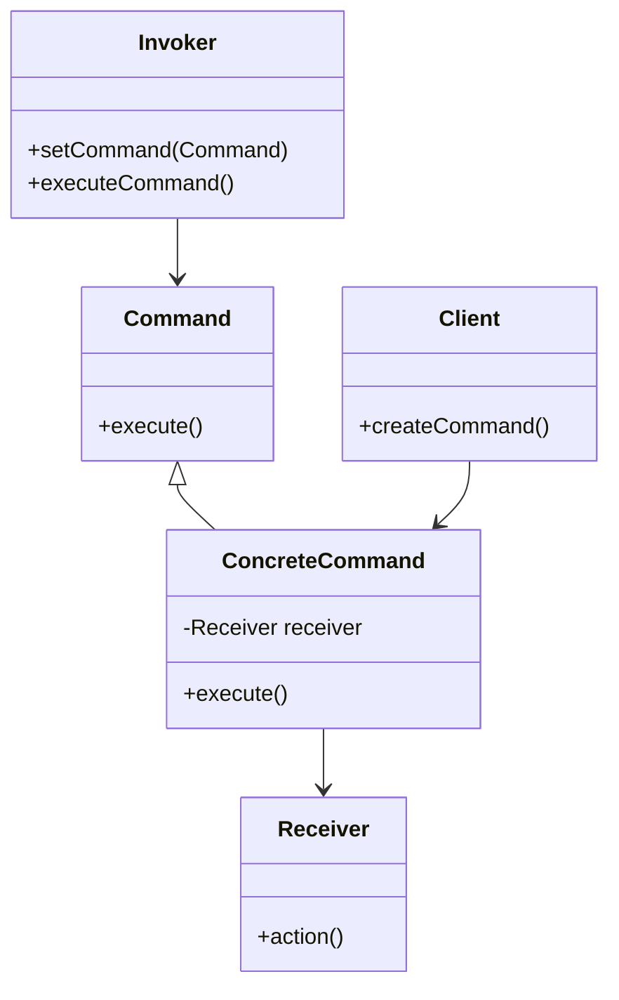

## 6.2 Command Pattern

### Introduction

The Command pattern is a behavioral design pattern that encapsulates a request as an object, thereby allowing for parameterization of clients with queues, requests, and operations. This pattern is particularly useful in scenarios where you need to decouple the sender of a request from its receiver, providing a higher level of flexibility in command execution. In Ruby, the Command pattern can be elegantly implemented using Procs, lambdas, or classes, leveraging the language's dynamic nature.

### Intent

The primary intent of the Command pattern is to encapsulate a request as an object, allowing you to parameterize clients with different requests, queue or log requests, and support undoable operations. This pattern promotes decoupling between objects that issue commands and those that execute them, enhancing the flexibility and maintainability of your code.

### Problem Addressed

In many applications, there is a need to parameterize objects with operations, delay the execution of a request, or queue a series of operations. The Command pattern addresses these needs by encapsulating requests as objects, which can be passed around, stored, and executed at a later time. This decoupling of the sender and receiver of a request allows for more flexible and maintainable code.

### Key Participants

1. **Command**: Declares an interface for executing an operation.
2. **ConcreteCommand**: Implements the Command interface and defines a binding between a Receiver object and an action.
3. **Client**: Creates a ConcreteCommand object and sets its receiver.
4. **Invoker**: Asks the command to carry out the request.
5. **Receiver**: Knows how to perform the operations associated with carrying out a request.

### Applicability

Use the Command pattern when you want to:

- Parameterize objects with operations.
- Queue operations for execution at a later time.
- Support undoable operations.
- Implement logging and transaction management.

### Implementing the Command Pattern in Ruby

In Ruby, the Command pattern can be implemented using classes, Procs, or lambdas. Let's explore each approach with examples.

#### Using Classes

```ruby
# Command Interface
class Command
  def execute
    raise NotImplementedError, 'You must implement the execute method'
  end
end

# Concrete Command
class LightOnCommand < Command
  def initialize(light)
    @light = light
  end

  def execute
    @light.turn_on
  end
end

# Receiver
class Light
  def turn_on
    puts 'The light is on'
  end

  def turn_off
    puts 'The light is off'
  end
end

# Invoker
class RemoteControl
  def initialize
    @commands = []
  end

  def set_command(command)
    @commands << command
  end

  def execute_commands
    @commands.each(&:execute)
  end
end

# Client
light = Light.new
light_on_command = LightOnCommand.new(light)

remote = RemoteControl.new
remote.set_command(light_on_command)
remote.execute_commands
```

In this example, we define a `Command` interface with an `execute` method. The `LightOnCommand` class implements this interface and binds a `Light` object to the action of turning on. The `RemoteControl` class acts as the invoker, storing and executing commands.

#### Using Procs and Lambdas

Ruby's Procs and lambdas provide a more concise way to implement the Command pattern, especially for simple commands.

```ruby
# Receiver
class Light
  def turn_on
    puts 'The light is on'
  end

  def turn_off
    puts 'The light is off'
  end
end

# Client
light = Light.new

# Command using Proc
light_on_command = Proc.new { light.turn_on }
light_off_command = Proc.new { light.turn_off }

# Invoker
class RemoteControl
  def initialize
    @commands = []
  end

  def set_command(command)
    @commands << command
  end

  def execute_commands
    @commands.each(&:call)
  end
end

remote = RemoteControl.new
remote.set_command(light_on_command)
remote.set_command(light_off_command)
remote.execute_commands
```

In this version, we use Procs to encapsulate the commands, which are then stored and executed by the `RemoteControl` invoker.

### Use Cases

#### Undo/Redo Operations

The Command pattern is ideal for implementing undo/redo functionality. By storing executed commands, you can easily reverse their effects.

```ruby
# Command Interface
class Command
  def execute
    raise NotImplementedError, 'You must implement the execute method'
  end

  def unexecute
    raise NotImplementedError, 'You must implement the unexecute method'
  end
end

# Concrete Command
class LightOnCommand < Command
  def initialize(light)
    @light = light
  end

  def execute
    @light.turn_on
  end

  def unexecute
    @light.turn_off
  end
end

# Receiver
class Light
  def turn_on
    puts 'The light is on'
  end

  def turn_off
    puts 'The light is off'
  end
end

# Invoker
class RemoteControl
  def initialize
    @commands = []
    @undo_commands = []
  end

  def set_command(command)
    @commands << command
  end

  def execute_commands
    @commands.each do |command|
      command.execute
      @undo_commands << command
    end
  end

  def undo_last_command
    command = @undo_commands.pop
    command.unexecute if command
  end
end

# Client
light = Light.new
light_on_command = LightOnCommand.new(light)

remote = RemoteControl.new
remote.set_command(light_on_command)
remote.execute_commands
remote.undo_last_command
```

In this example, the `LightOnCommand` class implements both `execute` and `unexecute` methods, allowing the `RemoteControl` to undo the last executed command.

#### Transaction Management

The Command pattern can also be used to manage transactions, where a series of operations need to be executed atomically.

### Benefits of the Command Pattern

- **Decoupling**: The sender and receiver are decoupled, allowing for more flexible command execution.
- **Flexibility**: Commands can be parameterized, queued, and executed at different times.
- **Undo/Redo**: Easily implement undoable operations by storing executed commands.
- **Logging and Transaction Management**: Commands can be logged and replayed, facilitating transaction management.

### Ruby Unique Features

Ruby's dynamic nature and support for blocks, Procs, and lambdas make it particularly well-suited for implementing the Command pattern. These features allow for concise and flexible command definitions, enhancing the pattern's applicability.

### Differences and Similarities

The Command pattern is often confused with the Strategy pattern. While both encapsulate actions, the Command pattern focuses on encapsulating requests as objects, whereas the Strategy pattern encapsulates algorithms.

### Design Considerations

When implementing the Command pattern, consider the following:

- **Granularity**: Determine the level of granularity for commands. Too fine-grained commands can lead to performance issues.
- **State Management**: Ensure that commands maintain the necessary state to execute and unexecute operations.
- **Error Handling**: Implement robust error handling to manage command execution failures.

### Visualizing the Command Pattern



This diagram illustrates the relationships between the key participants in the Command pattern.

### Try It Yourself

Experiment with the provided code examples by modifying the commands or adding new ones. Try implementing a command to turn off the light or to dim it. Explore using lambdas instead of Procs, and see how it affects the code.

### Knowledge Check

- What is the primary intent of the Command pattern?
- How does the Command pattern promote decoupling?
- What are some use cases for the Command pattern?
- How can the Command pattern be implemented in Ruby?
- What are the benefits of using the Command pattern?

### Embrace the Journey

Remember, mastering design patterns is a journey. As you progress, you'll discover more ways to apply the Command pattern in your applications. Keep experimenting, stay curious, and enjoy the journey!

## Quiz: Command Pattern



### What is the primary intent of the Command pattern?

- [x] To encapsulate a request as an object
- [ ] To define a family of algorithms
- [ ] To provide a way to access the elements of an aggregate object
- [ ] To define an interface for creating objects

> **Explanation:** The Command pattern encapsulates a request as an object, allowing for parameterization of clients with queues, requests, and operations.

### Which of the following is a key participant in the Command pattern?

- [x] Invoker
- [ ] Strategy
- [ ] Observer
- [ ] Factory

> **Explanation:** The Invoker is a key participant in the Command pattern, responsible for executing commands.

### How can the Command pattern be implemented in Ruby?

- [x] Using classes, Procs, or lambdas
- [ ] Using only classes
- [ ] Using only Procs
- [ ] Using only lambdas

> **Explanation:** In Ruby, the Command pattern can be implemented using classes, Procs, or lambdas, leveraging the language's dynamic features.

### What is a common use case for the Command pattern?

- [x] Undo/Redo operations
- [ ] Sorting algorithms
- [ ] Data validation
- [ ] Network communication

> **Explanation:** The Command pattern is commonly used for implementing undo/redo operations by storing executed commands.

### What benefit does the Command pattern provide?

- [x] Increased flexibility in command execution
- [ ] Improved data storage
- [ ] Faster network communication
- [ ] Enhanced data validation

> **Explanation:** The Command pattern provides increased flexibility in command execution by decoupling the sender and receiver.

### What is a potential design consideration when implementing the Command pattern?

- [x] Granularity of commands
- [ ] Network latency
- [ ] Data encryption
- [ ] User authentication

> **Explanation:** When implementing the Command pattern, consider the granularity of commands to avoid performance issues.

### Which Ruby feature enhances the applicability of the Command pattern?

- [x] Procs and lambdas
- [ ] Modules and mixins
- [ ] Class inheritance
- [ ] Method overloading

> **Explanation:** Ruby's support for Procs and lambdas enhances the applicability of the Command pattern by allowing concise command definitions.

### What is the role of the Receiver in the Command pattern?

- [x] To perform the operations associated with carrying out a request
- [ ] To encapsulate a request as an object
- [ ] To define a family of algorithms
- [ ] To provide a way to access the elements of an aggregate object

> **Explanation:** The Receiver knows how to perform the operations associated with carrying out a request in the Command pattern.

### How does the Command pattern differ from the Strategy pattern?

- [x] The Command pattern encapsulates requests as objects, while the Strategy pattern encapsulates algorithms
- [ ] The Command pattern encapsulates algorithms, while the Strategy pattern encapsulates requests as objects
- [ ] Both patterns encapsulate requests as objects
- [ ] Both patterns encapsulate algorithms

> **Explanation:** The Command pattern encapsulates requests as objects, whereas the Strategy pattern encapsulates algorithms.

### True or False: The Command pattern can be used for transaction management.

- [x] True
- [ ] False

> **Explanation:** The Command pattern can be used for transaction management by encapsulating operations as commands that can be executed atomically.


