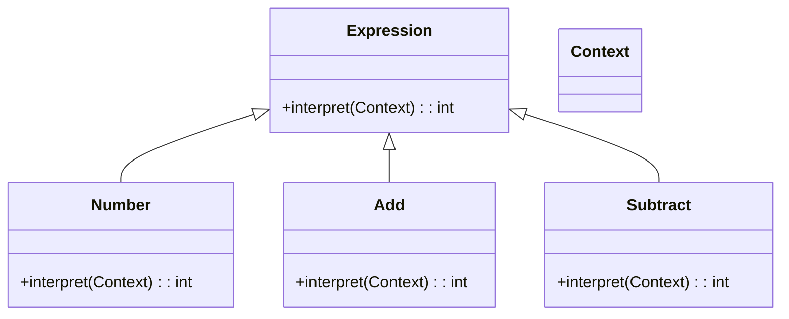

## 6.3 Interpreter Pattern

### Introduction

The Interpreter pattern is a behavioral design pattern that provides a way to evaluate language grammar or expressions. It is particularly useful for designing and implementing simple domain-specific languages (DSLs) and is often employed in scenarios where you need to interpret or parse custom languages. In Ruby, the Interpreter pattern can be implemented effectively by leveraging its dynamic and metaprogramming capabilities.

### Intent

The primary intent of the Interpreter pattern is to define a representation for a language's grammar and provide an interpreter to process sentences in that language. This pattern is particularly useful when the language to be interpreted is simple and can be represented by a grammar.

### Problem Addressed

The Interpreter pattern addresses the problem of parsing and interpreting custom languages. It is ideal for situations where you need to evaluate expressions or commands written in a specific language. This pattern allows you to build a system that can understand and execute instructions defined in a custom language, making it easier to extend and maintain.

### Key Participants

1. **AbstractExpression**: Declares an abstract `interpret` method that is implemented by all concrete expressions.
2. **TerminalExpression**: Implements the `interpret` method for terminal symbols in the grammar.
3. **NonTerminalExpression**: Implements the `interpret` method for non-terminal symbols, which are composed of other expressions.
4. **Context**: Contains information that is global to the interpreter, such as variable values.
5. **Client**: Builds the abstract syntax tree (AST) representing the language's grammar and invokes the `interpret` method.

### Applicability

Use the Interpreter pattern when:
- You have a simple language to interpret.
- The grammar is stable and not expected to change frequently.
- You want to extend the language easily by adding new expressions.
- You need to evaluate expressions or commands dynamically.

### Implementing the Interpreter Pattern in Ruby

Let's explore how to implement the Interpreter pattern in Ruby by building a simple arithmetic interpreter. This interpreter will evaluate expressions consisting of numbers and basic arithmetic operations like addition and subtraction.

#### Step 1: Define the Abstract Expression

First, we define an abstract class `Expression` with an `interpret` method that all concrete expressions will implement.

```ruby
# Abstract Expression
class Expression
  def interpret(context)
    raise NotImplementedError, "#{self.class} has not implemented method '#{__method__}'"
  end
end
```

#### Step 2: Implement Terminal Expressions

Terminal expressions represent the simplest elements of the language, such as numbers in our arithmetic interpreter.

```ruby
# Terminal Expression for Numbers
class Number < Expression
  def initialize(value)
    @value = value
  end

  def interpret(context)
    @value
  end
end
```

#### Step 3: Implement Non-Terminal Expressions

Non-terminal expressions represent operations or rules that are composed of other expressions. For our arithmetic interpreter, we will implement addition and subtraction.

```ruby
# Non-Terminal Expression for Addition
class Add < Expression
  def initialize(left, right)
    @left = left
    @right = right
  end

  def interpret(context)
    @left.interpret(context) + @right.interpret(context)
  end
end

# Non-Terminal Expression for Subtraction
class Subtract < Expression
  def initialize(left, right)
    @left = left
    @right = right
  end

  def interpret(context)
    @left.interpret(context) - @right.interpret(context)
  end
end
```

#### Step 4: Define the Context

The context holds any global information needed during interpretation. In our simple example, we don't require a complex context, but it can be extended to include variables or other state information.

```ruby
# Context class (can be extended as needed)
class Context
  # Add context-specific methods and data here
end
```

#### Step 5: Build the Abstract Syntax Tree (AST)

The client constructs the AST using the defined expressions. For example, to evaluate the expression `(5 + 3) - 2`, we build the AST as follows:

```ruby
# Building the AST for the expression (5 + 3) - 2
context = Context.new
expression = Subtract.new(
  Add.new(Number.new(5), Number.new(3)),
  Number.new(2)
)

# Evaluate the expression
result = expression.interpret(context)
puts "Result: #{result}" # Output: Result: 6
```

### Roles of Context and Abstract Syntax Trees

- **Context**: Provides the necessary environment for interpretation, such as variable values or global state.
- **Abstract Syntax Tree (AST)**: Represents the hierarchical structure of the language's grammar. Each node in the AST corresponds to an expression in the language.

### Benefits of the Interpreter Pattern

1. **Ease of Language Extension**: Adding new expressions or operations is straightforward, making it easy to extend the language.
2. **Flexibility**: The pattern allows for dynamic interpretation of expressions, enabling runtime evaluation.
3. **Separation of Concerns**: The pattern separates the grammar representation from the interpretation logic, promoting clean and maintainable code.

### Ruby's Unique Features

Ruby's metaprogramming capabilities make it particularly well-suited for implementing the Interpreter pattern. You can dynamically define methods, manipulate classes, and create domain-specific languages with ease.

### Differences and Similarities

The Interpreter pattern is often confused with the Strategy pattern. While both involve defining a family of algorithms, the Interpreter pattern focuses on evaluating expressions based on a grammar, whereas the Strategy pattern is about selecting an algorithm at runtime.

### Try It Yourself

Experiment with the interpreter by extending it to support multiplication and division. Implement the `Multiply` and `Divide` classes and modify the AST to evaluate expressions like `(5 * 3) / 2`.

### Visualizing the Interpreter Pattern

Let's visualize the structure of the Interpreter pattern using a class diagram.



### Knowledge Check

- What is the primary intent of the Interpreter pattern?
- How does the Interpreter pattern differ from the Strategy pattern?
- What role does the context play in the Interpreter pattern?

### Summary

The Interpreter pattern is a powerful tool for building domain-specific languages and interpreting custom languages. By leveraging Ruby's metaprogramming capabilities, you can create flexible and extensible interpreters that are easy to maintain and extend. Remember, the key to mastering the Interpreter pattern is understanding the grammar of the language you wish to interpret and constructing a corresponding abstract syntax tree.

## Quiz: Interpreter Pattern



### What is the primary intent of the Interpreter pattern?

- [x] To define a representation for a language's grammar and provide an interpreter to process sentences in that language.
- [ ] To select an algorithm at runtime.
- [ ] To encapsulate a request as an object.
- [ ] To provide a way to access the elements of an aggregate object sequentially.

> **Explanation:** The Interpreter pattern is designed to define a representation for a language's grammar and provide an interpreter to process sentences in that language.

### Which of the following is a key participant in the Interpreter pattern?

- [x] AbstractExpression
- [ ] ConcreteStrategy
- [ ] Command
- [ ] Iterator

> **Explanation:** AbstractExpression is a key participant in the Interpreter pattern, representing the base interface for expressions.

### How does the Interpreter pattern differ from the Strategy pattern?

- [x] The Interpreter pattern focuses on evaluating expressions based on a grammar, while the Strategy pattern is about selecting an algorithm at runtime.
- [ ] The Interpreter pattern is used for encapsulating requests as objects.
- [ ] The Interpreter pattern provides a way to access elements of an aggregate object.
- [ ] The Interpreter pattern is used for creating objects without specifying their concrete classes.

> **Explanation:** The Interpreter pattern is concerned with evaluating expressions based on a grammar, whereas the Strategy pattern is about selecting an algorithm at runtime.

### What role does the context play in the Interpreter pattern?

- [x] It provides the necessary environment for interpretation, such as variable values or global state.
- [ ] It encapsulates a request as an object.
- [ ] It defines a family of algorithms.
- [ ] It provides a way to access elements of an aggregate object.

> **Explanation:** The context provides the necessary environment for interpretation, such as variable values or global state.

### Which Ruby feature is particularly useful for implementing the Interpreter pattern?

- [x] Metaprogramming
- [ ] Garbage Collection
- [ ] Threading
- [ ] Exception Handling

> **Explanation:** Ruby's metaprogramming capabilities are particularly useful for implementing the Interpreter pattern, allowing for dynamic method definition and manipulation.

### What is an Abstract Syntax Tree (AST)?

- [x] A hierarchical structure representing the grammar of a language.
- [ ] A list of commands to be executed.
- [ ] A collection of algorithms.
- [ ] A sequence of operations to be performed.

> **Explanation:** An Abstract Syntax Tree (AST) is a hierarchical structure representing the grammar of a language.

### What is a Terminal Expression in the Interpreter pattern?

- [x] An expression that represents the simplest elements of the language.
- [ ] An expression that is composed of other expressions.
- [ ] An expression that encapsulates a request as an object.
- [ ] An expression that defines a family of algorithms.

> **Explanation:** A Terminal Expression represents the simplest elements of the language, such as numbers in an arithmetic interpreter.

### What is a Non-Terminal Expression in the Interpreter pattern?

- [x] An expression that is composed of other expressions.
- [ ] An expression that represents the simplest elements of the language.
- [ ] An expression that encapsulates a request as an object.
- [ ] An expression that defines a family of algorithms.

> **Explanation:** A Non-Terminal Expression is composed of other expressions and represents operations or rules in the language.

### True or False: The Interpreter pattern is ideal for complex languages with frequently changing grammar.

- [ ] True
- [x] False

> **Explanation:** The Interpreter pattern is best suited for simple languages with stable grammar, as it can become cumbersome for complex languages with frequently changing grammar.

### Which of the following is a benefit of the Interpreter pattern?

- [x] Ease of language extension
- [ ] Improved performance for complex languages
- [ ] Simplified memory management
- [ ] Enhanced security features

> **Explanation:** One of the benefits of the Interpreter pattern is the ease of language extension, allowing for straightforward addition of new expressions or operations.



Remember, this is just the beginning. As you progress, you'll build more complex and interactive interpreters. Keep experimenting, stay curious, and enjoy the journey!

---
