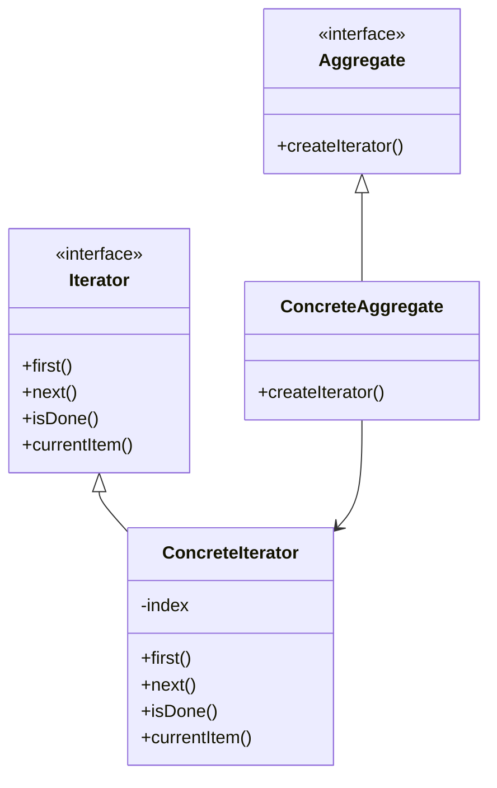

## 6.4 Iterator Pattern

### Introduction to the Iterator Pattern

The Iterator Pattern is a behavioral design pattern that provides a way to access the elements of an aggregate object sequentially without exposing its underlying representation. This pattern is particularly useful when dealing with collections of objects, as it allows you to traverse the collection without needing to know its internal structure.

In Ruby, the Iterator Pattern is elegantly embodied through the use of built-in iterators and the `Enumerable` module. These tools provide a powerful and flexible way to work with collections, allowing developers to focus on what they want to achieve rather than how to iterate over data.

### Intent of the Iterator Pattern

The primary intent of the Iterator Pattern is to:

- **Provide a standard way to traverse a collection**: This allows different types of collections to be accessed in a uniform manner.
- **Encapsulate the iteration logic**: By separating the iteration logic from the collection itself, the pattern promotes cleaner and more maintainable code.
- **Support multiple traversal methods**: The pattern can accommodate different ways of traversing a collection, such as forward, backward, or even skipping elements.

### Ruby's Built-in Iterators and the Enumerable Module

Ruby's approach to the Iterator Pattern is both intuitive and powerful, thanks to its built-in iterators and the `Enumerable` module. Let's explore how these features embody the Iterator Pattern.

#### The Enumerable Module

The `Enumerable` module is a cornerstone of Ruby's collection handling capabilities. It provides a set of methods that can be used to traverse, search, sort, and manipulate collections. To use `Enumerable`, a class must define an `each` method, which yields successive members of the collection.

```ruby
class CustomCollection
  include Enumerable

  def initialize(elements)
    @elements = elements
  end

  def each
    @elements.each { |element| yield element }
  end
end

collection = CustomCollection.new([1, 2, 3, 4, 5])
collection.each { |element| puts element }
```

In this example, the `CustomCollection` class includes the `Enumerable` module and defines an `each` method, allowing it to use all the methods provided by `Enumerable`, such as `map`, `select`, and `reduce`.

#### Enumerators

Enumerators are another powerful feature in Ruby that support the Iterator Pattern. An `Enumerator` is an object that can be used to iterate over a collection. It provides an external iteration mechanism, allowing you to control the iteration process.

```ruby
enumerator = [1, 2, 3, 4, 5].each
puts enumerator.next # Outputs: 1
puts enumerator.next # Outputs: 2
```

In this example, the `each` method returns an `Enumerator` object, which can be used to manually iterate over the array.

### Custom Iterators in Ruby

While Ruby's built-in iterators and `Enumerable` module cover most use cases, there are times when you might need to create custom iterators. Let's explore how to do this using `Enumerator` and `Enumerable`.

#### Creating a Custom Enumerator

You can create a custom enumerator by defining an `Enumerator` object and specifying the iteration logic.

```ruby
custom_enumerator = Enumerator.new do |yielder|
  3.times do |i|
    yielder.yield i
  end
end

custom_enumerator.each { |value| puts value }
```

In this example, we create a custom enumerator that yields numbers from 0 to 2. The `Enumerator` object is initialized with a block that defines the iteration logic.

#### Implementing Custom Enumerable Methods

You can also implement custom enumerable methods by including the `Enumerable` module and defining the `each` method.

```ruby
class FibonacciSequence
  include Enumerable

  def initialize(limit)
    @limit = limit
  end

  def each
    a, b = 0, 1
    while a <= @limit
      yield a
      a, b = b, a + b
    end
  end
end

fibonacci = FibonacciSequence.new(10)
fibonacci.each { |number| puts number }
```

In this example, the `FibonacciSequence` class generates Fibonacci numbers up to a specified limit. By including `Enumerable` and defining `each`, we can use all the enumerable methods on our custom sequence.

### Benefits of Using Iterators

The use of iterators in Ruby provides several benefits:

- **Encapsulation**: Iterators encapsulate the iteration logic, allowing you to change the way you traverse a collection without affecting the rest of your code.
- **Flexibility**: With iterators, you can easily switch between different traversal methods or even create custom traversal logic.
- **Reusability**: By using the `Enumerable` module, you gain access to a wide range of methods that can be reused across different collections.

### External vs. Internal Iterators

In Ruby, you can implement both external and internal iterators:

- **Internal Iterators**: These are the most common in Ruby and are implemented using blocks. The iteration logic is encapsulated within the method, and the block is called for each element.

  ```ruby
  [1, 2, 3].each { |number| puts number }
  ```

- **External Iterators**: These provide more control over the iteration process, allowing you to manually advance through the collection.

  ```ruby
  enumerator = [1, 2, 3].each
  puts enumerator.next # Outputs: 1
  ```

### Visualizing the Iterator Pattern

To better understand the Iterator Pattern, let's visualize it using a class diagram.



In this diagram, `Aggregate` represents the collection, and `Iterator` represents the iterator interface. `ConcreteAggregate` and `ConcreteIterator` are concrete implementations of these interfaces.

### Design Considerations

When implementing the Iterator Pattern in Ruby, consider the following:

- **Choose the right iterator type**: Use internal iterators for simplicity and external iterators when you need more control.
- **Leverage Ruby's features**: Make use of Ruby's `Enumerable` module and `Enumerator` class to simplify your implementation.
- **Ensure compatibility**: If you're designing a library or framework, ensure your iterators are compatible with Ruby's standard library.

### Ruby Unique Features

Ruby's unique features, such as blocks, procs, and lambdas, make it particularly well-suited for implementing the Iterator Pattern. The language's focus on simplicity and expressiveness allows you to create iterators that are both powerful and easy to use.

### Differences and Similarities

The Iterator Pattern is often compared to the `for` loop in other languages. However, unlike a `for` loop, which is tied to a specific collection type, the Iterator Pattern provides a more abstract way to traverse collections, making it more flexible and reusable.

### Try It Yourself

To deepen your understanding of the Iterator Pattern, try modifying the examples provided:

- Create a custom iterator that generates prime numbers.
- Implement a custom enumerable method that filters elements based on a condition.
- Experiment with both internal and external iterators to see how they differ in practice.

### Conclusion

The Iterator Pattern is a fundamental design pattern that provides a standardized way to traverse collections. In Ruby, this pattern is elegantly implemented through the use of built-in iterators and the `Enumerable` module, offering both simplicity and power. By mastering this pattern, you'll be able to write more flexible and maintainable code, making your applications more robust and scalable.

## Quiz: Iterator Pattern



### What is the primary intent of the Iterator Pattern?

- [x] To provide a way to access the elements of an aggregate object sequentially without exposing its underlying representation.
- [ ] To allow multiple objects to communicate with each other.
- [ ] To define a family of algorithms and make them interchangeable.
- [ ] To ensure a class has only one instance.

> **Explanation:** The Iterator Pattern is designed to provide a way to access elements of a collection sequentially without exposing its internal structure.

### Which Ruby module is commonly used to implement the Iterator Pattern?

- [x] Enumerable
- [ ] Comparable
- [ ] Kernel
- [ ] Math

> **Explanation:** The `Enumerable` module provides a set of methods for traversing, searching, and manipulating collections, embodying the Iterator Pattern.

### What method must a class define to include the Enumerable module?

- [x] each
- [ ] map
- [ ] select
- [ ] reduce

> **Explanation:** A class must define the `each` method to include the `Enumerable` module, as it is the basis for other enumerable methods.

### What is an Enumerator in Ruby?

- [x] An object that can be used to iterate over a collection.
- [ ] A method for sorting collections.
- [ ] A class for creating new objects.
- [ ] A type of exception handling.

> **Explanation:** An `Enumerator` is an object that provides an external iteration mechanism for collections.

### How can you manually iterate over a collection using an Enumerator?

- [x] By calling the `next` method on the Enumerator.
- [ ] By using a `for` loop.
- [ ] By defining a custom class.
- [ ] By using the `reduce` method.

> **Explanation:** The `next` method on an `Enumerator` allows you to manually iterate over a collection.

### What is the difference between internal and external iterators?

- [x] Internal iterators use blocks, while external iterators provide manual control.
- [ ] Internal iterators are faster than external iterators.
- [ ] External iterators are only used for arrays.
- [ ] Internal iterators are only used for hashes.

> **Explanation:** Internal iterators use blocks to encapsulate iteration logic, while external iterators allow manual control over the iteration process.

### Which of the following is a benefit of using iterators?

- [x] Encapsulation of iteration logic.
- [ ] Increased memory usage.
- [ ] Slower execution time.
- [ ] Limited flexibility.

> **Explanation:** Iterators encapsulate the iteration logic, promoting cleaner and more maintainable code.

### How can you create a custom enumerator in Ruby?

- [x] By defining an `Enumerator` object with a block.
- [ ] By using the `map` method.
- [ ] By including the `Comparable` module.
- [ ] By defining a new class.

> **Explanation:** You can create a custom enumerator by defining an `Enumerator` object and specifying the iteration logic in a block.

### True or False: The Iterator Pattern is only applicable to arrays in Ruby.

- [ ] True
- [x] False

> **Explanation:** The Iterator Pattern can be applied to any collection in Ruby, not just arrays.

### What is a key advantage of using the Enumerable module in Ruby?

- [x] It provides a wide range of methods for working with collections.
- [ ] It automatically optimizes code for performance.
- [ ] It is only available in Ruby 3.0 and later.
- [ ] It requires no additional methods to be defined.

> **Explanation:** The `Enumerable` module offers a comprehensive set of methods for traversing and manipulating collections, enhancing code reusability and flexibility.



Remember, mastering the Iterator Pattern in Ruby is just the beginning. As you continue to explore design patterns, you'll find new ways to write clean, efficient, and scalable code. Keep experimenting, stay curious, and enjoy the journey!
