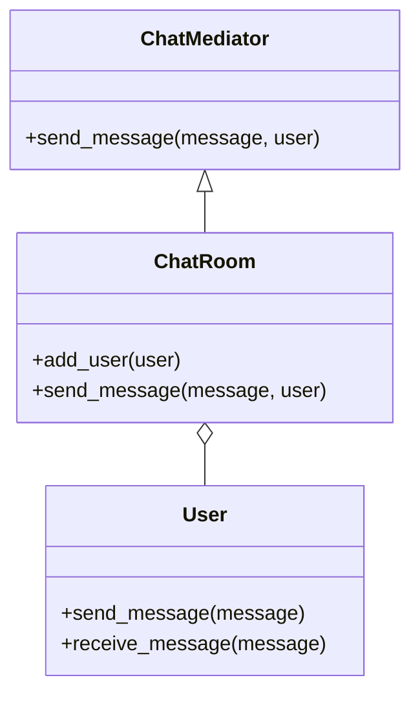

## 6.5 Mediator Pattern

In the realm of software design, managing complex interactions between objects can become a daunting task. The Mediator pattern offers a solution by encapsulating these interactions within a single object, known as the mediator. This pattern promotes loose coupling and enhances maintainability by preventing objects from referring to each other explicitly.

### Intent of the Mediator Pattern

The primary intent of the Mediator pattern is to define an object that encapsulates how a set of objects interact. By centralizing communication logic, the pattern reduces dependencies between communicating objects, making the system easier to understand and modify.

### Problem Addressed by the Mediator Pattern

In complex systems, objects often need to communicate with each other. Without a mediator, each object would need to know about the others, leading to a tightly coupled system. This tight coupling makes the system difficult to maintain and extend. The Mediator pattern addresses this problem by introducing a mediator object that handles all communication between objects, thereby reducing their dependencies on one another.

### Key Participants

1. **Mediator**: Defines an interface for communicating with Colleague objects.
2. **ConcreteMediator**: Implements cooperative behavior by coordinating Colleague objects.
3. **Colleague**: Each Colleague class knows its Mediator object and communicates with it whenever it would have otherwise communicated with another Colleague.

### Applicability

Use the Mediator pattern when:
- A set of objects communicate in well-defined but complex ways.
- Reusing an object is difficult because it refers to and communicates with many other objects.
- A behavior that's distributed between several classes should be customizable without a lot of subclassing.

### Implementing the Mediator Pattern in Ruby

Let's explore how to implement the Mediator pattern in Ruby with a practical example. We'll create a simple chat room application where users can send messages to each other through a mediator.

#### Step 1: Define the Mediator Interface

First, we define an interface for the mediator. In Ruby, we can use a module to define this interface.

```ruby
module ChatMediator
  def send_message(message, user)
    raise NotImplementedError, 'This method should be overridden in a subclass'
  end
end
```

#### Step 2: Implement the ConcreteMediator

Next, we implement the `ConcreteMediator` class, which will handle the communication between users.

```ruby
class ChatRoom
  include ChatMediator

  def initialize
    @users = []
  end

  def add_user(user)
    @users << user
  end

  def send_message(message, user)
    @users.each do |u|
      u.receive_message(message) unless u == user
    end
  end
end
```

#### Step 3: Define the Colleague Class

Now, let's define the `User` class, which will act as a colleague in our pattern.

```ruby
class User
  attr_reader :name

  def initialize(name, chat_room)
    @name = name
    @chat_room = chat_room
    @chat_room.add_user(self)
  end

  def send_message(message)
    puts "#{@name} sends: #{message}"
    @chat_room.send_message(message, self)
  end

  def receive_message(message)
    puts "#{@name} receives: #{message}"
  end
end
```

#### Step 4: Demonstrate the Mediator Pattern

Let's see how the mediator pattern works in action.

```ruby
# Create a chat room (mediator)
chat_room = ChatRoom.new

# Create users (colleagues)
alice = User.new('Alice', chat_room)
bob = User.new('Bob', chat_room)
charlie = User.new('Charlie', chat_room)

# Users send messages through the mediator
alice.send_message('Hello, everyone!')
bob.send_message('Hi, Alice!')
charlie.send_message('Hey, folks!')
```

### Benefits of the Mediator Pattern

- **Simplified Object Interactions**: By centralizing communication logic, the Mediator pattern simplifies interactions between objects.
- **Enhanced Maintainability**: With reduced dependencies, the system becomes easier to maintain and extend.
- **Improved Reusability**: Objects can be reused more easily since they are decoupled from each other.

### Design Considerations

- **Single Point of Failure**: The mediator can become a single point of failure if not designed carefully.
- **Complexity**: While the mediator simplifies object interactions, it can introduce complexity if it becomes too large.

### Ruby Unique Features

Ruby's dynamic nature and metaprogramming capabilities can be leveraged to create flexible and powerful mediator implementations. For instance, you can dynamically define methods in the mediator to handle different types of messages.

### Differences and Similarities

The Mediator pattern is often confused with the Observer pattern. While both patterns decouple objects, the Mediator pattern centralizes communication, whereas the Observer pattern allows objects to subscribe to events.

### Try It Yourself

Experiment with the code by adding more users or modifying the message format. Try implementing additional features, such as private messaging or user status notifications.

```ruby
# Add a private message feature
class ChatRoom
  # Existing code...

  def send_private_message(message, sender, receiver)
    receiver.receive_message("Private from #{sender.name}: #{message}")
  end
end

# Usage
chat_room.send_private_message('This is a secret!', alice, bob)
```

### Visualizing the Mediator Pattern



The diagram above illustrates the relationship between the `ChatMediator`, `ChatRoom`, and `User` classes. The `ChatRoom` acts as the mediator, coordinating communication between `User` instances.

### Knowledge Check

- What is the primary intent of the Mediator pattern?
- How does the Mediator pattern reduce dependencies between objects?
- What are some potential drawbacks of using the Mediator pattern?

### Summary

The Mediator pattern is a powerful tool for managing complex interactions between objects. By encapsulating communication logic within a mediator, it promotes loose coupling and enhances maintainability. As you continue to explore design patterns, consider how the Mediator pattern can simplify your application's architecture.

Remember, this is just the beginning. As you progress, you'll build more complex and interactive applications. Keep experimenting, stay curious, and enjoy the journey!

## Quiz: Mediator Pattern



### What is the primary intent of the Mediator pattern?

- [x] To define an object that encapsulates how a set of objects interact
- [ ] To create a single interface for a set of interfaces
- [ ] To ensure a class has only one instance
- [ ] To provide a way to access elements of an aggregate object sequentially

> **Explanation:** The Mediator pattern's primary intent is to encapsulate how a set of objects interact, reducing dependencies between them.

### How does the Mediator pattern reduce dependencies between objects?

- [x] By centralizing communication logic within a mediator
- [ ] By allowing objects to communicate directly with each other
- [ ] By using inheritance to share behavior
- [ ] By creating a single interface for multiple classes

> **Explanation:** The Mediator pattern centralizes communication logic, reducing dependencies between objects.

### Which of the following is a key participant in the Mediator pattern?

- [x] Mediator
- [ ] Singleton
- [ ] Adapter
- [ ] Proxy

> **Explanation:** The Mediator is a key participant in the Mediator pattern, along with ConcreteMediator and Colleague.

### What is a potential drawback of using the Mediator pattern?

- [x] The mediator can become a single point of failure
- [ ] It increases the number of classes in the system
- [ ] It tightly couples objects
- [ ] It makes the system less maintainable

> **Explanation:** The mediator can become a single point of failure if not designed carefully.

### In the provided Ruby example, what role does the `ChatRoom` class play?

- [x] ConcreteMediator
- [ ] Colleague
- [ ] Adapter
- [ ] Singleton

> **Explanation:** The `ChatRoom` class acts as the ConcreteMediator, coordinating communication between `User` instances.

### What is the role of the `User` class in the Mediator pattern?

- [x] Colleague
- [ ] Mediator
- [ ] Adapter
- [ ] Observer

> **Explanation:** The `User` class acts as a Colleague, communicating with other users through the mediator.

### How can Ruby's dynamic nature enhance the Mediator pattern?

- [x] By allowing dynamic method definitions in the mediator
- [ ] By enforcing strict type checking
- [ ] By limiting the number of objects
- [ ] By creating static interfaces

> **Explanation:** Ruby's dynamic nature allows for flexible mediator implementations through dynamic method definitions.

### What is a similarity between the Mediator and Observer patterns?

- [x] Both decouple objects
- [ ] Both centralize communication
- [ ] Both use inheritance extensively
- [ ] Both are creational patterns

> **Explanation:** Both the Mediator and Observer patterns decouple objects, though they do so in different ways.

### How can you extend the provided Ruby example?

- [x] By adding private messaging between users
- [ ] By removing the mediator
- [ ] By making all users communicate directly
- [ ] By using inheritance to share behavior

> **Explanation:** You can extend the example by adding features like private messaging, enhancing the mediator's functionality.

### True or False: The Mediator pattern is a structural design pattern.

- [ ] True
- [x] False

> **Explanation:** The Mediator pattern is a behavioral design pattern, not a structural one.


