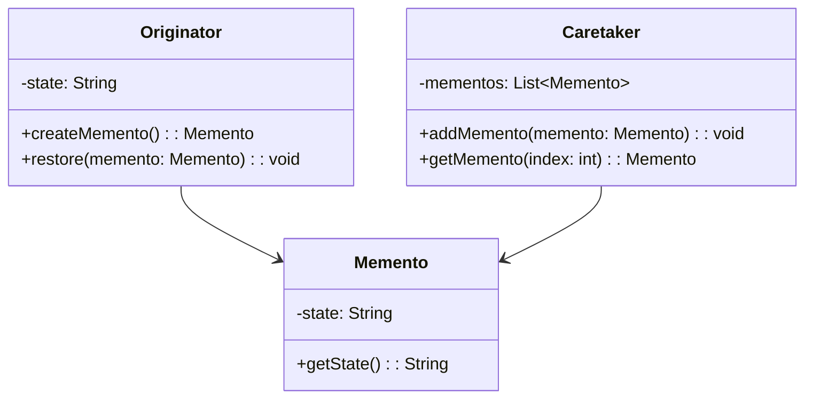

## 6.6 Memento Pattern

The Memento Pattern is a behavioral design pattern that provides the ability to restore an object to its previous state, enabling undo or rollback functionality. This pattern captures and externalizes an object's internal state without violating encapsulation, allowing the state to be restored later.

### Intent

The primary intent of the Memento Pattern is to capture an object's internal state so that it can be restored later, without exposing the details of the object's implementation. This is particularly useful in scenarios where you need to implement undo or rollback functionality.

### Problem Addressed

In many applications, there is a need to revert an object to a previous state. Consider a text editor where users can undo their last action. Implementing such functionality requires capturing the state of the object at various points in time and restoring it when needed. The challenge is to do this without exposing the internal state of the object, which could lead to violations of encapsulation.

### Key Participants

- **Originator**: The object whose state needs to be saved and restored.
- **Memento**: The object that stores the state of the Originator. It is opaque to other objects.
- **Caretaker**: The object responsible for keeping track of the Memento. It does not modify or inspect the contents of the Memento.

### Applicability

Use the Memento Pattern when:

- You need to save and restore the state of an object.
- Direct access to the state would expose implementation details.
- You want to implement undo/redo functionality.

### Sample Code Snippet

Let's demonstrate how to implement the Memento Pattern in Ruby with a simple example of a text editor that can undo text changes.

```ruby
# The Originator class
class TextEditor
  attr_accessor :content

  def initialize
    @content = ""
  end

  def write(text)
    @content += text
  end

  def save
    Memento.new(@content)
  end

  def restore(memento)
    @content = memento.state
  end
end

# The Memento class
class Memento
  attr_reader :state

  def initialize(state)
    @state = state
  end
end

# The Caretaker class
class Caretaker
  def initialize
    @mementos = []
  end

  def backup(memento)
    @mementos.push(memento)
  end

  def undo
    @mementos.pop
  end
end

# Usage
editor = TextEditor.new
caretaker = Caretaker.new

editor.write("Hello, ")
caretaker.backup(editor.save)

editor.write("world!")
caretaker.backup(editor.save)

puts "Current content: #{editor.content}" # Output: Hello, world!

editor.restore(caretaker.undo)
puts "After undo: #{editor.content}" # Output: Hello, 

editor.restore(caretaker.undo)
puts "After another undo: #{editor.content}" # Output: 
```

### Design Considerations

#### Memory Impact

One of the primary considerations when using the Memento Pattern is the memory impact. Each Memento stores a snapshot of the Originator's state, which can consume significant memory if the state is large or if many Mementos are stored. Consider implementing strategies to limit the number of Mementos or compress the state data.

#### Encapsulation Principles

The Memento Pattern is designed to preserve encapsulation by keeping the Memento's state private. The Originator is the only class that can access the Memento's state, ensuring that the internal details of the Originator are not exposed to other classes.

### Ruby Unique Features

Ruby's dynamic nature and metaprogramming capabilities make it particularly well-suited for implementing the Memento Pattern. You can leverage Ruby's `Marshal` module for serialization, which allows you to easily save and restore object states.

```ruby
# Using Marshal for serialization
class TextEditor
  # ...

  def save
    Marshal.dump(@content)
  end

  def restore(serialized_state)
    @content = Marshal.load(serialized_state)
  end
end
```

### Differences and Similarities

The Memento Pattern is often confused with the Command Pattern, as both can be used to implement undo functionality. However, the Command Pattern focuses on encapsulating actions, while the Memento Pattern focuses on capturing and restoring state.

### Visualizing the Memento Pattern



### Try It Yourself

Experiment with the code by adding more functionality to the `TextEditor` class, such as redo operations. Try modifying the `Caretaker` to limit the number of stored Mementos or implement a more complex state management system.

### References and Links

- [Design Patterns: Elements of Reusable Object-Oriented Software](https://en.wikipedia.org/wiki/Design_Patterns) - The book that introduced the Memento Pattern.
- [Ruby Documentation](https://ruby-doc.org/) - Official Ruby documentation for further reading on Ruby features.

### Knowledge Check

- What is the primary purpose of the Memento Pattern?
- How does the Memento Pattern preserve encapsulation?
- What are the key participants in the Memento Pattern?
- How can you manage memory usage when implementing the Memento Pattern?

### Embrace the Journey

Remember, mastering design patterns is a journey. As you continue to explore and implement these patterns, you'll gain a deeper understanding of how to build scalable and maintainable applications. Keep experimenting, stay curious, and enjoy the process!

## Quiz: Memento Pattern



### What is the primary purpose of the Memento Pattern?

- [x] To capture and restore an object's state without exposing its internal details.
- [ ] To encapsulate a request as an object.
- [ ] To define a family of algorithms.
- [ ] To provide a way to access the elements of an aggregate object sequentially.

> **Explanation:** The Memento Pattern is designed to capture and restore an object's state without exposing its internal details, enabling undo functionality.

### Which class is responsible for storing the state in the Memento Pattern?

- [ ] Originator
- [x] Memento
- [ ] Caretaker
- [ ] Observer

> **Explanation:** The Memento class is responsible for storing the state of the Originator.

### How does the Memento Pattern preserve encapsulation?

- [x] By keeping the Memento's state private and only accessible by the Originator.
- [ ] By exposing the Memento's state to the Caretaker.
- [ ] By allowing any class to modify the Memento's state.
- [ ] By storing the state in a global variable.

> **Explanation:** The Memento Pattern preserves encapsulation by keeping the Memento's state private and only accessible by the Originator.

### What is a potential drawback of using the Memento Pattern?

- [x] It can consume significant memory if many Mementos are stored.
- [ ] It exposes the internal state of the Originator.
- [ ] It cannot be used for undo functionality.
- [ ] It requires a complex implementation.

> **Explanation:** A potential drawback of the Memento Pattern is that it can consume significant memory if many Mementos are stored.

### Which Ruby feature can be used for serialization in the Memento Pattern?

- [x] Marshal
- [ ] ActiveRecord
- [ ] RSpec
- [ ] Sinatra

> **Explanation:** Ruby's `Marshal` module can be used for serialization in the Memento Pattern to save and restore object states.

### What is the role of the Caretaker in the Memento Pattern?

- [x] To keep track of Mementos without modifying or inspecting them.
- [ ] To modify the state of the Originator.
- [ ] To expose the Memento's state to other classes.
- [ ] To implement the undo functionality directly.

> **Explanation:** The Caretaker is responsible for keeping track of Mementos without modifying or inspecting them.

### Which pattern is often confused with the Memento Pattern?

- [x] Command Pattern
- [ ] Singleton Pattern
- [ ] Factory Pattern
- [ ] Observer Pattern

> **Explanation:** The Memento Pattern is often confused with the Command Pattern, as both can be used to implement undo functionality.

### What is the main difference between the Memento and Command Patterns?

- [x] Memento focuses on state, while Command focuses on actions.
- [ ] Memento focuses on actions, while Command focuses on state.
- [ ] Both focus on state.
- [ ] Both focus on actions.

> **Explanation:** The main difference is that the Memento Pattern focuses on capturing and restoring state, while the Command Pattern focuses on encapsulating actions.

### True or False: The Memento Pattern can be used to implement redo functionality.

- [x] True
- [ ] False

> **Explanation:** True. The Memento Pattern can be extended to implement redo functionality by managing multiple states.

### Which participant in the Memento Pattern is responsible for creating the Memento?

- [x] Originator
- [ ] Memento
- [ ] Caretaker
- [ ] Observer

> **Explanation:** The Originator is responsible for creating the Memento to capture its state.




