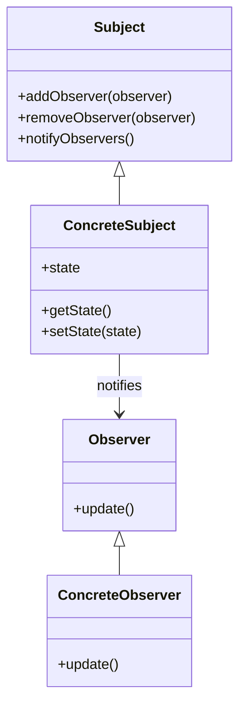

## 6.7 Observer Pattern

The Observer pattern is a fundamental behavioral design pattern that establishes a one-to-many dependency between objects. When one object, known as the subject, changes its state, all its dependents, known as observers, are notified and updated automatically. This pattern is crucial for building scalable and maintainable applications, as it promotes loose coupling between components.

### Intent of the Observer Pattern

The primary intent of the Observer pattern is to define a subscription mechanism to allow multiple objects to listen and react to events or changes in another object. This pattern is particularly useful in scenarios where an object needs to notify other objects without making assumptions about who those objects are.

### Key Participants

1. **Subject**: The object that holds the state and sends notifications to observers when changes occur.
2. **Observer**: The object that wants to be informed about changes in the subject.
3. **ConcreteSubject**: A specific implementation of the subject.
4. **ConcreteObserver**: A specific implementation of the observer that reacts to changes in the subject.

### Applicability

The Observer pattern is applicable in various scenarios, including:

- **Event Handling**: When you need to notify multiple components about events, such as user actions or system events.
- **Data Binding**: In applications where UI components need to reflect changes in the underlying data model.
- **Distributed Systems**: When changes in one component need to be propagated to other components across a network.

### Ruby's `Observable` Module

Ruby provides a built-in `Observable` module that simplifies the implementation of the Observer pattern. This module can be included in any class to make it observable. Here's how it works:

```ruby
require 'observer'

class TemperatureSensor
  include Observable

  def initialize
    @temperature = 0
  end

  def temperature=(new_temperature)
    @temperature = new_temperature
    changed
    notify_observers(@temperature)
  end
end

class TemperatureDisplay
  def update(temperature)
    puts "Temperature updated to #{temperature} degrees."
  end
end

sensor = TemperatureSensor.new
display = TemperatureDisplay.new

sensor.add_observer(display)
sensor.temperature = 25
```

**Explanation**:
- The `TemperatureSensor` class includes the `Observable` module, allowing it to manage a list of observers.
- The `temperature=` method updates the temperature and notifies all observers of the change.
- The `TemperatureDisplay` class implements an `update` method, which is called when the temperature changes.

### Alternative Implementations Without `Observable`

While Ruby's `Observable` module is convenient, you might want to implement the Observer pattern manually for more control or to avoid dependencies. Here's an example:

```ruby
class ManualTemperatureSensor
  def initialize
    @observers = []
    @temperature = 0
  end

  def add_observer(observer)
    @observers << observer
  end

  def remove_observer(observer)
    @observers.delete(observer)
  end

  def temperature=(new_temperature)
    @temperature = new_temperature
    notify_observers
  end

  private

  def notify_observers
    @observers.each { |observer| observer.update(@temperature) }
  end
end

class ManualTemperatureDisplay
  def update(temperature)
    puts "Temperature updated to #{temperature} degrees."
  end
end

sensor = ManualTemperatureSensor.new
display = ManualTemperatureDisplay.new

sensor.add_observer(display)
sensor.temperature = 30
```

**Explanation**:
- The `ManualTemperatureSensor` class manages its own list of observers and manually notifies them of changes.
- This approach provides more flexibility but requires more boilerplate code.

### Use Cases

1. **Event Handling**: The Observer pattern is ideal for implementing event-driven architectures where components need to react to events without being tightly coupled.
2. **Data Binding**: In GUI applications, the Observer pattern can be used to keep the UI in sync with the underlying data model.
3. **Real-Time Systems**: In systems where real-time updates are crucial, such as stock trading platforms, the Observer pattern ensures that all components are updated promptly.

### Benefits of the Observer Pattern

- **Decoupling**: Observers and subjects are loosely coupled, allowing for more flexible and maintainable code.
- **Scalability**: New observers can be added without modifying the subject.
- **Reusability**: Observers can be reused across different subjects.

### Design Considerations

- **Performance**: Notifying a large number of observers can be resource-intensive. Consider using asynchronous notifications if performance is a concern.
- **Memory Leaks**: Ensure that observers are properly removed to prevent memory leaks.
- **Complexity**: While the Observer pattern simplifies certain aspects of design, it can also introduce complexity if not managed properly.

### Ruby Unique Features

Ruby's dynamic nature and built-in `Observable` module make implementing the Observer pattern straightforward. The ability to include modules and dynamically define methods enhances flexibility and reduces boilerplate code.

### Differences and Similarities

The Observer pattern is often confused with the Publish-Subscribe pattern. While both involve notifying multiple subscribers, the Publish-Subscribe pattern typically involves a message broker, whereas the Observer pattern involves direct communication between subjects and observers.

### Visualizing the Observer Pattern



**Diagram Description**: This class diagram illustrates the relationship between the subject and its observers. The `ConcreteSubject` maintains a list of `Observer` instances and notifies them of state changes.

### Try It Yourself

Experiment with the Observer pattern by modifying the code examples. Try adding multiple observers to the `TemperatureSensor` and see how they react to temperature changes. Consider implementing a new observer that logs temperature changes to a file.

### References and Links

- [Ruby Observable Module Documentation](https://ruby-doc.org/stdlib-2.7.0/libdoc/observer/rdoc/Observable.html)
- [Design Patterns: Elements of Reusable Object-Oriented Software](https://en.wikipedia.org/wiki/Design_Patterns) by Erich Gamma et al.

### Knowledge Check

- What is the primary intent of the Observer pattern?
- How does Ruby's `Observable` module facilitate the Observer pattern?
- What are some use cases for the Observer pattern?
- What are the benefits of using the Observer pattern in Ruby?

### Embrace the Journey

Remember, mastering design patterns like the Observer pattern is a journey. As you continue to explore and experiment, you'll gain a deeper understanding of how to build scalable and maintainable applications. Keep experimenting, stay curious, and enjoy the journey!

## Quiz: Observer Pattern



### What is the primary intent of the Observer pattern?

- [x] To define a subscription mechanism to allow multiple objects to listen and react to events or changes in another object.
- [ ] To create a one-to-one relationship between objects.
- [ ] To encapsulate a request as an object.
- [ ] To provide a way to access the elements of an aggregate object sequentially.

> **Explanation:** The Observer pattern is designed to establish a one-to-many dependency between objects, allowing multiple observers to be notified of changes in the subject.

### How does Ruby's `Observable` module facilitate the Observer pattern?

- [x] By providing methods to manage a list of observers and notify them of changes.
- [ ] By automatically creating observer classes.
- [ ] By enforcing strict type checking on observers.
- [ ] By providing a graphical user interface for managing observers.

> **Explanation:** The `Observable` module provides methods like `add_observer`, `delete_observer`, and `notify_observers` to manage and notify observers.

### Which of the following is a use case for the Observer pattern?

- [x] Event handling in GUI applications.
- [ ] Sorting algorithms.
- [ ] Database normalization.
- [ ] Memory management.

> **Explanation:** The Observer pattern is commonly used in event-driven architectures, such as GUI applications, where components need to react to events.

### What is a potential drawback of the Observer pattern?

- [x] Performance issues when notifying a large number of observers.
- [ ] Difficulty in implementing the pattern in Ruby.
- [ ] Lack of flexibility in adding new observers.
- [ ] Inability to decouple components.

> **Explanation:** Notifying a large number of observers can be resource-intensive, which is a potential drawback of the Observer pattern.

### How can you prevent memory leaks when using the Observer pattern?

- [x] By ensuring observers are properly removed when no longer needed.
- [ ] By using global variables for observer management.
- [x] By using weak references for observers.
- [ ] By avoiding the use of the Observer pattern altogether.

> **Explanation:** Properly removing observers and using weak references can help prevent memory leaks.

### What is the difference between the Observer pattern and the Publish-Subscribe pattern?

- [x] The Observer pattern involves direct communication between subjects and observers, while the Publish-Subscribe pattern typically involves a message broker.
- [ ] The Observer pattern is only used in GUI applications.
- [ ] The Publish-Subscribe pattern is a subset of the Observer pattern.
- [ ] There is no difference between the two patterns.

> **Explanation:** The Observer pattern involves direct communication, whereas the Publish-Subscribe pattern often uses a message broker for communication.

### What is the role of the `ConcreteObserver` in the Observer pattern?

- [x] To implement the `update` method and react to changes in the subject.
- [ ] To manage the list of observers.
- [ ] To encapsulate the state of the subject.
- [ ] To provide a user interface for the application.

> **Explanation:** The `ConcreteObserver` implements the `update` method to react to changes in the subject.

### What method is used to notify observers in Ruby's `Observable` module?

- [x] `notify_observers`
- [ ] `update_observers`
- [ ] `send_notifications`
- [ ] `broadcast_changes`

> **Explanation:** The `notify_observers` method is used to notify all registered observers of changes.

### True or False: The Observer pattern can be used for data binding in applications.

- [x] True
- [ ] False

> **Explanation:** The Observer pattern is suitable for data binding scenarios where UI components need to reflect changes in the data model.

### Which of the following is a benefit of using the Observer pattern?

- [x] Decoupling of components.
- [ ] Increased complexity in code.
- [ ] Tight coupling between observers and subjects.
- [ ] Reduced flexibility in adding new observers.

> **Explanation:** The Observer pattern promotes decoupling, making it easier to maintain and extend the codebase.


