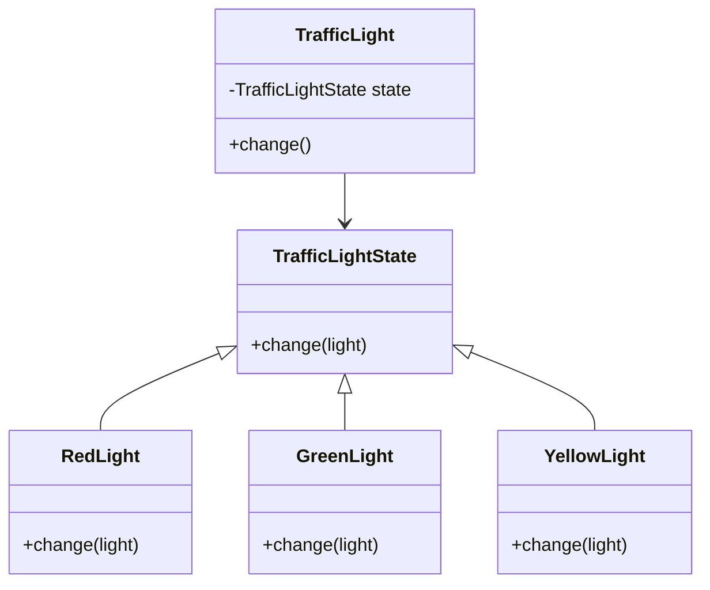

## 6.8 State Pattern

The State pattern is a behavioral design pattern that allows an object to change its behavior when its internal state changes. This pattern is particularly useful when an object must change its behavior at runtime depending on its state, making it appear as if the object has changed its class.

### Intent of the State Pattern

The primary intent of the State pattern is to encapsulate state-specific behavior and delegate behavior to the current state of the object. This pattern is beneficial in scenarios where an object can be in one of several states, and the behavior of the object changes based on its state.

### Problem Addressed by the State Pattern

In many applications, objects need to change their behavior based on their state. Without the State pattern, this often leads to complex conditional statements scattered throughout the codebase. These conditionals can become difficult to manage and understand, especially as the number of states grows. The State pattern provides a cleaner solution by encapsulating state-specific behavior in separate classes, thus promoting cleaner, more maintainable code.

### Implementing the State Pattern in Ruby

To implement the State pattern in Ruby, we define a context class that maintains an instance of a state subclass. The context delegates state-specific behavior to the current state object. Let's illustrate this with a practical example.

#### Example: Traffic Light System

Consider a traffic light system that can be in one of three states: Red, Green, or Yellow. Each state has specific behavior, such as transitioning to the next state after a certain period.

```ruby
# State interface
class TrafficLightState
  def change(light)
    raise NotImplementedError, "#{self.class} has not implemented method '#{__method__}'"
  end
end

# Concrete states
class RedLight < TrafficLightState
  def change(light)
    puts "Changing from Red to Green"
    light.state = GreenLight.new
  end
end

class GreenLight < TrafficLightState
  def change(light)
    puts "Changing from Green to Yellow"
    light.state = YellowLight.new
  end
end

class YellowLight < TrafficLightState
  def change(light)
    puts "Changing from Yellow to Red"
    light.state = RedLight.new
  end
end

# Context class
class TrafficLight
  attr_accessor :state

  def initialize
    @state = RedLight.new
  end

  def change
    @state.change(self)
  end
end

# Usage
light = TrafficLight.new
3.times { light.change }
```

In this example, the `TrafficLight` class acts as the context, and it maintains a reference to an instance of a `TrafficLightState`. The `change` method in each state class implements the transition logic to the next state.

### Advantages of the State Pattern

1. **Avoids Large Conditional Statements**: By encapsulating state-specific behavior in separate classes, the State pattern eliminates the need for complex conditional statements, leading to cleaner and more understandable code.

2. **Encapsulates State-Specific Behavior**: Each state is represented by a separate class, making it easier to manage and extend the behavior associated with each state.

3. **Promotes Open/Closed Principle**: The State pattern allows new states to be added without modifying existing code, adhering to the open/closed principle of software design.

4. **Improves Code Maintainability**: By organizing code into state-specific classes, the State pattern enhances code maintainability, making it easier to understand and modify.

### Ruby-Specific Features

Ruby's dynamic nature and support for duck typing make it particularly well-suited for implementing the State pattern. Ruby's ability to define methods dynamically and its flexible class system allow for elegant and concise implementations of state transitions.

### Differences and Similarities with Other Patterns

The State pattern is often confused with the Strategy pattern. While both patterns involve encapsulating behavior, the key difference is that the State pattern is used to change the behavior of an object based on its state, whereas the Strategy pattern is used to select an algorithm at runtime.

### Design Considerations

- **When to Use**: Use the State pattern when an object must change its behavior at runtime depending on its state, and when you have multiple states with distinct behaviors.
- **Pitfalls**: Be cautious of creating too many state classes, which can lead to an overly complex system. Ensure that the benefits of using the State pattern outweigh the complexity it introduces.

### Try It Yourself

To deepen your understanding, try modifying the traffic light example to include a blinking state. Implement a `BlinkingLight` class that transitions back to the previous state after a blink.

### Visualizing the State Pattern

Below is a class diagram illustrating the State pattern using Mermaid.js:



This diagram shows the relationship between the `TrafficLight` context and its state classes, illustrating how the context delegates behavior to the current state.

### Knowledge Check

- What is the primary intent of the State pattern?
- How does the State pattern improve code maintainability?
- What are the key differences between the State and Strategy patterns?

### Embrace the Journey

Remember, mastering design patterns like the State pattern is a journey. As you continue to explore and implement these patterns, you'll gain a deeper understanding of how to build scalable and maintainable applications. Keep experimenting, stay curious, and enjoy the journey!

## Quiz: State Pattern



### What is the primary intent of the State pattern?

- [x] To allow an object to change its behavior when its internal state changes
- [ ] To encapsulate algorithms in separate classes
- [ ] To provide a way to access the elements of an aggregate object sequentially
- [ ] To define a family of algorithms

> **Explanation:** The State pattern allows an object to change its behavior when its internal state changes, making it appear as if the object has changed its class.

### How does the State pattern improve code maintainability?

- [x] By encapsulating state-specific behavior in separate classes
- [ ] By using complex conditional statements
- [ ] By reducing the number of classes
- [ ] By making the code more abstract

> **Explanation:** The State pattern improves code maintainability by encapsulating state-specific behavior in separate classes, leading to cleaner and more understandable code.

### What is a key difference between the State and Strategy patterns?

- [x] The State pattern changes behavior based on state, while the Strategy pattern selects an algorithm at runtime
- [ ] The State pattern is used for encapsulating algorithms, while the Strategy pattern is used for state transitions
- [ ] The State pattern is a creational pattern, while the Strategy pattern is a structural pattern
- [ ] The State pattern is used for object creation, while the Strategy pattern is used for object destruction

> **Explanation:** The State pattern changes behavior based on the object's state, whereas the Strategy pattern is used to select an algorithm at runtime.

### Which of the following is a benefit of using the State pattern?

- [x] Avoids large conditional statements
- [ ] Increases the number of classes
- [ ] Makes code more complex
- [ ] Reduces code flexibility

> **Explanation:** The State pattern avoids large conditional statements by encapsulating state-specific behavior in separate classes.

### In the State pattern, what role does the context class play?

- [x] Maintains an instance of a state subclass and delegates behavior to it
- [ ] Implements all state-specific behavior directly
- [ ] Selects an algorithm at runtime
- [ ] Provides a way to access elements of an aggregate object

> **Explanation:** The context class maintains an instance of a state subclass and delegates behavior to the current state object.

### What is a potential pitfall of using the State pattern?

- [x] Creating too many state classes can lead to complexity
- [ ] It makes code less maintainable
- [ ] It requires complex conditional statements
- [ ] It reduces code flexibility

> **Explanation:** A potential pitfall of the State pattern is creating too many state classes, which can lead to an overly complex system.

### How does Ruby's dynamic nature benefit the implementation of the State pattern?

- [x] Allows for elegant and concise implementations of state transitions
- [ ] Requires more boilerplate code
- [ ] Makes it difficult to implement state transitions
- [ ] Reduces the flexibility of state transitions

> **Explanation:** Ruby's dynamic nature allows for elegant and concise implementations of state transitions, making it well-suited for the State pattern.

### What is the role of the `change` method in the state classes?

- [x] Implements the transition logic to the next state
- [ ] Selects an algorithm at runtime
- [ ] Provides a way to access elements of an aggregate object
- [ ] Encapsulates algorithms in separate classes

> **Explanation:** The `change` method in the state classes implements the transition logic to the next state.

### Which of the following is a characteristic of the State pattern?

- [x] Promotes the open/closed principle
- [ ] Reduces the number of classes
- [ ] Makes code more abstract
- [ ] Requires complex conditional statements

> **Explanation:** The State pattern promotes the open/closed principle by allowing new states to be added without modifying existing code.

### True or False: The State pattern is used to encapsulate algorithms in separate classes.

- [ ] True
- [x] False

> **Explanation:** False. The State pattern is used to encapsulate state-specific behavior and change an object's behavior based on its state, not to encapsulate algorithms.



---
