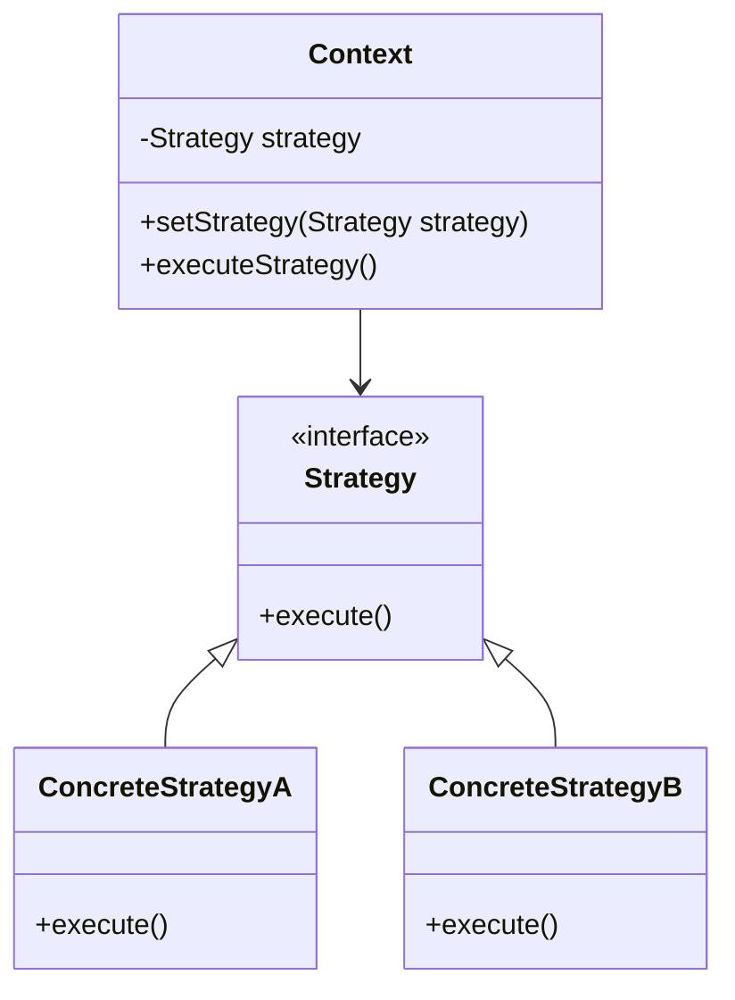

## 6.9 Strategy Pattern

### Introduction

The Strategy Pattern is a behavioral design pattern that enables selecting an algorithm's behavior at runtime. It defines a family of algorithms, encapsulates each one, and makes them interchangeable. This pattern allows the algorithm to vary independently from the clients that use it, promoting flexibility and reusability in your codebase.

### Intent

The primary intent of the Strategy Pattern is to define a set of algorithms, encapsulate each one, and make them interchangeable. This pattern allows clients to choose which algorithm to use, providing a way to configure a class with one of many behaviors.

### Problem Addressed

In software development, you often encounter scenarios where you need to perform a task using different algorithms. For instance, sorting data can be done using various algorithms like bubble sort, quicksort, or mergesort. The Strategy Pattern addresses the need for interchangeable algorithms, allowing you to switch between them without altering the client code.

### Key Participants

1. **Strategy**: An interface common to all supported algorithms. Context uses this interface to call the algorithm defined by a ConcreteStrategy.
2. **ConcreteStrategy**: Implements the algorithm using the Strategy interface.
3. **Context**: Maintains a reference to a Strategy object and is configured with a ConcreteStrategy object.

### Applicability

Use the Strategy Pattern when:

- You have multiple related classes that differ only in their behavior.
- You need different variants of an algorithm.
- You want to avoid exposing complex, algorithm-specific data structures.
- A class defines many behaviors, and these appear as multiple conditional statements in its operations.

### Implementing the Strategy Pattern in Ruby

Ruby's dynamic nature makes it an excellent language for implementing the Strategy Pattern. You can use modules, classes, or Procs to define strategies.

#### Using Classes

```ruby
# Define the Strategy interface
class PaymentStrategy
  def pay(amount)
    raise NotImplementedError, 'This method should be overridden'
  end
end

# ConcreteStrategy: CreditCard
class CreditCardPayment < PaymentStrategy
  def pay(amount)
    puts "Paying #{amount} using Credit Card."
  end
end

# ConcreteStrategy: PayPal
class PayPalPayment < PaymentStrategy
  def pay(amount)
    puts "Paying #{amount} using PayPal."
  end
end

# Context
class ShoppingCart
  attr_accessor :payment_strategy

  def initialize(payment_strategy)
    @payment_strategy = payment_strategy
  end

  def checkout(amount)
    @payment_strategy.pay(amount)
  end
end

# Client code
cart = ShoppingCart.new(CreditCardPayment.new)
cart.checkout(100)

cart.payment_strategy = PayPalPayment.new
cart.checkout(200)
```

#### Using Modules

```ruby
module PaymentStrategy
  def pay(amount)
    raise NotImplementedError, 'This method should be overridden'
  end
end

class CreditCardPayment
  include PaymentStrategy

  def pay(amount)
    puts "Paying #{amount} using Credit Card."
  end
end

class PayPalPayment
  include PaymentStrategy

  def pay(amount)
    puts "Paying #{amount} using PayPal."
  end
end

class ShoppingCart
  attr_accessor :payment_strategy

  def initialize(payment_strategy)
    @payment_strategy = payment_strategy
  end

  def checkout(amount)
    @payment_strategy.pay(amount)
  end
end

cart = ShoppingCart.new(CreditCardPayment.new)
cart.checkout(100)

cart.payment_strategy = PayPalPayment.new
cart.checkout(200)
```

#### Using Procs

```ruby
credit_card_payment = Proc.new { |amount| puts "Paying #{amount} using Credit Card." }
paypal_payment = Proc.new { |amount| puts "Paying #{amount} using PayPal." }

class ShoppingCart
  attr_accessor :payment_strategy

  def initialize(payment_strategy)
    @payment_strategy = payment_strategy
  end

  def checkout(amount)
    @payment_strategy.call(amount)
  end
end

cart = ShoppingCart.new(credit_card_payment)
cart.checkout(100)

cart.payment_strategy = paypal_payment
cart.checkout(200)
```

### Benefits of the Strategy Pattern

- **Flexibility**: Easily switch between different algorithms at runtime.
- **Reusability**: Reuse algorithms across different contexts.
- **Separation of Concerns**: Separate the algorithm from the context, making the code easier to maintain and extend.

### Design Considerations

- **Complexity**: Introducing the Strategy Pattern can add complexity to your codebase. Ensure that the benefits outweigh the added complexity.
- **Overhead**: If the strategy objects are stateless, they can be shared across contexts to reduce overhead.

### Ruby Unique Features

Ruby's dynamic typing and support for blocks and Procs make it particularly well-suited for the Strategy Pattern. You can leverage Ruby's flexibility to create concise and expressive strategy implementations.

### Differences and Similarities

The Strategy Pattern is often confused with the State Pattern. While both patterns involve changing behavior at runtime, the Strategy Pattern is used to select an algorithm, whereas the State Pattern is used to change the state of an object.

### Visualizing the Strategy Pattern



**Diagram Description**: This class diagram illustrates the Strategy Pattern. The `Context` class maintains a reference to a `Strategy` object and can execute the strategy. `ConcreteStrategyA` and `ConcreteStrategyB` are implementations of the `Strategy` interface.

### Try It Yourself

Experiment with the code examples provided. Try creating new payment strategies or modifying existing ones. Consider implementing a discount strategy for the shopping cart.

### Knowledge Check

- What is the primary intent of the Strategy Pattern?
- How does the Strategy Pattern promote flexibility and reusability?
- What are the key participants in the Strategy Pattern?
- How can you implement the Strategy Pattern using Ruby's Procs?
- What are the benefits of using the Strategy Pattern?

### Embrace the Journey

Remember, mastering design patterns is a journey. As you continue to explore the Strategy Pattern, you'll discover new ways to apply it in your projects. Keep experimenting, stay curious, and enjoy the process of learning and growing as a developer.

## Quiz: Strategy Pattern



### What is the primary intent of the Strategy Pattern?

- [x] To define a family of algorithms, encapsulate each one, and make them interchangeable.
- [ ] To manage object creation.
- [ ] To define a one-to-many dependency between objects.
- [ ] To provide a way to access elements of an aggregate object sequentially.

> **Explanation:** The Strategy Pattern's primary intent is to define a family of algorithms, encapsulate each one, and make them interchangeable.

### Which of the following is a key participant in the Strategy Pattern?

- [x] Strategy
- [ ] Observer
- [ ] Singleton
- [ ] Adapter

> **Explanation:** The Strategy Pattern involves key participants like Strategy, ConcreteStrategy, and Context.

### How can the Strategy Pattern be implemented in Ruby?

- [x] Using classes
- [x] Using modules
- [x] Using Procs
- [ ] Using only global variables

> **Explanation:** In Ruby, the Strategy Pattern can be implemented using classes, modules, or Procs due to Ruby's dynamic nature.

### What is a benefit of the Strategy Pattern?

- [x] Flexibility in choosing algorithms at runtime.
- [ ] Reducing the number of classes in a system.
- [ ] Eliminating the need for interfaces.
- [ ] Making all algorithms static.

> **Explanation:** The Strategy Pattern provides flexibility in choosing algorithms at runtime, enhancing reusability and separation of concerns.

### Which Ruby feature makes it particularly well-suited for the Strategy Pattern?

- [x] Dynamic typing
- [ ] Static typing
- [ ] Lack of inheritance
- [ ] Limited support for blocks

> **Explanation:** Ruby's dynamic typing and support for blocks and Procs make it well-suited for implementing the Strategy Pattern.

### In the Strategy Pattern, what does the Context class do?

- [x] Maintains a reference to a Strategy object and is configured with a ConcreteStrategy object.
- [ ] Implements the algorithm using the Strategy interface.
- [ ] Defines a family of algorithms.
- [ ] Provides a way to access elements of an aggregate object sequentially.

> **Explanation:** The Context class maintains a reference to a Strategy object and is configured with a ConcreteStrategy object.

### What is a potential downside of using the Strategy Pattern?

- [x] Increased complexity in the codebase.
- [ ] Reduced flexibility in choosing algorithms.
- [ ] Lack of reusability.
- [ ] Difficulty in maintaining separation of concerns.

> **Explanation:** Introducing the Strategy Pattern can add complexity to the codebase, which should be considered when deciding to use it.

### How does the Strategy Pattern differ from the State Pattern?

- [x] The Strategy Pattern is used to select an algorithm, while the State Pattern is used to change the state of an object.
- [ ] The Strategy Pattern is used to manage object creation.
- [ ] The Strategy Pattern is used to define a one-to-many dependency between objects.
- [ ] The Strategy Pattern is used to provide a way to access elements of an aggregate object sequentially.

> **Explanation:** The Strategy Pattern is used to select an algorithm, whereas the State Pattern is used to change the state of an object.

### Which of the following is not a benefit of the Strategy Pattern?

- [ ] Flexibility
- [ ] Reusability
- [ ] Separation of Concerns
- [x] Reducing the number of classes

> **Explanation:** While the Strategy Pattern offers flexibility, reusability, and separation of concerns, it does not necessarily reduce the number of classes.

### True or False: The Strategy Pattern allows algorithms to vary independently from clients that use them.

- [x] True
- [ ] False

> **Explanation:** True. The Strategy Pattern allows algorithms to vary independently from clients that use them, promoting flexibility and reusability.




