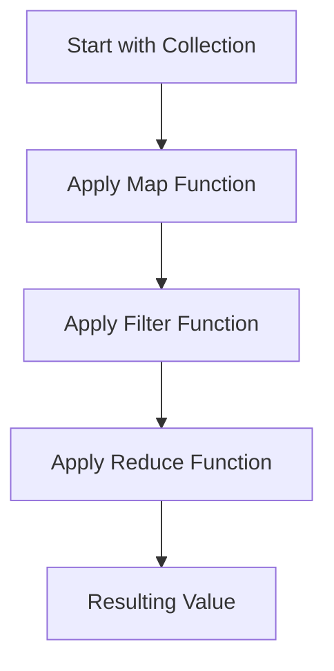

## 7.1 Understanding Functional Concepts in Ruby

Functional programming (FP) is a programming paradigm that treats computation as the evaluation of mathematical functions and avoids changing state or mutable data. In this section, we will explore the core concepts of functional programming and how they can be applied in Ruby. We will also discuss the benefits of using functional programming techniques in Ruby applications and provide examples to illustrate these concepts.

### What is Functional Programming?

Functional programming is a declarative programming paradigm where programs are constructed by applying and composing functions. It emphasizes the use of pure functions, immutability, and first-class functions. Let's break down these core concepts:

- **Pure Functions**: Functions that have no side effects and return the same output for the same input.
- **Immutability**: Data cannot be changed once created. Instead, new data structures are created with the desired changes.
- **First-Class Functions**: Functions are treated as first-class citizens, meaning they can be passed as arguments, returned from other functions, and assigned to variables.

### How Ruby Supports Functional Paradigms

Ruby is primarily an object-oriented language, but it also supports functional programming paradigms. Here are some ways Ruby facilitates functional programming:

- **Blocks, Procs, and Lambdas**: Ruby provides blocks, procs, and lambdas to create anonymous functions, which can be passed around as first-class citizens.
- **Enumerable Module**: Ruby's `Enumerable` module offers a collection of higher-order functions like `map`, `select`, and `reduce`, which are essential for functional programming.
- **Immutability with `freeze`**: Ruby allows objects to be frozen, making them immutable.
- **Functional Constructs**: Ruby supports constructs like `map`, `select`, and `reduce` that encourage a functional style of programming.

### Benefits of Functional Programming in Ruby

Functional programming offers several benefits, especially when applied to Ruby applications:

- **Improved Code Readability**: Functional code is often more concise and easier to read, as it focuses on what to do rather than how to do it.
- **Easier Debugging and Testing**: Pure functions are easier to test and debug because they don't rely on external state.
- **Concurrency and Parallelism**: Immutability and statelessness make it easier to write concurrent and parallel programs.
- **Reduced Bugs**: By avoiding side effects and mutable state, functional programming can help reduce bugs in your code.

### Comparing Functional and Imperative Approaches

To illustrate the difference between functional and imperative approaches, let's consider a simple example: calculating the sum of an array of numbers.

#### Imperative Approach

```ruby
# Imperative approach to calculate the sum of an array
def sum_array(numbers)
  sum = 0
  numbers.each do |number|
    sum += number
  end
  sum
end

numbers = [1, 2, 3, 4, 5]
puts sum_array(numbers) # Output: 15
```

In the imperative approach, we explicitly define how to calculate the sum by iterating over the array and maintaining a running total.

#### Functional Approach

```ruby
# Functional approach to calculate the sum of an array
def sum_array(numbers)
  numbers.reduce(0, :+)
end

numbers = [1, 2, 3, 4, 5]
puts sum_array(numbers) # Output: 15
```

In the functional approach, we use the `reduce` method to express what we want to achieve (summing the numbers) without specifying how to iterate over the array.

### Key Functional Concepts in Ruby

#### Immutability

Immutability is a core concept in functional programming. In Ruby, you can achieve immutability by using the `freeze` method, which prevents further modifications to an object.

```ruby
# Example of immutability in Ruby
numbers = [1, 2, 3].freeze
numbers << 4 # Raises RuntimeError: can't modify frozen Array
```

By freezing an object, you ensure that it cannot be altered, which can help prevent bugs related to unexpected state changes.

#### First-Class Functions

Ruby treats functions as first-class citizens, allowing you to pass them as arguments, return them from other functions, and assign them to variables.

```ruby
# Example of first-class functions in Ruby
def greet(name)
  "Hello, #{name}!"
end

def execute_function(func, arg)
  func.call(arg)
end

greeting = method(:greet)
puts execute_function(greeting, "Alice") # Output: Hello, Alice!
```

In this example, we pass the `greet` method as an argument to `execute_function`, demonstrating Ruby's support for first-class functions.

#### Pure Functions

Pure functions are functions that do not have side effects and return the same output for the same input. They are a cornerstone of functional programming.

```ruby
# Example of a pure function in Ruby
def add(a, b)
  a + b
end

puts add(2, 3) # Output: 5
puts add(2, 3) # Output: 5
```

The `add` function is pure because it always returns the same result for the same inputs and does not modify any external state.

### When to Use Functional Techniques

Functional techniques can improve code quality in various situations:

- **Data Transformation**: Use functional techniques like `map` and `reduce` for transforming collections of data.
- **Concurrency**: Leverage immutability and pure functions to write concurrent code that is free from race conditions.
- **Testing**: Pure functions are easier to test because they have no side effects.
- **Complex Logic**: Break down complex logic into smaller, pure functions to improve readability and maintainability.

### Try It Yourself

Experiment with the following code examples to deepen your understanding of functional programming in Ruby:

1. Modify the `sum_array` function to calculate the product of the numbers instead of the sum.
2. Create a pure function that filters out even numbers from an array.
3. Implement a function that takes another function as an argument and applies it to each element of an array.

### Visualizing Functional Concepts

To better understand the flow of functional programming, let's visualize the process of transforming a collection using functional techniques.



In this diagram, we start with a collection, apply a series of functional transformations (map, filter, reduce), and arrive at a resulting value.

### References and Further Reading

- [Ruby's Enumerable Module](https://ruby-doc.org/core-2.7.0/Enumerable.html)
- [Functional Programming Concepts](https://en.wikipedia.org/wiki/Functional_programming)
- [Ruby Blocks, Procs, and Lambdas](https://www.rubyguides.com/2016/02/ruby-procs-and-lambdas/)

### Knowledge Check

- What are the core concepts of functional programming?
- How does Ruby support functional programming paradigms?
- What are the benefits of using functional programming in Ruby applications?
- How do pure functions differ from impure functions?
- When should you use functional techniques in Ruby?

### Embrace the Journey

Remember, this is just the beginning. As you progress, you'll build more complex and interactive Ruby applications using functional programming techniques. Keep experimenting, stay curious, and enjoy the journey!

## Quiz: Understanding Functional Concepts in Ruby



### What is a pure function?

- [x] A function that returns the same output for the same input and has no side effects.
- [ ] A function that modifies global state.
- [ ] A function that depends on external variables.
- [ ] A function that uses mutable data.

> **Explanation:** A pure function always returns the same result for the same input and does not cause any side effects, such as modifying global state or relying on external variables.

### How does Ruby support first-class functions?

- [x] By allowing functions to be passed as arguments.
- [x] By allowing functions to be returned from other functions.
- [ ] By restricting functions to be used only within classes.
- [ ] By disallowing functions to be assigned to variables.

> **Explanation:** Ruby treats functions as first-class citizens, meaning they can be passed as arguments, returned from other functions, and assigned to variables.

### What is immutability in functional programming?

- [x] The concept that data cannot be changed once created.
- [ ] The ability to modify data in place.
- [ ] The use of mutable data structures.
- [ ] The reliance on global variables.

> **Explanation:** Immutability means that data cannot be changed once created, which helps prevent bugs related to unexpected state changes.

### Which Ruby feature helps achieve immutability?

- [x] The `freeze` method.
- [ ] The `dup` method.
- [ ] The `clone` method.
- [ ] The `eval` method.

> **Explanation:** The `freeze` method in Ruby is used to make objects immutable, preventing further modifications.

### What is the benefit of using pure functions?

- [x] Easier testing and debugging.
- [x] Improved code readability.
- [ ] Increased reliance on global state.
- [ ] More complex code structure.

> **Explanation:** Pure functions are easier to test and debug because they don't rely on external state, and they improve code readability by focusing on what the function does.

### What is the purpose of the `reduce` method in Ruby?

- [x] To accumulate a single value from a collection.
- [ ] To filter elements from a collection.
- [ ] To sort elements in a collection.
- [ ] To modify elements in place.

> **Explanation:** The `reduce` method is used to accumulate a single value from a collection by applying a binary operation.

### How can functional programming improve concurrency?

- [x] By using immutability to prevent race conditions.
- [x] By avoiding shared mutable state.
- [ ] By relying on global variables.
- [ ] By using side effects extensively.

> **Explanation:** Functional programming improves concurrency by using immutability and avoiding shared mutable state, which prevents race conditions.

### What is a higher-order function?

- [x] A function that takes other functions as arguments or returns them.
- [ ] A function that modifies global state.
- [ ] A function that relies on mutable data.
- [ ] A function that cannot be passed as an argument.

> **Explanation:** A higher-order function is a function that takes other functions as arguments or returns them, allowing for more abstract and flexible code.

### What is the difference between `map` and `reduce`?

- [x] `map` transforms each element, while `reduce` accumulates a single value.
- [ ] `map` accumulates a single value, while `reduce` transforms each element.
- [ ] `map` sorts elements, while `reduce` filters elements.
- [ ] `map` modifies elements in place, while `reduce` does not.

> **Explanation:** `map` is used to transform each element in a collection, while `reduce` is used to accumulate a single value from a collection.

### True or False: Functional programming in Ruby can help reduce bugs.

- [x] True
- [ ] False

> **Explanation:** Functional programming can help reduce bugs by avoiding side effects and mutable state, leading to more predictable and reliable code.


