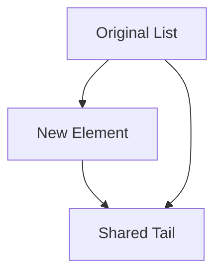

## 7.10 Functional Data Structures

Functional data structures are a cornerstone of functional programming, offering immutability and efficiency through techniques like structural sharing. In this section, we will explore what functional data structures are, the challenges of implementing them in Ruby, and how they can be used to build scalable and maintainable applications.

### Understanding Functional Data Structures

Functional data structures are designed to be immutable, meaning once they are created, they cannot be changed. This immutability is crucial in functional programming, where functions are expected to have no side effects. Instead of modifying data, functional data structures create new versions of themselves with the desired changes.

#### Key Characteristics

- **Immutability**: Once created, the data structure cannot be altered.
- **Persistence**: Previous versions of the data structure remain accessible after modifications.
- **Structural Sharing**: New versions of the data structure share parts of the old structure to save memory and improve efficiency.

### Challenges of Immutability in Ruby

Ruby is an object-oriented language that does not natively support immutability in the same way as some functional languages like Haskell or Clojure. However, Ruby's flexibility allows us to implement functional data structures with some effort.

#### Common Challenges

- **Performance Overhead**: Creating new versions of data structures can be costly in terms of memory and processing time.
- **Language Limitations**: Ruby's core data structures (arrays, hashes) are mutable by default.
- **Complexity**: Implementing functional data structures requires a deeper understanding of algorithms and data management.

### Implementing Functional Data Structures in Ruby

Let's explore how we can implement some common functional data structures in Ruby, focusing on immutability and efficiency.

#### Immutable Lists

An immutable list is a simple yet powerful data structure often used in functional programming. It can be implemented using a linked list where each node points to the next node.

```ruby
class ImmutableList
  attr_reader :head, :tail

  def initialize(head = nil, tail = nil)
    @head = head
    @tail = tail
  end

  def cons(element)
    ImmutableList.new(element, self)
  end

  def to_s
    elements = []
    current = self
    while current.head
      elements << current.head
      current = current.tail
    end
    elements.to_s
  end
end

# Example usage
list = ImmutableList.new
list = list.cons(1).cons(2).cons(3)
puts list.to_s  # Output: [3, 2, 1]
```

In this example, the `cons` method creates a new list with the new element at the head, preserving the original list.

#### Persistent Hash Maps

Persistent hash maps allow for efficient updates and lookups while maintaining immutability. They can be implemented using a trie (prefix tree) structure.

```ruby
class PersistentHashMap
  def initialize
    @store = {}
  end

  def put(key, value)
    new_store = @store.dup
    new_store[key] = value
    PersistentHashMap.new(new_store)
  end

  def get(key)
    @store[key]
  end

  private

  def initialize(store)
    @store = store
  end
end

# Example usage
map = PersistentHashMap.new
map = map.put(:a, 1)
map = map.put(:b, 2)
puts map.get(:a)  # Output: 1
```

Here, the `put` method duplicates the internal store and returns a new instance with the updated key-value pair.

### Libraries and Gems for Functional Data Structures

Several libraries and gems provide functional data structures in Ruby, making it easier to incorporate them into your applications.

#### Hamster

[Hamster](https://github.com/hamstergem/hamster) is a popular Ruby library that offers immutable data structures like lists, vectors, sets, and maps. It is designed to be thread-safe and efficient.

```ruby
require 'hamster'

list = Hamster.list(1, 2, 3)
new_list = list.cons(0)
puts new_list.to_a  # Output: [0, 1, 2, 3]
```

Hamster's data structures are persistent, meaning they share structure between versions to optimize memory usage.

### Benefits of Functional Data Structures

Functional data structures offer several advantages, particularly in concurrent and distributed systems.

#### Thread Safety

Immutability ensures that data structures are inherently thread-safe, as concurrent operations cannot alter their state. This reduces the need for complex synchronization mechanisms.

#### Predictability

Functional data structures lead to more predictable code, as functions that operate on them do not have side effects. This makes reasoning about code behavior easier and reduces bugs.

#### Efficiency

While creating new versions of data structures can be costly, techniques like structural sharing mitigate these costs by reusing existing data. This allows for efficient memory usage and faster operations.

### Visualizing Structural Sharing

To better understand how structural sharing works, consider the following diagram illustrating how a new version of a list shares structure with its predecessor:



In this diagram, the new list shares the tail of the original list, minimizing memory usage.

### Try It Yourself

Experiment with the provided code examples by modifying them to suit your needs. For instance, try implementing additional methods for the `ImmutableList` class, such as `map` or `filter`, to practice working with functional data structures.

### Knowledge Check

- Explain the concept of structural sharing and its benefits.
- Implement a simple immutable stack in Ruby.
- Discuss the trade-offs between immutability and performance.

### Conclusion

Functional data structures are a powerful tool for building scalable and maintainable applications in Ruby. By embracing immutability and leveraging libraries like Hamster, we can create efficient, thread-safe, and predictable code. Remember, this is just the beginning. As you progress, you'll discover more ways to apply functional programming principles in Ruby. Keep experimenting, stay curious, and enjoy the journey!

## Quiz: Functional Data Structures



### What is a key characteristic of functional data structures?

- [x] Immutability
- [ ] Mutability
- [ ] Volatility
- [ ] Transience

> **Explanation:** Functional data structures are immutable, meaning they cannot be changed once created.

### Which Ruby library provides immutable data structures?

- [x] Hamster
- [ ] ActiveRecord
- [ ] Nokogiri
- [ ] RSpec

> **Explanation:** Hamster is a Ruby library that offers immutable data structures like lists, vectors, sets, and maps.

### What is structural sharing?

- [x] Reusing parts of a data structure to create new versions
- [ ] Copying the entire data structure for each change
- [ ] Storing data in a shared database
- [ ] Using global variables for data storage

> **Explanation:** Structural sharing involves reusing parts of a data structure to create new versions, optimizing memory usage.

### What is a benefit of using functional data structures?

- [x] Thread safety
- [ ] Increased mutability
- [ ] Higher memory usage
- [ ] Complex synchronization

> **Explanation:** Functional data structures are inherently thread-safe due to their immutability.

### How can you create a new version of an immutable list in Ruby?

- [x] Using the `cons` method
- [ ] Using the `append` method
- [ ] Using the `delete` method
- [ ] Using the `modify` method

> **Explanation:** The `cons` method creates a new version of an immutable list by adding a new element at the head.

### What is a challenge of implementing functional data structures in Ruby?

- [x] Performance overhead
- [ ] Lack of libraries
- [ ] Incompatibility with Ruby syntax
- [ ] Lack of community support

> **Explanation:** Creating new versions of data structures can be costly in terms of memory and processing time.

### Which of the following is NOT a functional data structure?

- [x] Mutable array
- [ ] Immutable list
- [ ] Persistent hash map
- [ ] Immutable vector

> **Explanation:** A mutable array is not a functional data structure because it can be changed after creation.

### What does the `put` method do in a persistent hash map?

- [x] Adds a key-value pair and returns a new map
- [ ] Deletes a key-value pair
- [ ] Modifies the existing map
- [ ] Clears the map

> **Explanation:** The `put` method adds a key-value pair and returns a new map, maintaining immutability.

### Why are functional data structures more predictable?

- [x] They have no side effects
- [ ] They use global variables
- [ ] They rely on external state
- [ ] They are mutable

> **Explanation:** Functional data structures are more predictable because they have no side effects, making it easier to reason about code behavior.

### True or False: Functional data structures are inherently thread-safe.

- [x] True
- [ ] False

> **Explanation:** Functional data structures are inherently thread-safe because their immutability prevents concurrent operations from altering their state.


