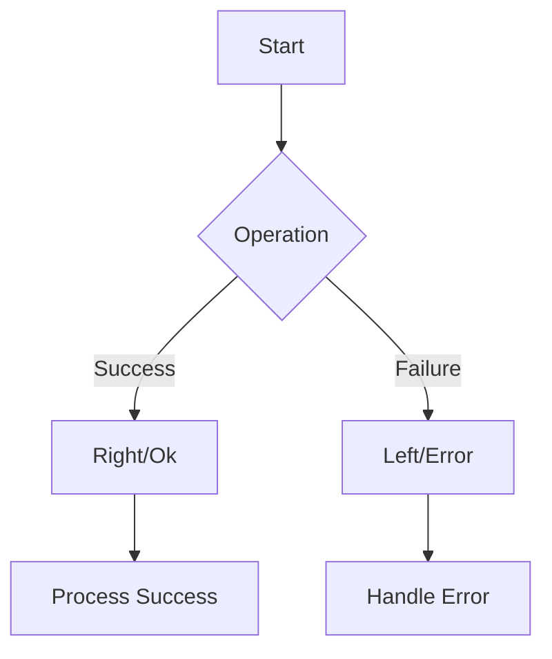

## 7.11 Functional Error Handling

Functional error handling is a paradigm that allows developers to manage errors in a way that is both expressive and robust. Unlike traditional exception handling, which relies on throwing and catching exceptions, functional error handling uses constructs like `Either`, `Maybe`, or `Result` types to represent success or failure. This approach can lead to cleaner, more maintainable code by making error handling explicit and composable.

### Understanding Functional Error Handling

In functional programming, errors are treated as values that can be passed around and manipulated just like any other data. This is in contrast to the traditional exception handling model, where errors are side effects that disrupt the normal flow of execution. By representing errors as values, we can use functional constructs to handle them in a predictable and consistent manner.

#### Key Concepts

- **Either Type**: Represents a value that can be one of two types, typically used to represent a computation that can either succeed or fail.
- **Maybe Type**: Represents an optional value, which can either be `Some` (a value is present) or `None` (no value).
- **Result Type**: Similar to `Either`, but often used to explicitly represent success (`Ok`) or failure (`Error`).

### Implementing Functional Error Handling in Ruby

Ruby, being a flexible and dynamic language, allows us to implement functional error handling patterns even though it is not a purely functional language. We can create our own `Either`, `Maybe`, and `Result` types to manage errors functionally.

#### Creating an `Either` Type

Let's start by implementing a simple `Either` type in Ruby:

```ruby
class Either
  attr_reader :value

  def initialize(value)
    @value = value
  end

  def self.left(value)
    Left.new(value)
  end

  def self.right(value)
    Right.new(value)
  end

  def left?
    is_a?(Left)
  end

  def right?
    is_a?(Right)
  end
end

class Left < Either; end
class Right < Either; end
```

In this implementation, `Either` is a base class with two subclasses: `Left` and `Right`. `Left` is typically used to represent a failure, while `Right` represents a success.

#### Using the `Either` Type

Here's how you might use the `Either` type to handle errors:

```ruby
def divide(a, b)
  return Either.left("Division by zero") if b == 0
  Either.right(a / b)
end

result = divide(10, 2)

if result.right?
  puts "Result: #{result.value}"
else
  puts "Error: #{result.value}"
end
```

In this example, the `divide` function returns an `Either` type. If the division is successful, it returns a `Right` with the result. If there's an error (e.g., division by zero), it returns a `Left` with an error message.

### Advantages of Functional Error Handling

Functional error handling offers several advantages over traditional exception handling:

1. **Explicitness**: Errors are explicitly represented as values, making it clear when a function can fail and what kind of errors it can produce.
2. **Composability**: Error handling logic can be composed and reused, leading to more modular and maintainable code.
3. **Predictability**: Since errors are values, they can be handled in a consistent and predictable manner, reducing the likelihood of unhandled exceptions.
4. **No Side Effects**: Functional error handling avoids the side effects associated with throwing exceptions, leading to more predictable code execution.

### Scenarios Where Functional Error Handling is Beneficial

Functional error handling is particularly useful in scenarios where:

- **Complex Error Propagation**: When errors need to be propagated through multiple layers of a system, functional error handling can simplify the process.
- **High Reliability**: In systems where reliability is critical, such as financial or safety-critical applications, functional error handling can provide more robust error management.
- **Asynchronous Operations**: In asynchronous programming, where exceptions can be difficult to manage, functional error handling can provide a more consistent approach.

### Implementing a `Maybe` Type

The `Maybe` type is another useful construct for functional error handling. It represents an optional value, which can either be `Some` (a value is present) or `None` (no value).

#### Creating a `Maybe` Type

Here's a simple implementation of a `Maybe` type in Ruby:

```ruby
class Maybe
  def self.some(value)
    Some.new(value)
  end

  def self.none
    None.new
  end

  def some?
    is_a?(Some)
  end

  def none?
    is_a?(None)
  end
end

class Some < Maybe
  attr_reader :value

  def initialize(value)
    @value = value
  end
end

class None < Maybe; end
```

#### Using the `Maybe` Type

Here's how you might use the `Maybe` type:

```ruby
def find_user(id)
  user = User.find_by(id: id)
  user ? Maybe.some(user) : Maybe.none
end

result = find_user(1)

if result.some?
  puts "User found: #{result.value.name}"
else
  puts "User not found"
end
```

In this example, the `find_user` function returns a `Maybe` type. If the user is found, it returns `Some` with the user object. If not, it returns `None`.

### Implementing a `Result` Type

The `Result` type is similar to `Either`, but it is often used to explicitly represent success (`Ok`) or failure (`Error`).

#### Creating a `Result` Type

Here's a simple implementation of a `Result` type in Ruby:

```ruby
class Result
  attr_reader :value

  def initialize(value)
    @value = value
  end

  def self.ok(value)
    Ok.new(value)
  end

  def self.error(value)
    Error.new(value)
  end

  def ok?
    is_a?(Ok)
  end

  def error?
    is_a?(Error)
  end
end

class Ok < Result; end
class Error < Result; end
```

#### Using the `Result` Type

Here's how you might use the `Result` type:

```ruby
def parse_json(json_string)
  begin
    data = JSON.parse(json_string)
    Result.ok(data)
  rescue JSON::ParserError => e
    Result.error(e.message)
  end
end

result = parse_json('{"key": "value"}')

if result.ok?
  puts "Parsed data: #{result.value}"
else
  puts "Error parsing JSON: #{result.value}"
end
```

In this example, the `parse_json` function returns a `Result` type. If the JSON is parsed successfully, it returns `Ok` with the parsed data. If there's an error, it returns `Error` with the error message.

### Visualizing Functional Error Handling

To better understand how functional error handling works, let's visualize the flow of data using a Mermaid.js diagram.



This diagram illustrates the flow of a computation that can either succeed or fail. If the operation is successful, it produces a `Right` or `Ok` value, which is then processed. If it fails, it produces a `Left` or `Error` value, which is then handled.

### Try It Yourself

To get a better understanding of functional error handling, try modifying the code examples provided. Here are some suggestions:

- **Modify the `divide` function** to handle more complex error scenarios, such as invalid input types.
- **Extend the `Maybe` type** to include additional methods for transforming or combining values.
- **Implement a new `Result` type** that includes additional metadata about the error, such as a timestamp or error code.

### References and Further Reading

For more information on functional error handling and related concepts, consider exploring the following resources:

- [Functional Programming in Ruby](https://www.oreilly.com/library/view/functional-programming-in/9781449363711/)
- [Monads in Functional Programming](https://en.wikipedia.org/wiki/Monad_(functional_programming))
- [Ruby's Exception Handling](https://ruby-doc.org/core-2.7.0/Exception.html)

### Knowledge Check

To reinforce your understanding of functional error handling, consider the following questions:

- What are the key differences between `Either`, `Maybe`, and `Result` types?
- How does functional error handling improve code maintainability?
- In what scenarios is functional error handling particularly beneficial?

### Embrace the Journey

Remember, mastering functional error handling is just one step on your journey to becoming a more proficient Ruby developer. Keep experimenting, stay curious, and enjoy the process of learning and growing as a developer.

## Quiz: Functional Error Handling



### What is the primary advantage of functional error handling over traditional exception handling?

- [x] Errors are treated as values, making them explicit and composable.
- [ ] It is faster than traditional exception handling.
- [ ] It requires less code to implement.
- [ ] It is more compatible with older Ruby versions.

> **Explanation:** Functional error handling treats errors as values, allowing for explicit and composable error management.

### Which type is typically used to represent a computation that can either succeed or fail?

- [x] Either
- [ ] Maybe
- [ ] Result
- [ ] Option

> **Explanation:** The `Either` type is commonly used to represent a computation that can either succeed (Right) or fail (Left).

### In the `Either` type, what does the `Left` subclass typically represent?

- [x] Failure
- [ ] Success
- [ ] A warning
- [ ] A retry

> **Explanation:** In the `Either` type, `Left` is typically used to represent a failure.

### What is the purpose of the `Maybe` type in functional error handling?

- [x] To represent an optional value that can be present or absent.
- [ ] To handle asynchronous errors.
- [ ] To log errors without interrupting execution.
- [ ] To convert exceptions into warnings.

> **Explanation:** The `Maybe` type represents an optional value, which can either be `Some` (present) or `None` (absent).

### How does the `Result` type differ from the `Either` type?

- [x] `Result` explicitly represents success (`Ok`) or failure (`Error`).
- [ ] `Result` is only used for asynchronous operations.
- [ ] `Result` is a subclass of `Either`.
- [ ] `Result` is used for logging purposes.

> **Explanation:** The `Result` type explicitly represents success (`Ok`) or failure (`Error`), similar to `Either` but with more explicit naming.

### What is a common use case for functional error handling?

- [x] Complex error propagation through multiple layers.
- [ ] Simple scripts with minimal error handling.
- [ ] Logging errors to a file.
- [ ] Handling user input validation.

> **Explanation:** Functional error handling is particularly useful for complex error propagation through multiple layers of a system.

### Which of the following is NOT a benefit of functional error handling?

- [ ] Explicitness
- [ ] Composability
- [ ] Predictability
- [x] Increased performance

> **Explanation:** While functional error handling offers explicitness, composability, and predictability, it does not inherently increase performance.

### What does the `Some` subclass in the `Maybe` type represent?

- [x] A value is present.
- [ ] No value is present.
- [ ] An error occurred.
- [ ] A warning was issued.

> **Explanation:** In the `Maybe` type, `Some` represents that a value is present.

### How can functional error handling improve code maintainability?

- [x] By making error handling explicit and reducing side effects.
- [ ] By reducing the number of lines of code.
- [ ] By eliminating the need for error handling.
- [ ] By automatically logging all errors.

> **Explanation:** Functional error handling improves maintainability by making error handling explicit and reducing side effects.

### True or False: Functional error handling is only applicable in functional programming languages.

- [ ] True
- [x] False

> **Explanation:** False. Functional error handling can be implemented in any language, including Ruby, which is not a purely functional language.


