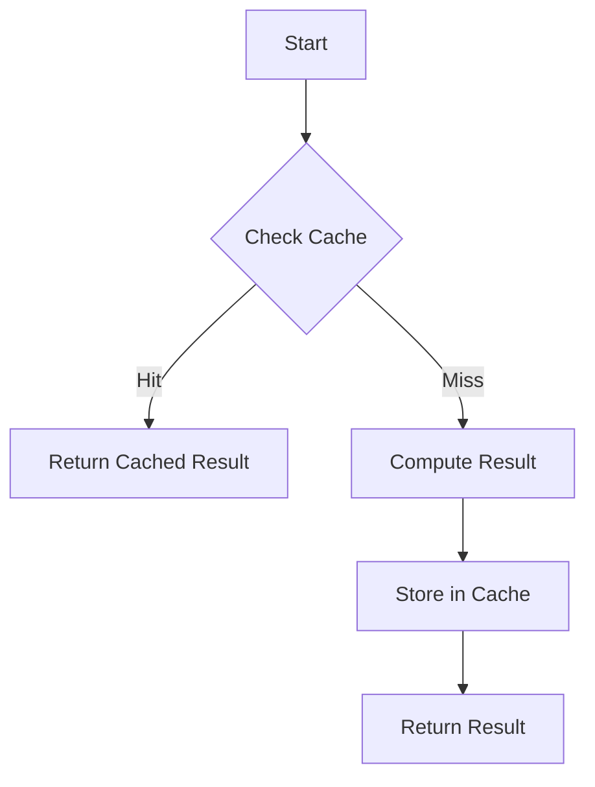

## 7.12 Memoization Techniques

Memoization is a powerful optimization technique that can significantly enhance the performance of your Ruby applications. By caching the results of expensive function calls, memoization allows you to avoid redundant calculations, thus speeding up your programs. In this section, we will explore the concept of memoization, how to implement it in Ruby, and the trade-offs involved. We will also look at practical examples and use cases where memoization can be particularly beneficial.

### Understanding Memoization

Memoization is a form of caching that involves storing the results of function calls and returning the cached result when the same inputs occur again. This technique is particularly useful for functions that are called repeatedly with the same arguments, as it can save a significant amount of computation time.

#### Purpose of Memoization

The primary purpose of memoization is to improve the efficiency of a program by reducing the number of redundant calculations. This is especially beneficial in scenarios where a function is computationally expensive and called multiple times with the same parameters.

### Implementing Memoization in Ruby

In Ruby, memoization can be implemented in several ways. The most common methods involve using hashes to store cached results or utilizing the `memoize` gem for a more streamlined approach.

#### Memoization Using Hashes

One of the simplest ways to implement memoization in Ruby is by using a hash to store the results of function calls. Here's a basic example:

```ruby
class Fibonacci
  def initialize
    @memo = {}
  end

  def fib(n)
    return n if n <= 1
    @memo[n] ||= fib(n - 1) + fib(n - 2)
  end
end

fibonacci = Fibonacci.new
puts fibonacci.fib(10) # Outputs: 55
```

In this example, the `fib` method calculates the Fibonacci number for a given `n`. The `@memo` hash stores the results of previous calculations, ensuring that each Fibonacci number is only calculated once.

#### Using the `memoize` Gem

The `memoize` gem provides a convenient way to add memoization to your methods without manually managing a cache. First, you need to install the gem:

```bash
gem install memoize
```

Then, you can use it in your Ruby code as follows:

```ruby
require 'memoize'

class Fibonacci
  extend Memoize

  def fib(n)
    return n if n <= 1
    fib(n - 1) + fib(n - 2)
  end

  memoize :fib
end

fibonacci = Fibonacci.new
puts fibonacci.fib(10) # Outputs: 55
```

By extending the `Memoize` module and calling `memoize :fib`, the `fib` method is automatically memoized, simplifying the process.

### Memoizing Recursive Functions

Recursive functions often benefit significantly from memoization, as they tend to perform the same calculations multiple times. Let's explore a more complex example with the factorial function:

```ruby
class Factorial
  def initialize
    @memo = {}
  end

  def fact(n)
    return 1 if n <= 1
    @memo[n] ||= n * fact(n - 1)
  end
end

factorial = Factorial.new
puts factorial.fact(5) # Outputs: 120
```

In this example, the `fact` method calculates the factorial of `n`. By storing previously computed factorials in the `@memo` hash, we avoid redundant calculations, thus improving performance.

### Trade-offs of Memoization

While memoization can significantly improve performance, it also comes with trade-offs. The primary trade-off is between memory consumption and performance gain. Memoization requires storing results in memory, which can lead to increased memory usage, especially for functions with a large number of unique inputs.

#### Memory Consumption vs. Performance Gain

- **Memory Consumption**: Memoization can lead to increased memory usage, as results are stored in memory. This can be a concern for applications with limited memory resources or functions with a large number of unique inputs.
- **Performance Gain**: The performance gain from memoization can be substantial, especially for functions that are called frequently with the same arguments. By avoiding redundant calculations, memoization can significantly reduce execution time.

### Use Cases for Memoization

Memoization is particularly useful in scenarios where functions are computationally expensive and called repeatedly with the same inputs. Some common use cases include:

- **Recursive Algorithms**: Functions like Fibonacci, factorial, and other recursive algorithms often benefit from memoization.
- **Dynamic Programming**: Memoization is a key component of dynamic programming, where it is used to store intermediate results and avoid redundant calculations.
- **Data Processing**: In data processing tasks, memoization can be used to cache results of expensive operations, such as database queries or API calls.

### Visualizing Memoization

To better understand how memoization works, let's visualize the process using a flowchart:



**Figure 1: Memoization Process Flowchart**

In this flowchart, the process begins with a function call. If the result is already cached (cache hit), the cached result is returned. If not (cache miss), the result is computed, stored in the cache, and then returned.

### Try It Yourself

To get a hands-on understanding of memoization, try modifying the examples provided. Experiment with different functions and observe how memoization affects performance. Consider implementing memoization for a function in your own projects and measure the impact on execution time.

### References and Further Reading

- [Ruby Documentation](https://ruby-doc.org/)
- [Memoization in Ruby](https://www.rubyguides.com/2018/07/memoization-in-ruby/)
- [Memoize Gem](https://rubygems.org/gems/memoize)

### Knowledge Check

Before we wrap up, let's test your understanding of memoization with a few questions.

## Quiz: Memoization Techniques



### What is the primary purpose of memoization?

- [x] To improve efficiency by caching results of expensive function calls
- [ ] To reduce memory usage
- [ ] To simplify code readability
- [ ] To enhance security

> **Explanation:** Memoization is used to cache results of expensive function calls to avoid redundant calculations and improve efficiency.

### Which data structure is commonly used for implementing memoization in Ruby?

- [x] Hash
- [ ] Array
- [ ] Set
- [ ] Queue

> **Explanation:** Hashes are commonly used to store cached results in memoization due to their key-value pair structure.

### What is a potential downside of memoization?

- [x] Increased memory consumption
- [ ] Slower execution time
- [ ] Reduced code readability
- [ ] Increased security vulnerabilities

> **Explanation:** Memoization can lead to increased memory consumption as results are stored in memory.

### Which Ruby gem can be used to simplify memoization?

- [x] memoize
- [ ] nokogiri
- [ ] devise
- [ ] rails

> **Explanation:** The `memoize` gem provides a convenient way to add memoization to methods in Ruby.

### In which scenario is memoization particularly beneficial?

- [x] Recursive algorithms
- [ ] Simple arithmetic operations
- [ ] String concatenation
- [ ] File I/O operations

> **Explanation:** Recursive algorithms often benefit from memoization as they perform the same calculations multiple times.

### What does a cache miss in memoization indicate?

- [x] The result is not in the cache and needs to be computed
- [ ] The result is already in the cache
- [ ] The cache is full
- [ ] The cache is corrupted

> **Explanation:** A cache miss indicates that the result is not in the cache and needs to be computed.

### How does memoization affect performance?

- [x] It reduces execution time by avoiding redundant calculations
- [ ] It increases execution time by adding overhead
- [ ] It has no effect on performance
- [ ] It only affects memory usage

> **Explanation:** Memoization reduces execution time by caching results and avoiding redundant calculations.

### What is a common use case for memoization?

- [x] Dynamic programming
- [ ] File manipulation
- [ ] String parsing
- [ ] Network communication

> **Explanation:** Memoization is commonly used in dynamic programming to store intermediate results and avoid redundant calculations.

### Which of the following is true about memoization?

- [x] It can lead to increased memory usage
- [ ] It always improves performance
- [ ] It is only applicable to recursive functions
- [ ] It is a security feature

> **Explanation:** Memoization can lead to increased memory usage as results are stored in memory.

### Memoization is a technique used to optimize performance by caching results.

- [x] True
- [ ] False

> **Explanation:** True. Memoization optimizes performance by caching results of expensive function calls.



Remember, memoization is a powerful tool in your optimization toolkit. As you continue to explore Ruby and functional programming, keep experimenting with memoization to see how it can enhance the performance of your applications. Stay curious, and enjoy the journey!
