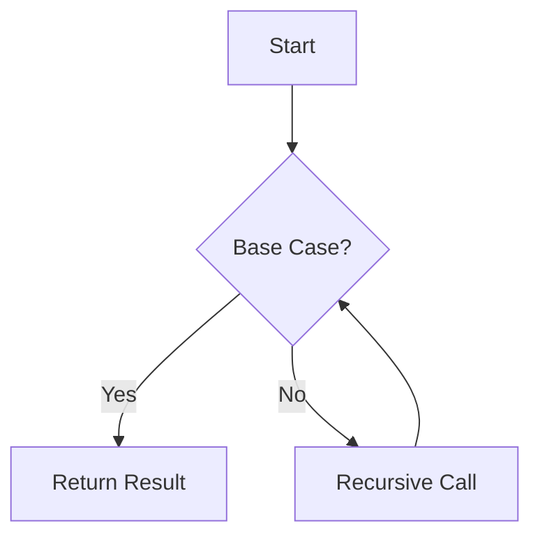

## 7.13 Recursion and Tail Call Optimization

Recursion is a powerful programming technique where a function calls itself to solve a problem. In Ruby, recursion can be an elegant solution for problems that can be broken down into smaller, similar sub-problems. However, recursive functions can lead to stack overflow errors if not optimized properly. This is where Tail Call Optimization (TCO) comes into play, allowing recursive calls to be executed without growing the call stack.

### Understanding Recursion in Ruby

Recursion is a method of solving problems where the solution depends on solutions to smaller instances of the same problem. A recursive function typically has two main components: the base case and the recursive case.

- **Base Case**: This is the condition under which the recursion ends. Without a base case, the function would call itself indefinitely, leading to a stack overflow.
- **Recursive Case**: This is where the function calls itself with a modified argument, gradually moving towards the base case.

#### Example: Factorial Calculation

Let's consider a classic example of recursion: calculating the factorial of a number.

```ruby
def factorial(n)
  return 1 if n <= 1  # Base case
  n * factorial(n - 1)  # Recursive case
end

puts factorial(5)  # Output: 120
```

In this example, the function `factorial` calls itself with `n - 1` until it reaches the base case `n <= 1`.

### Tail Call Optimization in Ruby

Tail Call Optimization is a technique used by some programming languages to optimize recursive function calls. In a tail-recursive function, the recursive call is the last operation performed before returning a result. This allows the language runtime to reuse the current function's stack frame for the recursive call, preventing stack overflow.

#### Ruby's Support for TCO

Ruby 2.0 introduced support for tail call optimization, but it is not enabled by default. To enable TCO, you need to use the `RubyVM::InstructionSequence` class to compile the code with the `:tailcall_optimization` option set to `true`.

```ruby
RubyVM::InstructionSequence.compile_option = {
  tailcall_optimization: true,
  trace_instruction: false
}

def tail_recursive_factorial(n, acc = 1)
  return acc if n <= 1
  tail_recursive_factorial(n - 1, n * acc)
end

puts tail_recursive_factorial(5)  # Output: 120
```

In this example, `tail_recursive_factorial` is a tail-recursive function because the recursive call is the last operation performed.

### Limitations of TCO in Ruby

While Ruby supports TCO, there are some limitations:

- **Not Enabled by Default**: As mentioned, TCO is not enabled by default and requires explicit configuration.
- **Limited to Certain Versions**: TCO is available in Ruby 2.0 and later, but its implementation and support may vary across different Ruby versions.
- **Performance Considerations**: Enabling TCO can have performance implications, and it may not always lead to significant improvements.

### Alternatives to Recursion

If TCO is not feasible or if recursion leads to stack overflow, consider alternative approaches:

#### Iteration

Many recursive problems can be solved using iteration, which avoids the risk of stack overflow.

```ruby
def iterative_factorial(n)
  result = 1
  while n > 1
    result *= n
    n -= 1
  end
  result
end

puts iterative_factorial(5)  # Output: 120
```

#### Trampoline Technique

The trampoline technique is a functional programming pattern that allows recursive functions to be executed iteratively, preventing stack overflow.

```ruby
def trampoline(f)
  result = f.call
  while result.is_a?(Proc)
    result = result.call
  end
  result
end

def trampoline_factorial(n, acc = 1)
  return acc if n <= 1
  -> { trampoline_factorial(n - 1, n * acc) }
end

puts trampoline(trampoline_factorial(5))  # Output: 120
```

### Visualizing Recursion and TCO

To better understand recursion and TCO, let's visualize the process using a flowchart.



This flowchart represents the recursive process, where the function checks the base case and either returns a result or makes a recursive call.

### Key Takeaways

- **Recursion** is a powerful technique for solving problems that can be broken down into smaller sub-problems.
- **Tail Call Optimization** can prevent stack overflow by reusing the current stack frame for recursive calls.
- **Ruby's TCO** is not enabled by default and has limitations in terms of version support and performance.
- **Alternative Approaches** like iteration and the trampoline technique can be used to avoid stack overflow in recursive functions.

### Try It Yourself

Experiment with the examples provided and try modifying them to solve different problems. For instance, implement a recursive function to calculate the Fibonacci sequence and optimize it using TCO or iteration.

### Further Reading

- [Ruby Documentation on Recursion](https://ruby-doc.org/core-2.7.0/doc/syntax/control_expressions_rdoc.html#label-Recursion)
- [Understanding Tail Call Optimization](https://en.wikipedia.org/wiki/Tail_call)
- [Functional Programming in Ruby](https://www.rubyguides.com/2018/10/functional-programming-ruby/)

## Quiz: Recursion and Tail Call Optimization



### What is the base case in a recursive function?

- [x] The condition under which the recursion ends
- [ ] The first call of the recursive function
- [ ] The last call of the recursive function
- [ ] The condition under which the recursion starts

> **Explanation:** The base case is the condition that stops the recursion, preventing infinite calls.

### How do you enable Tail Call Optimization in Ruby?

- [x] By using `RubyVM::InstructionSequence.compile_option`
- [ ] By setting a global variable
- [ ] By using a special keyword in the function
- [ ] By installing a gem

> **Explanation:** TCO is enabled by configuring `RubyVM::InstructionSequence.compile_option` with `tailcall_optimization: true`.

### What is a limitation of TCO in Ruby?

- [x] It is not enabled by default
- [ ] It only works with iterative functions
- [ ] It is available in all Ruby versions
- [ ] It improves performance in all cases

> **Explanation:** TCO is not enabled by default and requires explicit configuration.

### What is the trampoline technique used for?

- [x] To execute recursive functions iteratively
- [ ] To improve the performance of iterative functions
- [ ] To enable TCO in Ruby
- [ ] To optimize memory usage

> **Explanation:** The trampoline technique allows recursive functions to be executed iteratively, preventing stack overflow.

### Which of the following is a tail-recursive function?

- [x] A function where the recursive call is the last operation
- [ ] A function that calls itself multiple times
- [ ] A function with multiple base cases
- [ ] A function that uses iteration

> **Explanation:** In a tail-recursive function, the recursive call is the last operation before returning a result.

### What is the main advantage of using iteration over recursion?

- [x] It avoids the risk of stack overflow
- [ ] It is always faster
- [ ] It is easier to write
- [ ] It requires less memory

> **Explanation:** Iteration avoids stack overflow because it doesn't involve growing the call stack.

### How can you prevent stack overflow in recursive functions?

- [x] By using TCO or iteration
- [ ] By increasing the stack size
- [ ] By using global variables
- [ ] By avoiding base cases

> **Explanation:** TCO and iteration are techniques to prevent stack overflow in recursive functions.

### What is the purpose of the base case in recursion?

- [x] To stop the recursion
- [ ] To start the recursion
- [ ] To optimize the recursion
- [ ] To increase the recursion depth

> **Explanation:** The base case stops the recursion, preventing infinite calls.

### What does TCO stand for?

- [x] Tail Call Optimization
- [ ] Total Call Optimization
- [ ] Tail Call Operation
- [ ] Total Call Operation

> **Explanation:** TCO stands for Tail Call Optimization, a technique to optimize recursive calls.

### True or False: Ruby's TCO is enabled by default.

- [ ] True
- [x] False

> **Explanation:** Ruby's TCO is not enabled by default and requires explicit configuration.



Remember, mastering recursion and TCO in Ruby is just the beginning. As you continue to explore functional programming concepts, you'll discover new ways to write efficient and elegant code. Keep experimenting, stay curious, and enjoy the journey!
