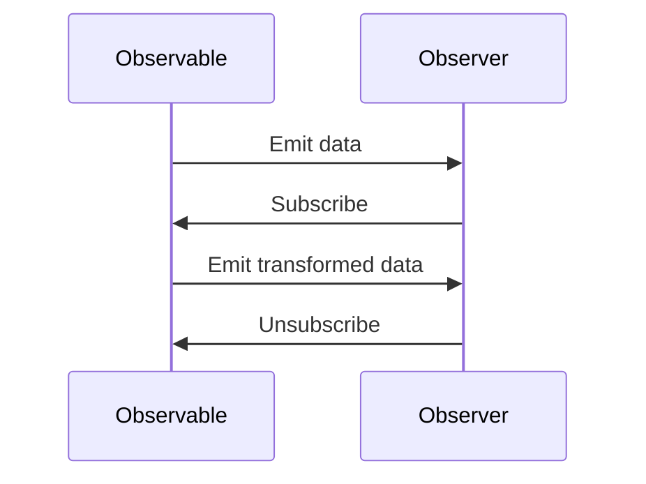

## 7.14 Functional Reactive Programming with RxRuby

Functional Reactive Programming (FRP) is a paradigm that combines the principles of functional programming with reactive programming to handle data streams and asynchronous events in a declarative manner. In this section, we will explore how FRP can be implemented in Ruby using the RxRuby library, which is part of the ReactiveX family. We will delve into the core concepts of RxRuby, such as Observables and Observers, and provide practical examples to illustrate how FRP can simplify complex event handling.

### Understanding Functional Reactive Programming (FRP)

Functional Reactive Programming is a programming paradigm that allows developers to work with asynchronous data streams and event-driven systems in a functional way. It emphasizes the use of pure functions, immutability, and declarative code to manage the flow of data and events.

#### Key Principles of FRP

1. **Declarative Programming**: FRP allows you to express the logic of your application in a high-level, declarative manner, focusing on what to do rather than how to do it.

2. **Data Streams**: In FRP, data is represented as streams that can be transformed, filtered, and combined using functional operators.

3. **Asynchronous Event Handling**: FRP provides a robust framework for handling asynchronous events, making it easier to manage complex event-driven systems.

4. **Composability**: FRP promotes the composition of small, reusable functions to build complex behavior, leading to cleaner and more maintainable code.

### Introducing RxRuby

RxRuby is a library that brings the power of Reactive Extensions (Rx) to Ruby. It provides a set of tools for composing asynchronous and event-based programs using observable sequences.

#### Core Concepts of RxRuby

- **Observables**: An Observable is a data structure that represents a stream of data or events. It can emit items over time, which can be processed using various operators.

- **Observers**: An Observer subscribes to an Observable to receive data or events. It defines how to handle the emitted items.

- **Operators**: Operators are functions that allow you to transform, filter, and combine Observables. They provide a way to manipulate data streams in a functional style.

- **Schedulers**: Schedulers control the execution context of Observables, allowing you to specify where and when the data processing should occur.

### Creating Observables in RxRuby

To start using RxRuby, you need to create Observables that represent your data streams. Observables can be created from various sources, such as arrays, timers, or custom logic.

```ruby
require 'rx'

# Create an Observable from an array
observable = Rx::Observable.from_array([1, 2, 3, 4, 5])

# Subscribe to the Observable
observable.subscribe(
  lambda { |value| puts "Received: #{value}" },
  lambda { |error| puts "Error: #{error}" },
  lambda { puts "Completed" }
)
```

In this example, we create an Observable from an array of numbers and subscribe to it using an Observer that prints each received value.

### Handling Asynchronous Events with RxRuby

RxRuby excels at handling asynchronous events, such as user input, network requests, or timer-based events. Let's explore how to use RxRuby to manage these scenarios.

#### Example: Timer-Based Events

```ruby
require 'rx'

# Create an Observable that emits a value every second
observable = Rx::Observable.interval(1)

# Subscribe to the Observable
subscription = observable.subscribe(
  lambda { |value| puts "Tick: #{value}" }
)

# Keep the script running for 5 seconds
sleep 5

# Unsubscribe from the Observable
subscription.unsubscribe
```

In this example, we create an Observable that emits a value every second and subscribe to it to print each tick. We use `unsubscribe` to stop receiving events after 5 seconds.

#### Example: User Input Events

```ruby
require 'rx'

# Simulate user input events
user_input = Rx::Observable.from_array(['click', 'scroll', 'keypress'])

# Subscribe to the Observable
user_input.subscribe(
  lambda { |event| puts "User event: #{event}" }
)
```

Here, we simulate user input events using an Observable and subscribe to it to handle each event.

### Composing Observables with Operators

RxRuby provides a rich set of operators to transform and combine Observables. Let's explore some common operators and how they can be used to build complex data flows.

#### Transforming Data with `map`

The `map` operator allows you to transform each item emitted by an Observable.

```ruby
require 'rx'

# Create an Observable from an array
observable = Rx::Observable.from_array([1, 2, 3, 4, 5])

# Transform each item using map
transformed = observable.map { |value| value * 2 }

# Subscribe to the transformed Observable
transformed.subscribe(
  lambda { |value| puts "Transformed: #{value}" }
)
```

In this example, we use `map` to double each value emitted by the Observable.

#### Filtering Data with `filter`

The `filter` operator allows you to filter items emitted by an Observable based on a predicate.

```ruby
require 'rx'

# Create an Observable from an array
observable = Rx::Observable.from_array([1, 2, 3, 4, 5])

# Filter items using filter
filtered = observable.filter { |value| value.even? }

# Subscribe to the filtered Observable
filtered.subscribe(
  lambda { |value| puts "Filtered: #{value}" }
)
```

Here, we use `filter` to only emit even numbers from the Observable.

#### Combining Observables with `merge`

The `merge` operator allows you to combine multiple Observables into a single Observable.

```ruby
require 'rx'

# Create two Observables
observable1 = Rx::Observable.from_array([1, 2, 3])
observable2 = Rx::Observable.from_array([4, 5, 6])

# Merge the Observables
merged = observable1.merge(observable2)

# Subscribe to the merged Observable
merged.subscribe(
  lambda { |value| puts "Merged: #{value}" }
)
```

In this example, we merge two Observables into one and subscribe to receive all emitted values.

### Scenarios Where FRP Simplifies Complex Event Handling

Functional Reactive Programming is particularly useful in scenarios where you need to handle complex event-driven systems. Here are some examples:

1. **User Interfaces**: FRP can simplify the management of user interface events, such as clicks, drags, and keyboard input, by treating them as data streams.

2. **Real-Time Data Processing**: FRP is ideal for processing real-time data streams, such as sensor data or financial market data, where you need to react to changes quickly.

3. **Network Requests**: FRP can help manage asynchronous network requests by composing them into a single data flow, making it easier to handle success, failure, and retries.

4. **Game Development**: FRP can be used to manage game events, such as player actions and physics updates, in a clean and composable way.

### Benefits of Functional Reactive Programming with RxRuby

- **Composability**: RxRuby allows you to compose complex data flows using simple, reusable operators, leading to cleaner and more maintainable code.

- **Declarative Code**: FRP encourages a declarative style of programming, making it easier to understand and reason about your code.

- **Asynchronous Event Handling**: RxRuby provides a robust framework for handling asynchronous events, reducing the complexity of managing callbacks and state.

- **Clean Abstraction**: FRP abstracts away the details of event handling, allowing you to focus on the logic of your application.

### Try It Yourself

To get hands-on experience with RxRuby, try modifying the code examples provided in this section. Experiment with different operators, create your own Observables, and explore how RxRuby can simplify your event-driven applications.

### Visualizing RxRuby Data Flow

To better understand how data flows through Observables and Observers in RxRuby, let's visualize the process using a Mermaid.js sequence diagram.



This diagram illustrates the interaction between an Observable and an Observer, showing how data is emitted, transformed, and received.

### Further Reading and Resources

- [RxRuby GitHub Repository](https://github.com/ReactiveX/RxRuby)
- [ReactiveX Documentation](http://reactivex.io/)
- [Functional Reactive Programming on Wikipedia](https://en.wikipedia.org/wiki/Functional_reactive_programming)

### Knowledge Check

- What are the core concepts of RxRuby?
- How does the `map` operator transform data in an Observable?
- In what scenarios is Functional Reactive Programming particularly useful?

### Summary

Functional Reactive Programming with RxRuby provides a powerful framework for handling asynchronous data streams and event-driven systems in Ruby. By leveraging Observables, Observers, and operators, you can build clean, composable, and maintainable applications. Remember, this is just the beginning. As you progress, you'll discover more advanced techniques and patterns to enhance your Ruby applications. Keep experimenting, stay curious, and enjoy the journey!

## Quiz: Functional Reactive Programming with RxRuby



### What is the primary benefit of using Functional Reactive Programming (FRP)?

- [x] It allows for declarative handling of asynchronous data streams.
- [ ] It simplifies synchronous data processing.
- [ ] It eliminates the need for any event handling.
- [ ] It is only useful for UI development.

> **Explanation:** FRP allows for declarative handling of asynchronous data streams, making it easier to manage complex event-driven systems.

### Which RxRuby concept represents a stream of data or events?

- [x] Observable
- [ ] Observer
- [ ] Operator
- [ ] Scheduler

> **Explanation:** An Observable is a data structure that represents a stream of data or events in RxRuby.

### What does the `map` operator do in RxRuby?

- [x] Transforms each item emitted by an Observable.
- [ ] Filters items based on a predicate.
- [ ] Combines multiple Observables.
- [ ] Schedules the execution of Observables.

> **Explanation:** The `map` operator transforms each item emitted by an Observable, allowing you to apply a function to each item.

### How can you stop receiving events from an Observable in RxRuby?

- [x] By calling `unsubscribe` on the subscription.
- [ ] By using the `filter` operator.
- [ ] By closing the Observable.
- [ ] By using the `merge` operator.

> **Explanation:** You can stop receiving events from an Observable by calling `unsubscribe` on the subscription.

### What is a common use case for Functional Reactive Programming?

- [x] Real-time data processing
- [ ] Static data analysis
- [ ] Batch processing
- [ ] File I/O operations

> **Explanation:** FRP is particularly useful for real-time data processing, where you need to react to changes quickly.

### Which operator would you use to combine two Observables in RxRuby?

- [x] `merge`
- [ ] `map`
- [ ] `filter`
- [ ] `interval`

> **Explanation:** The `merge` operator is used to combine two or more Observables into a single Observable.

### What is the role of an Observer in RxRuby?

- [x] It subscribes to an Observable to receive data or events.
- [ ] It transforms data emitted by an Observable.
- [ ] It filters data based on a predicate.
- [ ] It schedules the execution of Observables.

> **Explanation:** An Observer subscribes to an Observable to receive data or events and defines how to handle them.

### What is the purpose of a Scheduler in RxRuby?

- [x] To control the execution context of Observables.
- [ ] To transform data emitted by an Observable.
- [ ] To filter data based on a predicate.
- [ ] To merge multiple Observables.

> **Explanation:** A Scheduler controls the execution context of Observables, specifying where and when data processing should occur.

### How does FRP promote code composability?

- [x] By allowing the composition of small, reusable functions.
- [ ] By eliminating the need for functions.
- [ ] By using global variables.
- [ ] By enforcing a strict coding style.

> **Explanation:** FRP promotes code composability by allowing the composition of small, reusable functions to build complex behavior.

### True or False: RxRuby can only be used for UI development.

- [ ] True
- [x] False

> **Explanation:** False. RxRuby can be used for a wide range of applications, including real-time data processing, network requests, and game development.




