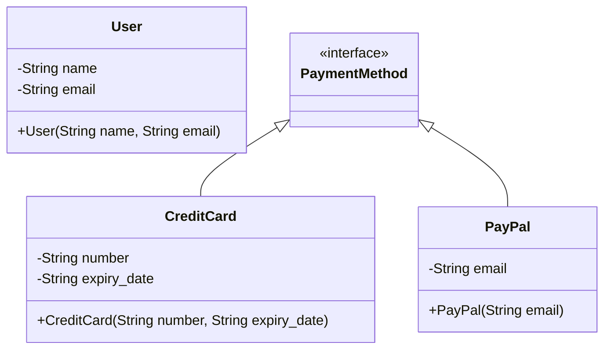

## 7.15 Functional Domain Modeling

Functional domain modeling is a powerful approach that leverages functional programming principles to model and represent complex domains. By using immutable data structures and pure functions, we can create robust, scalable, and maintainable applications. In this section, we'll explore the concepts of functional domain modeling, its importance, and how to implement it in Ruby.

### Understanding Domain Modeling

Domain modeling is the process of creating a conceptual model of a specific domain, capturing its entities, relationships, and rules. It serves as a blueprint for building software systems that accurately reflect the real-world domain they are intended to represent. Effective domain modeling is crucial for creating systems that are easy to understand, maintain, and extend.

### The Role of Functional Programming in Domain Modeling

Functional programming (FP) offers several advantages for domain modeling:

1. **Immutability**: By using immutable data structures, we ensure that data cannot be changed once created, leading to fewer bugs and easier reasoning about code.

2. **Pure Functions**: Functions that do not have side effects and always produce the same output for the same input make the system more predictable and testable.

3. **Algebraic Data Types (ADTs)**: ADTs, such as sum types and product types, allow us to model complex data structures in a concise and expressive way.

4. **Higher-Order Functions**: These functions enable us to abstract common patterns and behaviors, making the code more modular and reusable.

### Modeling Domains Functionally in Ruby

Let's explore how to apply functional programming principles to domain modeling in Ruby.

#### Using Immutable Data Structures

In Ruby, we can achieve immutability by using frozen objects. Here's an example of defining an immutable `User` class:

```ruby
class User
  attr_reader :name, :email

  def initialize(name, email)
    @name = name.freeze
    @email = email.freeze
  end
end

user = User.new("Alice", "alice@example.com")
puts user.name  # Output: Alice
```

In this example, the `name` and `email` attributes are frozen, ensuring they cannot be modified after the `User` object is created.

#### Implementing Pure Functions

Pure functions are a cornerstone of functional programming. They take inputs and produce outputs without modifying any state or causing side effects. Here's an example of a pure function in Ruby:

```ruby
def calculate_discount(price, discount_rate)
  price - (price * discount_rate)
end

puts calculate_discount(100, 0.1)  # Output: 90.0
```

This function calculates a discount without altering any external state.

#### Leveraging Algebraic Data Types (ADTs)

Algebraic Data Types allow us to model complex data structures. In Ruby, we can use classes and modules to represent ADTs. Here's an example of modeling a `PaymentMethod` using ADTs:

```ruby
module PaymentMethod
  class CreditCard
    attr_reader :number, :expiry_date

    def initialize(number, expiry_date)
      @number = number.freeze
      @expiry_date = expiry_date.freeze
    end
  end

  class PayPal
    attr_reader :email

    def initialize(email)
      @email = email.freeze
    end
  end
end

credit_card = PaymentMethod::CreditCard.new("1234-5678-9012-3456", "12/23")
paypal = PaymentMethod::PayPal.new("user@example.com")
```

In this example, `PaymentMethod` is a sum type with two variants: `CreditCard` and `PayPal`.

#### Higher-Order Functions for Abstraction

Higher-order functions take other functions as arguments or return them as results. They are useful for abstracting common patterns. Here's an example of a higher-order function in Ruby:

```ruby
def apply_discount(prices, discount_function)
  prices.map { |price| discount_function.call(price) }
end

discount_function = ->(price) { price * 0.9 }
prices = [100, 200, 300]
discounted_prices = apply_discount(prices, discount_function)

puts discounted_prices.inspect  # Output: [90.0, 180.0, 270.0]
```

In this example, `apply_discount` is a higher-order function that applies a discount function to a list of prices.

### Benefits of Functional Domain Modeling

Functional domain modeling offers several benefits:

1. **Easier Reasoning**: Immutability and pure functions make it easier to reason about code, as there are no hidden state changes or side effects.

2. **Improved Testability**: Pure functions are easier to test, as they do not depend on external state.

3. **Modularity and Reusability**: Higher-order functions and ADTs promote modular and reusable code.

4. **Concurrency and Parallelism**: Immutability makes it easier to write concurrent and parallel code, as there are no race conditions or shared state issues.

### Visualizing Functional Domain Modeling

Let's visualize the concept of functional domain modeling using a class diagram:



This diagram represents the `User` class and the `PaymentMethod` ADT with its variants `CreditCard` and `PayPal`.

### Try It Yourself

Experiment with the code examples provided. Try modifying the `User` class to include additional immutable attributes, or create new variants for the `PaymentMethod` ADT. Consider implementing additional pure functions to manipulate these data structures.

### References and Further Reading

- [Functional Programming in Ruby](https://www.rubyguides.com/2019/01/functional-programming-ruby/)
- [Algebraic Data Types in Ruby](https://dev.to/baweaver/algebraic-data-types-in-ruby-4j1f)
- [Immutable Data Structures in Ruby](https://www.rubyguides.com/2018/02/immutable-objects-ruby/)

### Knowledge Check

- What are the key benefits of using immutable data structures in domain modeling?
- How do pure functions contribute to the testability of a system?
- What are Algebraic Data Types, and how do they aid in domain modeling?

### Embrace the Journey

Remember, this is just the beginning. As you progress, you'll build more complex and interactive domain models. Keep experimenting, stay curious, and enjoy the journey!

## Quiz: Functional Domain Modeling



### What is a key advantage of using immutable data structures in functional domain modeling?

- [x] They prevent data from being changed, reducing bugs.
- [ ] They allow for dynamic data changes.
- [ ] They increase the complexity of the code.
- [ ] They make the code harder to understand.

> **Explanation:** Immutable data structures prevent data from being changed after creation, which reduces bugs and makes reasoning about code easier.

### How do pure functions contribute to a system's predictability?

- [x] They always produce the same output for the same input.
- [ ] They rely on external state changes.
- [ ] They modify global variables.
- [ ] They introduce side effects.

> **Explanation:** Pure functions always produce the same output for the same input, making the system more predictable and easier to test.

### What is an example of an Algebraic Data Type in Ruby?

- [x] A module with multiple class variants.
- [ ] A single class with multiple methods.
- [ ] A hash with key-value pairs.
- [ ] An array of integers.

> **Explanation:** An Algebraic Data Type can be represented as a module with multiple class variants, allowing for concise and expressive modeling of complex data structures.

### What is a higher-order function?

- [x] A function that takes other functions as arguments or returns them.
- [ ] A function that only operates on integers.
- [ ] A function that modifies global state.
- [ ] A function that is defined within a class.

> **Explanation:** A higher-order function is one that takes other functions as arguments or returns them, enabling abstraction of common patterns.

### Which of the following is NOT a benefit of functional domain modeling?

- [ ] Easier reasoning about code.
- [ ] Improved testability.
- [ ] Modularity and reusability.
- [x] Increased reliance on mutable state.

> **Explanation:** Functional domain modeling reduces reliance on mutable state, which is a benefit, not a drawback.

### What is the role of Algebraic Data Types in domain modeling?

- [x] They allow for concise and expressive modeling of complex data structures.
- [ ] They increase the complexity of the code.
- [ ] They make the code harder to understand.
- [ ] They rely on mutable state.

> **Explanation:** Algebraic Data Types allow for concise and expressive modeling of complex data structures, making the code easier to understand and maintain.

### How does immutability aid in concurrent programming?

- [x] It eliminates race conditions and shared state issues.
- [ ] It increases the complexity of managing state.
- [ ] It requires more memory.
- [ ] It makes the code harder to understand.

> **Explanation:** Immutability eliminates race conditions and shared state issues, making concurrent programming easier and safer.

### What is a pure function?

- [x] A function that does not have side effects and always produces the same output for the same input.
- [ ] A function that modifies global variables.
- [ ] A function that relies on external state changes.
- [ ] A function that introduces side effects.

> **Explanation:** A pure function does not have side effects and always produces the same output for the same input, making it predictable and testable.

### What is the benefit of using higher-order functions?

- [x] They enable abstraction of common patterns and behaviors.
- [ ] They increase the complexity of the code.
- [ ] They make the code harder to understand.
- [ ] They rely on mutable state.

> **Explanation:** Higher-order functions enable abstraction of common patterns and behaviors, making the code more modular and reusable.

### True or False: Functional domain modeling relies heavily on mutable state.

- [ ] True
- [x] False

> **Explanation:** Functional domain modeling relies on immutable data structures and pure functions, reducing reliance on mutable state.


