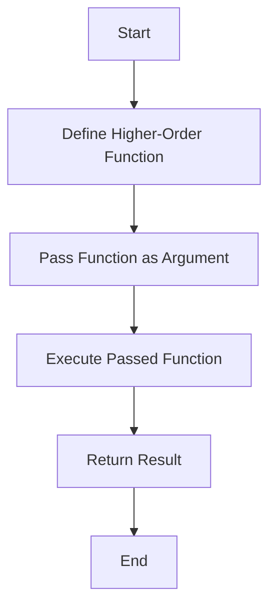

## 7.2 Higher-Order Functions

Higher-order functions are a fundamental concept in functional programming, allowing developers to write more abstract, reusable, and concise code. In Ruby, higher-order functions are functions that can take other functions as arguments or return them as results. This capability is a powerful tool for creating flexible and modular code.

### Understanding Higher-Order Functions

Higher-order functions are essential in functional programming languages, and Ruby, with its support for functional programming paradigms, makes it easy to leverage them. Let's break down the concept:

- **Definition**: A higher-order function is a function that either takes one or more functions as arguments or returns a function as its result.
- **Significance**: They enable developers to create more abstract and reusable code, allowing for operations like callbacks, decorators, and currying.

### Creating Higher-Order Functions in Ruby

Ruby provides several constructs to create higher-order functions, including blocks, Procs, and lambdas. Let's explore each of these:

#### Using Blocks

Blocks are a fundamental part of Ruby and are often used to implement higher-order functions. A block is a chunk of code enclosed between `do...end` or curly braces `{}`. Blocks can be passed to methods and executed within the method's context.

```ruby
# Example of a method that takes a block
def greet(name)
  yield(name) if block_given?
end

# Using the method with a block
greet("Alice") { |name| puts "Hello, #{name}!" }
```

In this example, the `greet` method takes a block that is executed with the `yield` keyword. The block receives the `name` parameter and prints a greeting.

#### Using Procs

A `Proc` is an object that encapsulates a block of code, which can be stored in a variable and passed around. Procs are created using the `Proc.new` method or the `proc` method.

```ruby
# Creating a Proc
say_hello = Proc.new { |name| puts "Hello, #{name}!" }

# Using the Proc
say_hello.call("Bob")
```

Procs provide more flexibility than blocks, as they can be stored in variables and reused multiple times.

#### Using Lambdas

Lambdas are similar to Procs but have some differences in behavior, particularly in terms of argument handling and return behavior. Lambdas are created using the `lambda` method or the `->` syntax.

```ruby
# Creating a lambda
say_hello = lambda { |name| puts "Hello, #{name}!" }

# Using the lambda
say_hello.call("Charlie")
```

Lambdas check the number of arguments passed to them and will raise an error if the wrong number of arguments is provided. They also return control to the calling method when a `return` statement is executed, unlike Procs, which exit the method entirely.

### Use Cases for Higher-Order Functions

Higher-order functions have numerous applications in Ruby, including:

#### Callbacks

Callbacks are functions that are passed as arguments to other functions and are executed at a specific point in the execution flow. They are commonly used in event-driven programming and asynchronous operations.

```ruby
def perform_task(callback)
  puts "Performing task..."
  callback.call
end

# Defining a callback
task_completed = lambda { puts "Task completed!" }

# Using the callback
perform_task(task_completed)
```

#### Decorators

Decorators are higher-order functions that modify the behavior of other functions. They are useful for adding functionality to existing methods without altering their code.

```ruby
def log_execution(proc)
  lambda do |*args|
    puts "Starting execution..."
    result = proc.call(*args)
    puts "Execution finished."
    result
  end
end

# Original function
say_hello = lambda { |name| puts "Hello, #{name}!" }

# Decorating the function
decorated_say_hello = log_execution(say_hello)

# Using the decorated function
decorated_say_hello.call("Dave")
```

#### Currying

Currying is a technique where a function is transformed into a sequence of functions, each taking a single argument. Ruby supports currying with Procs and lambdas.

```ruby
# Creating a curried function
multiply = ->(x, y) { x * y }.curry

# Partially applying the function
double = multiply.call(2)

# Using the partially applied function
puts double.call(5) # Output: 10
```

Currying allows for the creation of specialized functions from more general ones, enhancing code reuse and modularity.

### Benefits of Higher-Order Functions

Higher-order functions offer several advantages:

- **Code Reuse**: By abstracting common patterns into higher-order functions, you can reuse code across different parts of your application.
- **Abstraction**: They allow you to abstract away details, focusing on the high-level logic of your code.
- **Flexibility**: Higher-order functions enable you to create flexible APIs that can be extended with custom behavior.

### Visualizing Higher-Order Functions

To better understand how higher-order functions work, let's visualize the flow of a higher-order function using a simple diagram.



This diagram illustrates the process of defining a higher-order function, passing a function as an argument, executing it, and returning the result.

### Try It Yourself

Experiment with higher-order functions by modifying the examples provided. Try creating your own higher-order functions and see how they can simplify your code.

- **Modify the `greet` method** to take multiple blocks and execute them in sequence.
- **Create a higher-order function** that takes a list of functions and executes them in order.
- **Experiment with currying** by creating a curried function that adds three numbers.

### References and Further Reading

- [Ruby Documentation on Blocks, Procs, and Lambdas](https://ruby-doc.org/core-3.0.0/Proc.html)
- [Functional Programming in Ruby](https://www.ruby-lang.org/en/documentation/)
- [Higher-Order Functions on Wikipedia](https://en.wikipedia.org/wiki/Higher-order_function)

### Knowledge Check

- What is a higher-order function?
- How do blocks, Procs, and lambdas differ in Ruby?
- What are some common use cases for higher-order functions?
- How can currying be used to create specialized functions?

### Summary

Higher-order functions are a powerful feature of Ruby that enable developers to write more abstract, reusable, and flexible code. By understanding and leveraging blocks, Procs, and lambdas, you can create higher-order functions that enhance your application's design and functionality. Remember, this is just the beginning. As you progress, you'll discover even more ways to apply higher-order functions in your Ruby projects. Keep experimenting, stay curious, and enjoy the journey!

## Quiz: Higher-Order Functions



### What is a higher-order function?

- [x] A function that takes other functions as arguments or returns them as results.
- [ ] A function that only performs arithmetic operations.
- [ ] A function that cannot be passed as an argument.
- [ ] A function that does not return any value.

> **Explanation:** Higher-order functions are those that can take other functions as arguments or return them as results, enabling more abstract and reusable code.

### Which of the following is a characteristic of a lambda in Ruby?

- [x] Lambdas check the number of arguments passed to them.
- [ ] Lambdas do not check the number of arguments.
- [ ] Lambdas exit the method entirely when a return statement is executed.
- [ ] Lambdas cannot be stored in variables.

> **Explanation:** Lambdas in Ruby check the number of arguments passed to them and will raise an error if the wrong number of arguments is provided.

### What is the purpose of currying in functional programming?

- [x] To transform a function into a sequence of functions, each taking a single argument.
- [ ] To execute a function multiple times.
- [ ] To store a function in a variable.
- [ ] To create a function that does not return any value.

> **Explanation:** Currying transforms a function into a sequence of functions, each taking a single argument, allowing for the creation of specialized functions from more general ones.

### How can you create a Proc in Ruby?

- [x] Using `Proc.new` or `proc` method.
- [ ] Using `lambda` method.
- [ ] Using `def` keyword.
- [ ] Using `class` keyword.

> **Explanation:** A Proc in Ruby can be created using the `Proc.new` or `proc` method, encapsulating a block of code that can be stored and reused.

### What is a common use case for higher-order functions?

- [x] Callbacks and decorators.
- [ ] Arithmetic operations.
- [ ] String manipulation.
- [ ] File I/O operations.

> **Explanation:** Higher-order functions are commonly used for callbacks and decorators, allowing for flexible and modular code design.

### What is the difference between a block and a lambda in Ruby?

- [x] A lambda checks the number of arguments, while a block does not.
- [ ] A block checks the number of arguments, while a lambda does not.
- [ ] Both check the number of arguments.
- [ ] Neither checks the number of arguments.

> **Explanation:** A lambda checks the number of arguments passed to it, raising an error if the wrong number is provided, while a block does not perform such checks.

### How do decorators work in Ruby?

- [x] They modify the behavior of other functions.
- [ ] They perform arithmetic operations.
- [ ] They store data in variables.
- [ ] They create new classes.

> **Explanation:** Decorators are higher-order functions that modify the behavior of other functions, adding functionality without altering the original code.

### What is the `yield` keyword used for in Ruby?

- [x] To execute a block passed to a method.
- [ ] To define a new class.
- [ ] To create a new variable.
- [ ] To perform arithmetic operations.

> **Explanation:** The `yield` keyword is used to execute a block passed to a method, allowing for flexible and reusable code design.

### Can a Proc be stored in a variable in Ruby?

- [x] True
- [ ] False

> **Explanation:** A Proc can be stored in a variable in Ruby, allowing it to be reused and passed around as needed.

### What is the benefit of using higher-order functions?

- [x] They enable code reuse and abstraction.
- [ ] They make code execution slower.
- [ ] They increase the complexity of code.
- [ ] They limit the functionality of a program.

> **Explanation:** Higher-order functions enable code reuse and abstraction, allowing developers to write more flexible and modular code.


