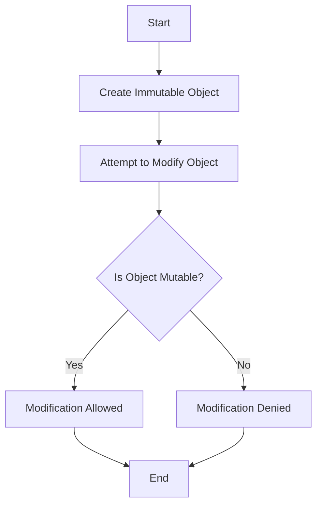

## 7.3 Immutability and Functional Purity

In the realm of software development, especially when dealing with complex systems, the concepts of immutability and functional purity play a pivotal role in ensuring that our code is predictable, testable, and maintainable. In this section, we will delve into these concepts, explore how they can be applied in Ruby, and understand their significance in building robust applications.

### Understanding Immutability

**Immutability** refers to the state of an object that cannot be changed after it has been created. This concept is central to functional programming, where data is treated as immutable by default. In Ruby, while most objects are mutable, we can enforce or simulate immutability to achieve the benefits it offers.

#### Enforcing Immutability in Ruby

Ruby does not natively enforce immutability, but we can simulate it using several techniques:

1. **Freezing Objects**: The simplest way to make an object immutable in Ruby is by using the `freeze` method. Once an object is frozen, any attempt to modify it will result in a `RuntimeError`.

    ```ruby
    person = { name: "Alice", age: 30 }
    person.freeze

    # Attempting to modify the frozen object
    begin
      person[:age] = 31
    rescue => e
      puts e.message  # => "can't modify frozen Hash"
    end
    ```

2. **Using Immutable Data Structures**: Libraries like `Hamster` provide immutable data structures for Ruby. These structures return modified copies instead of altering the original.

    ```ruby
    require 'hamster'

    list = Hamster::Vector[1, 2, 3]
    new_list = list.add(4)

    puts list.inspect     # => Hamster::Vector[1, 2, 3]
    puts new_list.inspect # => Hamster::Vector[1, 2, 3, 4]
    ```

3. **Custom Immutable Classes**: You can design your classes to be immutable by not providing any methods that modify the state of the object after its creation.

    ```ruby
    class ImmutablePoint
      attr_reader :x, :y

      def initialize(x, y)
        @x, @y = x, y
        freeze
      end
    end

    point = ImmutablePoint.new(10, 20)
    # point.x = 15  # This will raise an error
    ```

### Advantages of Immutable Data Structures

1. **Thread Safety**: Immutable objects are inherently thread-safe since their state cannot change. This eliminates the need for synchronization mechanisms, reducing complexity in concurrent applications.

2. **Predictability**: With immutable data, you can be confident that the state of an object will not change unexpectedly, leading to more predictable code behavior.

3. **Ease of Testing**: Immutable objects simplify testing because they eliminate side effects, making it easier to reason about the code and write tests.

4. **Functional Programming Compatibility**: Immutability aligns well with functional programming paradigms, allowing for easier adoption of functional techniques in Ruby.

### Exploring Functional Purity

**Functional Purity** refers to functions that have no side effects and return the same output for the same input. Pure functions are deterministic and do not depend on or modify any state outside their scope.

#### Characteristics of Pure Functions

- **Deterministic**: Given the same inputs, a pure function will always return the same output.
- **No Side Effects**: Pure functions do not alter any external state or rely on it.

#### Examples of Pure vs. Impure Functions

Let's illustrate the difference between pure and impure functions with examples:

**Pure Function Example**:

```ruby
def add(a, b)
  a + b
end

puts add(2, 3)  # => 5
puts add(2, 3)  # => 5 (always returns the same result)
```

**Impure Function Example**:

```ruby
total = 0

def add_to_total(value)
  total += value
end

puts add_to_total(5)  # => 5
puts add_to_total(5)  # => 10 (result depends on external state)
```

In the impure function example, the function `add_to_total` modifies the external variable `total`, making it impure.

### Benefits of Functional Purity

1. **Easier Testing**: Pure functions are easier to test because they do not depend on external state. You can test them in isolation with various inputs.

2. **Improved Readability**: Pure functions are self-contained and easier to understand, as they do not have hidden dependencies or side effects.

3. **Enhanced Reusability**: Since pure functions do not rely on external state, they can be reused in different contexts without unintended consequences.

4. **Facilitates Refactoring**: Pure functions make refactoring safer and more straightforward, as they are less likely to introduce bugs when moved or modified.

### Implementing Immutability and Functional Purity in Ruby

To effectively implement immutability and functional purity in Ruby, consider the following strategies:

1. **Adopt a Functional Mindset**: Embrace functional programming principles by treating functions as first-class citizens and focusing on immutability.

2. **Use Immutable Data Structures**: Leverage libraries like `Hamster` or design your immutable classes to ensure data cannot be modified after creation.

3. **Write Pure Functions**: Strive to write functions that do not depend on or modify external state. Use inputs and return values to pass data.

4. **Refactor Impure Code**: Identify impure functions in your codebase and refactor them to be pure, reducing dependencies on external state.

### Visualizing Immutability and Functional Purity

To better understand the concepts of immutability and functional purity, let's visualize them using a flowchart.



**Figure 1**: This flowchart illustrates the process of creating an immutable object and attempting to modify it. If the object is immutable, the modification is denied.

### Try It Yourself

Experiment with the code examples provided in this section. Try modifying the immutable objects and observe the behavior. Additionally, refactor impure functions in your codebase to be pure and see how it impacts your application's predictability and testability.

### Knowledge Check

- What is immutability, and how can it be enforced in Ruby?
- Explain the difference between pure and impure functions.
- What are the advantages of using immutable data structures?
- How does functional purity contribute to easier testing and refactoring?

### Summary

In this section, we've explored the concepts of immutability and functional purity, understanding their significance in building scalable and maintainable applications. By adopting these principles, we can create code that is more predictable, testable, and easier to reason about. Remember, this is just the beginning. As you progress, you'll discover more ways to leverage these concepts to enhance your Ruby applications. Keep experimenting, stay curious, and enjoy the journey!

## Quiz: Immutability and Functional Purity



### What is immutability in programming?

- [x] The state of an object that cannot be changed after it is created
- [ ] The ability to modify an object at any time
- [ ] The process of freezing an object temporarily
- [ ] A method to ensure thread safety

> **Explanation:** Immutability refers to the state of an object that cannot be changed after it is created, ensuring that its state remains constant.

### How can you enforce immutability in Ruby?

- [x] By using the `freeze` method on objects
- [ ] By using mutable data structures
- [ ] By creating classes with setter methods
- [ ] By using global variables

> **Explanation:** The `freeze` method in Ruby can be used to make objects immutable, preventing any modifications to their state.

### What is a characteristic of pure functions?

- [x] They have no side effects
- [ ] They modify external state
- [ ] They depend on global variables
- [ ] They return different outputs for the same inputs

> **Explanation:** Pure functions have no side effects and always return the same output for the same inputs, making them predictable and testable.

### Which of the following is an advantage of immutable data structures?

- [x] Thread safety
- [ ] Increased complexity
- [ ] Unpredictable behavior
- [ ] Difficulty in testing

> **Explanation:** Immutable data structures are inherently thread-safe because their state cannot change, eliminating the need for synchronization.

### What does functional purity ensure?

- [x] Functions return the same output for the same input
- [ ] Functions modify external state
- [ ] Functions rely on global variables
- [ ] Functions have side effects

> **Explanation:** Functional purity ensures that functions return the same output for the same input and do not have side effects, making them easier to test and reason about.

### How does immutability contribute to predictability?

- [x] By ensuring that object state does not change unexpectedly
- [ ] By allowing objects to be modified at any time
- [ ] By increasing the complexity of code
- [ ] By making code harder to test

> **Explanation:** Immutability ensures that object state does not change unexpectedly, leading to more predictable code behavior.

### What is a benefit of writing pure functions?

- [x] Easier testing
- [ ] Increased reliance on external state
- [ ] More complex code
- [ ] Unpredictable outputs

> **Explanation:** Pure functions are easier to test because they do not depend on external state and always produce the same output for the same input.

### How can you simulate immutability in Ruby?

- [x] By using libraries like Hamster
- [ ] By using mutable data structures
- [ ] By modifying global variables
- [ ] By creating classes with setter methods

> **Explanation:** Libraries like Hamster provide immutable data structures in Ruby, allowing you to simulate immutability.

### What is a key difference between pure and impure functions?

- [x] Pure functions have no side effects, while impure functions do
- [ ] Pure functions modify external state, while impure functions do not
- [ ] Pure functions rely on global variables, while impure functions do not
- [ ] Pure functions return different outputs for the same inputs, while impure functions do not

> **Explanation:** Pure functions have no side effects and do not modify external state, while impure functions do.

### True or False: Immutability and functional purity lead to more predictable and testable code.

- [x] True
- [ ] False

> **Explanation:** Immutability and functional purity lead to more predictable and testable code by eliminating side effects and ensuring consistent behavior.


