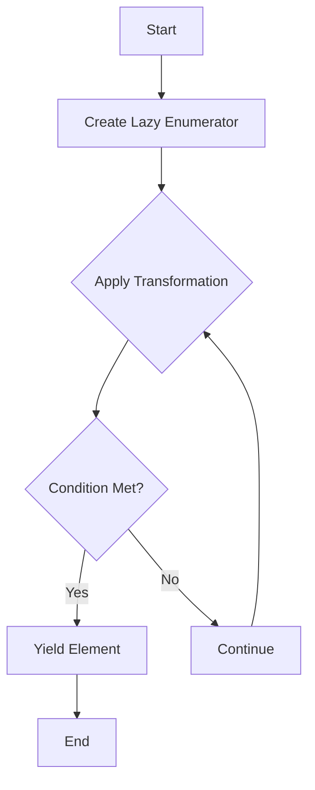

## 7.4 Enumerables and Lazy Enumerators

In Ruby, the concepts of Enumerables and Lazy Enumerators are pivotal for efficient data processing, especially when dealing with large datasets or potentially infinite sequences. This section will delve into these concepts, demonstrating how they can be leveraged to write clean, efficient, and scalable Ruby code.

### Understanding Enumerables in Ruby

Enumerables in Ruby are a set of methods that allow traversal, searching, sorting, and manipulation of collections. The `Enumerable` module provides a collection of methods that can be used with any class that implements the `each` method, such as arrays and hashes.

#### Key Enumerable Methods

The `Enumerable` module includes a variety of methods that are essential for functional programming in Ruby. Here are some of the most commonly used methods:

- **`map`**: Transforms each element of the collection based on the block provided.
- **`select`**: Filters elements based on the block's truthiness.
- **`reject`**: Opposite of `select`, it filters out elements based on the block's truthiness.
- **`reduce`**: Combines all elements of the collection by applying a binary operation, specified by a block or symbol.
- **`find`**: Returns the first element for which the block returns true.
- **`all?`**: Returns true if the block never returns false or nil for all elements.
- **`any?`**: Returns true if the block returns true for any element.

#### Example: Using Enumerable Methods

```ruby
numbers = [1, 2, 3, 4, 5]

# Using map to square each number
squared_numbers = numbers.map { |n| n * n }
# => [1, 4, 9, 16, 25]

# Using select to find even numbers
even_numbers = numbers.select { |n| n.even? }
# => [2, 4]

# Using reduce to sum all numbers
sum = numbers.reduce(0) { |total, n| total + n }
# => 15
```

### Introducing Lazy Enumerators

Lazy enumerators in Ruby allow for deferred computation, meaning that elements are computed only when needed. This is particularly useful for handling large datasets or infinite sequences, as it avoids loading the entire collection into memory.

#### Creating Lazy Enumerators

To create a lazy enumerator, you can call the `lazy` method on an enumerable object. This converts the enumerable into an instance of `Enumerator::Lazy`.

```ruby
# Creating a lazy enumerator
lazy_numbers = (1..Float::INFINITY).lazy

# Using lazy enumerator to find the first 10 even numbers
even_numbers = lazy_numbers.select { |n| n.even? }.first(10)
# => [2, 4, 6, 8, 10, 12, 14, 16, 18, 20]
```

#### Benefits of Deferred Computation

Deferred computation allows Ruby to handle large datasets efficiently by computing elements only when they are needed. This can significantly reduce memory usage and improve performance.

#### Example: Lazy Evaluation with Infinite Sequences

```ruby
# Infinite sequence of natural numbers
natural_numbers = (1..Float::INFINITY).lazy

# Finding the first 10 numbers divisible by 3
divisible_by_three = natural_numbers.select { |n| n % 3 == 0 }.first(10)
# => [3, 6, 9, 12, 15, 18, 21, 24, 27, 30]
```

### Performance Implications and Use Cases

Lazy enumerators are particularly useful in scenarios where you are dealing with large datasets or streams of data that cannot be loaded entirely into memory. They are also beneficial when working with potentially infinite sequences, as they allow you to process elements on-demand.

#### Use Cases for Lazy Enumerators

- **Processing Large Files**: When reading large files, lazy enumerators can be used to process lines one at a time without loading the entire file into memory.
- **Generating Infinite Sequences**: Lazy enumerators can generate infinite sequences, such as Fibonacci numbers or prime numbers, and process them as needed.
- **Streaming Data**: In applications that process streaming data, lazy enumerators can be used to handle data efficiently without blocking.

### Laziness and Functional Programming Principles

Lazy enumerators align well with functional programming principles, such as immutability and pure functions. By deferring computation, they allow for more predictable and testable code, as side effects are minimized.

#### Example: Combining Lazy Enumerators with Functional Programming

```ruby
# Infinite sequence of Fibonacci numbers
fibonacci = Enumerator.new do |yielder|
  a, b = 0, 1
  loop do
    yielder << a
    a, b = b, a + b
  end
end.lazy

# Finding the first 10 Fibonacci numbers greater than 100
large_fibonacci = fibonacci.select { |n| n > 100 }.first(10)
# => [144, 233, 377, 610, 987, 1597, 2584, 4181, 6765, 10946]
```

### Visualizing Lazy Evaluation

To better understand how lazy evaluation works, let's visualize the process using a flowchart.



**Description**: This flowchart illustrates the process of lazy evaluation, where elements are computed and yielded only when a condition is met.

### Try It Yourself

Experiment with lazy enumerators by modifying the code examples provided. Try creating your own infinite sequences or processing large datasets using lazy evaluation. Observe how lazy enumerators can improve performance and reduce memory usage.

### Key Takeaways

- Enumerables provide a powerful set of methods for traversing and manipulating collections in Ruby.
- Lazy enumerators enable deferred computation, allowing for efficient processing of large datasets and infinite sequences.
- Lazy evaluation aligns with functional programming principles, promoting immutability and pure functions.
- Use lazy enumerators in scenarios where memory efficiency and performance are critical.

### References and Further Reading

- [Ruby Enumerable Module Documentation](https://ruby-doc.org/core-3.1.0/Enumerable.html)
- [Ruby Enumerator::Lazy Documentation](https://ruby-doc.org/core-3.1.0/Enumerator/Lazy.html)
- [Functional Programming in Ruby](https://www.oreilly.com/library/view/functional-programming-in/9781449360726/)

## Quiz: Enumerables and Lazy Enumerators



### What is the primary benefit of using lazy enumerators in Ruby?

- [x] Deferred computation
- [ ] Faster execution
- [ ] Easier syntax
- [ ] More readable code

> **Explanation:** Lazy enumerators allow for deferred computation, meaning elements are computed only when needed, which is especially useful for large datasets or infinite sequences.

### Which method is used to create a lazy enumerator from an enumerable?

- [ ] `map`
- [ ] `select`
- [x] `lazy`
- [ ] `reduce`

> **Explanation:** The `lazy` method is called on an enumerable to create a lazy enumerator.

### How does lazy evaluation improve performance?

- [x] By reducing memory usage
- [ ] By increasing CPU usage
- [ ] By simplifying code
- [ ] By using more threads

> **Explanation:** Lazy evaluation improves performance by reducing memory usage, as elements are computed only when needed.

### What is a common use case for lazy enumerators?

- [ ] Sorting small arrays
- [x] Processing large files
- [ ] Simple arithmetic operations
- [ ] String manipulation

> **Explanation:** Lazy enumerators are commonly used for processing large files, as they allow for efficient memory usage by processing elements one at a time.

### Which of the following aligns with functional programming principles?

- [x] Immutability
- [ ] Side effects
- [x] Pure functions
- [ ] Global variables

> **Explanation:** Functional programming principles include immutability and pure functions, which help create predictable and testable code.

### What does the `select` method do in an enumerable?

- [x] Filters elements based on a block
- [ ] Transforms elements based on a block
- [ ] Combines elements using a block
- [ ] Finds the first element matching a block

> **Explanation:** The `select` method filters elements based on the truthiness of the block provided.

### How can lazy enumerators be used with infinite sequences?

- [x] By generating elements on-demand
- [ ] By precomputing all elements
- [x] By processing elements as needed
- [ ] By storing all elements in memory

> **Explanation:** Lazy enumerators generate elements on-demand and process them as needed, making them suitable for infinite sequences.

### What is the result of calling `first(10)` on a lazy enumerator?

- [x] The first 10 elements
- [ ] The last 10 elements
- [ ] All elements
- [ ] No elements

> **Explanation:** Calling `first(10)` on a lazy enumerator returns the first 10 elements.

### Why is lazy evaluation beneficial for streaming data?

- [x] It handles data efficiently without blocking
- [ ] It requires less code
- [ ] It simplifies error handling
- [ ] It increases data accuracy

> **Explanation:** Lazy evaluation handles streaming data efficiently without blocking, as it processes elements on-demand.

### True or False: Lazy enumerators can only be used with finite sequences.

- [ ] True
- [x] False

> **Explanation:** Lazy enumerators can be used with both finite and infinite sequences, as they compute elements on-demand.



Remember, this is just the beginning. As you progress, you'll build more complex and interactive applications using Ruby's powerful enumerables and lazy enumerators. Keep experimenting, stay curious, and enjoy the journey!

---
