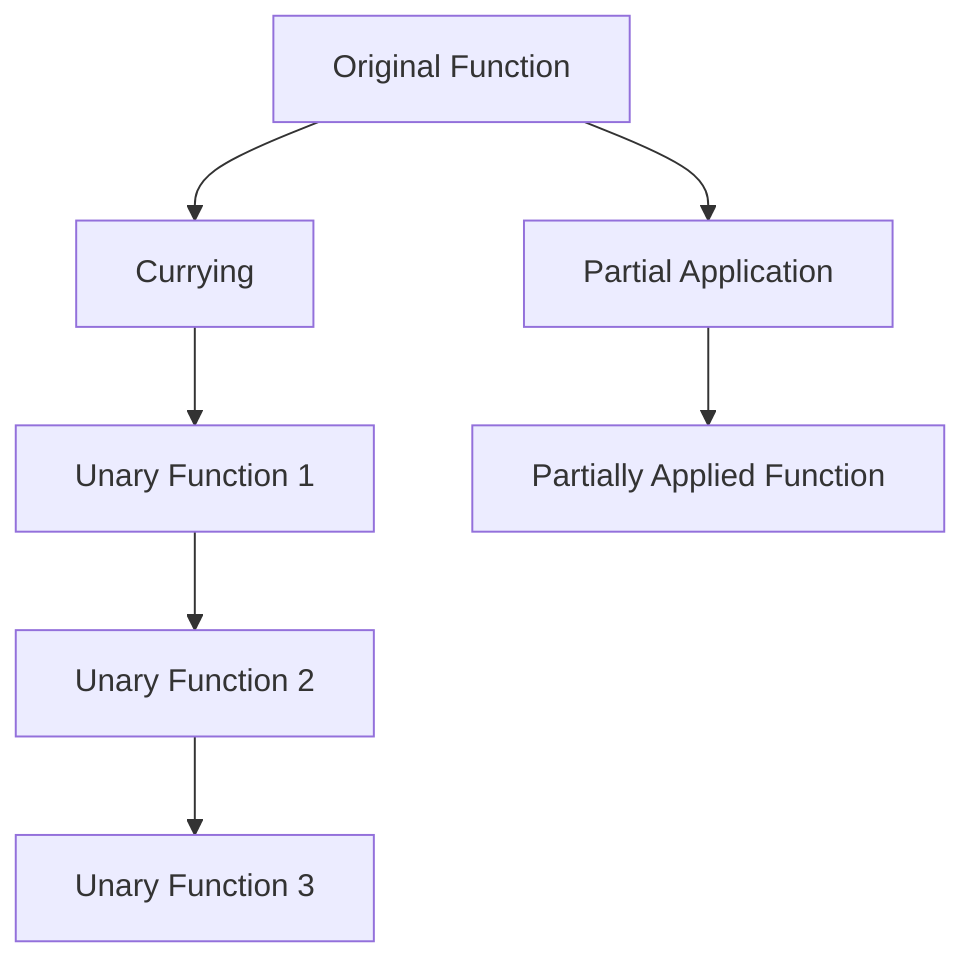

## 7.5 Currying and Partial Application

In the realm of functional programming, currying and partial application are powerful techniques that can greatly enhance the flexibility and reusability of your code. These concepts allow you to transform and configure functions in ways that make them more adaptable to different contexts. In this section, we will delve into the definitions, implementations, and practical applications of currying and partial application in Ruby.

### Understanding Currying

**Currying** is a technique in functional programming where a function with multiple arguments is transformed into a sequence of functions, each taking a single argument. This transformation allows for more modular and reusable code, as it enables the creation of specialized functions by fixing some arguments while leaving others open for later specification.

#### Currying in Ruby

Ruby provides built-in support for currying through the `Proc#curry` method. This method allows you to curry a proc or lambda, transforming it into a series of unary functions.

```ruby
# Define a simple function that takes three arguments
add = ->(x, y, z) { x + y + z }

# Curry the function
curried_add = add.curry

# Use the curried function
add_five = curried_add.call(5)
add_five_and_ten = add_five.call(10)
result = add_five_and_ten.call(15)

puts result # Output: 30
```

In this example, we define a lambda `add` that takes three arguments. By currying it, we transform it into a series of functions, each taking one argument. This allows us to create specialized functions like `add_five` and `add_five_and_ten`.

### Exploring Partial Application

**Partial application** is a related concept where a function is transformed by fixing some of its arguments, resulting in a new function with fewer arguments. Unlike currying, which transforms a function into a series of unary functions, partial application allows you to fix any number of arguments at once.

#### Partial Application in Ruby

While Ruby does not have built-in support for partial application, you can achieve it using closures or by leveraging existing libraries like `partial_application` gem.

```ruby
# Define a simple function
def multiply(x, y, z)
  x * y * z
end

# Create a partially applied function
def partial_multiply(x)
  ->(y, z) { multiply(x, y, z) }
end

# Use the partially applied function
multiply_by_two = partial_multiply(2)
result = multiply_by_two.call(3, 4)

puts result # Output: 24
```

In this example, we define a method `multiply` and create a partially applied function `partial_multiply` that fixes the first argument. This allows us to create specialized functions like `multiply_by_two`.

### Comparing Currying and Partial Application

While currying and partial application may seem similar, they serve different purposes and are used in different contexts. Currying transforms a function into a series of unary functions, while partial application fixes some arguments of a function, resulting in a new function with fewer arguments.

#### Key Differences

- **Currying**: Transforms a function into a sequence of unary functions.
- **Partial Application**: Fixes some arguments of a function, resulting in a new function with fewer arguments.

#### Practical Applications

Both currying and partial application can be used to create more flexible and reusable code. They are particularly useful in scenarios where you need to configure functions with specific arguments or when you want to create specialized versions of a function for different contexts.

### Benefits of Currying and Partial Application

1. **Code Reusability**: By transforming functions, you can create specialized versions that can be reused across different parts of your application.
2. **Flexibility**: Currying and partial application allow you to configure functions with specific arguments, making them more adaptable to different contexts.
3. **Modularity**: These techniques promote modular code by enabling the creation of smaller, specialized functions.

### Practical Applications in Ruby

#### Configuring Functions

Currying and partial application are particularly useful for configuring functions with specific arguments. For example, you can use these techniques to create specialized versions of a function that are pre-configured with certain parameters.

```ruby
# Define a function that sends a message
def send_message(sender, recipient, message)
  "#{sender} sends '#{message}' to #{recipient}"
end

# Create a partially applied function for a specific sender
def sender(sender)
  ->(recipient, message) { send_message(sender, recipient, message) }
end

# Use the partially applied function
alice_sender = sender("Alice")
puts alice_sender.call("Bob", "Hello!") # Output: Alice sends 'Hello!' to Bob
```

#### Enhancing Code Readability

By using currying and partial application, you can enhance the readability of your code by creating more descriptive and specialized functions.

```ruby
# Define a function that calculates the area of a rectangle
def area(length, width)
  length * width
end

# Create a curried version of the function
curried_area = method(:area).to_proc.curry

# Use the curried function to create specialized versions
area_of_length_five = curried_area.call(5)
puts area_of_length_five.call(10) # Output: 50
```

### Visualizing Currying and Partial Application

To better understand the transformation process involved in currying and partial application, let's visualize these concepts using a flowchart.



**Description**: This diagram illustrates the transformation process for currying and partial application. The original function is transformed into a series of unary functions through currying, while partial application results in a new function with some arguments fixed.

### Try It Yourself

To deepen your understanding of currying and partial application, try modifying the code examples provided. Experiment with different functions and arguments to see how these techniques can be applied in various contexts.

### References and Further Reading

- [MDN Web Docs: Currying](https://developer.mozilla.org/en-US/docs/Glossary/Currying)
- [Ruby Documentation: Proc#curry](https://ruby-doc.org/core-2.7.0/Proc.html#method-i-curry)
- [Functional Programming in Ruby](https://www.ruby-lang.org/en/documentation/)
- [Partial Application in Ruby](https://github.com/partial_application)

### Knowledge Check

- What is the primary difference between currying and partial application?
- How can you implement currying in Ruby?
- What are some practical applications of currying and partial application?

### Embrace the Journey

Remember, mastering currying and partial application is just one step in your journey to becoming a more proficient Ruby developer. Keep experimenting, stay curious, and enjoy the process of learning and applying these powerful techniques to your code.

## Quiz: Currying and Partial Application



### What is currying in functional programming?

- [x] Transforming a function with multiple arguments into a sequence of functions each taking a single argument
- [ ] Fixing a few arguments of a function to produce another function of smaller arity
- [ ] Combining multiple functions into a single function
- [ ] Converting a function into a lambda

> **Explanation:** Currying transforms a function with multiple arguments into a series of unary functions, each taking one argument.

### How can you perform currying in Ruby?

- [x] Using the `Proc#curry` method
- [ ] Using the `lambda` keyword
- [ ] By defining a new method
- [ ] Using the `yield` keyword

> **Explanation:** Ruby provides the `Proc#curry` method to perform currying on procs and lambdas.

### What is partial application?

- [x] Fixing some arguments of a function, resulting in a new function with fewer arguments
- [ ] Transforming a function into a series of unary functions
- [ ] Combining multiple functions into a single function
- [ ] Converting a function into a lambda

> **Explanation:** Partial application involves fixing some arguments of a function to create a new function with fewer arguments.

### Which of the following is a benefit of currying and partial application?

- [x] Code reusability
- [x] Flexibility
- [ ] Increased complexity
- [ ] Reduced performance

> **Explanation:** Currying and partial application enhance code reusability and flexibility, making functions more adaptable to different contexts.

### What is the result of currying a function?

- [x] A series of unary functions
- [ ] A single function with fixed arguments
- [ ] A lambda function
- [ ] A proc object

> **Explanation:** Currying transforms a function into a series of unary functions, each taking one argument.

### What is the primary use of partial application?

- [x] Creating specialized functions by fixing some arguments
- [ ] Transforming functions into unary functions
- [ ] Combining functions into a single function
- [ ] Converting functions into procs

> **Explanation:** Partial application is used to create specialized functions by fixing some arguments, resulting in a new function with fewer arguments.

### How does currying enhance code modularity?

- [x] By enabling the creation of smaller, specialized functions
- [ ] By increasing the number of arguments in a function
- [ ] By combining multiple functions into one
- [ ] By converting functions into procs

> **Explanation:** Currying enhances code modularity by allowing the creation of smaller, specialized functions that can be reused in different contexts.

### Which Ruby method is used to curry a proc or lambda?

- [x] `Proc#curry`
- [ ] `Proc#call`
- [ ] `Proc#to_proc`
- [ ] `Proc#lambda`

> **Explanation:** The `Proc#curry` method is used to curry a proc or lambda in Ruby.

### What is the difference between currying and partial application?

- [x] Currying transforms a function into unary functions, while partial application fixes some arguments
- [ ] Currying fixes some arguments, while partial application transforms into unary functions
- [ ] Both currying and partial application transform functions into unary functions
- [ ] Both currying and partial application fix some arguments

> **Explanation:** Currying transforms a function into a series of unary functions, while partial application fixes some arguments, resulting in a new function with fewer arguments.

### True or False: Currying and partial application are only useful in functional programming languages.

- [ ] True
- [x] False

> **Explanation:** Currying and partial application are useful in any programming language that supports higher-order functions, including Ruby.


