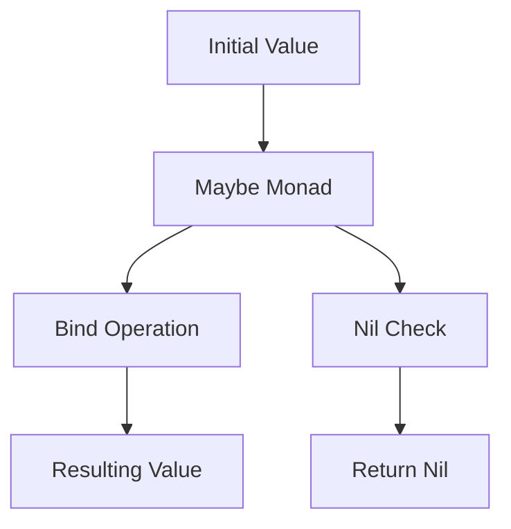

## 7.6 Monads in Ruby

Monads are a fundamental concept in functional programming, often used to handle side effects such as state, IO, or exceptions in a pure functional way. In this section, we will delve into the world of monads, exploring their purpose, common types, and how they can be implemented in Ruby. We will also discuss the challenges and benefits of using monads in Ruby, providing you with a comprehensive understanding of this powerful design pattern.

### What Are Monads?

Monads are a type of abstract data type used to represent computations instead of values. They are a design pattern that allows for the chaining of operations while managing side effects in a functional programming context. Monads encapsulate behavior such as handling null values, exceptions, or asynchronous operations, providing a way to compose functions in a clean and predictable manner.

#### Purpose of Monads

The primary purpose of monads is to provide a way to sequence computations while abstracting away side effects. This allows developers to write code that is both modular and easy to reason about. Monads achieve this by defining two primary operations:

1. **Bind (also known as flatMap or chain):** This operation takes a monadic value and a function that returns a monad, applying the function to the unwrapped value and returning a new monad.
2. **Return (also known as unit or pure):** This operation takes a value and wraps it in a monad, allowing it to be used in a monadic context.

### Common Monads in Ruby

In Ruby, monads are not built into the language, but they can be implemented using Ruby's flexible object-oriented features. Let's explore some common monads and how they can be implemented in Ruby.

#### Maybe Monad

The Maybe monad is used to handle computations that may fail or return a null value. It encapsulates a value that may or may not be present, allowing for safe chaining of operations without the need for explicit null checks.

```ruby
class Maybe
  def initialize(value)
    @value = value
  end

  def self.just(value)
    new(value)
  end

  def self.nothing
    new(nil)
  end

  def bind
    return self if @value.nil?
    Maybe.just(yield(@value))
  end

  def value
    @value
  end
end

# Example usage
result = Maybe.just(5)
            .bind { |x| x * 2 }
            .bind { |x| x + 3 }
puts result.value # Output: 13

nil_result = Maybe.nothing
                 .bind { |x| x * 2 }
puts nil_result.value # Output: nil
```

In this example, the `Maybe` class provides a way to chain operations on a value that may be nil, without having to check for nil explicitly.

#### Either Monad

The Either monad is used to handle computations that may result in an error. It encapsulates a value that can be either a success or a failure, allowing for error handling without exceptions.

```ruby
class Either
  def initialize(value, is_right)
    @value = value
    @is_right = is_right
  end

  def self.right(value)
    new(value, true)
  end

  def self.left(value)
    new(value, false)
  end

  def bind
    return self unless @is_right
    yield(@value)
  end

  def value
    @value
  end

  def right?
    @is_right
  end

  def left?
    !@is_right
  end
end

# Example usage
success = Either.right(10)
               .bind { |x| Either.right(x * 2) }
               .bind { |x| Either.right(x + 5) }
puts success.value # Output: 25

failure = Either.left("Error")
                .bind { |x| Either.right(x * 2) }
puts failure.value # Output: "Error"
```

The `Either` monad allows for chaining operations that may fail, with the ability to handle errors gracefully.

### Challenges of Using Monads in Ruby

While monads offer many benefits, there are challenges to using them in Ruby:

- **Lack of Native Support:** Ruby does not have built-in support for monads, requiring developers to implement them manually.
- **Complexity:** Monads can introduce complexity, especially for developers unfamiliar with functional programming concepts.
- **Performance:** Implementing monads in Ruby may introduce performance overhead compared to languages with native support.

### Benefits of Using Monads in Ruby

Despite the challenges, using monads in Ruby can provide several benefits:

- **Cleaner Error Handling:** Monads like `Maybe` and `Either` provide a structured way to handle errors and null values, reducing the need for explicit checks and exception handling.
- **Chaining Operations:** Monads allow for the chaining of operations in a clean and predictable manner, improving code readability and maintainability.
- **Modularity:** Monads encapsulate behavior, allowing for more modular and reusable code.

### Try It Yourself

Experiment with the provided code examples by modifying the operations or adding new monads. Try implementing a `List` monad or a `Reader` monad to further explore the power of monads in Ruby.

### Visualizing Monads

To better understand how monads work, let's visualize the flow of operations using a Mermaid.js diagram.



This diagram illustrates the flow of operations in the `Maybe` monad, showing how the initial value is passed through the monad, with checks for nil values and the resulting value after binding operations.

### References and Links

For further reading on monads and functional programming in Ruby, consider the following resources:

- [Learn You a Haskell for Great Good!](http://learnyouahaskell.com/)
- [Functional Programming in Scala](https://www.manning.com/books/functional-programming-in-scala)
- [Ruby Monads Gem](https://github.com/robrix/monads)

### Knowledge Check

- What is the primary purpose of monads in functional programming?
- How does the `Maybe` monad handle nil values?
- What are the two primary operations defined by monads?
- How can the `Either` monad be used for error handling in Ruby?

### Embrace the Journey

Remember, understanding monads is just the beginning of your journey into functional programming in Ruby. As you continue to explore, you'll discover more powerful patterns and techniques that will enhance your ability to write clean, efficient, and scalable Ruby code. Keep experimenting, stay curious, and enjoy the journey!

## Quiz: Monads in Ruby



### What is the primary purpose of monads in functional programming?

- [x] To sequence computations while managing side effects
- [ ] To provide a data structure for storing values
- [ ] To improve performance of functional programs
- [ ] To replace object-oriented programming

> **Explanation:** Monads are used to sequence computations while managing side effects, allowing for clean and predictable function composition.

### How does the `Maybe` monad handle nil values?

- [x] It encapsulates the value and allows chaining without explicit nil checks
- [ ] It raises an exception when a nil value is encountered
- [ ] It converts nil values to a default value
- [ ] It ignores nil values and continues execution

> **Explanation:** The `Maybe` monad encapsulates the value and allows chaining operations without explicit nil checks, returning nil if the value is absent.

### What are the two primary operations defined by monads?

- [x] Bind and Return
- [ ] Map and Filter
- [ ] Reduce and Fold
- [ ] Initialize and Execute

> **Explanation:** Monads define two primary operations: Bind (for chaining operations) and Return (for wrapping values in a monadic context).

### How can the `Either` monad be used for error handling in Ruby?

- [x] By encapsulating success and failure values, allowing for graceful error handling
- [ ] By raising exceptions for errors
- [ ] By logging errors to a file
- [ ] By ignoring errors and continuing execution

> **Explanation:** The `Either` monad encapsulates success and failure values, allowing for graceful error handling without exceptions.

### What is a challenge of using monads in Ruby?

- [x] Lack of native support
- [ ] Improved performance
- [ ] Simplified code structure
- [ ] Enhanced readability

> **Explanation:** A challenge of using monads in Ruby is the lack of native support, requiring manual implementation.

### What benefit do monads provide in Ruby?

- [x] Cleaner error handling
- [ ] Increased complexity
- [ ] Reduced code readability
- [ ] Slower performance

> **Explanation:** Monads provide cleaner error handling by structuring how errors and null values are managed.

### What is the `Bind` operation in monads?

- [x] It applies a function to a monadic value and returns a new monad
- [ ] It initializes a monad with a value
- [ ] It converts a monad to a regular value
- [ ] It checks for nil values in a monad

> **Explanation:** The `Bind` operation applies a function to a monadic value and returns a new monad, allowing for chaining operations.

### What is the `Return` operation in monads?

- [x] It wraps a value in a monad
- [ ] It extracts a value from a monad
- [ ] It checks for errors in a monad
- [ ] It logs the value of a monad

> **Explanation:** The `Return` operation wraps a value in a monad, allowing it to be used in a monadic context.

### How does the `Either` monad differ from the `Maybe` monad?

- [x] `Either` handles success and failure, while `Maybe` handles presence and absence of values
- [ ] `Either` is used for asynchronous operations, while `Maybe` is not
- [ ] `Either` is a built-in Ruby class, while `Maybe` is not
- [ ] `Either` is used for logging, while `Maybe` is not

> **Explanation:** The `Either` monad handles success and failure, while the `Maybe` monad handles the presence and absence of values.

### True or False: Monads are a built-in feature of Ruby.

- [ ] True
- [x] False

> **Explanation:** False. Monads are not a built-in feature of Ruby; they must be implemented manually using Ruby's object-oriented features.


