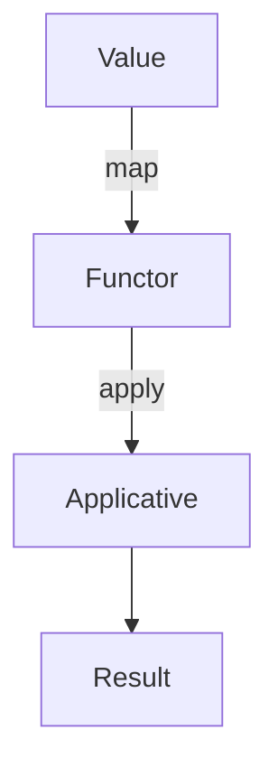

## 7.7 Functors and Applicatives

In the realm of functional programming, **functors** and **applicatives** are powerful abstractions that facilitate the application of functions within a context, such as a container or computational environment. These concepts allow developers to write more abstract, reusable, and scalable code. In this section, we will delve into the definitions, roles, and applications of functors and applicatives in Ruby, providing you with a comprehensive understanding of how to leverage these abstractions in your projects.

### Understanding Functors in Ruby

#### What is a Functor?

A **functor** is a design pattern that allows you to map a function over a structure without altering the structure itself. In Ruby, a functor can be thought of as any object that implements a `map` method. This method takes a function as an argument and applies it to the values within the context of the functor.

#### Role of Functors

Functors play a crucial role in functional programming by enabling the transformation of data within a context. They provide a way to apply functions to wrapped values, allowing for cleaner and more expressive code. Functors are often used in scenarios where you want to perform operations on data that is encapsulated within a container, such as an array or a custom data type.

#### Implementing Functors in Ruby

Let's start by implementing a simple functor in Ruby using a custom class. We'll create a `Box` class that acts as a container for a value and implements the `map` method.

```ruby
class Box
  def initialize(value)
    @value = value
  end

  def map(&block)
    Box.new(block.call(@value))
  end

  def value
    @value
  end
end

# Usage example
box = Box.new(5)
new_box = box.map { |x| x * 2 }
puts new_box.value # Output: 10
```

In this example, the `Box` class encapsulates a value and provides a `map` method that applies a given block to the value, returning a new `Box` instance with the transformed value.

#### Real-World Applications of Functors

Functors are widely used in real-world applications, particularly in scenarios involving data transformation and manipulation. For instance, they can be used to apply a series of transformations to a collection of data, such as filtering, mapping, and reducing, without altering the original data structure.

### Exploring Applicatives in Ruby

#### What is an Applicative?

An **applicative** is a more advanced abstraction that extends the concept of functors. While functors allow you to apply a single function to a value within a context, applicatives enable you to apply functions that are themselves within a context to values within a context. This is particularly useful when dealing with multiple wrapped values or functions.

#### Role of Applicatives

Applicatives provide a mechanism for applying functions to multiple arguments that are wrapped in a context. They are essential for scenarios where you need to perform operations on multiple encapsulated values, such as combining results from different computations.

#### Implementing Applicatives in Ruby

To illustrate the concept of applicatives, let's extend our `Box` class to support applicative operations. We'll add an `apply` method that takes another `Box` containing a function and applies it to the value within the current `Box`.

```ruby
class Box
  def initialize(value)
    @value = value
  end

  def map(&block)
    Box.new(block.call(@value))
  end

  def apply(box_with_function)
    box_with_function.map { |func| func.call(@value) }
  end

  def value
    @value
  end
end

# Usage example
box = Box.new(5)
function_box = Box.new(->(x) { x * 2 })
result_box = box.apply(function_box)
puts result_box.value # Output: 10
```

In this example, the `apply` method allows us to apply a function contained within a `Box` to the value of another `Box`, demonstrating the power of applicatives in handling multiple contexts.

#### Real-World Applications of Applicatives

Applicatives are particularly useful in scenarios involving asynchronous computations, where you need to combine results from multiple operations. They can also be used in form validation, where multiple fields need to be validated independently and combined into a single result.

### Benefits of Using Functors and Applicatives

#### Improved Code Abstraction

By using functors and applicatives, you can achieve a higher level of code abstraction. These abstractions allow you to separate the logic of function application from the underlying data structure, resulting in more modular and reusable code.

#### Enhanced Scalability

Functors and applicatives enable you to write code that is more scalable and adaptable to changes. By encapsulating operations within contexts, you can easily extend or modify functionality without affecting the rest of the codebase.

#### Real-World Benefits

In real-world applications, functors and applicatives can lead to cleaner and more maintainable code. They are particularly beneficial in projects involving complex data transformations, asynchronous operations, and form validations.

### Visualizing Functors and Applicatives

To better understand the relationship between functors and applicatives, let's visualize these concepts using a Mermaid.js diagram.



This diagram illustrates how a value is first transformed into a functor using the `map` method, and then further transformed into an applicative using the `apply` method, resulting in a final computed result.

### Try It Yourself

To solidify your understanding of functors and applicatives, try modifying the code examples provided. Experiment with different data types, functions, and contexts to see how these abstractions can be applied in various scenarios.

### Further Reading

For more information on functors and applicatives, consider exploring the following resources:

- [MDN Web Docs: Functors](https://developer.mozilla.org/en-US/docs/Glossary/Functor)
- [Haskell Wiki: Applicative Functors](https://wiki.haskell.org/Applicative_functor)

### Summary

In this section, we've explored the concepts of functors and applicatives in Ruby, understanding their roles in function application within contexts. By implementing these abstractions, you can achieve improved code abstraction, enhanced scalability, and real-world benefits in your Ruby applications. Remember, this is just the beginning. As you progress, continue experimenting with these concepts to unlock their full potential.

## Quiz: Functors and Applicatives



### What is a functor in Ruby?

- [x] An object that implements a `map` method to apply a function to a value within a context.
- [ ] A class that defines a single method.
- [ ] A type of loop in Ruby.
- [ ] A method for handling exceptions.

> **Explanation:** A functor in Ruby is an object that implements a `map` method, allowing a function to be applied to a value within a context.

### What does the `apply` method in an applicative do?

- [x] Applies a function contained within a context to a value within another context.
- [ ] Maps a function over a list.
- [ ] Handles exceptions in a program.
- [ ] Initializes a new object.

> **Explanation:** The `apply` method in an applicative applies a function that is contained within a context to a value within another context.

### How do functors improve code abstraction?

- [x] By separating the logic of function application from the underlying data structure.
- [ ] By making code more complex.
- [ ] By reducing the number of lines of code.
- [ ] By increasing the speed of execution.

> **Explanation:** Functors improve code abstraction by allowing the logic of function application to be separated from the data structure, resulting in more modular and reusable code.

### What is a real-world application of applicatives?

- [x] Combining results from multiple asynchronous operations.
- [ ] Sorting an array.
- [ ] Printing to the console.
- [ ] Reading from a file.

> **Explanation:** Applicatives are useful in real-world applications for combining results from multiple asynchronous operations.

### Which method is used to transform a value into a functor?

- [x] `map`
- [ ] `apply`
- [ ] `reduce`
- [ ] `filter`

> **Explanation:** The `map` method is used to transform a value into a functor by applying a function to it.

### What is the main difference between functors and applicatives?

- [x] Functors apply a single function to a value, while applicatives apply functions within a context to values within a context.
- [ ] Functors are faster than applicatives.
- [ ] Applicatives are used for error handling.
- [ ] Functors are only used in Ruby.

> **Explanation:** The main difference is that functors apply a single function to a value, while applicatives apply functions within a context to values within a context.

### What is the purpose of the `Box` class in the examples?

- [x] To act as a container for a value and demonstrate functor and applicative operations.
- [ ] To handle exceptions.
- [ ] To sort arrays.
- [ ] To read from files.

> **Explanation:** The `Box` class acts as a container for a value and demonstrates functor and applicative operations through its `map` and `apply` methods.

### How can applicatives enhance scalability?

- [x] By allowing operations on multiple encapsulated values without affecting the rest of the codebase.
- [ ] By making code more complex.
- [ ] By reducing execution time.
- [ ] By increasing the number of lines of code.

> **Explanation:** Applicatives enhance scalability by allowing operations on multiple encapsulated values, enabling code to be easily extended or modified.

### What is the output of the following code snippet?
```ruby
box = Box.new(3)
function_box = Box.new(->(x) { x + 4 })
result_box = box.apply(function_box)
puts result_box.value
```

- [x] 7
- [ ] 3
- [ ] 4
- [ ] 12

> **Explanation:** The `apply` method applies the function `(x + 4)` to the value `3`, resulting in `7`.

### True or False: Functors and applicatives are only applicable in functional programming languages.

- [ ] True
- [x] False

> **Explanation:** False. Functors and applicatives are applicable in any programming language that supports functional programming concepts, including Ruby.




