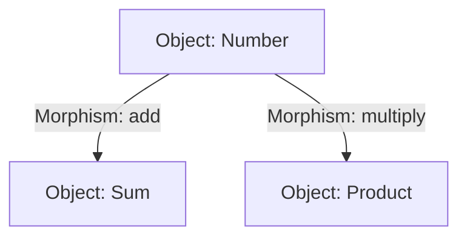
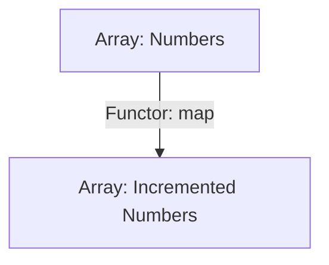

## 7.8 Category Theory Concepts

Category theory, often dubbed the "mathematics of mathematics," provides a high-level, abstract framework for understanding and structuring mathematical concepts. Its principles have found a natural home in programming, particularly in functional programming paradigms. In this section, we'll explore the basics of category theory and how its concepts like categories, objects, and morphisms relate to Ruby programming. We'll also delve into how category theory underpins many functional programming patterns, providing practical Ruby code examples to illustrate these ideas.

### Introduction to Category Theory

Category theory is a branch of mathematics that deals with abstract structures and relationships between them. It provides a unified way of looking at mathematical concepts by focusing on the relationships (morphisms) between objects rather than the objects themselves.

#### Key Concepts

- **Categories**: A category consists of objects and morphisms (arrows) between these objects. In programming, objects can be types, and morphisms can be functions.
- **Objects**: These are the entities within a category. In Ruby, objects can be classes or instances.
- **Morphisms**: These are the arrows or mappings between objects. In Ruby, morphisms are typically methods or functions that transform one object into another.
- **Functors**: These map objects and morphisms from one category to another, preserving the structure of the category.
- **Monads**: These are a type of functor that encapsulate computation logic, allowing for the chaining of operations.

### Categories in Ruby

In Ruby, we can think of categories as collections of types (objects) and methods (morphisms) that operate on these types. Let's explore how these concepts translate into Ruby code.

#### Objects and Morphisms

Consider a simple category where the objects are numbers and the morphisms are arithmetic operations:

```ruby
# Objects: Numbers
number1 = 5
number2 = 10

# Morphisms: Functions
def add(x, y)
  x + y
end

def multiply(x, y)
  x * y
end

# Using morphisms
sum = add(number1, number2) # Morphism: add
product = multiply(number1, number2) # Morphism: multiply

puts "Sum: #{sum}, Product: #{product}"
```

In this example, `number1` and `number2` are objects, while `add` and `multiply` are morphisms that map these objects to new objects (the results of the operations).

### Functors in Ruby

Functors are mappings between categories that preserve the structure of the categories. In Ruby, a functor can be represented by a class that implements a `map` method, which applies a function to the value it contains.

#### Example: Array as a Functor

The `Array` class in Ruby can be seen as a functor because it implements the `map` method:

```ruby
# Array as a Functor
numbers = [1, 2, 3, 4, 5]

# Morphism: Increment each number
incremented_numbers = numbers.map { |n| n + 1 }

puts "Incremented Numbers: #{incremented_numbers.inspect}"
```

Here, `numbers` is an array (functor), and `map` is the functor's method that applies a morphism (increment operation) to each element in the array.

### Monads in Ruby

Monads are a type of functor that provide a way to chain operations while managing side effects. They encapsulate values and provide a mechanism to apply functions to these values in a controlled manner.

#### Example: Maybe Monad

A common monad is the `Maybe` monad, which handles computations that might fail. Let's implement a simple `Maybe` monad in Ruby:

```ruby
# Maybe Monad Implementation
class Maybe
  def initialize(value)
    @value = value
  end

  def self.just(value)
    new(value)
  end

  def self.nothing
    new(nil)
  end

  def bind
    return Maybe.nothing if @value.nil?
    yield(@value)
  end

  def value
    @value
  end
end

# Usage of Maybe Monad
maybe_value = Maybe.just(10)

result = maybe_value.bind do |value|
  Maybe.just(value * 2)
end

puts "Result: #{result.value}" # Output: Result: 20
```

In this example, the `Maybe` monad encapsulates a value and provides a `bind` method to apply a function to the value if it exists. This allows us to chain operations without worrying about `nil` values.

### Benefits of Understanding Category Theory

Understanding category theory concepts can greatly enhance your ability to write clean, efficient, and scalable Ruby code. Here are some benefits:

- **Abstraction**: Category theory provides a high-level abstraction that can simplify complex problems.
- **Reusability**: By understanding the underlying patterns, you can create reusable and composable code.
- **Robustness**: Category theory encourages thinking about the relationships between objects, leading to more robust and maintainable code.

### Visualizing Category Theory Concepts

To better understand these concepts, let's visualize them using Mermaid.js diagrams.

#### Diagram: Category with Objects and Morphisms



This diagram represents a simple category with numbers as objects and arithmetic operations as morphisms.

#### Diagram: Functor Mapping



This diagram illustrates how a functor (array) maps objects (numbers) to new objects (incremented numbers) using a morphism (increment operation).

### Try It Yourself

To deepen your understanding, try modifying the code examples:

- Implement a `List` functor that applies a transformation to each element.
- Create a `Result` monad that handles success and failure cases.
- Visualize your own category theory concepts using Mermaid.js.

### Knowledge Check

Before we conclude, let's reinforce what we've learned with a few questions:

- What are the main components of a category in category theory?
- How does a functor differ from a monad?
- Why is category theory useful in functional programming?

### Embrace the Journey

Remember, understanding category theory is a journey. As you explore these concepts, you'll gain a deeper appreciation for the elegance and power of functional programming in Ruby. Keep experimenting, stay curious, and enjoy the journey!

## Quiz: Category Theory Concepts



### What is a category in category theory?

- [x] A collection of objects and morphisms between them
- [ ] A single object with no morphisms
- [ ] A function that maps objects to morphisms
- [ ] A type of monad

> **Explanation:** A category consists of objects and morphisms (arrows) between these objects.

### What is a morphism in category theory?

- [x] A mapping between objects
- [ ] A type of object
- [ ] A functor
- [ ] A monad

> **Explanation:** Morphisms are the arrows or mappings between objects in a category.

### How does a functor operate?

- [x] It maps objects and morphisms from one category to another
- [ ] It only maps objects, not morphisms
- [ ] It is a type of monad
- [ ] It encapsulates side effects

> **Explanation:** Functors map both objects and morphisms from one category to another, preserving the structure.

### What is a monad?

- [x] A type of functor that allows chaining of operations
- [ ] A standalone object
- [ ] A morphism
- [ ] A category

> **Explanation:** Monads are a type of functor that encapsulate computation logic, allowing for the chaining of operations.

### Which Ruby class can be considered a functor?

- [x] Array
- [ ] Integer
- [ ] String
- [ ] Hash

> **Explanation:** The `Array` class in Ruby can be considered a functor because it implements the `map` method.

### What does the `bind` method do in a monad?

- [x] Applies a function to the encapsulated value
- [ ] Creates a new monad
- [ ] Maps objects to morphisms
- [ ] Converts a functor to a monad

> **Explanation:** The `bind` method applies a function to the encapsulated value, allowing for chaining operations.

### What is the purpose of the `Maybe` monad?

- [x] To handle computations that might fail
- [ ] To map objects to morphisms
- [ ] To encapsulate side effects
- [ ] To create new categories

> **Explanation:** The `Maybe` monad handles computations that might fail by encapsulating values and providing a mechanism to apply functions to these values.

### How does category theory benefit programming?

- [x] By providing high-level abstractions and encouraging robust code
- [ ] By focusing solely on objects
- [ ] By eliminating the need for functions
- [ ] By simplifying syntax

> **Explanation:** Category theory provides high-level abstractions that simplify complex problems and encourage robust, maintainable code.

### What is the relationship between functors and monads?

- [x] Monads are a type of functor
- [ ] Functors are a type of monad
- [ ] They are unrelated
- [ ] They are both types of morphisms

> **Explanation:** Monads are a type of functor that provide additional capabilities for chaining operations.

### True or False: Category theory is only applicable to functional programming.

- [ ] True
- [x] False

> **Explanation:** While category theory is often associated with functional programming, its principles can be applied to various programming paradigms.




