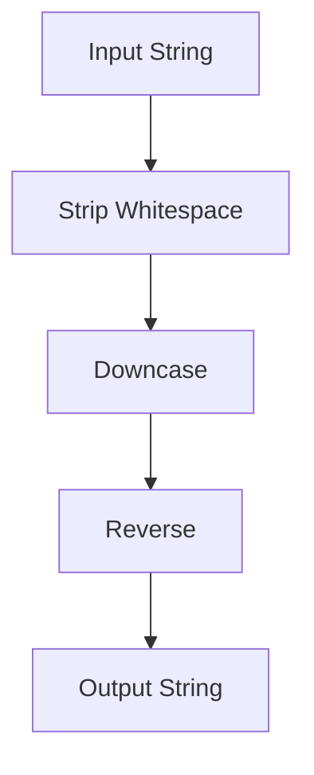

## 7.9 Pipelines and Function Composition

In the realm of functional programming, pipelines and function composition are powerful concepts that enable developers to write clean, modular, and maintainable code. By chaining functions together, we can create a seamless flow of data transformations, where the output of one function becomes the input of the next. This approach not only enhances code readability but also promotes reusability and scalability.

### Understanding Function Composition and Pipelines

**Function Composition** is the process of combining two or more functions to produce a new function. In mathematical terms, if we have two functions `f` and `g`, the composition of these functions is denoted as `f(g(x))`. In Ruby, function composition allows us to build complex operations by combining simpler functions.

**Pipelines**, on the other hand, are a series of data transformations applied in sequence. Each step in a pipeline is a function that takes an input, processes it, and passes the result to the next function in the chain. Pipelines are particularly useful for processing streams of data, such as collections or input from external sources.

### Composing Functions in Ruby

Ruby, with its dynamic nature and support for functional programming concepts, provides several ways to compose functions. Let's explore how we can achieve function composition using methods, Procs, and lambdas.

#### Composing Methods

In Ruby, methods can be composed by calling them in sequence. However, to achieve true function composition, we need to ensure that each method returns a value that can be used as the input for the next method.

```ruby
class StringProcessor
  def initialize(string)
    @string = string
  end

  def strip_whitespace
    @string.strip!
    self
  end

  def downcase
    @string.downcase!
    self
  end

  def reverse
    @string.reverse!
    self
  end

  def result
    @string
  end
end

processor = StringProcessor.new("  Hello World  ")
result = processor.strip_whitespace.downcase.reverse.result
puts result # Output: "dlrow olleh"
```

In this example, we have a `StringProcessor` class with methods that transform a string. By returning `self` from each method, we enable method chaining, which allows us to compose these transformations in a pipeline-like fashion.

#### Using Procs and Lambdas

Procs and lambdas in Ruby are objects that encapsulate blocks of code. They can be used to create reusable functions that can be composed together.

```ruby
strip_whitespace = Proc.new { |str| str.strip }
downcase = Proc.new { |str| str.downcase }
reverse = Proc.new { |str| str.reverse }

def compose(*functions)
  ->(arg) {
    functions.reduce(arg) { |acc, func| func.call(acc) }
  }
end

pipeline = compose(strip_whitespace, downcase, reverse)
result = pipeline.call("  Hello World  ")
puts result # Output: "dlrow olleh"
```

In this example, we define three Procs for stripping whitespace, converting to lowercase, and reversing a string. The `compose` method takes these Procs and returns a new lambda that applies them in sequence. This is a classic example of function composition, where each function's output becomes the input for the next.

#### Leveraging Lambdas for Composition

Lambdas in Ruby are similar to Procs but have stricter argument checking and return behavior. They can be used interchangeably with Procs for function composition.

```ruby
strip_whitespace = ->(str) { str.strip }
downcase = ->(str) { str.downcase }
reverse = ->(str) { str.reverse }

pipeline = compose(strip_whitespace, downcase, reverse)
result = pipeline.call("  Hello World  ")
puts result # Output: "dlrow olleh"
```

The use of lambdas here is identical to Procs, demonstrating their flexibility in function composition.

### Exploring the `functor` Gem

Ruby's ecosystem includes several gems that facilitate function composition. One such gem is `functor`, which provides a functional interface for composing functions.

To use the `functor` gem, first install it by adding it to your Gemfile:

```ruby
gem 'functor'
```

Then, run `bundle install` to install the gem.

Here's how you can use `functor` for function composition:

```ruby
require 'functor'

strip_whitespace = Functor.new { |str| str.strip }
downcase = Functor.new { |str| str.downcase }
reverse = Functor.new { |str| str.reverse }

pipeline = strip_whitespace >> downcase >> reverse
result = pipeline.call("  Hello World  ")
puts result # Output: "dlrow olleh"
```

The `functor` gem allows us to use the `>>` operator to compose functions, creating a clean and readable pipeline.

### Benefits of Pipelines and Function Composition

The use of pipelines and function composition in Ruby offers several advantages:

- **Modularity**: By breaking down complex operations into smaller, reusable functions, we can build more modular code.
- **Readability**: Pipelines provide a clear and concise way to express a sequence of transformations, making the code easier to read and understand.
- **Maintainability**: Composed functions are easier to test and maintain, as each function can be developed and tested independently.
- **Reusability**: Functions used in pipelines can be reused across different parts of an application, reducing code duplication.

### Visualizing Function Composition

To better understand how function composition works, let's visualize the process using a flowchart.



In this diagram, we see the flow of data through a series of transformations, each represented by a function. The input string is processed by each function in sequence, resulting in the final output string.

### Try It Yourself

To deepen your understanding of pipelines and function composition, try modifying the examples provided. Here are some suggestions:

- Add a new function to the pipeline that replaces spaces with underscores.
- Modify the `compose` method to handle functions with different argument counts.
- Experiment with error handling in pipelines, such as skipping a function if an error occurs.

### Further Reading

For more information on functional programming in Ruby, consider exploring the following resources:

- [Ruby's Official Documentation](https://www.ruby-lang.org/en/documentation/)
- [Functional Programming in Ruby](https://pragprog.com/titles/kcruby/functional-programming-in-ruby/)
- [The `functor` Gem Documentation](https://rubygems.org/gems/functor)

### Knowledge Check

Before moving on, let's review some key concepts:

- Function composition allows us to build complex operations by combining simpler functions.
- Pipelines are sequences of data transformations, where each function's output becomes the input for the next.
- Ruby supports function composition using methods, Procs, and lambdas.
- The `functor` gem provides a functional interface for composing functions.

Remember, mastering pipelines and function composition is just the beginning. As you continue to explore Ruby's functional programming capabilities, you'll discover new ways to write clean, efficient, and scalable code. Keep experimenting, stay curious, and enjoy the journey!

## Quiz: Pipelines and Function Composition



### What is function composition in Ruby?

- [x] Combining two or more functions to produce a new function
- [ ] A method for optimizing Ruby code
- [ ] A way to handle exceptions in Ruby
- [ ] A technique for managing memory in Ruby

> **Explanation:** Function composition involves combining two or more functions to create a new function, allowing for complex operations to be built from simpler ones.

### How can you compose functions in Ruby?

- [x] Using methods, Procs, and lambdas
- [ ] Only using methods
- [ ] Only using Procs
- [ ] Only using lambdas

> **Explanation:** In Ruby, functions can be composed using methods, Procs, and lambdas, each offering different levels of flexibility and behavior.

### What is the primary benefit of using pipelines in Ruby?

- [x] Improved code readability and maintainability
- [ ] Faster execution speed
- [ ] Reduced memory usage
- [ ] Enhanced security

> **Explanation:** Pipelines improve code readability and maintainability by providing a clear and concise way to express a sequence of transformations.

### Which gem can be used for function composition in Ruby?

- [x] functor
- [ ] rails
- [ ] devise
- [ ] nokogiri

> **Explanation:** The `functor` gem provides a functional interface for composing functions in Ruby, allowing for clean and readable pipelines.

### What operator does the `functor` gem use for function composition?

- [x] >>
- [ ] <<
- [ ] ++
- [ ] --

> **Explanation:** The `functor` gem uses the `>>` operator to compose functions, creating a pipeline of transformations.

### What is the output of the following pipeline: `strip_whitespace >> downcase >> reverse`?

- [x] The input string is stripped of whitespace, converted to lowercase, and then reversed
- [ ] The input string is converted to uppercase and then reversed
- [ ] The input string is reversed and then stripped of whitespace
- [ ] The input string is left unchanged

> **Explanation:** The pipeline applies the transformations in sequence: stripping whitespace, converting to lowercase, and reversing the string.

### What is a key advantage of using lambdas over Procs in Ruby?

- [x] Stricter argument checking and return behavior
- [ ] Faster execution speed
- [ ] Easier to write
- [ ] More memory efficient

> **Explanation:** Lambdas in Ruby have stricter argument checking and return behavior compared to Procs, making them suitable for certain use cases.

### How does the `compose` method work in the provided example?

- [x] It reduces the functions into a single lambda that applies them in sequence
- [ ] It optimizes the functions for faster execution
- [ ] It converts methods into Procs
- [ ] It handles exceptions in the functions

> **Explanation:** The `compose` method reduces the functions into a single lambda that applies them in sequence, enabling function composition.

### What is the purpose of method chaining in Ruby?

- [x] To enable the composition of methods by returning `self`
- [ ] To optimize method execution
- [ ] To handle exceptions in methods
- [ ] To manage memory usage

> **Explanation:** Method chaining allows for the composition of methods by returning `self`, enabling a sequence of transformations to be applied.

### True or False: Pipelines can only be used with string transformations in Ruby.

- [ ] True
- [x] False

> **Explanation:** Pipelines can be used with any type of data transformation in Ruby, not just string transformations.


