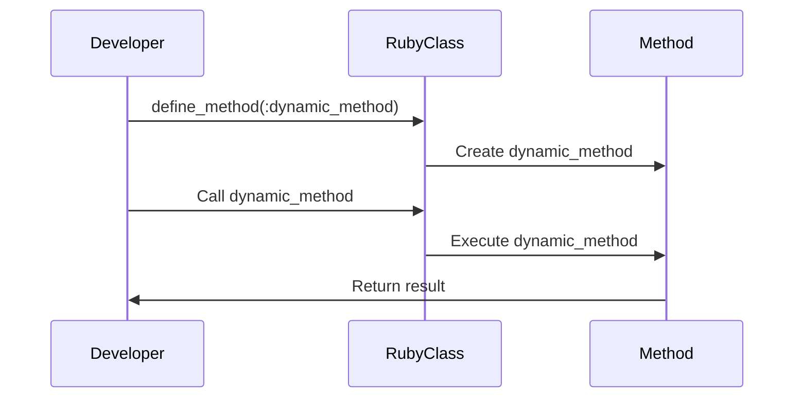

## 8.1 Introduction to Metaprogramming

Metaprogramming is a fascinating and powerful programming technique that allows code to write code. This capability enables dynamic alterations to a program's structure and behavior at runtime, offering a level of flexibility and dynamism that can be incredibly useful in certain contexts. In this section, we will explore the concept of metaprogramming, why Ruby is particularly well-suited for it, and how you can leverage it effectively in your applications.

### What is Metaprogramming?

Metaprogramming refers to the practice of writing code that can generate, modify, or inspect other code. This can be done at compile-time or runtime, but in Ruby, it is predominantly a runtime activity. Metaprogramming allows developers to create more flexible and reusable code by enabling programs to adapt their behavior dynamically.

#### Key Capabilities of Metaprogramming

- **Dynamic Code Generation**: Create new methods or classes on the fly.
- **Code Introspection**: Examine the properties of objects, classes, and methods.
- **Code Modification**: Alter existing code structures during execution.

### Why Ruby Excels at Metaprogramming

Ruby is renowned for its metaprogramming capabilities, thanks to its dynamic nature and flexible syntax. Here are some reasons why Ruby is particularly well-suited for metaprogramming:

- **Open Classes**: Ruby allows classes to be reopened and modified, making it easy to add or change methods dynamically.
- **Reflection and Introspection**: Ruby provides powerful reflection capabilities, allowing you to inspect objects, classes, and methods at runtime.
- **Dynamic Method Handling**: With features like `method_missing`, Ruby can handle calls to undefined methods, providing a hook for dynamic behavior.
- **Blocks and Procs**: These first-class functions enable dynamic code execution and manipulation.

### Simple Examples of Metaprogramming Constructs

Let's dive into some basic examples to illustrate how metaprogramming works in Ruby.

#### Example 1: Dynamic Method Definition

```ruby
class DynamicGreeter
  def self.create_greeting_method(name)
    define_method("greet_#{name}") do
      "Hello, #{name.capitalize}!"
    end
  end
end

DynamicGreeter.create_greeting_method("alice")
greeter = DynamicGreeter.new
puts greeter.greet_alice  # Output: Hello, Alice!
```

In this example, we use `define_method` to dynamically create a method `greet_alice` on the `DynamicGreeter` class. This method is not defined until `create_greeting_method` is called.

#### Example 2: Using `method_missing`

```ruby
class GhostMethod
  def method_missing(method_name, *args, &block)
    puts "You tried to call #{method_name} with arguments #{args.join(', ')}"
  end
end

ghost = GhostMethod.new
ghost.any_method_you_like(1, 2, 3)  # Output: You tried to call any_method_you_like with arguments 1, 2, 3
```

Here, `method_missing` is used to catch calls to undefined methods, allowing us to handle them dynamically.

### Use Cases for Metaprogramming

Metaprogramming can be incredibly advantageous in various scenarios:

- **DSLs (Domain-Specific Languages)**: Ruby's metaprogramming capabilities make it ideal for creating internal DSLs, such as RSpec for testing.
- **ActiveRecord in Rails**: Metaprogramming is heavily used in Rails' ActiveRecord to dynamically define methods based on database schema.
- **Code Generation**: Automate repetitive code patterns, reducing boilerplate and improving maintainability.

### Potential Risks and Judicious Use

While metaprogramming is powerful, it comes with potential risks:

- **Complexity**: Code can become difficult to understand and maintain if overused.
- **Performance**: Dynamic code generation can introduce runtime overhead.
- **Debugging Challenges**: Errors in metaprogrammed code can be harder to trace.

It's crucial to use metaprogramming judiciously, ensuring that its benefits outweigh the potential downsides. Always strive for clarity and maintainability in your codebase.

### Visualizing Metaprogramming Concepts

To better understand how metaprogramming fits into Ruby's architecture, let's visualize the process of dynamic method creation and invocation using a sequence diagram.



**Diagram Description**: This sequence diagram illustrates the process of defining and invoking a dynamic method in Ruby. The developer defines a method using `define_method`, which is then created and stored in the class. When the method is called, it is executed, and the result is returned to the developer.

### Try It Yourself

Experiment with the examples provided by modifying the method names or adding new dynamic behaviors. For instance, try creating a dynamic method that takes parameters and returns a customized message. This hands-on practice will deepen your understanding of metaprogramming in Ruby.

### Summary

Metaprogramming in Ruby is a powerful tool that, when used wisely, can lead to more flexible and maintainable code. By understanding its capabilities and potential pitfalls, you can harness its power to create dynamic, adaptable applications. Remember, the key is to balance flexibility with clarity and maintainability.

## Quiz: Introduction to Metaprogramming



### What is metaprogramming?

- [x] A technique where code writes code
- [ ] A method of optimizing code performance
- [ ] A way to compile code faster
- [ ] A technique for debugging code

> **Explanation:** Metaprogramming involves writing code that can generate or modify other code.

### Why is Ruby well-suited for metaprogramming?

- [x] It allows open classes and dynamic method handling
- [ ] It is a compiled language
- [ ] It has a static type system
- [ ] It does not support reflection

> **Explanation:** Ruby's open classes and dynamic method handling make it ideal for metaprogramming.

### Which method is used to define methods dynamically in Ruby?

- [x] `define_method`
- [ ] `create_method`
- [ ] `add_method`
- [ ] `new_method`

> **Explanation:** `define_method` is used to define methods dynamically in Ruby.

### What is the purpose of `method_missing`?

- [x] To handle calls to undefined methods
- [ ] To optimize method execution
- [ ] To compile methods at runtime
- [ ] To debug method calls

> **Explanation:** `method_missing` is used to catch and handle calls to undefined methods.

### What is a potential risk of metaprogramming?

- [x] Increased code complexity
- [ ] Improved code readability
- [ ] Faster code execution
- [ ] Easier debugging

> **Explanation:** Metaprogramming can increase code complexity, making it harder to maintain.

### Which Ruby feature allows inspection of objects and methods at runtime?

- [x] Reflection
- [ ] Compilation
- [ ] Static typing
- [ ] Debugging

> **Explanation:** Reflection allows inspection of objects and methods at runtime in Ruby.

### What is a common use case for metaprogramming in Ruby?

- [x] Creating DSLs
- [ ] Writing low-level system code
- [ ] Compiling C extensions
- [ ] Debugging applications

> **Explanation:** Metaprogramming is commonly used to create DSLs in Ruby.

### How can metaprogramming affect performance?

- [x] It can introduce runtime overhead
- [ ] It always improves performance
- [ ] It has no impact on performance
- [ ] It compiles code faster

> **Explanation:** Metaprogramming can introduce runtime overhead, affecting performance.

### What should be prioritized when using metaprogramming?

- [x] Clarity and maintainability
- [ ] Code obfuscation
- [ ] Maximum flexibility
- [ ] Minimal documentation

> **Explanation:** Clarity and maintainability should be prioritized when using metaprogramming.

### True or False: Metaprogramming can only be done at compile-time.

- [ ] True
- [x] False

> **Explanation:** In Ruby, metaprogramming is predominantly a runtime activity.



Remember, this is just the beginning. As you progress, you'll build more complex and interactive applications using metaprogramming. Keep experimenting, stay curious, and enjoy the journey!
