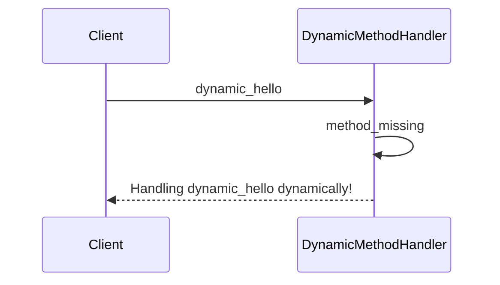

## 8.10 Metaprogramming Best Practices and Pitfalls

Metaprogramming in Ruby is a powerful tool that allows developers to write code that writes code. This can lead to highly flexible and dynamic applications. However, with great power comes great responsibility. If not used judiciously, metaprogramming can result in code that is difficult to understand, maintain, and debug. In this section, we will explore best practices for using metaprogramming effectively, highlight common pitfalls, and provide guidelines on when to use metaprogramming and when to avoid it.

### Understanding Metaprogramming

Before diving into best practices, let's briefly revisit what metaprogramming is. Metaprogramming refers to the practice of writing code that can manipulate or generate other code at runtime. In Ruby, this is often achieved through dynamic method definitions, `method_missing`, and other reflective capabilities.

### Best Practices for Metaprogramming

#### 1. **Use Metaprogramming Sparingly**

Metaprogramming should be used only when necessary. It's tempting to use it to solve every problem, but often a simpler, more straightforward solution exists. Always ask yourself if metaprogramming is the best tool for the job.

#### 2. **Maintain Code Readability**

Readable code is maintainable code. When using metaprogramming, ensure that your code remains understandable. Use clear naming conventions and document your code thoroughly. Comments should explain why metaprogramming is used and what it achieves.

#### 3. **Limit the Scope of Metaprogramming**

Avoid applying metaprogramming techniques globally. Instead, limit their scope to specific classes or modules. This minimizes the risk of unintended side effects and makes the code easier to debug.

#### 4. **Test Metaprogrammed Code Thoroughly**

Metaprogrammed code can be tricky to test due to its dynamic nature. Write comprehensive tests to cover all possible scenarios. Use test doubles and mocks to simulate dynamic behavior and ensure your code behaves as expected.

#### 5. **Encapsulate Metaprogramming Logic**

Encapsulate metaprogramming logic within well-defined methods or modules. This helps isolate the complexity and makes the code easier to understand and maintain.

#### 6. **Use `method_missing` Wisely**

The `method_missing` method is a powerful tool in Ruby's metaprogramming arsenal. However, it can lead to hard-to-debug code if overused. Always provide a `respond_to_missing?` method to ensure that your objects behave predictably.

```ruby
class DynamicMethodHandler
  def method_missing(method_name, *args, &block)
    if method_name.to_s.start_with?('dynamic_')
      puts "Handling #{method_name} dynamically!"
    else
      super
    end
  end

  def respond_to_missing?(method_name, include_private = false)
    method_name.to_s.start_with?('dynamic_') || super
  end
end

handler = DynamicMethodHandler.new
handler.dynamic_hello # Outputs: Handling dynamic_hello dynamically!
```

### Common Pitfalls of Metaprogramming

#### 1. **Breaking Encapsulation**

Metaprogramming can easily break encapsulation by exposing internal details of a class. This can lead to fragile code that is difficult to maintain. Always respect the boundaries of encapsulation and avoid exposing internal state unnecessarily.

#### 2. **Creating Hard-to-Debug Code**

Dynamic code can be challenging to debug because it may not be clear where a method is defined or how it is being called. Use logging and debugging tools to trace the execution flow and identify issues.

#### 3. **Performance Overhead**

Metaprogramming can introduce performance overhead due to the dynamic nature of the code. Be mindful of the performance implications and optimize where necessary.

#### 4. **Complexity and Maintainability**

Metaprogramming can make code more complex and harder to maintain. Always weigh the benefits against the potential increase in complexity and consider alternative solutions.

### Strategies to Minimize Negative Impacts

#### 1. **Use Metaprogramming Libraries**

Leverage existing metaprogramming libraries and frameworks that have been tested and optimized. These libraries often provide a more robust and maintainable solution than custom implementations.

#### 2. **Refactor Regularly**

Regularly refactor metaprogrammed code to improve readability and maintainability. This helps keep the codebase clean and reduces technical debt.

#### 3. **Document Metaprogramming Usage**

Document the use of metaprogramming in your codebase. This helps other developers understand the rationale behind its use and how it works.

#### 4. **Limit Dynamic Behavior**

Limit the use of dynamic behavior to specific areas of the application. This reduces the risk of unintended side effects and makes the code easier to understand.

### Guidelines on When to Use Metaprogramming

- **Use Metaprogramming When:**
  - You need to define methods dynamically based on runtime data.
  - You are building a domain-specific language (DSL) or a framework.
  - You need to reduce boilerplate code and improve code reuse.

- **Avoid Metaprogramming When:**
  - A simpler, more straightforward solution exists.
  - It significantly increases the complexity of the code.
  - It makes the code harder to understand and maintain.

### Encouraging Code Readability and Maintainability

- **Use Descriptive Names:** Choose clear and descriptive names for methods and variables.
- **Write Comprehensive Tests:** Ensure that all metaprogrammed code is thoroughly tested.
- **Document Thoroughly:** Provide detailed documentation and comments to explain the use of metaprogramming.
- **Review Code Regularly:** Conduct regular code reviews to identify and address potential issues.

### Visualizing Metaprogramming Concepts

To better understand the flow and impact of metaprogramming, let's visualize the process using a sequence diagram. This diagram illustrates how a dynamic method call is handled in Ruby.



### Try It Yourself

Experiment with the provided code examples by modifying the method names or adding new dynamic methods. Observe how the behavior changes and consider the implications of these changes on code readability and maintainability.

### References and Further Reading

- [Ruby Metaprogramming: A Primer](https://www.rubyguides.com/2018/11/ruby-metaprogramming/)
- [Metaprogramming Ruby 2: Program Like the Ruby Pros](https://pragprog.com/titles/ppmetr2/metaprogramming-ruby-2/)
- [Ruby Documentation on `method_missing`](https://ruby-doc.org/core-2.7.0/BasicObject.html#method-i-method_missing)

### Knowledge Check

- What are the key benefits of using metaprogramming in Ruby?
- How can you ensure that metaprogrammed code remains maintainable?
- What are the common pitfalls associated with metaprogramming?
- When should you avoid using metaprogramming?

### Embrace the Journey

Remember, metaprogramming is a powerful tool in your Ruby toolkit. Use it wisely and judiciously to create flexible and dynamic applications. Keep experimenting, stay curious, and enjoy the journey of mastering Ruby metaprogramming!

## Quiz: Metaprogramming Best Practices and Pitfalls



### What is a key benefit of using metaprogramming in Ruby?

- [x] It allows for dynamic method definitions.
- [ ] It simplifies all code.
- [ ] It eliminates the need for testing.
- [ ] It automatically optimizes performance.

> **Explanation:** Metaprogramming allows for dynamic method definitions, enabling more flexible and adaptable code.

### Which of the following is a common pitfall of metaprogramming?

- [x] Breaking encapsulation
- [ ] Improved readability
- [ ] Enhanced performance
- [ ] Simplified debugging

> **Explanation:** Metaprogramming can break encapsulation, making code more fragile and harder to maintain.

### How can you minimize the negative impacts of metaprogramming?

- [x] Limit the scope of metaprogramming
- [ ] Use metaprogramming globally
- [ ] Avoid testing metaprogrammed code
- [ ] Ignore code readability

> **Explanation:** Limiting the scope of metaprogramming helps reduce unintended side effects and improves maintainability.

### When should you avoid using metaprogramming?

- [x] When it significantly increases code complexity
- [ ] When you need dynamic method definitions
- [ ] When building a DSL
- [ ] When reducing boilerplate code

> **Explanation:** Avoid metaprogramming when it significantly increases code complexity, as it can make the code harder to understand and maintain.

### What is a best practice for using `method_missing`?

- [x] Provide a `respond_to_missing?` method
- [ ] Use it for all method calls
- [ ] Avoid using it altogether
- [ ] Ignore method visibility

> **Explanation:** Providing a `respond_to_missing?` method ensures that objects behave predictably when using `method_missing`.

### How can you ensure metaprogrammed code is maintainable?

- [x] Write comprehensive tests
- [ ] Avoid documenting the code
- [ ] Use metaprogramming everywhere
- [ ] Ignore code reviews

> **Explanation:** Writing comprehensive tests ensures that metaprogrammed code behaves as expected and remains maintainable.

### What should you do to maintain code readability when using metaprogramming?

- [x] Use clear naming conventions
- [ ] Avoid comments
- [ ] Use complex method names
- [ ] Ignore code structure

> **Explanation:** Using clear naming conventions helps maintain code readability, making it easier for others to understand.

### What is a strategy to minimize the negative impacts of metaprogramming?

- [x] Refactor regularly
- [ ] Avoid using libraries
- [ ] Use metaprogramming for all problems
- [ ] Ignore performance considerations

> **Explanation:** Regularly refactoring metaprogrammed code helps improve readability and maintainability.

### How can you document metaprogramming usage effectively?

- [x] Provide detailed comments and documentation
- [ ] Avoid explaining the rationale
- [ ] Use cryptic comments
- [ ] Ignore documentation

> **Explanation:** Providing detailed comments and documentation helps others understand the rationale behind metaprogramming usage.

### True or False: Metaprogramming should be used for every problem in Ruby.

- [ ] True
- [x] False

> **Explanation:** Metaprogramming should be used sparingly and only when it is the best tool for the job, as it can increase complexity and reduce maintainability.


