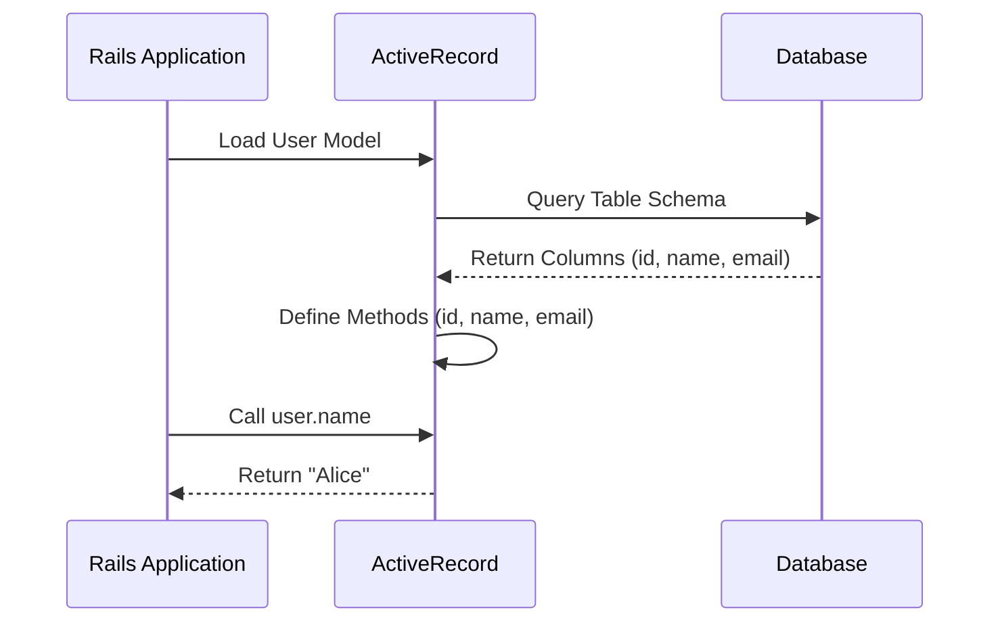

## 8.11 Case Study: Metaprogramming in Rails ActiveRecord

ActiveRecord, the Object-Relational Mapping (ORM) layer in Ruby on Rails, is a quintessential example of how metaprogramming can be harnessed to create a powerful and flexible API for database interactions. In this case study, we will delve into the metaprogramming techniques employed by ActiveRecord, explore dynamic finder methods and attribute accessors, and discuss the benefits and trade-offs of this approach. We'll also extract valuable lessons that can be applied to other metaprogramming endeavors.

### Understanding Metaprogramming in ActiveRecord

Metaprogramming in Ruby allows developers to write code that writes code, enabling dynamic method creation and modification at runtime. ActiveRecord leverages this capability to define methods based on the database schema, providing a seamless interface for interacting with database records.

#### Dynamic Method Definition

One of the most powerful aspects of ActiveRecord is its ability to define methods dynamically based on the columns in a database table. When a model is loaded, ActiveRecord reads the table schema and creates attribute accessors for each column. This means you can interact with database fields as if they were native Ruby object attributes.

```ruby
# Assuming a `users` table with columns `id`, `name`, and `email`
class User < ApplicationRecord
end

# ActiveRecord dynamically creates attribute accessors
user = User.new
user.name = "Alice"
user.email = "alice@example.com"
```

In the example above, `name` and `email` are not explicitly defined in the `User` class. Instead, ActiveRecord uses metaprogramming to create these methods on the fly.

#### Dynamic Finder Methods

ActiveRecord also provides dynamic finder methods, which allow developers to query the database using intuitive method names. These methods are constructed using the column names and common query operations.

```ruby
# Find a user by email
user = User.find_by_email("alice@example.com")

# Find all users with a specific name
users = User.where(name: "Alice")
```

The `find_by_email` method does not exist in the codebase; it is generated dynamically by ActiveRecord. This approach significantly reduces boilerplate code and enhances readability.

### Benefits of Metaprogramming in ActiveRecord

The use of metaprogramming in ActiveRecord offers several benefits:

1. **Increased Productivity**: Developers can focus on business logic rather than writing repetitive code for database interactions.
2. **Cleaner Codebase**: Dynamic methods reduce the need for explicit method definitions, leading to a more concise and maintainable codebase.
3. **Flexibility**: Changes to the database schema are automatically reflected in the model, minimizing the need for manual updates.

### Trade-offs and Challenges

While metaprogramming provides significant advantages, it also introduces certain challenges:

1. **Debugging Complexity**: Dynamically generated methods can be harder to trace and debug, as they are not explicitly defined in the code.
2. **Performance Overhead**: The dynamic nature of method creation can introduce performance overhead, especially in large applications with complex schemas.
3. **Potential for Confusion**: Developers unfamiliar with metaprogramming may find the implicit nature of method definitions confusing.

### Lessons for Other Metaprogramming Endeavors

ActiveRecord's use of metaprogramming offers valuable lessons for other projects:

1. **Balance Flexibility and Clarity**: While dynamic methods enhance flexibility, it's crucial to maintain clarity in the codebase. Clear documentation and naming conventions can help mitigate confusion.
2. **Optimize for Performance**: Consider the performance implications of dynamic method creation and explore caching or other optimization techniques where necessary.
3. **Educate Developers**: Ensure that team members understand the metaprogramming techniques used in the project to facilitate effective collaboration and debugging.

### Code Example: Creating Dynamic Methods

Let's explore a simplified example of how ActiveRecord might dynamically define attribute accessors:

```ruby
class DynamicModel
  def initialize(attributes = {})
    @attributes = attributes
  end

  def method_missing(method_name, *args, &block)
    attribute = method_name.to_s

    if @attributes.key?(attribute)
      @attributes[attribute]
    elsif attribute.end_with?('=')
      @attributes[attribute.chop] = args.first
    else
      super
    end
  end

  def respond_to_missing?(method_name, include_private = false)
    @attributes.key?(method_name.to_s) || super
  end
end

# Usage
user = DynamicModel.new("name" => "Alice", "email" => "alice@example.com")
puts user.name  # Output: Alice
user.email = "new_email@example.com"
puts user.email # Output: new_email@example.com
```

In this example, `method_missing` is used to intercept calls to undefined methods and dynamically handle attribute access and assignment.

### Visualizing Dynamic Method Creation

To better understand how ActiveRecord uses metaprogramming, let's visualize the process of dynamic method creation:



This sequence diagram illustrates how ActiveRecord queries the database schema and defines methods dynamically based on the columns.

### Try It Yourself

To deepen your understanding, try modifying the `DynamicModel` example to add support for additional data types or validation logic. Experiment with different approaches to method interception and dynamic method creation.

### Conclusion

Metaprogramming in Rails ActiveRecord exemplifies the power and flexibility of Ruby's dynamic capabilities. By understanding the techniques used in ActiveRecord, developers can harness metaprogramming to create more efficient and maintainable applications. Remember, while metaprogramming offers significant benefits, it's essential to balance flexibility with clarity and performance considerations.

## Quiz: Case Study: Metaprogramming in Rails ActiveRecord



### What is the primary benefit of using metaprogramming in ActiveRecord?

- [x] Increased developer productivity
- [ ] Improved database performance
- [ ] Enhanced security features
- [ ] Simplified deployment process

> **Explanation:** Metaprogramming in ActiveRecord increases developer productivity by reducing the need for repetitive code and allowing dynamic method creation based on the database schema.

### How does ActiveRecord define methods for database columns?

- [x] Dynamically based on the table schema
- [ ] Statically in the model class
- [ ] Through configuration files
- [ ] Using external libraries

> **Explanation:** ActiveRecord dynamically defines methods for database columns by reading the table schema and creating attribute accessors at runtime.

### What is a potential drawback of metaprogramming in ActiveRecord?

- [x] Debugging complexity
- [ ] Lack of flexibility
- [ ] Increased code verbosity
- [ ] Reduced developer productivity

> **Explanation:** One potential drawback of metaprogramming in ActiveRecord is the increased complexity in debugging, as dynamically generated methods are not explicitly defined in the code.

### Which method does ActiveRecord use to handle undefined method calls?

- [x] `method_missing`
- [ ] `respond_to`
- [ ] `define_method`
- [ ] `alias_method`

> **Explanation:** ActiveRecord uses the `method_missing` method to handle undefined method calls and dynamically create methods based on the database schema.

### What is a key lesson from ActiveRecord's use of metaprogramming?

- [x] Balance flexibility and clarity
- [ ] Avoid using dynamic methods
- [ ] Prioritize performance over readability
- [ ] Use metaprogramming sparingly

> **Explanation:** A key lesson from ActiveRecord's use of metaprogramming is to balance flexibility and clarity, ensuring that the codebase remains understandable and maintainable.

### How can developers mitigate confusion when using metaprogramming?

- [x] Provide clear documentation
- [ ] Avoid using metaprogramming
- [ ] Use only static methods
- [ ] Limit the number of developers on the project

> **Explanation:** Developers can mitigate confusion by providing clear documentation and naming conventions to help team members understand the metaprogramming techniques used in the project.

### What is a common use of dynamic finder methods in ActiveRecord?

- [x] Querying the database using intuitive method names
- [ ] Defining static methods for database interactions
- [ ] Configuring database connections
- [ ] Managing database migrations

> **Explanation:** Dynamic finder methods in ActiveRecord are commonly used to query the database using intuitive method names, reducing boilerplate code and enhancing readability.

### What role does `respond_to_missing?` play in dynamic method creation?

- [x] It helps determine if a method should be dynamically created
- [ ] It defines static methods
- [ ] It handles database connections
- [ ] It manages database migrations

> **Explanation:** The `respond_to_missing?` method helps determine if a method should be dynamically created by checking if the method name corresponds to a known attribute.

### Which of the following is a benefit of using metaprogramming in ActiveRecord?

- [x] Cleaner codebase
- [ ] Increased code verbosity
- [ ] Reduced flexibility
- [ ] Improved database performance

> **Explanation:** One benefit of using metaprogramming in ActiveRecord is a cleaner codebase, as dynamic methods reduce the need for explicit method definitions.

### True or False: Metaprogramming in ActiveRecord can introduce performance overhead.

- [x] True
- [ ] False

> **Explanation:** True. The dynamic nature of method creation in ActiveRecord can introduce performance overhead, especially in large applications with complex schemas.



Remember, this is just the beginning. As you progress, you'll build more complex and interactive applications. Keep experimenting, stay curious, and enjoy the journey!
