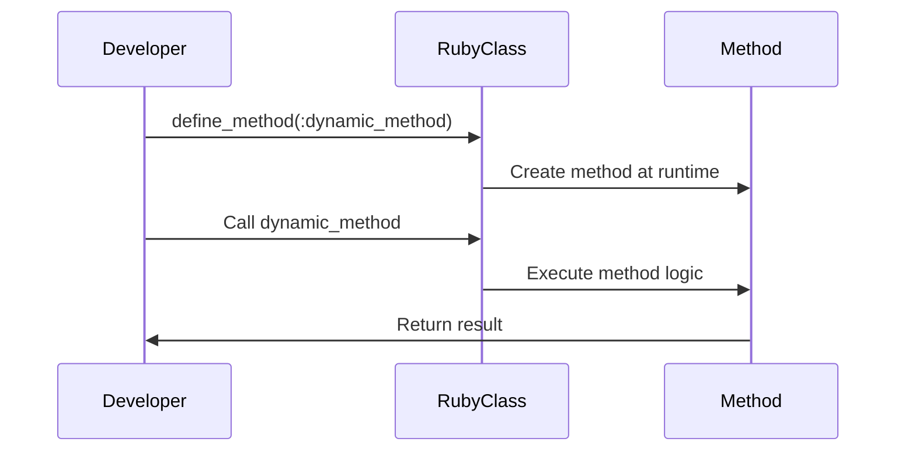

## 8.2 Dynamic Method Definition

Dynamic method definition in Ruby is a powerful metaprogramming technique that allows developers to define and alter methods at runtime. This capability can lead to more flexible and DRY (Don't Repeat Yourself) code, enabling the creation of scalable and maintainable applications. In this section, we will explore how to define methods dynamically using Ruby's `define_method`, `method_missing`, and `class_eval`. We will also discuss practical scenarios where dynamic method creation is beneficial, along with considerations for scope, binding, and security. Finally, we will cover best practices to avoid common pitfalls.

### Understanding Dynamic Method Definition

Dynamic method definition refers to the ability to create methods during the execution of a program, rather than at compile time. This is particularly useful in Ruby due to its dynamic nature and flexible object model. By leveraging dynamic method definition, developers can write code that adapts to changing requirements and reduces redundancy.

#### Key Concepts

- **Metaprogramming**: Writing code that writes or manipulates other code.
- **Dynamic Typing**: Ruby's ability to handle types at runtime, which complements dynamic method definition.
- **Reflection**: The ability to inspect and modify the program structure at runtime.

### Techniques for Dynamic Method Definition

Ruby provides several techniques for defining methods dynamically. Let's explore the most common ones:

#### Using `define_method`

The `define_method` is a Ruby method that allows you to define a method for a class or module at runtime. It is part of Ruby's `Module` class and is often used in metaprogramming.

```ruby
class DynamicGreeter
  define_method(:greet) do |name|
    "Hello, #{name}!"
  end
end

greeter = DynamicGreeter.new
puts greeter.greet("Alice") # Output: Hello, Alice!
```

**Explanation**: In this example, `define_method` is used to create a `greet` method that takes a `name` parameter and returns a greeting string. This method is defined at runtime, allowing for flexible method creation.

#### Using `method_missing`

The `method_missing` method is a powerful tool in Ruby that allows you to intercept calls to methods that do not exist. It can be used to dynamically handle undefined methods.

```ruby
class DynamicResponder
  def method_missing(method_name, *args)
    if method_name.to_s.start_with?('say_')
      "You called #{method_name} with #{args.join(', ')}"
    else
      super
    end
  end
end

responder = DynamicResponder.new
puts responder.say_hello("world") # Output: You called say_hello with world
```

**Explanation**: Here, `method_missing` is used to catch calls to methods that start with `say_`. This allows for dynamic method handling based on method names.

#### Using `class_eval`

The `class_eval` method allows you to evaluate a string or block of code in the context of a class. This can be used to define methods dynamically.

```ruby
class DynamicCalculator
  class_eval do
    def add(a, b)
      a + b
    end
  end
end

calculator = DynamicCalculator.new
puts calculator.add(2, 3) # Output: 5
```

**Explanation**: In this example, `class_eval` is used to define an `add` method within the `DynamicCalculator` class. This method is evaluated and added to the class at runtime.

### Practical Scenarios for Dynamic Method Creation

Dynamic method creation is particularly useful in scenarios where:

- **Reducing Redundancy**: When you have multiple methods that perform similar operations, dynamic method definition can help reduce code duplication.
- **Handling Dynamic Data**: When dealing with data structures that change at runtime, dynamic methods can adapt to these changes.
- **Creating Domain-Specific Languages (DSLs)**: Dynamic methods can be used to create intuitive and flexible DSLs within Ruby applications.

### Considerations for Scope, Binding, and Security

While dynamic method definition offers flexibility, it also comes with considerations that developers must be aware of:

#### Scope and Binding

- **Scope**: Ensure that dynamically defined methods have access to the necessary variables and context.
- **Binding**: Be cautious of the binding context when using `class_eval` or `instance_eval`, as it can affect variable access and method visibility.

#### Security

- **Code Injection**: Be wary of evaluating user input directly, as it can lead to code injection vulnerabilities.
- **Access Control**: Ensure that dynamically defined methods do not inadvertently expose private or sensitive data.

### Best Practices for Dynamic Method Definition

To effectively use dynamic method definition in Ruby, consider the following best practices:

- **Use with Purpose**: Only use dynamic method definition when it adds clear value, such as reducing redundancy or enhancing flexibility.
- **Maintain Readability**: Ensure that dynamically defined methods are well-documented and easy to understand.
- **Test Thoroughly**: Dynamic methods can introduce complexity, so thorough testing is essential to ensure correctness.
- **Limit Scope**: Restrict the use of dynamic methods to specific areas of the codebase to avoid widespread complexity.

### Try It Yourself: Experimenting with Dynamic Methods

To deepen your understanding of dynamic method definition, try modifying the code examples provided:

- **Experiment with `define_method`**: Create a class that dynamically defines multiple methods based on an array of method names.
- **Enhance `method_missing`**: Modify the `method_missing` example to handle a wider range of method patterns.
- **Explore `class_eval`**: Use `class_eval` to dynamically add methods to an existing class and observe how it affects instances of that class.

### Visualizing Dynamic Method Definition

To better understand the flow of dynamic method definition, consider the following sequence diagram illustrating the process of defining and invoking a dynamic method:



**Description**: This diagram shows how a developer uses `define_method` to create a method at runtime, which is then invoked and executed within the class.

### References and Further Reading

For more information on dynamic method definition and metaprogramming in Ruby, consider the following resources:

- [Ruby Metaprogramming: A Primer](https://www.ruby-lang.org/en/documentation/)
- [Metaprogramming Ruby 2: Program Like the Ruby Pros](https://pragprog.com/titles/ppmetr2/metaprogramming-ruby-2/)
- [Ruby's `define_method` Documentation](https://ruby-doc.org/core-3.0.0/Module.html#method-i-define_method)

### Knowledge Check

Before moving on, consider the following questions to test your understanding of dynamic method definition:

1. What is the primary purpose of using `define_method` in Ruby?
2. How does `method_missing` enhance dynamic method handling?
3. What are the security considerations when using `class_eval`?
4. How can dynamic method definition contribute to creating DSLs?
5. What are the best practices for maintaining readability in dynamically defined methods?

### Embrace the Journey

Remember, mastering dynamic method definition is just one step in your journey to becoming a proficient Ruby developer. As you continue to explore Ruby's metaprogramming capabilities, you'll unlock new possibilities for creating flexible and maintainable applications. Keep experimenting, stay curious, and enjoy the journey!

## Quiz: Dynamic Method Definition



### What is the primary purpose of using `define_method` in Ruby?

- [x] To define methods dynamically at runtime
- [ ] To handle exceptions in Ruby
- [ ] To create static methods
- [ ] To optimize performance

> **Explanation:** `define_method` is used to define methods dynamically at runtime, allowing for flexible method creation.

### How does `method_missing` enhance dynamic method handling?

- [x] By intercepting calls to undefined methods
- [ ] By optimizing method execution
- [ ] By defining static methods
- [ ] By handling exceptions

> **Explanation:** `method_missing` intercepts calls to methods that do not exist, allowing for dynamic handling of undefined methods.

### What are the security considerations when using `class_eval`?

- [x] Code injection vulnerabilities
- [ ] Performance optimization
- [ ] Static method creation
- [ ] Exception handling

> **Explanation:** `class_eval` can lead to code injection vulnerabilities if user input is evaluated directly.

### How can dynamic method definition contribute to creating DSLs?

- [x] By allowing intuitive and flexible method creation
- [ ] By optimizing performance
- [ ] By handling exceptions
- [ ] By defining static methods

> **Explanation:** Dynamic method definition allows for intuitive and flexible method creation, which is beneficial for creating DSLs.

### What are the best practices for maintaining readability in dynamically defined methods?

- [x] Ensure methods are well-documented
- [ ] Use complex logic
- [ ] Avoid testing
- [ ] Use only in large codebases

> **Explanation:** Ensuring that dynamically defined methods are well-documented helps maintain readability.

### Which method allows you to define a method for a class or module at runtime?

- [x] define_method
- [ ] method_missing
- [ ] class_eval
- [ ] instance_eval

> **Explanation:** `define_method` allows you to define a method for a class or module at runtime.

### What is a potential pitfall of using `method_missing`?

- [x] It can lead to unexpected behavior if not handled properly
- [ ] It optimizes performance
- [ ] It creates static methods
- [ ] It handles exceptions

> **Explanation:** If not handled properly, `method_missing` can lead to unexpected behavior and complexity.

### What is the role of `class_eval` in dynamic method definition?

- [x] To evaluate code in the context of a class
- [ ] To handle exceptions
- [ ] To optimize performance
- [ ] To create static methods

> **Explanation:** `class_eval` evaluates code in the context of a class, allowing for dynamic method definition.

### How does dynamic method definition help in reducing redundancy?

- [x] By allowing similar methods to be defined dynamically
- [ ] By optimizing performance
- [ ] By handling exceptions
- [ ] By creating static methods

> **Explanation:** Dynamic method definition allows similar methods to be defined dynamically, reducing redundancy.

### True or False: Dynamic method definition is only useful for creating DSLs.

- [ ] True
- [x] False

> **Explanation:** Dynamic method definition is useful for various purposes, including reducing redundancy and handling dynamic data, not just for creating DSLs.




