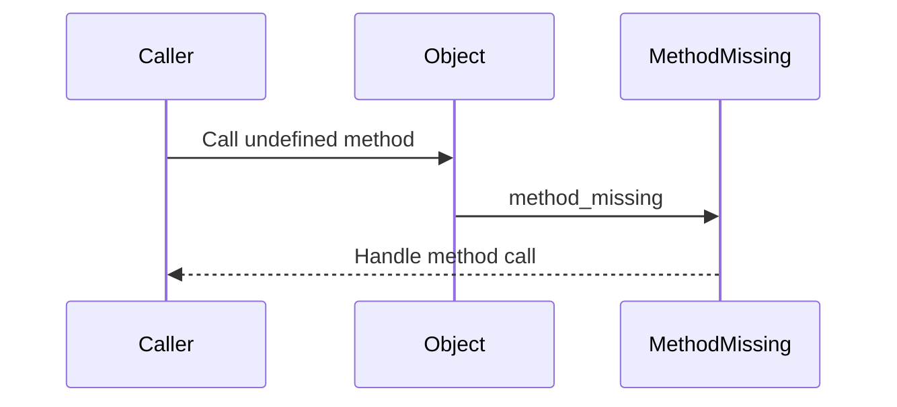

## 8.3 `method_missing` and Dynamic Dispatch

In the world of Ruby, metaprogramming is a powerful tool that allows developers to write flexible and dynamic code. One of the key features that enable this flexibility is the `method_missing` hook. This hook allows Ruby objects to intercept calls to undefined methods, providing a mechanism to handle these calls dynamically or delegate them elsewhere. In this section, we will explore how `method_missing` works, how to implement it, and best practices for using it effectively.

### Understanding `method_missing`

The `method_missing` method is a special hook in Ruby that is called whenever an object receives a message (method call) it does not know how to handle. By overriding this method, you can define custom behavior for handling undefined method calls.

#### How `method_missing` Works

When you call a method on an object, Ruby follows a method lookup path to find the method definition. If Ruby cannot find the method, it calls `method_missing` on the object, passing the method name and any arguments.

Here's a simple example to illustrate this:

```ruby
class DynamicResponder
  def method_missing(method_name, *args, &block)
    puts "You tried to call: #{method_name} with arguments: #{args.inspect}"
  end
end

responder = DynamicResponder.new
responder.unknown_method('arg1', 'arg2')
```

**Output:**

```
You tried to call: unknown_method with arguments: ["arg1", "arg2"]
```

In this example, the `unknown_method` is not defined in the `DynamicResponder` class, so Ruby calls `method_missing`, which prints the method name and arguments.

### Implementing `method_missing` for Dynamic Methods

`method_missing` can be used to create dynamic methods that respond to a variety of method calls. This is particularly useful in scenarios where you want to create proxy objects or delegators.

#### Creating Proxy Objects

A proxy object acts as an intermediary for another object. You can use `method_missing` to forward method calls to the target object dynamically.

```ruby
class Proxy
  def initialize(target)
    @target = target
  end

  def method_missing(method_name, *args, &block)
    if @target.respond_to?(method_name)
      @target.public_send(method_name, *args, &block)
    else
      super
    end
  end

  def respond_to_missing?(method_name, include_private = false)
    @target.respond_to?(method_name, include_private) || super
  end
end

class Target
  def greet(name)
    "Hello, #{name}!"
  end
end

target = Target.new
proxy = Proxy.new(target)
puts proxy.greet("World")  # Outputs: Hello, World!
```

In this example, the `Proxy` class forwards method calls to the `Target` object if it responds to the method. Otherwise, it calls `super`, which raises a `NoMethodError`.

#### Delegating Method Calls

You can also use `method_missing` to delegate method calls to another object, allowing for flexible and dynamic behavior.

```ruby
class Delegator
  def initialize(target)
    @target = target
  end

  def method_missing(method_name, *args, &block)
    @target.send(method_name, *args, &block)
  end

  def respond_to_missing?(method_name, include_private = false)
    @target.respond_to?(method_name, include_private)
  end
end

class Worker
  def perform(task)
    "Performing #{task}"
  end
end

worker = Worker.new
delegator = Delegator.new(worker)
puts delegator.perform("task")  # Outputs: Performing task
```

### Performance Implications

While `method_missing` is a powerful tool, it comes with performance considerations. Each call to `method_missing` incurs a performance penalty because Ruby has to go through the method lookup process before calling it. Therefore, it's important to use `method_missing` judiciously and only when necessary.

#### Importance of `respond_to_missing?`

When you override `method_missing`, it's crucial to also define `respond_to_missing?`. This method should return `true` if the object can respond to the given method name, even if it's handled by `method_missing`.

This is important for several reasons:

- **Introspection**: Tools like `Object#respond_to?` rely on `respond_to_missing?` to determine if an object can handle a method call.
- **Duck Typing**: Ruby's dynamic typing relies on objects responding to methods. Properly implementing `respond_to_missing?` ensures that your objects behave correctly in a dynamic environment.

### Best Practices for `method_missing`

To prevent unexpected behavior and maintain code quality, follow these best practices when using `method_missing`:

1. **Use Sparingly**: Only use `method_missing` when necessary. If you can define methods explicitly, do so.
2. **Define `respond_to_missing?`**: Always implement `respond_to_missing?` alongside `method_missing`.
3. **Call `super`**: If you cannot handle a method call, call `super` to allow Ruby to raise a `NoMethodError`.
4. **Document Behavior**: Clearly document the behavior of `method_missing` in your code to aid understanding and maintenance.
5. **Avoid Complex Logic**: Keep the logic in `method_missing` simple to avoid performance issues and bugs.

### Try It Yourself

To get a hands-on understanding of `method_missing`, try modifying the examples above:

- **Experiment with Arguments**: Modify the proxy example to handle methods with different numbers of arguments.
- **Add Logging**: Enhance the delegator example to log each method call before delegating it.
- **Create a Dynamic API**: Use `method_missing` to create a class that dynamically generates methods based on a configuration.

### Visualizing `method_missing` and Dynamic Dispatch

To better understand how `method_missing` fits into Ruby's method lookup process, let's visualize it using a sequence diagram.



**Diagram Description**: This sequence diagram illustrates the flow of a method call to an undefined method. The `Caller` attempts to call a method on the `Object`. Since the method is undefined, the call is intercepted by `method_missing`, which handles the call.

### References and Further Reading

- [Ruby Documentation on `method_missing`](https://ruby-doc.org/core-3.0.0/BasicObject.html#method-i-method_missing)
- [Metaprogramming Ruby 2: Program Like the Ruby Pros](https://pragprog.com/titles/ppmetr2/metaprogramming-ruby-2/)
- [Ruby's `respond_to?` Method](https://ruby-doc.org/core-3.0.0/Object.html#method-i-respond_to-3F)

### Knowledge Check

- **Question**: What is the purpose of `method_missing` in Ruby?
- **Exercise**: Implement a class that uses `method_missing` to handle undefined methods and logs each call.

### Embrace the Journey

Remember, mastering `method_missing` and dynamic dispatch is just one step in your Ruby journey. As you continue to explore Ruby's metaprogramming capabilities, you'll unlock new ways to write flexible and powerful code. Keep experimenting, stay curious, and enjoy the journey!

## Quiz: `method_missing` and Dynamic Dispatch



### What is the primary purpose of `method_missing` in Ruby?

- [x] To handle calls to undefined methods dynamically
- [ ] To define new methods at runtime
- [ ] To optimize method lookup performance
- [ ] To prevent method calls from failing

> **Explanation:** `method_missing` is used to handle calls to methods that are not defined on an object, allowing for dynamic behavior.

### Why is it important to define `respond_to_missing?` when using `method_missing`?

- [x] To ensure correct behavior with `respond_to?`
- [ ] To improve performance
- [ ] To automatically define missing methods
- [ ] To prevent `method_missing` from being called

> **Explanation:** `respond_to_missing?` ensures that `respond_to?` accurately reflects the methods an object can handle, even if they are managed by `method_missing`.

### What should you do if `method_missing` cannot handle a method call?

- [x] Call `super` to raise a `NoMethodError`
- [ ] Return `nil`
- [ ] Log the error and continue
- [ ] Define the method dynamically

> **Explanation:** Calling `super` allows Ruby to raise a `NoMethodError`, which is the expected behavior when a method cannot be handled.

### What is a common use case for `method_missing`?

- [x] Creating proxy objects
- [ ] Optimizing method calls
- [ ] Defining private methods
- [ ] Handling exceptions

> **Explanation:** `method_missing` is often used to create proxy objects that forward method calls to another object.

### Which of the following is a best practice when using `method_missing`?

- [x] Use it sparingly and document its behavior
- [ ] Use it for all undefined methods
- [ ] Avoid using `respond_to_missing?`
- [ ] Implement complex logic within it

> **Explanation:** `method_missing` should be used sparingly, with clear documentation and simple logic to avoid performance issues and bugs.

### How does `method_missing` affect performance?

- [x] It incurs a performance penalty due to method lookup
- [ ] It improves performance by caching methods
- [ ] It has no impact on performance
- [ ] It speeds up method calls

> **Explanation:** `method_missing` incurs a performance penalty because Ruby must perform a method lookup before calling it.

### What is a proxy object in the context of `method_missing`?

- [x] An object that forwards method calls to another object
- [ ] An object that caches method results
- [ ] An object that defines methods dynamically
- [ ] An object that handles exceptions

> **Explanation:** A proxy object uses `method_missing` to forward method calls to another object, acting as an intermediary.

### What happens if you don't call `super` in `method_missing`?

- [x] The method call will not raise a `NoMethodError`
- [ ] The method call will be optimized
- [ ] The method call will be cached
- [ ] The method call will be ignored

> **Explanation:** If `super` is not called, Ruby will not raise a `NoMethodError`, which can lead to unexpected behavior.

### Can `method_missing` be used to create dynamic APIs?

- [x] True
- [ ] False

> **Explanation:** `method_missing` can be used to create dynamic APIs by handling a variety of method calls based on runtime conditions.

### What is the role of `public_send` in the proxy example?

- [x] To safely call a method on the target object
- [ ] To define a new method on the proxy
- [ ] To optimize method calls
- [ ] To handle exceptions

> **Explanation:** `public_send` is used to safely call a method on the target object, ensuring that only public methods are invoked.


