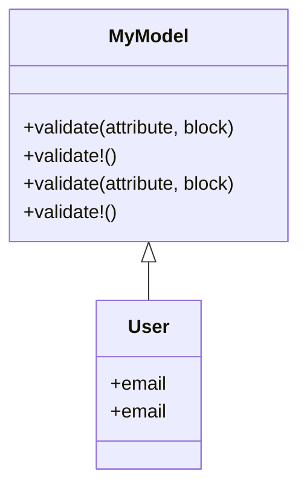

## 8.4 Class Macros and Domain-Specific Languages

In the world of Ruby, metaprogramming is a powerful tool that allows developers to write code that writes code. Among the many techniques available, class macros stand out as a particularly elegant way to extend and modify class behavior. When combined with the concept of Domain-Specific Languages (DSLs), class macros can transform how we write and understand Ruby code. In this section, we will delve into the intricacies of class macros, explore their role in building DSLs, and provide practical examples to illustrate their use.

### Understanding Class Macros

**Class Macros** are methods defined within a class that, when invoked, alter the class's behavior or structure. They are often used to create internal DSLs, which are specialized mini-languages tailored to a specific problem domain. Class macros leverage Ruby's dynamic nature to provide a clean, expressive syntax that can significantly enhance code readability and maintainability.

#### Purpose of Class Macros

The primary purpose of class macros is to encapsulate complex logic and repetitive patterns within a single, reusable method. This not only reduces boilerplate code but also allows developers to express intent more clearly. By abstracting away the implementation details, class macros enable a higher level of abstraction, making the codebase easier to understand and modify.

### Building Domain-Specific Languages (DSLs) with Class Macros

A **Domain-Specific Language (DSL)** is a language tailored to a specific application domain. In Ruby, DSLs are often implemented using class macros to provide a more natural and intuitive way to express domain logic. This approach is prevalent in many popular Ruby libraries and frameworks, such as ActiveRecord and RSpec.

#### How Class Macros Contribute to DSLs

Class macros contribute to DSLs by allowing developers to define concise, expressive syntax that closely resembles natural language. This is achieved by leveraging Ruby's flexible syntax and metaprogramming capabilities. By defining class macros, developers can create methods that act as building blocks for the DSL, encapsulating complex logic and providing a clean interface for users.

### Examples of Class Macros in Popular Ruby Libraries

To better understand the power of class macros, let's explore some examples from well-known Ruby libraries.

#### ActiveRecord's `has_many`

ActiveRecord, the Object-Relational Mapping (ORM) layer in Ruby on Rails, uses class macros extensively to define associations between models. The `has_many` macro is a prime example:

```ruby
class Author < ApplicationRecord
  has_many :books
end
```

In this example, the `has_many` macro defines a one-to-many relationship between the `Author` and `Book` models. Behind the scenes, it generates methods to manage the associated books, such as `author.books` and `author.books.create`.

#### RSpec's `describe`

RSpec, a popular testing framework for Ruby, uses class macros to define test suites. The `describe` macro is a key component of RSpec's DSL:

```ruby
RSpec.describe 'An example group' do
  it 'contains an example' do
    expect(true).to be true
  end
end
```

Here, the `describe` macro defines a group of related tests, while the `it` macro specifies individual test cases. This DSL provides a clear, readable structure for writing tests, making it easy to understand the behavior being tested.

### Creating Custom Class Macros

Creating custom class macros involves defining methods that modify the class's behavior or structure when called. This typically involves using Ruby's metaprogramming features, such as `define_method` and `class_eval`.

#### Steps to Create a Custom Class Macro

1. **Define the Macro Method**: The macro method should be defined as a class method, often using `self` to specify the class context.

2. **Modify the Class**: Use metaprogramming techniques to alter the class's behavior or structure. This may involve defining new methods, setting instance variables, or modifying existing methods.

3. **Provide a Clean Interface**: Ensure the macro provides a clean, intuitive interface for users. This often involves using Ruby's flexible syntax to create a DSL-like experience.

#### Example: Creating a Custom Validation Macro

Let's create a custom validation macro for a simple Ruby class:

```ruby
class ValidationError < StandardError; end

class MyModel
  def self.validate(attribute, &block)
    define_method("validate_#{attribute}") do
      value = instance_variable_get("@#{attribute}")
      raise ValidationError, "#{attribute} is invalid" unless block.call(value)
    end
  end

  def validate!
    methods.grep(/^validate_/).each { |method| send(method) }
  end
end

class User < MyModel
  attr_accessor :email

  validate :email do |email|
    email =~ /\A[^@\s]+@[^@\s]+\z/
  end
end

user = User.new
user.email = "invalid_email"
begin
  user.validate!
rescue ValidationError => e
  puts e.message
end
```

In this example, we define a `validate` macro that creates a validation method for a specified attribute. The `validate!` method iterates over all validation methods and executes them, raising an error if any validation fails.

### Benefits of Using Class Macros and DSLs

Class macros and DSLs offer several benefits that can significantly enhance the development process:

- **Cleaner Syntax**: By abstracting complex logic into concise macros, the resulting code is cleaner and more readable.
- **Improved Readability**: DSLs provide a natural, intuitive way to express domain logic, making it easier for developers to understand and maintain the codebase.
- **Reusability**: Class macros encapsulate reusable logic, reducing duplication and promoting code reuse.
- **Flexibility**: Ruby's dynamic nature allows for flexible, adaptable DSLs that can evolve with changing requirements.

### Visualizing Class Macros and DSLs

To better understand the relationship between class macros and DSLs, let's visualize the process using a class diagram.



In this diagram, `MyModel` defines the `validate` macro, which is inherited by the `User` class. The `validate!` method in `MyModel` executes all validation methods defined by the `validate` macro.

### Try It Yourself

Now that we've explored class macros and DSLs, let's experiment with the code examples. Try modifying the `validate` macro to support additional validation rules, such as checking for a minimum length or ensuring a value is not `nil`. Experiment with different attributes and validation logic to see how the macro adapts to various requirements.

### Knowledge Check

Before we conclude, let's review some key concepts:

- **What is a class macro, and how does it differ from a regular method?**
- **How do class macros contribute to building DSLs in Ruby?**
- **What are some benefits of using class macros and DSLs in Ruby applications?**

### Conclusion

Class macros and DSLs are powerful tools in the Ruby developer's toolkit. By leveraging Ruby's dynamic nature, they enable the creation of expressive, maintainable, and scalable code. As you continue to explore Ruby, consider how class macros and DSLs can enhance your applications and improve your development process. Remember, this is just the beginning. Keep experimenting, stay curious, and enjoy the journey!

## Quiz: Class Macros and Domain-Specific Languages



### What is the primary purpose of class macros in Ruby?

- [x] To encapsulate complex logic and repetitive patterns within a single, reusable method.
- [ ] To define instance variables.
- [ ] To handle exceptions.
- [ ] To perform arithmetic operations.

> **Explanation:** Class macros encapsulate complex logic and repetitive patterns, making code more reusable and expressive.

### How do class macros contribute to building DSLs in Ruby?

- [x] By allowing developers to define concise, expressive syntax that closely resembles natural language.
- [ ] By enforcing strict type checking.
- [ ] By optimizing memory usage.
- [ ] By providing built-in security features.

> **Explanation:** Class macros enable the creation of DSLs by providing a natural, intuitive way to express domain logic.

### Which of the following is an example of a class macro in ActiveRecord?

- [x] `has_many`
- [ ] `attr_accessor`
- [ ] `initialize`
- [ ] `to_s`

> **Explanation:** `has_many` is a class macro in ActiveRecord used to define associations between models.

### What is a Domain-Specific Language (DSL)?

- [x] A language tailored to a specific application domain.
- [ ] A general-purpose programming language.
- [ ] A type of database query language.
- [ ] A markup language for web pages.

> **Explanation:** A DSL is a specialized mini-language designed for a specific domain, often implemented using class macros.

### What is the benefit of using DSLs in Ruby applications?

- [x] Improved readability and maintainability of code.
- [ ] Increased execution speed.
- [ ] Reduced memory usage.
- [ ] Enhanced security features.

> **Explanation:** DSLs improve code readability and maintainability by providing a natural, intuitive way to express domain logic.

### Which method is used to define a custom class macro in Ruby?

- [x] `define_method`
- [ ] `attr_reader`
- [ ] `puts`
- [ ] `require`

> **Explanation:** `define_method` is used in metaprogramming to define methods dynamically, often used in class macros.

### What is the role of the `validate!` method in the custom validation macro example?

- [x] To execute all validation methods and raise an error if any validation fails.
- [ ] To initialize instance variables.
- [ ] To perform arithmetic operations.
- [ ] To handle exceptions.

> **Explanation:** The `validate!` method iterates over all validation methods and executes them, raising an error if any validation fails.

### What is the relationship between `MyModel` and `User` in the class diagram?

- [x] `User` inherits from `MyModel`.
- [ ] `MyModel` inherits from `User`.
- [ ] They are unrelated classes.
- [ ] They are instances of the same class.

> **Explanation:** In the class diagram, `User` inherits from `MyModel`, gaining access to the validation macros.

### What is the purpose of the `class_eval` method in creating class macros?

- [x] To evaluate a block of code in the context of a class, allowing modification of its behavior.
- [ ] To perform arithmetic operations.
- [ ] To handle exceptions.
- [ ] To define instance variables.

> **Explanation:** `class_eval` is used to evaluate code within the context of a class, enabling modification of its behavior.

### True or False: Class macros can only be used in Ruby on Rails applications.

- [ ] True
- [x] False

> **Explanation:** False. Class macros can be used in any Ruby application, not just Ruby on Rails.


