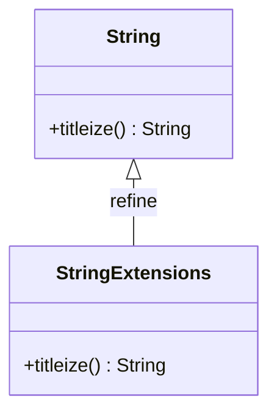

## 8.5 Open Classes and Module Extensions

In the world of Ruby, flexibility is a key feature that sets it apart from many other programming languages. One of the most powerful aspects of Ruby is its ability to modify existing classes, even those that are part of the core language. This feature, known as "open classes," allows developers to extend or alter the behavior of classes at runtime. While this can be incredibly useful, it also comes with certain risks and responsibilities. In this section, we'll delve into the concept of open classes, explore how to use them effectively, and discuss best practices to ensure your code remains maintainable and robust.

### Understanding Open Classes

Open classes in Ruby allow you to reopen existing classes and modify them by adding new methods or overriding existing ones. This capability is not limited to user-defined classes; you can also modify built-in classes like `String`, `Array`, and `Hash`. This feature is part of Ruby's dynamic nature, enabling developers to adapt and extend the language to suit their needs.

#### Example: Adding Methods to Existing Classes

Let's start with a simple example of how to add a method to an existing class. Suppose we want to add a method `titleize` to the `String` class, which capitalizes each word in a string.

```ruby
class String
  def titleize
    self.split(' ').map(&:capitalize).join(' ')
  end
end

puts "hello world".titleize  # Output: "Hello World"
```

In this example, we reopen the `String` class and define a new method `titleize`. This method splits the string into words, capitalizes each word, and then joins them back together.

#### Example: Modifying Existing Methods

You can also modify existing methods in a class. For instance, let's override the `+` method in the `String` class to add a space between concatenated strings.

```ruby
class String
  alias_method :original_plus, :+

  def +(other)
    "#{self} #{other}"
  end
end

puts "Hello" + "World"  # Output: "Hello World"
```

Here, we first alias the original `+` method to `original_plus` to preserve its original functionality. Then, we redefine the `+` method to include a space between the concatenated strings.

### Potential Risks of Modifying Core Classes

While open classes provide great flexibility, they also introduce potential risks. Modifying core classes can lead to unexpected behavior, especially if multiple libraries or parts of your application modify the same class. This can result in conflicts and make debugging difficult.

#### Example: Unintended Consequences

Consider a scenario where two different libraries modify the `Array` class to add a method `average`. If both libraries define this method differently, it can lead to unpredictable results.

```ruby
# Library A
class Array
  def average
    sum / size
  end
end

# Library B
class Array
  def average
    inject(:+) / length
  end
end
```

In this case, the second definition of `average` will overwrite the first, potentially causing issues if the behavior differs.

### Using Refinements for Safer Modifications

To mitigate the risks associated with open classes, Ruby introduced refinements in version 2.0. Refinements allow you to scope changes to specific parts of your code, reducing the risk of conflicts.

#### Example: Using Refinements

Let's revisit the `titleize` method example, but this time using refinements.

```ruby
module StringExtensions
  refine String do
    def titleize
      self.split(' ').map(&:capitalize).join(' ')
    end
  end
end

using StringExtensions

puts "hello world".titleize  # Output: "Hello World"
```

In this example, we define a module `StringExtensions` and use the `refine` keyword to add the `titleize` method to the `String` class. By using the `using` keyword, we activate the refinement only in the current scope, preventing it from affecting other parts of the application.

### Appropriate Use Cases and Best Practices

While open classes and refinements are powerful tools, they should be used judiciously. Here are some best practices to consider:

1. **Limit Modifications**: Avoid modifying core classes unless absolutely necessary. Consider using refinements to limit the scope of changes.

2. **Namespace Your Extensions**: Use modules to namespace your extensions, reducing the risk of conflicts with other libraries.

3. **Document Changes**: Clearly document any modifications to existing classes, especially if they alter the behavior of core classes.

4. **Test Thoroughly**: Ensure that any changes to existing classes are thoroughly tested to prevent unexpected behavior.

5. **Consider Alternatives**: Before modifying a core class, consider alternative solutions such as subclassing or using composition.

### Visualizing Open Classes and Module Extensions

To better understand the concept of open classes and module extensions, let's visualize how they work using a class diagram.



In this diagram, we see the `String` class with the `titleize` method added through open classes. The `StringExtensions` module refines the `String` class, providing a scoped modification.

### Try It Yourself

Experiment with open classes and refinements by modifying the examples provided. Try adding new methods to other core classes or using refinements to limit the scope of changes. Consider the potential impact of these changes on your application and how you can mitigate risks.

### Knowledge Check

- What are open classes in Ruby, and how do they differ from traditional class definitions?
- How can refinements help mitigate the risks associated with modifying core classes?
- What are some best practices for using open classes and module extensions in Ruby?

### Summary

Open classes and module extensions are powerful features of Ruby that allow developers to modify existing classes and add new functionality. While they offer great flexibility, they also come with potential risks. By using refinements and following best practices, you can harness the power of open classes while minimizing the risk of conflicts and unexpected behavior. Remember, this is just the beginning. As you progress, you'll discover more ways to leverage Ruby's dynamic nature to build scalable and maintainable applications. Keep experimenting, stay curious, and enjoy the journey!

## Quiz: Open Classes and Module Extensions



### What is an open class in Ruby?

- [x] A class that can be reopened and modified at runtime
- [ ] A class that is only accessible within a specific module
- [ ] A class that cannot be inherited from
- [ ] A class that is defined using the `open` keyword

> **Explanation:** An open class in Ruby is a class that can be reopened and modified at runtime, allowing developers to add or override methods.

### What is a potential risk of modifying core classes in Ruby?

- [x] It can lead to unexpected behavior and conflicts
- [ ] It makes the code run faster
- [ ] It prevents other classes from being modified
- [ ] It automatically documents the changes

> **Explanation:** Modifying core classes can lead to unexpected behavior and conflicts, especially if multiple libraries or parts of an application modify the same class.

### How do refinements help in Ruby?

- [x] They limit the scope of changes to specific parts of the code
- [ ] They make the code run faster
- [ ] They prevent any modifications to core classes
- [ ] They automatically document the changes

> **Explanation:** Refinements limit the scope of changes to specific parts of the code, reducing the risk of conflicts and unexpected behavior.

### Which keyword is used to activate a refinement in Ruby?

- [x] using
- [ ] refine
- [ ] activate
- [ ] include

> **Explanation:** The `using` keyword is used to activate a refinement in Ruby, applying the changes only within the current scope.

### What is a best practice when modifying existing classes in Ruby?

- [x] Limit modifications and consider using refinements
- [ ] Modify as many classes as possible for flexibility
- [ ] Avoid documenting changes to keep the code clean
- [ ] Use the `open` keyword for all modifications

> **Explanation:** A best practice is to limit modifications and consider using refinements to reduce the risk of conflicts and maintain code clarity.

### What is the purpose of aliasing a method before modifying it?

- [x] To preserve the original functionality
- [ ] To make the code run faster
- [ ] To prevent the method from being called
- [ ] To automatically document the changes

> **Explanation:** Aliasing a method before modifying it preserves the original functionality, allowing you to call the original method if needed.

### What is an alternative to modifying a core class in Ruby?

- [x] Subclassing or using composition
- [ ] Using the `open` keyword
- [ ] Avoiding any changes to the code
- [ ] Automatically documenting the changes

> **Explanation:** An alternative to modifying a core class is to use subclassing or composition, which can provide the desired functionality without altering the original class.

### What is a refinement in Ruby?

- [x] A way to scope changes to specific parts of the code
- [ ] A method that cannot be overridden
- [ ] A class that is only accessible within a specific module
- [ ] A keyword used to define a class

> **Explanation:** A refinement in Ruby is a way to scope changes to specific parts of the code, reducing the risk of conflicts and unexpected behavior.

### What is the output of the following code?
```ruby
module StringExtensions
  refine String do
    def titleize
      self.split(' ').map(&:capitalize).join(' ')
    end
  end
end

using StringExtensions

puts "hello world".titleize
```

- [x] "Hello World"
- [ ] "hello world"
- [ ] "HELLO WORLD"
- [ ] "Hello world"

> **Explanation:** The `titleize` method capitalizes each word in the string, resulting in "Hello World".

### True or False: Open classes in Ruby allow you to modify built-in classes like `String` and `Array`.

- [x] True
- [ ] False

> **Explanation:** True. Open classes in Ruby allow you to modify built-in classes like `String` and `Array`, adding or overriding methods as needed.


