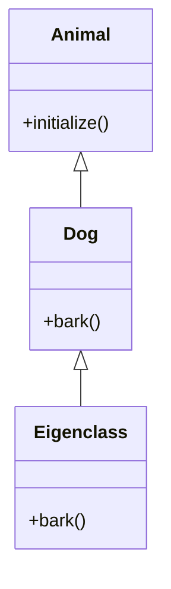

## 8.6 Singleton Methods and Eigenclasses

In the realm of Ruby programming, the concepts of singleton methods and eigenclasses (also known as singleton classes) are pivotal for understanding the flexibility and power of Ruby's object model. These features allow developers to define methods on individual objects, enabling per-object behavior customization and advanced metaprogramming techniques.

### Understanding Singleton Methods

**Singleton methods** are methods that are defined on a single object rather than on all instances of a class. This allows for unique behavior to be assigned to specific objects without affecting other instances of the same class.

#### Defining Singleton Methods

To define a singleton method, you can use the following syntax:

```ruby
class Animal
end

dog = Animal.new

# Define a singleton method on the dog object
def dog.bark
  puts "Woof!"
end

dog.bark # Output: Woof!
```

In this example, the `bark` method is defined only for the `dog` object. Other instances of `Animal` will not have this method unless it is explicitly defined for them.

#### Practical Applications of Singleton Methods

Singleton methods are particularly useful when you need to customize the behavior of specific objects without altering the class definition. This can be beneficial in scenarios such as:

- **Dynamic Behavior**: Adding methods to objects at runtime based on specific conditions.
- **Testing**: Mocking or stubbing methods on individual objects during testing.
- **Configuration**: Assigning configuration settings or callbacks to specific instances.

### Exploring Eigenclasses

**Eigenclasses**, also known as singleton classes, are the hidden classes where singleton methods are stored. Every object in Ruby has its own eigenclass, which is created automatically when a singleton method is defined.

#### Accessing Eigenclasses

You can access an object's eigenclass using the `class << object` syntax:

```ruby
class Animal
end

dog = Animal.new

# Access the eigenclass of the dog object
class << dog
  def bark
    puts "Woof!"
  end
end

dog.bark # Output: Woof!
```

In this example, the `bark` method is defined within the eigenclass of the `dog` object. This is functionally equivalent to defining a singleton method directly on the object.

#### Visualizing Eigenclasses

To better understand how eigenclasses work, consider the following diagram:



In this diagram, `Dog` is an instance of `Animal`, and its eigenclass contains the `bark` method. This illustrates how eigenclasses extend the functionality of individual objects.

### Metaprogramming with Eigenclasses

Eigenclasses are a cornerstone of Ruby's metaprogramming capabilities. They allow for dynamic method definitions and modifications at runtime, enabling powerful and flexible code structures.

#### Dynamic Method Definition

Using eigenclasses, you can define methods dynamically based on runtime conditions:

```ruby
class Animal
end

dog = Animal.new

# Define a method dynamically
method_name = :bark
dog.singleton_class.define_method(method_name) do
  puts "Woof!"
end

dog.bark # Output: Woof!
```

In this example, the `bark` method is defined dynamically using `define_method`, showcasing the flexibility of eigenclasses in metaprogramming.

#### Customizing Per-Object Behavior

Eigenclasses enable per-object behavior customization, allowing you to tailor the functionality of individual objects without affecting others:

```ruby
class Animal
end

dog = Animal.new
cat = Animal.new

# Define a singleton method for the dog object
def dog.bark
  puts "Woof!"
end

# Define a singleton method for the cat object
def cat.meow
  puts "Meow!"
end

dog.bark # Output: Woof!
cat.meow # Output: Meow!
```

Here, the `dog` and `cat` objects have unique methods, demonstrating how eigenclasses facilitate per-object customization.

### Key Considerations

When working with singleton methods and eigenclasses, consider the following:

- **Performance**: Defining many singleton methods can impact performance, as each method creates a new eigenclass.
- **Complexity**: Overusing singleton methods can lead to complex and hard-to-maintain code. Use them judiciously.
- **Testing**: Ensure that singleton methods are adequately tested, as they can introduce unexpected behavior.

### Ruby's Unique Features

Ruby's object model, with its support for singleton methods and eigenclasses, provides a unique level of flexibility compared to other programming languages. This allows for dynamic and expressive code, making Ruby a powerful tool for metaprogramming.

### Differences and Similarities

Singleton methods and eigenclasses are often confused with class methods. While both allow for defining methods outside the standard class definition, singleton methods are specific to individual objects, whereas class methods apply to the class itself.

### Try It Yourself

Experiment with the following code to deepen your understanding of singleton methods and eigenclasses:

```ruby
class Vehicle
end

car = Vehicle.new
bike = Vehicle.new

# Define a singleton method for car
def car.honk
  puts "Beep beep!"
end

# Access and modify the eigenclass of bike
class << bike
  def ring_bell
    puts "Ring ring!"
  end
end

car.honk # Output: Beep beep!
bike.ring_bell # Output: Ring ring!

# Try adding more singleton methods or modifying existing ones
```

### Summary

Singleton methods and eigenclasses are powerful tools in Ruby's metaprogramming arsenal. They allow for per-object behavior customization and dynamic method definitions, enabling developers to write flexible and expressive code. By understanding and leveraging these concepts, you can enhance your Ruby applications with tailored functionality and dynamic behavior.

## Quiz: Singleton Methods and Eigenclasses



### What is a singleton method in Ruby?

- [x] A method defined on a single object
- [ ] A method defined on all instances of a class
- [ ] A method defined on the class itself
- [ ] A method that cannot be overridden

> **Explanation:** A singleton method is defined on a single object, allowing for unique behavior customization.

### How do you access an object's eigenclass?

- [x] Using `class << object`
- [ ] Using `object.class`
- [ ] Using `object.superclass`
- [ ] Using `object.instance_of?`

> **Explanation:** The `class << object` syntax is used to access an object's eigenclass.

### What is the primary use of eigenclasses in Ruby?

- [x] To store singleton methods
- [ ] To define class methods
- [ ] To inherit from other classes
- [ ] To manage instance variables

> **Explanation:** Eigenclasses store singleton methods, enabling per-object behavior customization.

### What is a potential downside of using many singleton methods?

- [x] Performance impact
- [ ] Increased readability
- [ ] Simplified code structure
- [ ] Enhanced maintainability

> **Explanation:** Defining many singleton methods can impact performance due to the creation of new eigenclasses.

### How can you define a method dynamically in an eigenclass?

- [x] Using `define_method`
- [ ] Using `attr_accessor`
- [ ] Using `include`
- [ ] Using `extend`

> **Explanation:** The `define_method` method allows for dynamic method definition in an eigenclass.

### What is the difference between a singleton method and a class method?

- [x] Singleton methods are defined on individual objects, while class methods are defined on the class itself.
- [ ] Singleton methods are defined on the class itself, while class methods are defined on individual objects.
- [ ] Singleton methods cannot be overridden, while class methods can.
- [ ] Singleton methods are faster than class methods.

> **Explanation:** Singleton methods are specific to individual objects, whereas class methods apply to the class itself.

### Which of the following is a practical application of singleton methods?

- [x] Mocking methods during testing
- [ ] Defining class-level constants
- [ ] Creating instance variables
- [ ] Managing inheritance hierarchies

> **Explanation:** Singleton methods are useful for mocking or stubbing methods on individual objects during testing.

### What is a key consideration when using singleton methods?

- [x] They can lead to complex and hard-to-maintain code.
- [ ] They simplify code structure.
- [ ] They improve performance.
- [ ] They are always necessary for dynamic behavior.

> **Explanation:** Overusing singleton methods can lead to complex and hard-to-maintain code.

### How do eigenclasses relate to metaprogramming?

- [x] They enable dynamic method definitions at runtime.
- [ ] They restrict method definitions to compile time.
- [ ] They simplify static analysis.
- [ ] They enforce strict typing.

> **Explanation:** Eigenclasses allow for dynamic method definitions, a key aspect of metaprogramming.

### True or False: Every object in Ruby has its own eigenclass.

- [x] True
- [ ] False

> **Explanation:** Every object in Ruby has its own eigenclass, which is created automatically when a singleton method is defined.



Remember, this is just the beginning. As you progress, you'll build more complex and interactive Ruby applications. Keep experimenting, stay curious, and enjoy the journey!
