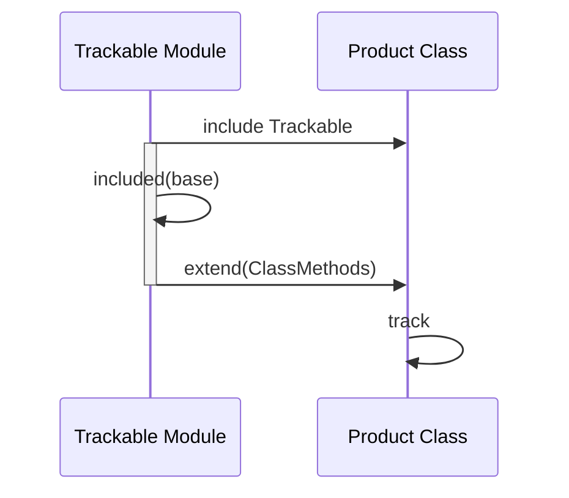

## 8.7 Hooks and Callbacks

In Ruby, hooks and callbacks are powerful metaprogramming tools that allow developers to inject additional behavior into classes and modules during their lifecycle events. These mechanisms provide a way to dynamically modify or extend the behavior of classes and modules, making Ruby a flexible and dynamic programming language. In this section, we will explore what hooks and callbacks are, how to use them, and their practical applications in Ruby programming.

### Understanding Hooks and Callbacks

Hooks and callbacks in Ruby are methods that are automatically called during certain events in the lifecycle of a class or module. These events include when a module is included in a class, when a class is inherited, or when a method is added to a class. By defining these methods, developers can execute custom code in response to these events, allowing for dynamic behavior modification.

#### Key Concepts

- **Hooks**: Methods that are called automatically during specific lifecycle events of a class or module.
- **Callbacks**: Similar to hooks, callbacks are methods that are invoked in response to certain events, often used to trigger additional behavior.

### Common Hooks and Callbacks in Ruby

Ruby provides several built-in hooks and callbacks that can be used to modify class and module behavior. Some of the most commonly used hooks and callbacks include:

- `included`: Called when a module is included in another module or class.
- `extended`: Called when a module is extended in another module or class.
- `inherited`: Called when a class is subclassed.
- `method_added`: Called when a method is added to a class or module.
- `method_removed`: Called when a method is removed from a class or module.
- `method_undefined`: Called when a method is undefined in a class or module.

### Using Hooks and Callbacks

Let's explore how to use these hooks and callbacks in Ruby with practical examples.

#### The `included` Hook

The `included` hook is triggered when a module is included in another module or class. It is often used to extend the functionality of the including class or module.

```ruby
module Trackable
  def self.included(base)
    puts "#{base} has included the Trackable module"
    base.extend(ClassMethods)
  end

  module ClassMethods
    def track
      puts "Tracking changes in #{self}"
    end
  end
end

class Product
  include Trackable
end

Product.track
```

**Explanation**: In this example, when the `Trackable` module is included in the `Product` class, the `included` hook is triggered. This hook extends the `Product` class with additional class methods defined in the `ClassMethods` module.

#### The `inherited` Hook

The `inherited` hook is called when a class is subclassed. It is useful for tracking subclasses or modifying subclass behavior.

```ruby
class Base
  def self.inherited(subclass)
    puts "#{subclass} is inheriting from #{self}"
  end
end

class Derived < Base
end
```

**Explanation**: Here, the `inherited` hook is used to print a message whenever a new subclass is created from the `Base` class.

#### The `method_added` Hook

The `method_added` hook is invoked when a new method is added to a class or module. This can be used to track method definitions or modify behavior dynamically.

```ruby
class Logger
  def self.method_added(method_name)
    puts "New method added: #{method_name}"
  end

  def log
    puts "Logging information"
  end
end
```

**Explanation**: In this example, the `method_added` hook prints a message whenever a new method is added to the `Logger` class.

### Practical Use Cases

Hooks and callbacks can be used in various scenarios to enhance the functionality of Ruby applications. Here are some practical use cases:

#### Tracking Subclasses

By using the `inherited` hook, you can keep track of all subclasses of a particular class. This is useful for frameworks or libraries that need to manage a collection of subclasses.

```ruby
class Plugin
  @subclasses = []

  def self.inherited(subclass)
    @subclasses << subclass
  end

  def self.subclasses
    @subclasses
  end
end

class AuthenticationPlugin < Plugin
end

class AuthorizationPlugin < Plugin
end

puts Plugin.subclasses.inspect
```

**Explanation**: This example demonstrates how to track all subclasses of the `Plugin` class using the `inherited` hook.

#### Adding Methods Dynamically

The `method_added` hook can be used to dynamically add methods to a class or module. This is useful for creating dynamic proxies or decorators.

```ruby
class DynamicProxy
  def self.method_added(method_name)
    alias_method :"original_#{method_name}", method_name

    define_method(method_name) do |*args, &block|
      puts "Calling #{method_name} with arguments: #{args.inspect}"
      send(:"original_#{method_name}", *args, &block)
    end
  end

  def greet(name)
    puts "Hello, #{name}!"
  end
end

proxy = DynamicProxy.new
proxy.greet("Alice")
```

**Explanation**: In this example, the `method_added` hook is used to create a dynamic proxy that logs method calls and their arguments.

### Importance of Understanding the Object Model

To effectively use hooks and callbacks, it is crucial to have a solid understanding of Ruby's object model. This includes knowing how classes, modules, and methods interact with each other. Understanding the object model allows you to leverage hooks and callbacks to their full potential, enabling you to create more flexible and dynamic Ruby applications.

### Visualizing Hooks and Callbacks

To better understand how hooks and callbacks work, let's visualize the process using a sequence diagram.



**Description**: This sequence diagram illustrates the process of including the `Trackable` module in the `Product` class. The `included` hook is triggered, extending the `Product` class with additional methods.

### Try It Yourself

Experiment with the code examples provided in this section. Try modifying the hooks and callbacks to see how they affect the behavior of classes and modules. For example, you can:

- Add additional methods to the `ClassMethods` module in the `Trackable` example.
- Create a new subclass of the `Base` class and observe the output of the `inherited` hook.
- Add more methods to the `Logger` class and see how the `method_added` hook responds.

### Conclusion

Hooks and callbacks are powerful tools in Ruby that allow developers to dynamically modify class and module behavior. By understanding and utilizing these mechanisms, you can create more flexible and maintainable Ruby applications. Remember, this is just the beginning. As you progress, you'll discover even more ways to leverage Ruby's dynamic capabilities. Keep experimenting, stay curious, and enjoy the journey!

## Quiz: Hooks and Callbacks



### What is the purpose of the `included` hook in Ruby?

- [x] To execute code when a module is included in a class or another module.
- [ ] To execute code when a class is instantiated.
- [ ] To execute code when a method is called.
- [ ] To execute code when a class is destroyed.

> **Explanation:** The `included` hook is triggered when a module is included in a class or another module, allowing additional behavior to be injected.

### Which hook is called when a class is subclassed in Ruby?

- [ ] `included`
- [ ] `extended`
- [x] `inherited`
- [ ] `method_added`

> **Explanation:** The `inherited` hook is called when a class is subclassed, allowing developers to track or modify subclass behavior.

### What does the `method_added` hook do?

- [x] It is called when a new method is added to a class or module.
- [ ] It is called when a method is removed from a class or module.
- [ ] It is called when a method is called on an object.
- [ ] It is called when a class is instantiated.

> **Explanation:** The `method_added` hook is triggered when a new method is added to a class or module, allowing developers to track method definitions.

### How can hooks and callbacks be used in Ruby?

- [x] To dynamically modify class and module behavior.
- [ ] To statically define class behavior.
- [ ] To execute code only at runtime.
- [ ] To prevent method overriding.

> **Explanation:** Hooks and callbacks allow for dynamic modification of class and module behavior, providing flexibility in Ruby programming.

### Which hook is used to track subclasses of a class?

- [ ] `included`
- [x] `inherited`
- [ ] `method_added`
- [ ] `method_removed`

> **Explanation:** The `inherited` hook is used to track subclasses of a class, making it useful for frameworks or libraries.

### What is the main benefit of using hooks and callbacks in Ruby?

- [x] They allow for dynamic behavior modification.
- [ ] They make code execution faster.
- [ ] They simplify method definitions.
- [ ] They prevent runtime errors.

> **Explanation:** Hooks and callbacks provide the ability to dynamically modify behavior, enhancing the flexibility and maintainability of Ruby applications.

### Can the `method_added` hook be used to create dynamic proxies?

- [x] Yes
- [ ] No

> **Explanation:** The `method_added` hook can be used to create dynamic proxies by modifying or wrapping method behavior when methods are added.

### What is required to effectively use hooks and callbacks in Ruby?

- [x] A solid understanding of Ruby's object model.
- [ ] Knowledge of C programming.
- [ ] Experience with JavaScript.
- [ ] Familiarity with SQL databases.

> **Explanation:** Understanding Ruby's object model is crucial for effectively using hooks and callbacks, as it involves interactions between classes, modules, and methods.

### Which of the following is NOT a hook or callback in Ruby?

- [ ] `included`
- [ ] `inherited`
- [ ] `method_added`
- [x] `method_called`

> **Explanation:** `method_called` is not a hook or callback in Ruby. The others are valid hooks and callbacks.

### True or False: Hooks and callbacks can only be used in classes, not modules.

- [ ] True
- [x] False

> **Explanation:** Hooks and callbacks can be used in both classes and modules, providing flexibility in modifying behavior across different structures.


