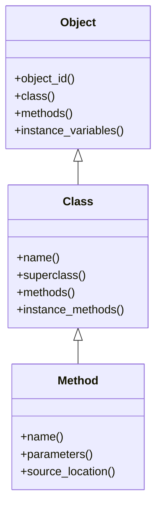

## 8.8 Reflection and Introspection Techniques

Reflection and introspection are powerful techniques in Ruby that allow programs to examine and modify their own structure and behavior at runtime. These capabilities are central to Ruby's metaprogramming prowess, enabling developers to write more flexible and dynamic code. In this section, we'll delve into the concepts of reflection and introspection, explore how to inspect objects, classes, and methods in Ruby, and discuss practical applications such as debugging, serialization, and dynamic method invocation.

### Understanding Reflection and Introspection

**Reflection** is the ability of a program to examine and modify its own structure and behavior during execution. This includes inspecting classes, methods, and objects, and even altering them on the fly. Reflection is a key feature in dynamic languages like Ruby, where the program's structure can be manipulated at runtime.

**Introspection**, on the other hand, is a subset of reflection that focuses on examining the program's structure without modifying it. It allows you to query the properties of objects, such as their class, methods, and instance variables, providing a deeper understanding of the program's state.

Together, reflection and introspection empower developers to write code that is both adaptable and self-aware, making it easier to implement advanced features and optimizations.

### Inspecting Objects, Classes, and Methods

Ruby provides a rich set of methods for inspecting objects, classes, and methods. Let's explore some of these methods and see how they can be used in practice.

#### Inspecting Objects

To inspect an object in Ruby, you can use methods like `object_id`, `class`, `instance_variables`, and `methods`. These methods provide valuable information about the object's identity, type, and capabilities.

```ruby
# Define a simple class with instance variables
class Person
  attr_accessor :name, :age

  def initialize(name, age)
    @name = name
    @age = age
  end
end

# Create an instance of the Person class
person = Person.new("Alice", 30)

# Inspect the object
puts "Object ID: #{person.object_id}" # Unique identifier for the object
puts "Class: #{person.class}"         # Class of the object
puts "Instance Variables: #{person.instance_variables}" # List of instance variables
puts "Methods: #{person.methods.sort}" # List of methods available to the object
```

In this example, we define a `Person` class with `name` and `age` attributes. We then create an instance of this class and use introspection methods to inspect its properties. The `object_id` method returns a unique identifier for the object, while `class` reveals the object's class. The `instance_variables` method lists the instance variables defined for the object, and `methods` provides a list of all methods available to the object.

#### Inspecting Classes

Classes in Ruby are objects themselves, and you can inspect them using similar methods. This allows you to explore the structure and behavior of classes at runtime.

```ruby
# Inspect the Person class
puts "Class Name: #{Person.name}" # Name of the class
puts "Superclass: #{Person.superclass}" # Superclass of the class
puts "Class Methods: #{Person.methods(false).sort}" # Class methods
puts "Instance Methods: #{Person.instance_methods(false).sort}" # Instance methods
```

Here, we inspect the `Person` class itself. The `name` method returns the name of the class, while `superclass` reveals its superclass. The `methods(false)` method lists the class methods, and `instance_methods(false)` provides the instance methods defined for the class.

#### Inspecting Methods

Ruby allows you to inspect individual methods, providing insights into their parameters and source code. This can be particularly useful for debugging and understanding complex codebases.

```ruby
# Define a method with parameters
def greet(name, greeting = "Hello")
  "#{greeting}, #{name}!"
end

# Inspect the greet method
method_obj = method(:greet)
puts "Method Name: #{method_obj.name}" # Name of the method
puts "Parameters: #{method_obj.parameters}" # List of parameters
puts "Source Location: #{method_obj.source_location}" # File and line number
```

In this example, we define a `greet` method with parameters and use the `method` method to obtain a `Method` object representing it. We then inspect the method's name, parameters, and source location. The `parameters` method returns an array of parameter names and types, while `source_location` provides the file and line number where the method is defined.

### Applications of Reflection and Introspection

Reflection and introspection have numerous practical applications in Ruby development. Let's explore some of the most common use cases.

#### Debugging

Reflection and introspection are invaluable tools for debugging Ruby applications. By inspecting objects, classes, and methods at runtime, you can gain insights into the program's state and behavior, making it easier to identify and fix issues.

For example, you can use introspection to log the state of an object before and after a method call, helping you pinpoint the source of a bug.

```ruby
# Log the state of an object before and after a method call
def log_state(object)
  puts "Before: #{object.inspect}"
  yield
  puts "After: #{object.inspect}"
end

# Use the log_state method to debug a method call
log_state(person) do
  person.name = "Bob"
end
```

In this example, we define a `log_state` method that logs the state of an object before and after a block of code is executed. This can be a powerful debugging tool, allowing you to track changes to an object's state over time.

#### Serialization

Reflection and introspection can also be used to implement serialization, the process of converting an object into a format that can be easily stored or transmitted. By inspecting an object's instance variables, you can dynamically generate a serialized representation of the object.

```ruby
# Serialize an object to a hash
def serialize(object)
  object.instance_variables.each_with_object({}) do |var, hash|
    hash[var] = object.instance_variable_get(var)
  end
end

# Serialize the person object
serialized_person = serialize(person)
puts "Serialized Person: #{serialized_person}"
```

In this example, we define a `serialize` method that converts an object's instance variables into a hash. This allows you to easily serialize and deserialize objects, making it easier to store and transmit data.

#### Dynamic Method Invocation

Reflection and introspection enable dynamic method invocation, allowing you to call methods based on runtime conditions. This can be useful for implementing flexible APIs and plugins.

```ruby
# Define a method that dynamically invokes another method
def invoke_method(object, method_name, *args)
  if object.respond_to?(method_name)
    object.send(method_name, *args)
  else
    puts "Method #{method_name} not found"
  end
end

# Dynamically invoke the greet method
puts invoke_method(self, :greet, "Alice", "Hi")
```

In this example, we define an `invoke_method` method that dynamically invokes a method on an object if it exists. This allows you to call methods based on runtime conditions, providing greater flexibility and extensibility.

### Supporting Metaprogramming Tasks

Reflection and introspection are essential tools for metaprogramming in Ruby. They allow you to write code that can adapt to changing requirements and environments, making it easier to implement advanced features and optimizations.

For example, you can use reflection to dynamically define methods based on runtime data, or to implement domain-specific languages (DSLs) that provide a more expressive syntax for specific tasks.

```ruby
# Define a method that dynamically creates getter and setter methods
def define_accessor(object, attribute)
  object.class.class_eval do
    define_method(attribute) do
      instance_variable_get("@#{attribute}")
    end

    define_method("#{attribute}=") do |value|
      instance_variable_set("@#{attribute}", value)
    end
  end
end

# Dynamically define accessor methods for the person object
define_accessor(person, :email)
person.email = "alice@example.com"
puts "Email: #{person.email}"
```

In this example, we define a `define_accessor` method that dynamically creates getter and setter methods for an attribute on an object. This demonstrates how reflection and introspection can be used to implement metaprogramming tasks, enabling you to write more flexible and dynamic code.

### Visualizing Reflection and Introspection

To better understand the relationships between objects, classes, and methods in Ruby, let's visualize these concepts using a class diagram.



This diagram illustrates the relationships between the `Object`, `Class`, and `Method` classes in Ruby. The `Object` class provides methods for inspecting objects, while the `Class` class extends `Object` to provide additional methods for inspecting classes. The `Method` class represents individual methods and provides methods for inspecting their properties.

### Try It Yourself

To deepen your understanding of reflection and introspection in Ruby, try modifying the code examples provided in this section. Experiment with different objects, classes, and methods, and explore how reflection and introspection can be used to implement advanced features and optimizations.

### Key Takeaways

- **Reflection** allows a program to examine and modify its own structure and behavior at runtime.
- **Introspection** is a subset of reflection that focuses on examining the program's structure without modifying it.
- Ruby provides a rich set of methods for inspecting objects, classes, and methods, including `object_id`, `class`, `methods`, and `instance_variables`.
- Reflection and introspection have numerous practical applications, including debugging, serialization, and dynamic method invocation.
- These techniques are essential tools for metaprogramming in Ruby, enabling developers to write more flexible and dynamic code.

## Quiz: Reflection and Introspection Techniques



### What is the primary purpose of reflection in Ruby?

- [x] To examine and modify the program's structure and behavior at runtime
- [ ] To compile Ruby code into machine code
- [ ] To optimize Ruby code for performance
- [ ] To enforce strict type checking

> **Explanation:** Reflection allows a program to examine and modify its own structure and behavior during execution, making it a powerful tool for dynamic programming.

### Which method would you use to obtain a unique identifier for an object in Ruby?

- [x] `object_id`
- [ ] `class`
- [ ] `methods`
- [ ] `instance_variables`

> **Explanation:** The `object_id` method returns a unique identifier for an object, which can be used to distinguish it from other objects.

### How can you list all instance variables of an object in Ruby?

- [x] `instance_variables`
- [ ] `methods`
- [ ] `class`
- [ ] `object_id`

> **Explanation:** The `instance_variables` method returns an array of instance variable names for an object, allowing you to inspect its state.

### What does the `method` method in Ruby return?

- [x] A `Method` object representing the specified method
- [ ] A string containing the method's source code
- [ ] A list of all methods in the class
- [ ] The return value of the method

> **Explanation:** The `method` method returns a `Method` object that represents the specified method, allowing you to inspect its properties.

### Which of the following is a practical application of reflection and introspection in Ruby?

- [x] Debugging
- [x] Serialization
- [x] Dynamic method invocation
- [ ] Static analysis

> **Explanation:** Reflection and introspection are used in debugging, serialization, and dynamic method invocation, among other applications.

### What is the difference between reflection and introspection?

- [x] Reflection can modify the program's structure, while introspection only examines it
- [ ] Introspection can modify the program's structure, while reflection only examines it
- [ ] Reflection is used for performance optimization, while introspection is not
- [ ] There is no difference; they are the same

> **Explanation:** Reflection allows modification of the program's structure, while introspection focuses on examining it without making changes.

### How can you dynamically invoke a method on an object in Ruby?

- [x] Using the `send` method
- [ ] Using the `eval` method
- [ ] Using the `method_missing` method
- [ ] Using the `respond_to?` method

> **Explanation:** The `send` method allows you to dynamically invoke a method on an object by passing the method name as a symbol or string.

### What does the `parameters` method of a `Method` object return?

- [x] An array of parameter names and types
- [ ] The return value of the method
- [ ] The method's source code
- [ ] The method's documentation

> **Explanation:** The `parameters` method returns an array of parameter names and types, providing insights into the method's signature.

### Which method would you use to check if an object responds to a specific method?

- [x] `respond_to?`
- [ ] `method`
- [ ] `send`
- [ ] `instance_variables`

> **Explanation:** The `respond_to?` method checks if an object responds to a specific method, allowing you to safely invoke methods.

### True or False: Reflection and introspection are only useful for metaprogramming tasks.

- [ ] True
- [x] False

> **Explanation:** While reflection and introspection are essential for metaprogramming, they also have practical applications in debugging, serialization, and dynamic method invocation.



Remember, this is just the beginning. As you progress, you'll discover even more powerful ways to leverage reflection and introspection in Ruby. Keep experimenting, stay curious, and enjoy the journey!
