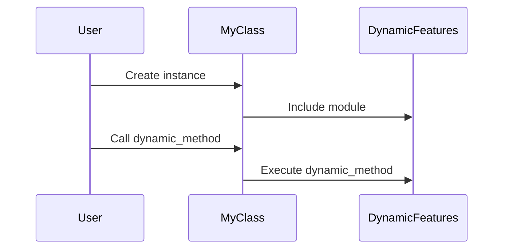

## 8.9 Advanced Metaprogramming Practices

Metaprogramming in Ruby is a powerful tool that allows developers to write code that writes code. This capability can lead to more flexible and dynamic applications, but it also comes with its own set of challenges and risks. In this section, we'll delve into advanced metaprogramming practices, exploring techniques such as dynamically creating modules, manipulating scopes, and using `Binding` objects to alter execution contexts.

### Introduction to Advanced Metaprogramming

Advanced metaprogramming involves using Ruby's dynamic capabilities to perform complex operations at runtime. This includes creating methods and classes on the fly, altering the behavior of existing code, and even changing the execution context of code blocks. These techniques can be incredibly powerful, but they require a deep understanding of Ruby's object model and execution flow.

#### Key Concepts

- **Dynamic Module Creation**: Creating and including modules at runtime to extend or modify class behavior.
- **Scope Manipulation**: Changing the scope in which code is executed to access or modify variables and methods.
- **Execution Context Alteration**: Using `Binding` objects to capture and modify the execution context of code blocks.

### Dynamic Module Creation

Dynamic module creation allows you to define and include modules at runtime. This can be useful for adding behavior to classes based on runtime conditions or configurations.

```ruby
module DynamicFeatures
  def dynamic_method
    puts "This is a dynamically added method!"
  end
end

class MyClass
  def initialize
    extend DynamicFeatures if some_condition?
  end

  def some_condition?
    # Logic to determine if the module should be included
    true
  end
end

obj = MyClass.new
obj.dynamic_method # Outputs: This is a dynamically added method!
```

In this example, the `DynamicFeatures` module is conditionally included in `MyClass` based on the result of `some_condition?`. This allows `MyClass` to gain new methods dynamically.

#### Best Practices

- **Use Sparingly**: Dynamic module creation can make code difficult to understand and maintain. Use it only when necessary.
- **Document Clearly**: Ensure that the conditions and effects of dynamic module inclusion are well-documented.

### Scope Manipulation

Scope manipulation involves changing the context in which code is executed. This can be achieved using Ruby's `instance_eval` and `class_eval` methods, which allow you to execute code in the context of a specific object or class.

```ruby
class MyClass
  def initialize
    @secret = "I'm a secret!"
  end
end

obj = MyClass.new
obj.instance_eval do
  puts @secret # Outputs: I'm a secret!
end
```

Here, `instance_eval` is used to execute a block of code in the context of `obj`, allowing access to its instance variables.

#### Security Considerations

- **Avoid Untrusted Input**: Never use `eval` or similar methods with untrusted input, as this can lead to security vulnerabilities.
- **Limit Scope Changes**: Minimize the use of scope manipulation to avoid unexpected side effects.

### Execution Context Alteration with `Binding`

The `Binding` class in Ruby encapsulates the execution context at a particular place in the code and retains this context for future use. This can be used to evaluate code in the context of a captured binding.

```ruby
def get_binding(param)
  binding
end

b = get_binding("Hello")
eval("puts param", b) # Outputs: Hello
```

In this example, `get_binding` captures the context where `param` is defined, allowing `eval` to access `param` later.

#### Risks and Mitigations

- **Complexity**: Using `Binding` can make code harder to follow. Ensure that its use is justified and well-documented.
- **Performance**: Excessive use of `eval` and `Binding` can impact performance. Use these features judiciously.

### Advanced Techniques and Examples

#### Creating Domain-Specific Languages (DSLs)

Metaprogramming can be used to create DSLs, which are specialized mini-languages tailored to specific tasks. Ruby's flexibility makes it an excellent choice for DSL creation.

```ruby
class DSLExample
  def initialize
    @commands = []
  end

  def method_missing(name, *args, &block)
    @commands << { name: name, args: args, block: block }
  end

  def execute
    @commands.each do |command|
      puts "Executing #{command[:name]} with args #{command[:args]}"
      command[:block].call if command[:block]
    end
  end
end

dsl = DSLExample.new
dsl.say_hello("world") { puts "Hello, world!" }
dsl.execute
```

In this DSL example, `method_missing` is used to capture undefined method calls, storing them for later execution.

#### Implementing Callbacks and Hooks

Callbacks and hooks can be implemented using metaprogramming to allow code to respond to events or changes in state.

```ruby
class HookExample
  def self.before_action(method_name, &block)
    define_method("#{method_name}_with_hook") do
      block.call
      send("#{method_name}_without_hook")
    end

    alias_method "#{method_name}_without_hook", method_name
    alias_method method_name, "#{method_name}_with_hook"
  end

  def action
    puts "Action executed!"
  end

  before_action :action do
    puts "Before action hook!"
  end
end

obj = HookExample.new
obj.action
```

This example demonstrates how to define a `before_action` hook that executes a block of code before a specified method.

### Best Practices for Advanced Metaprogramming

- **Maintain Clarity**: Ensure that metaprogramming constructs are clear and understandable. Avoid overly complex metaprogramming that obscures the logic of your code.
- **Document Extensively**: Provide thorough documentation for any metaprogramming techniques used, explaining their purpose and behavior.
- **Test Thoroughly**: Metaprogramming can introduce subtle bugs. Ensure that your code is well-tested, especially when using dynamic features.
- **Consider Alternatives**: Before resorting to metaprogramming, consider if there are simpler alternatives that achieve the same goal.

### Try It Yourself

Experiment with the examples provided by modifying the conditions or adding new methods. Try creating your own DSL or implementing hooks in a class. This hands-on practice will deepen your understanding of advanced metaprogramming techniques.

### Visualizing Metaprogramming Concepts

To better understand how metaprogramming works, let's visualize the flow of method calls and scope changes using Mermaid.js diagrams.



This sequence diagram illustrates the process of dynamically including a module and calling a method defined within it.

### Knowledge Check

- **What are the potential risks of using `eval` in Ruby?**
- **How can `Binding` objects be used to alter execution contexts?**
- **What are some best practices for maintaining code clarity when using metaprogramming?**

### Conclusion

Advanced metaprogramming in Ruby offers powerful capabilities for creating dynamic and flexible applications. However, it also requires careful consideration of readability, maintainability, and security. By following best practices and understanding the underlying concepts, you can harness the full potential of metaprogramming in your Ruby applications.

## Quiz: Advanced Metaprogramming Practices



### What is a key benefit of dynamic module creation in Ruby?

- [x] It allows adding behavior to classes based on runtime conditions.
- [ ] It improves the performance of the application.
- [ ] It simplifies the codebase by reducing the number of classes.
- [ ] It automatically handles memory management.

> **Explanation:** Dynamic module creation allows you to add behavior to classes based on runtime conditions, making your application more flexible.

### Which method is used to execute code in the context of a specific object?

- [ ] eval
- [x] instance_eval
- [ ] class_eval
- [ ] method_missing

> **Explanation:** `instance_eval` is used to execute code in the context of a specific object, allowing access to its instance variables and methods.

### What is a potential risk of using `eval` with untrusted input?

- [x] Security vulnerabilities
- [ ] Increased performance
- [ ] Improved readability
- [ ] Automatic error handling

> **Explanation:** Using `eval` with untrusted input can lead to security vulnerabilities, as it allows execution of arbitrary code.

### How can `Binding` objects be used in Ruby?

- [x] To capture and modify the execution context of code blocks.
- [ ] To automatically manage memory allocation.
- [ ] To simplify error handling.
- [ ] To improve code readability.

> **Explanation:** `Binding` objects capture the execution context at a particular place in the code, allowing you to evaluate code in that context later.

### What is a best practice when using metaprogramming?

- [x] Document extensively and test thoroughly.
- [ ] Use metaprogramming for all method definitions.
- [ ] Avoid using comments in metaprogramming code.
- [ ] Use metaprogramming to replace all conditional logic.

> **Explanation:** Documenting extensively and testing thoroughly are best practices when using metaprogramming to ensure code clarity and reliability.

### Which method allows capturing undefined method calls in Ruby?

- [ ] eval
- [ ] instance_eval
- [x] method_missing
- [ ] class_eval

> **Explanation:** `method_missing` allows capturing undefined method calls, enabling dynamic behavior in Ruby classes.

### What is a common use case for creating a DSL in Ruby?

- [x] To create specialized mini-languages tailored to specific tasks.
- [ ] To improve the performance of the application.
- [ ] To simplify the user interface.
- [ ] To automatically handle database connections.

> **Explanation:** Creating a DSL in Ruby allows you to define specialized mini-languages tailored to specific tasks, enhancing flexibility and expressiveness.

### What is the purpose of using hooks in Ruby?

- [x] To allow code to respond to events or changes in state.
- [ ] To automatically manage memory allocation.
- [ ] To simplify error handling.
- [ ] To improve code readability.

> **Explanation:** Hooks in Ruby allow code to respond to events or changes in state, providing a mechanism for implementing callbacks.

### What should be avoided when using metaprogramming?

- [x] Overly complex constructs that obscure logic.
- [ ] Using comments to explain code.
- [ ] Testing code thoroughly.
- [ ] Documenting the purpose and behavior of metaprogramming techniques.

> **Explanation:** Overly complex metaprogramming constructs can obscure logic and make code difficult to understand and maintain.

### True or False: Metaprogramming should be used for all method definitions in Ruby.

- [ ] True
- [x] False

> **Explanation:** False. Metaprogramming should be used judiciously and only when it provides clear benefits, as it can make code harder to understand and maintain.



Remember, metaprogramming is a powerful tool, but with great power comes great responsibility. Use these techniques wisely to create flexible and maintainable Ruby applications.
