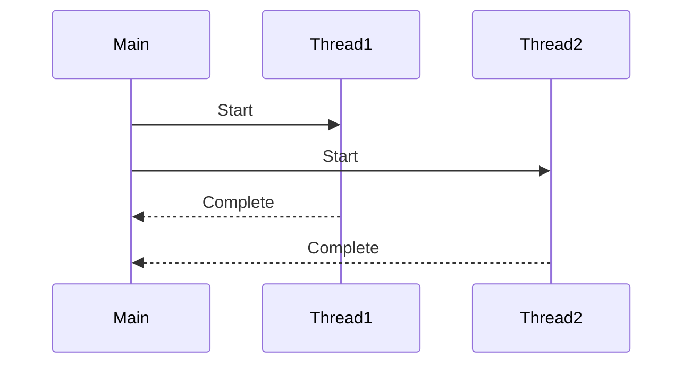
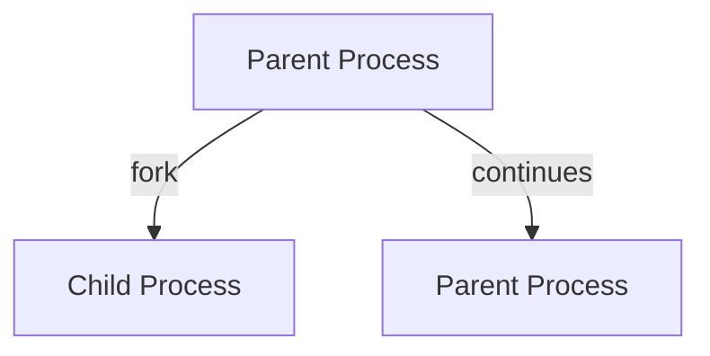

## 9.1 Overview of Concurrency Models

Concurrency and parallelism are fundamental concepts in modern programming, enabling applications to perform multiple tasks simultaneously. In this section, we will explore these concepts, their importance, and how they are implemented in Ruby. We will also delve into the various concurrency models, including threads, processes, event loops, actors, and message passing, and discuss the challenges associated with concurrent programming.

### Understanding Concurrency and Parallelism

**Concurrency** refers to the ability of a program to manage multiple tasks at the same time. These tasks can be executed in overlapping time periods, but not necessarily simultaneously. Concurrency is about dealing with lots of things at once.

**Parallelism**, on the other hand, involves executing multiple tasks simultaneously, typically on multiple processors or cores. Parallelism is about doing lots of things at once.

#### Key Differences

- **Concurrency** is a design pattern to structure a program by breaking it into independent tasks.
- **Parallelism** is a runtime property where tasks are executed simultaneously.

### Importance of Concurrency in Modern Programming

Concurrency is crucial for building responsive and efficient applications. It allows programs to perform tasks such as handling user input, processing data, and communicating over networks without blocking the main execution flow. This is especially important in today's multi-core processor environments, where leveraging concurrency can lead to significant performance improvements.

### Common Concurrency Models

Let's explore some common concurrency models and how they are implemented in Ruby.

#### Threads

Threads are the smallest unit of processing that can be scheduled by an operating system. They allow multiple sequences of instructions to be executed concurrently within the same process.

**Ruby Implementation:**

Ruby provides native support for threads through the `Thread` class. However, it's important to note that the Global Interpreter Lock (GIL) in MRI Ruby limits the execution of Ruby threads to one at a time, which can impact performance in CPU-bound tasks.

```ruby
# Example of creating and using threads in Ruby
thread1 = Thread.new { puts "Thread 1: Hello from Ruby!" }
thread2 = Thread.new { puts "Thread 2: Running concurrently!" }

thread1.join
thread2.join
```

#### Processes

Processes are independent execution units with their own memory space. They are heavier than threads but provide true parallelism since each process can run on a separate CPU core.

**Ruby Implementation:**

Ruby can create processes using the `fork` method, which is available on Unix-like systems. Each process runs independently, and communication between processes can be achieved using inter-process communication (IPC) mechanisms.

```ruby
# Example of forking a process in Ruby
fork do
  puts "This is a child process"
end

puts "This is the parent process"
```

#### Event Loops

Event-driven programming involves using an event loop to manage tasks. This model is particularly useful for I/O-bound applications, such as web servers, where tasks spend a lot of time waiting for external events.

**Ruby Implementation:**

Ruby's `EventMachine` library provides an event-driven I/O framework, allowing developers to build scalable network applications.

```ruby
require 'eventmachine'

EM.run do
  EM.add_timer(1) { puts "Hello from EventMachine!" }
end
```

#### Actors

The actor model treats "actors" as the fundamental units of computation. Actors can send messages to each other and process messages asynchronously.

**Ruby Implementation:**

The `Celluloid` gem provides an actor-based concurrency model for Ruby, allowing developers to build concurrent applications using actors.

```ruby
require 'celluloid'

class MyActor
  include Celluloid

  def greet
    puts "Hello from an actor!"
  end
end

actor = MyActor.new
actor.greet
```

#### Message Passing

Message passing involves communication between concurrent processes or threads through messages. This model is often used in distributed systems.

**Ruby Implementation:**

Ruby supports message passing through various libraries and frameworks, such as `DRb` (Distributed Ruby) for remote method invocation.

```ruby
require 'drb/drb'

# Example of setting up a DRb server
DRb.start_service('druby://localhost:8787', MyService.new)
DRb.thread.join
```

### Ruby's Concurrency Primitives

Ruby offers several concurrency primitives to help developers manage concurrent tasks effectively.

#### Threads

As mentioned earlier, Ruby's `Thread` class allows the creation of threads. However, due to the GIL, Ruby threads are more suitable for I/O-bound tasks rather than CPU-bound tasks.

#### Fibers

Fibers are lightweight concurrency primitives that allow cooperative multitasking. Unlike threads, fibers do not run in parallel but can be paused and resumed, making them useful for implementing coroutines.

```ruby
# Example of using fibers in Ruby
fiber = Fiber.new do
  puts "Fiber says hello!"
  Fiber.yield
  puts "Fiber resumes execution!"
end

fiber.resume
puts "Back to main program"
fiber.resume
```

#### Ractors

Introduced in Ruby 3.0, Ractors provide a way to achieve true parallelism by running code in separate memory spaces. Ractors do not share memory, which eliminates the need for locks and reduces the risk of race conditions.

```ruby
# Example of using ractors in Ruby
ractor = Ractor.new do
  Ractor.yield "Hello from Ractor!"
end

puts ractor.take
```

### Challenges of Concurrent Programming

Concurrent programming introduces several challenges that developers must address to ensure correct and efficient execution.

#### Race Conditions

Race conditions occur when multiple threads or processes access shared resources concurrently, leading to unpredictable results. Proper synchronization is necessary to avoid race conditions.

#### Deadlocks

Deadlocks happen when two or more threads or processes are waiting for each other to release resources, causing the program to hang indefinitely. Careful resource management and deadlock detection techniques are required to prevent deadlocks.

#### Thread Safety

Ensuring thread safety involves protecting shared resources from concurrent access. This can be achieved using synchronization mechanisms such as mutexes and locks.

### Visualizing Concurrency Concepts

To better understand concurrency concepts, let's visualize some of the models using Mermaid.js diagrams.

#### Thread Execution



*Diagram: A sequence diagram showing the execution of two threads concurrently.*

#### Process Forking



*Diagram: A graph showing the forking of a child process from a parent process.*

### Choosing the Right Concurrency Model

Choosing the right concurrency model depends on the specific needs of your application. Consider the following factors:

- **Task Nature**: Determine whether tasks are CPU-bound or I/O-bound.
- **Resource Sharing**: Assess the need for shared resources and synchronization.
- **Scalability**: Consider the scalability requirements of your application.
- **Platform Support**: Ensure the chosen model is supported by your target platform.

### Conclusion

Concurrency is a powerful tool for building responsive and efficient applications. By understanding the various concurrency models and Ruby's concurrency primitives, you can choose the right approach for your application's needs. Remember to consider the challenges of concurrent programming and apply best practices to ensure correct and efficient execution.

### Try It Yourself

Experiment with the code examples provided in this section. Try modifying the thread and process examples to see how they behave with different tasks. Explore the use of fibers and ractors in your applications to achieve concurrency and parallelism.

## Quiz: Overview of Concurrency Models



### What is the primary difference between concurrency and parallelism?

- [x] Concurrency is about managing multiple tasks at once, while parallelism is about executing multiple tasks simultaneously.
- [ ] Concurrency is about executing tasks simultaneously, while parallelism is about managing tasks.
- [ ] Concurrency and parallelism are the same concepts.
- [ ] Concurrency is only applicable to single-core processors.

> **Explanation:** Concurrency involves managing multiple tasks at once, whereas parallelism involves executing tasks simultaneously, often on multiple cores.

### Which Ruby feature limits the execution of threads to one at a time?

- [x] Global Interpreter Lock (GIL)
- [ ] Fibers
- [ ] Ractors
- [ ] EventMachine

> **Explanation:** The Global Interpreter Lock (GIL) in MRI Ruby limits the execution of threads to one at a time.

### What is the primary use of fibers in Ruby?

- [x] Implementing coroutines through cooperative multitasking.
- [ ] Achieving true parallelism.
- [ ] Managing shared resources.
- [ ] Handling I/O-bound tasks.

> **Explanation:** Fibers are used for cooperative multitasking, allowing the implementation of coroutines.

### Which concurrency model is best suited for I/O-bound applications?

- [x] Event-driven models
- [ ] Threads
- [ ] Processes
- [ ] Ractors

> **Explanation:** Event-driven models are well-suited for I/O-bound applications as they efficiently manage tasks that spend time waiting for external events.

### What is a race condition?

- [x] A situation where multiple threads access shared resources concurrently, leading to unpredictable results.
- [ ] A condition where a program runs faster than expected.
- [ ] A scenario where threads execute in a predetermined order.
- [ ] A situation where a program hangs indefinitely.

> **Explanation:** Race conditions occur when multiple threads access shared resources concurrently, leading to unpredictable results.

### How can deadlocks be prevented?

- [x] By careful resource management and deadlock detection techniques.
- [ ] By using more threads.
- [ ] By avoiding the use of processes.
- [ ] By increasing the number of CPU cores.

> **Explanation:** Deadlocks can be prevented through careful resource management and deadlock detection techniques.

### What is the primary advantage of using ractors in Ruby?

- [x] Achieving true parallelism by running code in separate memory spaces.
- [ ] Simplifying thread management.
- [ ] Reducing memory usage.
- [ ] Handling I/O-bound tasks more efficiently.

> **Explanation:** Ractors achieve true parallelism by running code in separate memory spaces, eliminating the need for locks.

### Which concurrency model uses message passing for communication?

- [x] Actors
- [ ] Threads
- [ ] Processes
- [ ] Fibers

> **Explanation:** The actor model uses message passing for communication between actors.

### What is the purpose of the `fork` method in Ruby?

- [x] To create a new process.
- [ ] To create a new thread.
- [ ] To pause a fiber.
- [ ] To manage event loops.

> **Explanation:** The `fork` method is used to create a new process in Ruby.

### True or False: The Global Interpreter Lock (GIL) affects all Ruby implementations.

- [ ] True
- [x] False

> **Explanation:** The GIL primarily affects MRI Ruby. Other implementations like JRuby and Rubinius do not have a GIL.



Remember, this is just the beginning. As you progress, you'll build more complex and interactive applications. Keep experimenting, stay curious, and enjoy the journey!


