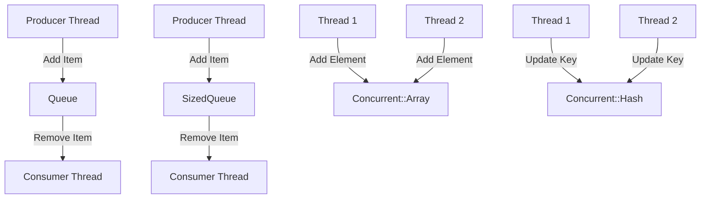

## 9.10 Handling Concurrent Data Structures

In the world of Ruby programming, handling concurrency and ensuring thread safety are critical for building scalable and maintainable applications. This section delves into the realm of concurrent data structures, focusing on Ruby's built-in capabilities and third-party libraries like Concurrent-Ruby. We'll explore how these structures can help you manage data safely across multiple threads, avoid synchronization issues, and improve performance.

### Introduction to Concurrent Data Structures

Concurrent data structures are designed to be safely accessed and modified by multiple threads simultaneously. They play a crucial role in concurrent programming by providing mechanisms to manage shared data without the need for explicit synchronization, such as locks or mutexes. This not only simplifies code but also reduces the risk of common concurrency issues like race conditions and deadlocks.

#### Why Use Concurrent Data Structures?

- **Thread Safety**: Ensure that data is accessed and modified safely across multiple threads.
- **Simplified Code**: Reduce the complexity of managing locks and synchronization manually.
- **Performance**: Improve application performance by allowing multiple threads to work concurrently without blocking each other.
- **Scalability**: Enable applications to scale efficiently by leveraging multi-core processors.

### Ruby's Built-in Thread-safe Collections

Ruby provides a few built-in thread-safe collections that can be used to manage data in concurrent environments. Let's explore some of these collections and how they can be utilized in your applications.

#### Queue

The `Queue` class in Ruby is a thread-safe data structure that follows the First-In-First-Out (FIFO) principle. It is particularly useful for producer-consumer scenarios, where multiple threads produce data that needs to be processed by other threads.

```ruby
require 'thread'

queue = Queue.new

# Producer thread
producer = Thread.new do
  5.times do |i|
    queue << i
    puts "Produced #{i}"
    sleep rand(0.1..0.5)
  end
end

# Consumer thread
consumer = Thread.new do
  5.times do
    item = queue.pop
    puts "Consumed #{item}"
    sleep rand(0.1..0.5)
  end
end

producer.join
consumer.join
```

In this example, the producer thread adds items to the queue, while the consumer thread removes and processes them. The `Queue` class ensures that these operations are thread-safe.

#### SizedQueue

`SizedQueue` is a subclass of `Queue` that adds a size limit to the queue. This is useful when you want to control the number of items in the queue, preventing memory overflow and ensuring that producers do not overwhelm consumers.

```ruby
require 'thread'

sized_queue = SizedQueue.new(3)

# Producer thread
producer = Thread.new do
  5.times do |i|
    sized_queue << i
    puts "Produced #{i}"
    sleep rand(0.1..0.5)
  end
end

# Consumer thread
consumer = Thread.new do
  5.times do
    item = sized_queue.pop
    puts "Consumed #{item}"
    sleep rand(0.1..0.5)
  end
end

producer.join
consumer.join
```

In this example, the `SizedQueue` ensures that the queue never holds more than three items at a time, providing backpressure to the producer when the queue is full.

### Concurrent-Ruby: A Powerful Library for Concurrency

While Ruby's built-in collections are useful, the Concurrent-Ruby gem offers a more comprehensive set of thread-safe data structures and utilities. This library is designed to simplify concurrent programming in Ruby and includes a variety of tools for managing shared data.

#### Installation

To use Concurrent-Ruby, you'll need to install the gem:

```bash
gem install concurrent-ruby
```

#### Key Data Structures in Concurrent-Ruby

Let's explore some of the key data structures provided by Concurrent-Ruby and how they can be used in your applications.

##### Concurrent::Array

`Concurrent::Array` is a thread-safe variant of Ruby's `Array`. It provides the same interface as a regular array but ensures that all operations are atomic and thread-safe.

```ruby
require 'concurrent-ruby'

array = Concurrent::Array.new

# Multiple threads adding elements to the array
threads = 10.times.map do |i|
  Thread.new do
    array << i
  end
end

threads.each(&:join)
puts array.inspect
```

In this example, multiple threads add elements to a `Concurrent::Array`, ensuring that the array remains consistent and thread-safe.

##### Concurrent::Hash

`Concurrent::Hash` is a thread-safe variant of Ruby's `Hash`. It provides atomic operations for accessing and modifying key-value pairs.

```ruby
require 'concurrent-ruby'

hash = Concurrent::Hash.new

# Multiple threads updating the hash
threads = 10.times.map do |i|
  Thread.new do
    hash[i] = i * 2
  end
end

threads.each(&:join)
puts hash.inspect
```

Here, multiple threads update a `Concurrent::Hash`, ensuring that all operations are atomic and thread-safe.

##### Concurrent::Map

`Concurrent::Map` is another thread-safe map implementation that offers better performance than `Concurrent::Hash` for certain use cases. It is optimized for high concurrency and provides atomic operations for accessing and modifying key-value pairs.

```ruby
require 'concurrent-ruby'

map = Concurrent::Map.new

# Multiple threads updating the map
threads = 10.times.map do |i|
  Thread.new do
    map[i] = i * 3
  end
end

threads.each(&:join)
puts map.inspect
```

In this example, `Concurrent::Map` is used to store key-value pairs, ensuring thread safety and high performance.

### Importance of Immutability and Atomic Operations

Immutability and atomic operations are crucial concepts in concurrent programming. They help ensure that data remains consistent and prevent race conditions.

#### Immutability

Immutable objects cannot be modified after they are created. This property makes them inherently thread-safe, as multiple threads can read immutable data without the risk of interference.

```ruby
# Immutable string
immutable_string = "Hello, World!".freeze

# Attempting to modify the string will raise an error
begin
  immutable_string << "!"
rescue => e
  puts "Error: #{e.message}"
end
```

In this example, the `freeze` method is used to make a string immutable, preventing any modifications.

#### Atomic Operations

Atomic operations are indivisible and ensure that a series of actions are completed without interruption. This is essential for maintaining data consistency in concurrent environments.

```ruby
require 'concurrent-ruby'

counter = Concurrent::AtomicFixnum.new(0)

# Multiple threads incrementing the counter
threads = 10.times.map do
  Thread.new do
    1000.times { counter.increment }
  end
end

threads.each(&:join)
puts "Counter: #{counter.value}"
```

In this example, `Concurrent::AtomicFixnum` provides atomic increment operations, ensuring that the counter remains consistent across multiple threads.

### Avoiding Synchronization Issues

Synchronization issues, such as race conditions and deadlocks, can lead to unpredictable behavior and difficult-to-debug errors. Using thread-safe data structures and atomic operations can help avoid these issues.

#### Race Conditions

A race condition occurs when multiple threads access shared data simultaneously, leading to inconsistent or incorrect results. Thread-safe data structures and atomic operations help prevent race conditions by ensuring that data is accessed and modified safely.

#### Deadlocks

A deadlock occurs when two or more threads are blocked, waiting for each other to release resources. Using high-level concurrency constructs, such as those provided by Concurrent-Ruby, can help avoid deadlocks by reducing the need for explicit locks.

### Performance Considerations and Scalability

When working with concurrent data structures, it's important to consider performance and scalability. While thread-safe data structures simplify concurrency, they can introduce overhead due to synchronization.

#### Performance Tips

- **Choose the Right Data Structure**: Select data structures that are optimized for your use case. For example, `Concurrent::Map` may offer better performance than `Concurrent::Hash` in high-concurrency scenarios.
- **Minimize Contention**: Reduce the number of threads competing for the same resources to improve performance.
- **Use Immutability**: Leverage immutable data structures to avoid unnecessary synchronization.

#### Scalability

Concurrent data structures enable applications to scale efficiently by leveraging multi-core processors. By allowing multiple threads to work concurrently, you can improve throughput and responsiveness.

### Try It Yourself

To deepen your understanding of concurrent data structures, try modifying the examples provided in this section. Experiment with different data structures, thread counts, and operations to see how they affect performance and behavior.

### Visualizing Concurrent Data Structures

To better understand how concurrent data structures work, let's visualize the interaction between threads and data structures using Mermaid.js.



This diagram illustrates how producer and consumer threads interact with `Queue` and `SizedQueue`, as well as how multiple threads update `Concurrent::Array` and `Concurrent::Hash`.

### References and Links

For further reading on concurrent data structures and concurrency in Ruby, consider the following resources:

- [Ruby's Thread Documentation](https://ruby-doc.org/core-3.0.0/Thread.html)
- [Concurrent-Ruby GitHub Repository](https://github.com/ruby-concurrency/concurrent-ruby)
- [Concurrency in Ruby: A Guide](https://www.rubyguides.com/2015/07/ruby-concurrency/)

### Knowledge Check

To reinforce your understanding of concurrent data structures, consider the following questions and exercises:

1. What are the benefits of using thread-safe data structures in Ruby?
2. How does `SizedQueue` differ from `Queue`?
3. Experiment with `Concurrent::Array` by adding and removing elements from multiple threads. What do you observe?
4. Why is immutability important in concurrent programming?
5. How can atomic operations help prevent race conditions?

### Embrace the Journey

Remember, mastering concurrent data structures is just one step in your journey to becoming a proficient Ruby developer. As you continue to explore concurrency and parallelism, you'll gain the skills needed to build robust, scalable applications. Keep experimenting, stay curious, and enjoy the journey!

## Quiz: Handling Concurrent Data Structures



### What is a key benefit of using thread-safe data structures?

- [x] They ensure data is accessed safely across multiple threads.
- [ ] They eliminate the need for any synchronization.
- [ ] They automatically improve code readability.
- [ ] They are faster than non-thread-safe structures.

> **Explanation:** Thread-safe data structures ensure that data is accessed and modified safely across multiple threads, reducing the risk of concurrency issues.

### Which Ruby class is used for a thread-safe FIFO queue?

- [x] Queue
- [ ] Array
- [ ] Hash
- [ ] Set

> **Explanation:** The `Queue` class in Ruby is a thread-safe data structure that follows the FIFO principle.

### What does the `SizedQueue` class add to the `Queue` class?

- [x] A size limit
- [ ] Faster performance
- [ ] Automatic sorting
- [ ] Thread prioritization

> **Explanation:** `SizedQueue` is a subclass of `Queue` that adds a size limit, controlling the number of items in the queue.

### What is the purpose of `Concurrent::Array`?

- [x] To provide a thread-safe variant of Ruby's `Array`
- [ ] To sort arrays automatically
- [ ] To improve array performance
- [ ] To reduce memory usage

> **Explanation:** `Concurrent::Array` is a thread-safe variant of Ruby's `Array`, ensuring that all operations are atomic and thread-safe.

### How can immutability help in concurrent programming?

- [x] It prevents data from being modified, ensuring thread safety.
- [ ] It makes code run faster.
- [ ] It reduces memory usage.
- [ ] It simplifies code readability.

> **Explanation:** Immutability ensures that data cannot be modified after creation, making it inherently thread-safe.

### What is an atomic operation?

- [x] An indivisible operation that ensures data consistency
- [ ] A faster operation
- [ ] An operation that uses less memory
- [ ] An operation that is always thread-safe

> **Explanation:** Atomic operations are indivisible and ensure that a series of actions are completed without interruption, maintaining data consistency.

### What issue can occur if multiple threads access shared data simultaneously?

- [x] Race conditions
- [ ] Improved performance
- [ ] Reduced memory usage
- [ ] Automatic synchronization

> **Explanation:** Race conditions occur when multiple threads access shared data simultaneously, leading to inconsistent or incorrect results.

### How can deadlocks be avoided in concurrent programming?

- [x] By using high-level concurrency constructs
- [ ] By increasing the number of threads
- [ ] By reducing memory usage
- [ ] By using more locks

> **Explanation:** Using high-level concurrency constructs can help avoid deadlocks by reducing the need for explicit locks.

### What is a performance consideration when using concurrent data structures?

- [x] They can introduce overhead due to synchronization.
- [ ] They always improve performance.
- [ ] They reduce memory usage.
- [ ] They eliminate the need for locks.

> **Explanation:** While concurrent data structures simplify concurrency, they can introduce overhead due to synchronization.

### True or False: Concurrent data structures enable applications to scale efficiently by leveraging multi-core processors.

- [x] True
- [ ] False

> **Explanation:** Concurrent data structures allow multiple threads to work concurrently, improving throughput and responsiveness, and enabling efficient scaling.




