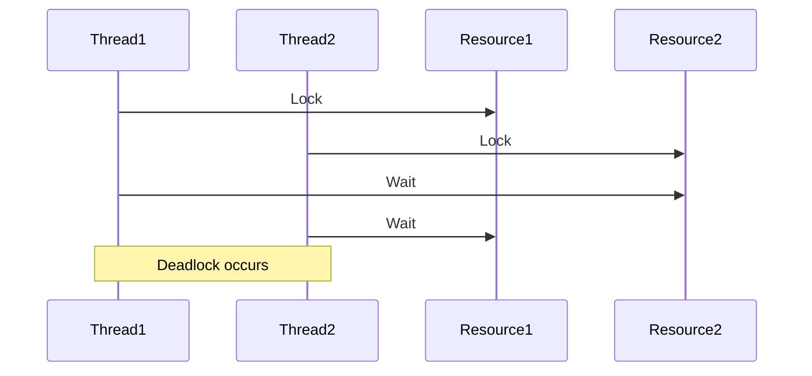

## 9.12 Debugging Concurrent Applications

Concurrency in Ruby can significantly enhance the performance and responsiveness of applications by allowing multiple tasks to run simultaneously. However, it also introduces complexity, making debugging a challenging task. In this section, we will explore common issues that arise in concurrent applications, such as deadlocks, race conditions, and performance bottlenecks. We will also introduce various debugging tools and techniques to diagnose and resolve these issues effectively.

### Common Issues in Concurrent Applications

Before diving into debugging techniques, it's essential to understand the common problems that can occur in concurrent applications:

1. **Deadlocks**: Occur when two or more threads are blocked forever, each waiting for the other to release a resource.
2. **Race Conditions**: Happen when the outcome of a program depends on the sequence or timing of uncontrollable events, such as thread scheduling.
3. **Performance Bottlenecks**: Arise when certain parts of the code slow down the entire application, often due to inefficient resource management or contention.

### Debugging Tools and Techniques

#### 1. Using `Thread#backtrace`

The `Thread#backtrace` method is a powerful tool for inspecting the call stack of a thread. It can help identify where a thread is stuck or what it was doing when an error occurred.

```ruby
threads = []

5.times do |i|
  threads << Thread.new do
    sleep(rand(0..5))
    puts "Thread #{i} finished"
  end
end

threads.each do |thread|
  puts thread.backtrace if thread.status == 'sleep'
end
```

**Explanation**: In this example, we create multiple threads that sleep for a random duration. Using `Thread#backtrace`, we can inspect the call stack of each thread to understand its current state.

#### 2. Detecting Deadlocks

Deadlocks can be tricky to detect, but Ruby provides a built-in method `Thread.list` to help identify them. By analyzing the status of all threads, we can determine if a deadlock has occurred.

```ruby
mutex1 = Mutex.new
mutex2 = Mutex.new

thread1 = Thread.new do
  mutex1.synchronize do
    sleep(1)
    mutex2.synchronize do
      puts "Thread 1 acquired both locks"
    end
  end
end

thread2 = Thread.new do
  mutex2.synchronize do
    sleep(1)
    mutex1.synchronize do
      puts "Thread 2 acquired both locks"
    end
  end
end

sleep(2)
deadlocked = Thread.list.select { |t| t.status == 'sleep' }
puts "Deadlocked threads: #{deadlocked.map(&:object_id)}" unless deadlocked.empty?
```

**Explanation**: This code snippet demonstrates a classic deadlock scenario. By checking the status of threads, we can identify if any are stuck in a deadlock.

#### 3. Resolving Race Conditions

Race conditions can be resolved by ensuring that shared resources are accessed in a thread-safe manner. Using mutexes or other synchronization primitives can help achieve this.

```ruby
counter = 0
mutex = Mutex.new

threads = 10.times.map do
  Thread.new do
    1000.times do
      mutex.synchronize do
        counter += 1
      end
    end
  end
end

threads.each(&:join)
puts "Counter: #{counter}"
```

**Explanation**: In this example, we use a mutex to synchronize access to a shared counter, preventing race conditions.

### Profiling and Monitoring Tools

Profiling and monitoring tools are essential for analyzing the performance of concurrent applications. They help identify bottlenecks and optimize resource usage.

#### 1. Profiling with `ruby-prof`

`ruby-prof` is a powerful profiling tool that provides detailed insights into the performance of Ruby applications. It can help identify slow methods and optimize them.

```ruby
require 'ruby-prof'

RubyProf.start

# Code to profile
1000.times do
  sleep(0.01)
end

result = RubyProf.stop

# Print a flat profile to text
printer = RubyProf::FlatPrinter.new(result)
printer.print(STDOUT)
```

**Explanation**: This example demonstrates how to use `ruby-prof` to profile a block of code and print the results.

#### 2. Monitoring with `NewRelic`

NewRelic is a comprehensive monitoring tool that provides real-time insights into application performance. It can help track metrics such as response time, throughput, and error rates.

**Integration Steps**:
1. Sign up for a NewRelic account and obtain an API key.
2. Install the `newrelic_rpm` gem in your Ruby application.
3. Configure the `newrelic.yml` file with your API key and application settings.
4. Deploy your application and monitor its performance through the NewRelic dashboard.

### Best Practices for Logging and Error Handling

Effective logging and error handling are crucial for debugging concurrent applications. They provide valuable insights into the application's behavior and help identify issues early.

#### 1. Structured Logging

Structured logging involves logging messages in a structured format, such as JSON, to facilitate easy parsing and analysis.

```ruby
require 'json'

def log_message(level, message)
  log_entry = {
    timestamp: Time.now,
    level: level,
    message: message
  }
  puts log_entry.to_json
end

log_message('INFO', 'Application started')
```

**Explanation**: This example demonstrates how to log messages in a structured format using JSON.

#### 2. Error Handling with `begin-rescue`

Using `begin-rescue` blocks to handle exceptions gracefully is a best practice in concurrent applications. It ensures that errors are logged and handled appropriately without crashing the application.

```ruby
begin
  # Code that may raise an exception
  raise 'An error occurred'
rescue => e
  puts "Error: #{e.message}"
end
```

**Explanation**: This code snippet shows how to use a `begin-rescue` block to catch and handle exceptions.

### Proactive Testing Strategies

Proactive testing strategies help identify concurrency issues early in the development process, reducing the risk of bugs in production.

#### 1. Unit Testing with `RSpec`

RSpec is a popular testing framework for Ruby that supports unit testing of concurrent code. Writing comprehensive test cases can help ensure the correctness of your application.

```ruby
require 'rspec'

RSpec.describe 'Concurrent Code' do
  it 'increments the counter correctly' do
    counter = 0
    mutex = Mutex.new

    threads = 10.times.map do
      Thread.new do
        1000.times do
          mutex.synchronize do
            counter += 1
          end
        end
      end
    end

    threads.each(&:join)
    expect(counter).to eq(10000)
  end
end
```

**Explanation**: This RSpec test case verifies that the counter is incremented correctly in a concurrent environment.

#### 2. Stress Testing

Stress testing involves simulating high load conditions to identify performance bottlenecks and ensure the application can handle concurrent requests efficiently.

**Steps for Stress Testing**:
1. Identify critical paths in your application that need testing.
2. Use tools like `Apache JMeter` or `Gatling` to simulate high load conditions.
3. Analyze the results to identify bottlenecks and optimize performance.

### Visualizing Concurrency Issues

Visualizing concurrency issues can help understand complex interactions between threads and identify potential problems.



**Description**: This sequence diagram illustrates a deadlock scenario where two threads are waiting for each other to release resources.

### Summary

Debugging concurrent applications in Ruby requires a deep understanding of concurrency issues and effective use of debugging tools and techniques. By proactively testing and monitoring your application, you can identify and resolve issues early, ensuring a robust and performant application.

### Key Takeaways

- **Understand common concurrency issues**: Deadlocks, race conditions, and performance bottlenecks.
- **Use debugging tools effectively**: `Thread#backtrace`, `ruby-prof`, and NewRelic.
- **Implement best practices**: Structured logging, error handling, and proactive testing.
- **Visualize concurrency issues**: Use diagrams to understand complex interactions.

Remember, debugging concurrent applications is a journey. Stay curious, keep experimenting, and enjoy the process of building scalable and maintainable Ruby applications.

## Quiz: Debugging Concurrent Applications



### What is a common issue in concurrent applications?

- [x] Deadlocks
- [ ] Syntax errors
- [ ] Memory leaks
- [ ] Compilation errors

> **Explanation:** Deadlocks are a common issue in concurrent applications where threads are blocked forever, waiting for each other to release resources.

### Which method can be used to inspect the call stack of a thread in Ruby?

- [x] Thread#backtrace
- [ ] Thread#status
- [ ] Thread#join
- [ ] Thread#kill

> **Explanation:** Thread#backtrace is used to inspect the call stack of a thread, helping identify where it is stuck or what it was doing when an error occurred.

### How can race conditions be resolved in Ruby?

- [x] By using mutexes
- [ ] By using global variables
- [ ] By increasing thread priority
- [ ] By using more threads

> **Explanation:** Race conditions can be resolved by using mutexes or other synchronization primitives to ensure thread-safe access to shared resources.

### What tool can be used for profiling Ruby applications?

- [x] ruby-prof
- [ ] NewRelic
- [ ] Apache JMeter
- [ ] RSpec

> **Explanation:** ruby-prof is a profiling tool that provides detailed insights into the performance of Ruby applications, helping identify slow methods.

### What is the purpose of structured logging?

- [x] To facilitate easy parsing and analysis of log messages
- [ ] To increase application performance
- [ ] To reduce memory usage
- [ ] To enhance security

> **Explanation:** Structured logging involves logging messages in a structured format, such as JSON, to facilitate easy parsing and analysis.

### Which block is used for handling exceptions in Ruby?

- [x] begin-rescue
- [ ] try-catch
- [ ] if-else
- [ ] switch-case

> **Explanation:** The begin-rescue block is used for handling exceptions in Ruby, allowing errors to be logged and handled appropriately.

### What is the benefit of proactive testing strategies?

- [x] Identifying concurrency issues early
- [ ] Reducing code complexity
- [ ] Increasing code readability
- [ ] Enhancing user interface

> **Explanation:** Proactive testing strategies help identify concurrency issues early in the development process, reducing the risk of bugs in production.

### Which tool can be used for stress testing applications?

- [x] Apache JMeter
- [ ] ruby-prof
- [ ] NewRelic
- [ ] RSpec

> **Explanation:** Apache JMeter is a tool used for stress testing applications by simulating high load conditions.

### What does the sequence diagram illustrate in the context of concurrency?

- [x] A deadlock scenario
- [ ] A race condition
- [ ] A performance bottleneck
- [ ] A syntax error

> **Explanation:** The sequence diagram illustrates a deadlock scenario where two threads are waiting for each other to release resources.

### True or False: Debugging concurrent applications is a straightforward process.

- [ ] True
- [x] False

> **Explanation:** Debugging concurrent applications is complex due to the intricate interactions between threads and the potential for issues like deadlocks and race conditions.




