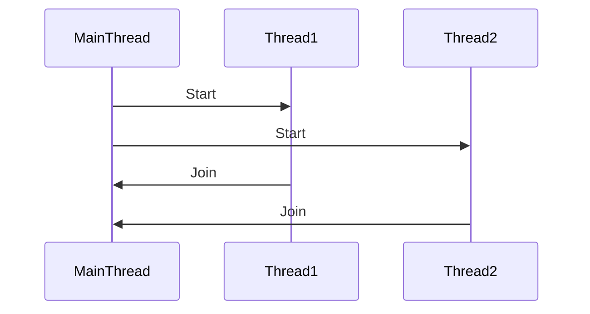

## 9.2 Threads and Thread Safety

Concurrency is a powerful concept in programming that allows multiple tasks to be executed simultaneously, improving the efficiency and responsiveness of applications. In Ruby, threads are the primary mechanism for achieving concurrency. This section will guide you through the intricacies of Ruby's `Thread` class, how to manage threads, and the critical concept of thread safety to prevent common concurrency issues.

### Understanding Threads in Ruby

Threads are lightweight processes that share the same memory space, allowing them to run concurrently within a single program. In Ruby, threads enable you to perform multiple operations simultaneously, making your applications more efficient and responsive.

#### Creating and Managing Threads

In Ruby, you can create threads using the `Thread` class. Here's a simple example to demonstrate how to create and run a thread:

```ruby
# Creating a new thread
thread = Thread.new do
  5.times do |i|
    puts "Thread #{i}"
    sleep(1)
  end
end

# Main thread continues to run
5.times do |i|
  puts "Main #{i}"
  sleep(1)
end

# Wait for the thread to finish
thread.join
```

In this example, we create a new thread that prints "Thread" followed by a number, while the main thread prints "Main" followed by a number. The `join` method is used to wait for the thread to complete its execution before the program exits.

### Thread Safety and Concurrency Issues

Thread safety is a crucial aspect of concurrent programming. It refers to the property of a program or code segment to function correctly during simultaneous execution by multiple threads. When threads share mutable data, concurrency issues such as race conditions can occur.

#### Race Conditions

A race condition occurs when two or more threads access shared data and try to change it simultaneously. The final outcome depends on the sequence of thread execution, which can lead to unpredictable results.

```ruby
# Example of a race condition
counter = 0

threads = 10.times.map do
  Thread.new do
    1000.times do
      counter += 1
    end
  end
end

threads.each(&:join)
puts counter # Expected: 10000, but may vary due to race condition
```

In this example, multiple threads increment the `counter` variable. Due to the race condition, the final value of `counter` may not be as expected.

### Synchronization Mechanisms

To prevent race conditions and ensure thread safety, synchronization mechanisms like Mutexes and Monitors are used.

#### Mutexes

A Mutex (short for mutual exclusion) is a synchronization primitive that allows only one thread to access a resource at a time.

```ruby
# Using a Mutex to prevent race conditions
counter = 0
mutex = Mutex.new

threads = 10.times.map do
  Thread.new do
    1000.times do
      mutex.synchronize do
        counter += 1
      end
    end
  end
end

threads.each(&:join)
puts counter # Correctly outputs 10000
```

In this example, the `synchronize` method ensures that only one thread can increment the `counter` at a time, preventing race conditions.

#### Monitors

Monitors are another synchronization mechanism in Ruby, providing a higher-level abstraction than Mutexes. They are used to synchronize access to shared resources.

```ruby
# Using a Monitor for synchronization
require 'monitor'

counter = 0
monitor = Monitor.new

threads = 10.times.map do
  Thread.new do
    1000.times do
      monitor.synchronize do
        counter += 1
      end
    end
  end
end

threads.each(&:join)
puts counter # Correctly outputs 10000
```

Monitors provide a similar interface to Mutexes but are more flexible and can be used to implement complex synchronization patterns.

### The Global Interpreter Lock (GIL)

In MRI (Matz's Ruby Interpreter), the Global Interpreter Lock (GIL) is a mutex that prevents multiple native threads from executing Ruby code simultaneously. This means that even though you can create multiple threads, only one can execute Ruby code at a time. The GIL simplifies memory management but can be a bottleneck for CPU-bound tasks.

### Best Practices for Thread Safety

1. **Minimize Shared State**: Reduce the amount of shared mutable state between threads to minimize the risk of concurrency issues.
2. **Use Immutable Objects**: Immutable objects are inherently thread-safe, as their state cannot be modified after creation.
3. **Leverage Synchronization Primitives**: Use Mutexes, Monitors, or other synchronization mechanisms to protect shared resources.
4. **Thread-Local Variables**: Use thread-local variables to store data that is specific to a thread, reducing the need for shared state.

#### Thread-Local Variables

Thread-local variables are variables that are local to a thread. They can be used to store data that is specific to a thread, reducing the need for shared state.

```ruby
# Using thread-local variables
Thread.new do
  Thread.current[:my_data] = "Thread-specific data"
  puts Thread.current[:my_data]
end.join
```

In this example, `Thread.current[:my_data]` is a thread-local variable that stores data specific to the current thread.

### Visualizing Thread Execution

To better understand how threads execute concurrently, let's visualize the process using a sequence diagram.



This diagram illustrates the sequence of events when two threads are started and then joined back to the main thread.

### Try It Yourself

Experiment with the code examples provided. Try modifying the number of threads or the operations performed within each thread. Observe how changes affect the program's behavior and output.

### Knowledge Check

- What is a race condition, and how can it be prevented?
- How does the Global Interpreter Lock (GIL) affect threading in Ruby?
- What are the differences between Mutexes and Monitors?

### Summary

In this section, we've explored the fundamentals of threads and thread safety in Ruby. We've learned how to create and manage threads, the importance of thread safety, and how to use synchronization mechanisms to prevent concurrency issues. By following best practices and understanding the impact of the GIL, you can write efficient and thread-safe Ruby code.

Remember, mastering concurrency is a journey. Keep experimenting, stay curious, and enjoy the process!

## Quiz: Threads and Thread Safety



### What is a race condition?

- [x] A situation where two or more threads access shared data and try to change it simultaneously.
- [ ] A condition where threads are executed in a predetermined order.
- [ ] A method to synchronize threads.
- [ ] A type of exception in Ruby.

> **Explanation:** A race condition occurs when threads access shared data simultaneously, leading to unpredictable results.

### How can you prevent race conditions in Ruby?

- [x] By using Mutexes to synchronize access to shared resources.
- [ ] By increasing the number of threads.
- [ ] By using thread-local variables.
- [ ] By avoiding the use of threads altogether.

> **Explanation:** Mutexes are used to synchronize access to shared resources, preventing race conditions.

### What is the Global Interpreter Lock (GIL) in Ruby?

- [x] A mutex that prevents multiple native threads from executing Ruby code simultaneously.
- [ ] A lock that allows multiple threads to execute concurrently.
- [ ] A mechanism to improve thread performance.
- [ ] A feature that enhances memory management.

> **Explanation:** The GIL is a mutex that prevents multiple native threads from executing Ruby code simultaneously in MRI.

### What is the purpose of thread-local variables?

- [x] To store data that is specific to a thread, reducing the need for shared state.
- [ ] To synchronize access to shared resources.
- [ ] To increase the number of threads.
- [ ] To improve thread performance.

> **Explanation:** Thread-local variables store data specific to a thread, reducing the need for shared state.

### Which of the following is a best practice for writing thread-safe code?

- [x] Minimize shared state between threads.
- [ ] Use as many threads as possible.
- [x] Use immutable objects.
- [ ] Avoid using synchronization mechanisms.

> **Explanation:** Minimizing shared state and using immutable objects are best practices for writing thread-safe code.

### What is a Mutex in Ruby?

- [x] A synchronization primitive that allows only one thread to access a resource at a time.
- [ ] A type of thread in Ruby.
- [ ] A method for creating threads.
- [ ] A variable local to a thread.

> **Explanation:** A Mutex is a synchronization primitive that allows only one thread to access a resource at a time.

### What is the difference between Mutexes and Monitors?

- [x] Monitors provide a higher-level abstraction than Mutexes.
- [ ] Mutexes are more flexible than Monitors.
- [x] Monitors can be used to implement complex synchronization patterns.
- [ ] Mutexes are used for thread-local variables.

> **Explanation:** Monitors provide a higher-level abstraction and can be used to implement complex synchronization patterns.

### How does the GIL affect CPU-bound tasks in Ruby?

- [x] It can be a bottleneck because only one thread can execute Ruby code at a time.
- [ ] It improves performance by allowing multiple threads to execute concurrently.
- [ ] It enhances memory management for CPU-bound tasks.
- [ ] It has no impact on CPU-bound tasks.

> **Explanation:** The GIL can be a bottleneck for CPU-bound tasks because only one thread can execute Ruby code at a time.

### What is the `join` method used for in threading?

- [x] To wait for a thread to finish its execution before the program exits.
- [ ] To start a new thread.
- [ ] To synchronize access to shared resources.
- [ ] To create thread-local variables.

> **Explanation:** The `join` method is used to wait for a thread to finish its execution before the program exits.

### True or False: Immutable objects are inherently thread-safe.

- [x] True
- [ ] False

> **Explanation:** Immutable objects are inherently thread-safe because their state cannot be modified after creation.


