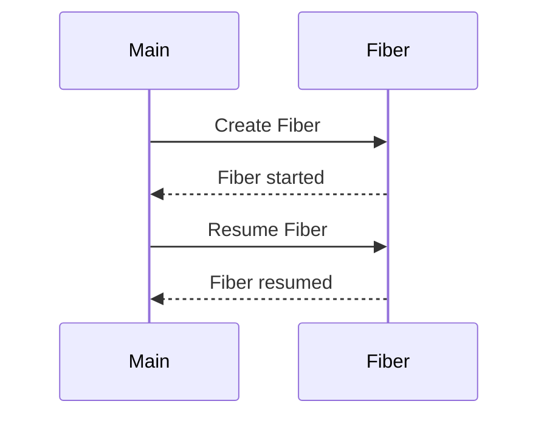

## 9.3 Fibers and Cooperative Concurrency

Concurrency is a crucial aspect of modern software development, enabling applications to perform multiple tasks simultaneously. In Ruby, Fibers provide a unique approach to concurrency, known as cooperative concurrency. This section delves into the concept of Fibers, how they differ from Threads, and their practical applications in Ruby programming.

### Understanding Fibers

Fibers in Ruby are lightweight concurrency primitives that allow developers to manually control the execution of code blocks. Unlike Threads, which operate under a preemptive concurrency model, Fibers use cooperative concurrency. This means that the control of execution is explicitly managed by the programmer, allowing for more predictable and fine-grained control over task execution.

#### Fibers vs. Threads

- **Threads**: Threads in Ruby are part of the preemptive concurrency model, where the operating system scheduler decides when to switch between threads. This can lead to race conditions and requires careful management of shared resources.
- **Fibers**: Fibers, on the other hand, are part of the cooperative concurrency model. They do not run concurrently with each other; instead, they yield control back to the calling code, allowing the programmer to decide when to switch between tasks.

### Cooperative vs. Preemptive Concurrency

- **Cooperative Concurrency**: In cooperative concurrency, tasks voluntarily yield control, allowing other tasks to run. This model is simpler to reason about because the developer has explicit control over task switching.
- **Preemptive Concurrency**: In preemptive concurrency, the operating system or runtime environment decides when to switch between tasks, which can lead to more complex interactions and potential race conditions.

### Creating and Using Fibers

Let's explore how to create and use Fibers in Ruby. The `Fiber` class provides the necessary methods to define and manage fibers.

#### Creating a Fiber

To create a Fiber, use the `Fiber.new` method, passing a block of code that represents the task to be executed.

```ruby
fiber = Fiber.new do
  puts "Fiber started"
  Fiber.yield
  puts "Fiber resumed"
end
```

In this example, the fiber prints a message, yields control, and then resumes execution when explicitly instructed.

#### Resuming a Fiber

To resume a Fiber, use the `fiber.resume` method. This method continues the execution of the fiber from the point it yielded.

```ruby
fiber.resume
# Output: Fiber started

fiber.resume
# Output: Fiber resumed
```

The `Fiber.yield` method is used within the fiber to pause execution and return control to the calling code. The `fiber.resume` method is then used to continue execution from where it left off.

### Use Cases for Fibers

Fibers are particularly useful in scenarios where tasks need to be paused and resumed explicitly. Here are some common use cases:

- **IO-bound Applications**: Fibers can improve performance in IO-bound applications by allowing tasks to yield control while waiting for IO operations to complete, thus enabling other tasks to run.
- **Generators and Enumerators**: Fibers are used internally in Ruby to implement generators and enumerators, providing a way to iterate over data lazily.
- **Coroutines**: Fibers can be used to implement coroutines, which are general control structures that generalize subroutines for non-preemptive multitasking.

### Limitations of Fibers

While Fibers offer several advantages, they also come with limitations:

- **Single-threaded Execution**: Fibers do not utilize multiple CPU cores, as they operate within a single thread. This makes them unsuitable for CPU-bound tasks that require parallel execution.
- **Manual Control**: The need for explicit control over task switching can lead to complex code if not managed carefully.

### Improving Performance with Fibers

In IO-bound applications, Fibers can significantly improve performance by allowing tasks to yield control during IO operations. This enables other tasks to execute while waiting for IO to complete, reducing idle time and increasing throughput.

### Enumerator and Generator

Ruby's Enumerator and Generator classes internally use Fibers to provide lazy iteration over collections. This allows developers to create custom iterators that yield values one at a time, improving memory efficiency and performance.

#### Example: Custom Enumerator with Fiber

```ruby
def custom_enumerator
  Fiber.new do
    (1..5).each do |i|
      Fiber.yield i
    end
  end
end

enumerator = custom_enumerator

5.times do
  puts enumerator.resume
end
```

In this example, a custom enumerator is created using a Fiber, yielding values from 1 to 5. The `Fiber.yield` method is used to pause execution and return each value to the calling code.

### Visualizing Fibers and Cooperative Concurrency

To better understand the flow of execution in Fibers, let's visualize the process using a Mermaid.js diagram:



This diagram illustrates the interaction between the main program and a Fiber, highlighting the creation, yielding, and resumption of the Fiber.

### References and Further Reading

- [Ruby Documentation on Fibers](https://ruby-doc.org/core-3.0.0/Fiber.html)
- [Concurrency in Ruby](https://www.ruby-lang.org/en/documentation/)
- [Understanding Cooperative Concurrency](https://en.wikipedia.org/wiki/Cooperative_multitasking)

### Knowledge Check

To reinforce your understanding of Fibers and cooperative concurrency, consider the following questions:

- What is the primary difference between Fibers and Threads in Ruby?
- How does cooperative concurrency differ from preemptive concurrency?
- In what scenarios are Fibers particularly advantageous?
- What are the limitations of using Fibers in Ruby applications?

### Embrace the Journey

Remember, mastering concurrency in Ruby is a journey. As you explore Fibers and cooperative concurrency, you'll gain valuable insights into managing task execution and improving application performance. Keep experimenting, stay curious, and enjoy the journey!

## Quiz: Fibers and Cooperative Concurrency



### What is the primary difference between Fibers and Threads in Ruby?

- [x] Fibers use cooperative concurrency, while Threads use preemptive concurrency.
- [ ] Fibers use preemptive concurrency, while Threads use cooperative concurrency.
- [ ] Both Fibers and Threads use cooperative concurrency.
- [ ] Both Fibers and Threads use preemptive concurrency.

> **Explanation:** Fibers use cooperative concurrency, allowing manual control over execution, whereas Threads use preemptive concurrency, managed by the operating system.

### How do you create a Fiber in Ruby?

- [x] Using `Fiber.new` with a block of code.
- [ ] Using `Thread.new` with a block of code.
- [ ] Using `Fiber.create` with a block of code.
- [ ] Using `Thread.create` with a block of code.

> **Explanation:** Fibers are created using `Fiber.new`, passing a block of code that represents the task to be executed.

### What method is used to pause a Fiber's execution?

- [x] `Fiber.yield`
- [ ] `Fiber.pause`
- [ ] `Fiber.stop`
- [ ] `Fiber.wait`

> **Explanation:** `Fiber.yield` is used within a Fiber to pause execution and return control to the calling code.

### What method is used to resume a Fiber's execution?

- [x] `fiber.resume`
- [ ] `fiber.start`
- [ ] `fiber.continue`
- [ ] `fiber.run`

> **Explanation:** `fiber.resume` is used to continue the execution of a Fiber from the point it yielded.

### In what scenarios are Fibers particularly advantageous?

- [x] IO-bound applications
- [ ] CPU-bound applications
- [x] Generators and Enumerators
- [ ] Parallel processing

> **Explanation:** Fibers are advantageous in IO-bound applications and for implementing generators and enumerators, where tasks can yield control during IO operations.

### What is a limitation of Fibers in Ruby?

- [x] They do not utilize multiple CPU cores.
- [ ] They cannot be used for IO-bound tasks.
- [ ] They require complex synchronization.
- [ ] They are slower than Threads.

> **Explanation:** Fibers operate within a single thread and do not utilize multiple CPU cores, making them unsuitable for CPU-bound tasks.

### How can Fibers improve performance in IO-bound applications?

- [x] By allowing tasks to yield control during IO operations.
- [ ] By running tasks in parallel on multiple cores.
- [ ] By using preemptive task switching.
- [ ] By reducing memory usage.

> **Explanation:** Fibers can yield control during IO operations, allowing other tasks to execute and reducing idle time.

### What Ruby classes internally use Fibers?

- [x] Enumerator
- [ ] Thread
- [x] Generator
- [ ] Mutex

> **Explanation:** Ruby's Enumerator and Generator classes internally use Fibers to provide lazy iteration over collections.

### What is cooperative concurrency?

- [x] Tasks voluntarily yield control to allow other tasks to run.
- [ ] The operating system decides when to switch between tasks.
- [ ] Tasks run in parallel on multiple cores.
- [ ] Tasks are managed by a central scheduler.

> **Explanation:** In cooperative concurrency, tasks voluntarily yield control, allowing other tasks to run, providing explicit control over task switching.

### True or False: Fibers can be used for parallel processing on multiple CPU cores.

- [ ] True
- [x] False

> **Explanation:** False. Fibers operate within a single thread and do not utilize multiple CPU cores, making them unsuitable for parallel processing.




