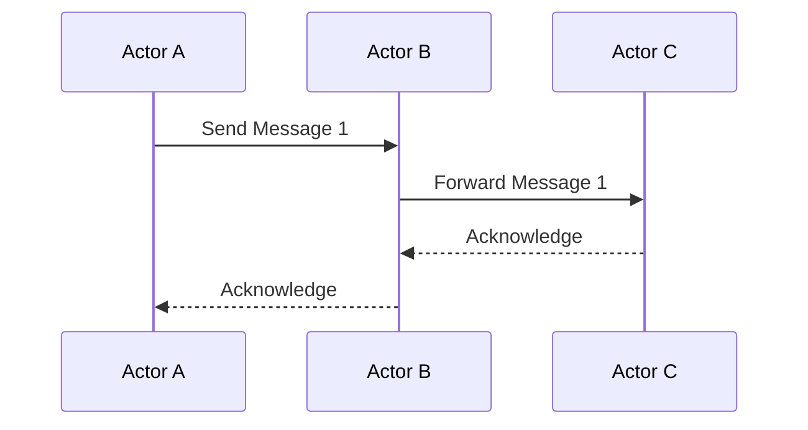

## 9.5 Actors Model with Celluloid and Concurrent-Ruby

Concurrency is a crucial aspect of modern software development, allowing applications to perform multiple tasks simultaneously. In Ruby, the Actor model provides a powerful abstraction for managing concurrency by encapsulating state and behavior within independent actors that communicate through message passing. This section delves into the Actor model, its implementation in Ruby using libraries like Celluloid and Concurrent-Ruby, and how it can be leveraged to build scalable and maintainable applications.

### Understanding the Actor Model

The Actor model is a conceptual framework for designing concurrent systems. It treats "actors" as the fundamental units of computation. Each actor is an independent entity with its own state and behavior, capable of:

- **Receiving Messages**: Actors communicate by sending and receiving messages.
- **Changing State**: Actors can modify their internal state in response to messages.
- **Creating More Actors**: Actors can spawn new actors to handle specific tasks.

This model promotes encapsulation and avoids shared state, reducing the complexity of concurrent programming.

### Implementing the Actor Model in Ruby

Ruby offers several libraries that implement the Actor model, with Celluloid and Concurrent-Ruby being the most notable. While Celluloid was once a popular choice, it is no longer actively maintained. Concurrent-Ruby, on the other hand, is a robust and actively developed library that provides a comprehensive suite of concurrency tools, including actors.

#### Celluloid: A Historical Perspective

Celluloid was designed to simplify concurrent object-oriented programming by integrating the Actor model with Ruby's object system. It allowed developers to create actors by simply including the `Celluloid` module in their classes.

```ruby
require 'celluloid/current'

class MyActor
  include Celluloid

  def greet(name)
    puts "Hello, #{name}!"
  end
end

actor = MyActor.new
actor.greet("World")
```

In this example, `MyActor` becomes an actor capable of handling concurrent method calls. However, due to maintenance issues, Celluloid is not recommended for new projects.

#### Concurrent-Ruby: The Modern Choice

Concurrent-Ruby is a comprehensive concurrency toolkit for Ruby, offering a reliable implementation of the Actor model. It provides a more modern and maintained alternative to Celluloid.

```ruby
require 'concurrent-ruby'

class MyActor
  include Concurrent::Actor::Context

  def on_message(message)
    puts "Received message: #{message}"
  end
end

actor = MyActor.spawn(:my_actor)
actor.tell("Hello, Actor!")
```

In this example, `MyActor` is defined as an actor by including `Concurrent::Actor::Context`. The `on_message` method handles incoming messages, and the actor is spawned using `MyActor.spawn`.

### Benefits of Using the Actor Model

The Actor model offers several advantages for concurrent programming:

- **Encapsulation**: Actors encapsulate state and behavior, reducing the risk of race conditions.
- **Message Passing**: Communication through messages avoids shared state, simplifying synchronization.
- **Scalability**: Actors can be distributed across multiple threads or nodes, enhancing scalability.
- **Error Isolation**: Failures in one actor do not affect others, improving fault tolerance.

### Thread Management and Error Isolation

Concurrent-Ruby handles thread management and error isolation efficiently. Each actor runs in its own thread, and errors are isolated to the actor that encounters them. This isolation prevents cascading failures and simplifies error handling.

```ruby
class ResilientActor
  include Concurrent::Actor::Context

  def on_message(message)
    raise "An error occurred" if message == :fail
    puts "Processing message: #{message}"
  rescue => e
    puts "Error handled: #{e.message}"
  end
end

actor = ResilientActor.spawn(:resilient_actor)
actor.tell(:fail)
actor.tell(:continue)
```

In this example, the `ResilientActor` demonstrates error handling within an actor. When an error occurs, it is caught and handled within the actor, allowing other messages to be processed without interruption.

### Real-World Use Cases

The Actor model is particularly beneficial in scenarios requiring high concurrency and fault tolerance, such as:

- **Web Servers**: Handling multiple client requests concurrently.
- **Distributed Systems**: Managing communication between distributed components.
- **Real-Time Applications**: Processing real-time data streams with minimal latency.

### Try It Yourself

Experiment with the provided code examples by modifying the messages sent to actors or creating additional actors to handle different tasks. Observe how the Actor model simplifies concurrent programming and enhances application scalability.

### Visualizing the Actor Model

To better understand the Actor model, let's visualize the flow of messages between actors using a sequence diagram.



This diagram illustrates how Actor A sends a message to Actor B, which forwards it to Actor C. Actor C processes the message and sends an acknowledgment back to Actor B, which then acknowledges Actor A.

### Conclusion

The Actor model, implemented through libraries like Concurrent-Ruby, provides a powerful paradigm for managing concurrency in Ruby applications. By encapsulating state and behavior within actors and using message passing for communication, developers can build scalable and maintainable systems with ease. As you continue your journey in Ruby development, consider leveraging the Actor model to simplify concurrent programming and enhance application performance.

## Quiz: Actors Model with Celluloid and Concurrent-Ruby



### What is the primary unit of computation in the Actor model?

- [x] Actor
- [ ] Thread
- [ ] Process
- [ ] Fiber

> **Explanation:** In the Actor model, the primary unit of computation is the actor, which encapsulates state and behavior.

### Which Ruby library is recommended for implementing the Actor model in modern applications?

- [ ] Celluloid
- [x] Concurrent-Ruby
- [ ] Sidekiq
- [ ] Resque

> **Explanation:** Concurrent-Ruby is the recommended library for implementing the Actor model in modern Ruby applications due to its active maintenance and comprehensive features.

### How do actors communicate in the Actor model?

- [ ] Shared state
- [x] Message passing
- [ ] Direct method calls
- [ ] Global variables

> **Explanation:** Actors communicate through message passing, which avoids shared state and simplifies synchronization.

### What is a key benefit of using the Actor model?

- [x] Encapsulation of state and behavior
- [ ] Increased memory usage
- [ ] Complex synchronization
- [ ] Direct access to other actors' state

> **Explanation:** The Actor model encapsulates state and behavior within actors, reducing the risk of race conditions and simplifying concurrency.

### What happens when an error occurs in an actor?

- [ ] The entire system crashes
- [x] The error is isolated to the actor
- [ ] All actors stop processing messages
- [ ] The error is ignored

> **Explanation:** Errors in the Actor model are isolated to the actor that encounters them, preventing cascading failures.

### Which method is used to send a message to an actor in Concurrent-Ruby?

- [ ] send_message
- [ ] dispatch
- [x] tell
- [ ] notify

> **Explanation:** The `tell` method is used to send a message to an actor in Concurrent-Ruby.

### What is the purpose of the `on_message` method in Concurrent-Ruby actors?

- [ ] To initialize the actor
- [x] To handle incoming messages
- [ ] To terminate the actor
- [ ] To spawn new actors

> **Explanation:** The `on_message` method in Concurrent-Ruby actors is used to handle incoming messages.

### Why is Celluloid not recommended for new projects?

- [ ] It is too complex
- [ ] It lacks features
- [x] It is no longer actively maintained
- [ ] It is incompatible with Ruby

> **Explanation:** Celluloid is not recommended for new projects because it is no longer actively maintained.

### What is a real-world use case for the Actor model?

- [ ] Single-threaded applications
- [x] Real-time data processing
- [ ] Static website hosting
- [ ] Simple script execution

> **Explanation:** The Actor model is beneficial for real-time data processing due to its concurrency and fault tolerance capabilities.

### True or False: Actors in the Actor model can directly access each other's state.

- [ ] True
- [x] False

> **Explanation:** Actors in the Actor model cannot directly access each other's state; they communicate through message passing.



Remember, mastering the Actor model in Ruby is just the beginning. As you progress, you'll discover more advanced concurrency patterns and techniques. Keep experimenting, stay curious, and enjoy the journey!
