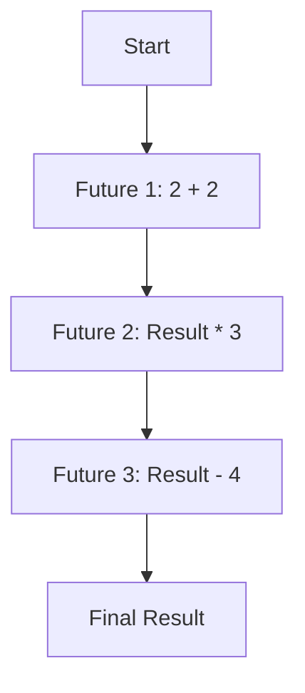

## 9.6 Futures, Promises, and Dataflow Programming

In the realm of concurrent and parallel programming, **Futures** and **Promises** are powerful abstractions that allow developers to handle asynchronous computations more effectively. These concepts, along with **Dataflow Programming**, provide a robust framework for building scalable and maintainable applications in Ruby. In this section, we will delve into these abstractions, explore their implementation using the `Concurrent-Ruby` gem, and demonstrate their practical applications.

### Understanding Futures and Promises

#### What are Futures?

A **Future** is a placeholder for a result that is initially unknown because the computation of the result is yet to be completed. It allows a program to continue executing other tasks while waiting for the result of the computation. Once the computation is complete, the Future is resolved with the result.

#### What are Promises?

A **Promise** is a write-once container that represents a value that may not be available yet. It is used to set the result of a Future. Promises are often used in conjunction with Futures to provide a mechanism for asynchronous computation.

#### Role in Concurrency

Futures and Promises play a crucial role in concurrency by allowing programs to perform non-blocking operations. They enable developers to write asynchronous code that is easier to understand and maintain, as opposed to traditional callback-based approaches.

### Implementing Futures and Promises in Ruby

Ruby, with its dynamic nature, provides several libraries to implement Futures and Promises. One of the most popular libraries is `Concurrent-Ruby`, which offers a rich set of concurrency abstractions.

#### Setting Up Concurrent-Ruby

To use Futures and Promises in Ruby, you need to install the `Concurrent-Ruby` gem. You can add it to your `Gemfile` or install it directly:

```ruby
gem install concurrent-ruby
```

#### Using Futures with Concurrent-Ruby

Here's a simple example demonstrating how to use Futures in Ruby:

```ruby
require 'concurrent-ruby'

# Create a Future to perform an asynchronous computation
future = Concurrent::Future.execute do
  # Simulate a long-running task
  sleep(2)
  "Result of the computation"
end

# Do other work while the Future is being resolved
puts "Doing other work..."

# Retrieve the result of the Future
result = future.value
puts "Future result: #{result}"
```

**Explanation:**

- We create a Future using `Concurrent::Future.execute`, which performs the computation asynchronously.
- The main thread continues executing, allowing other tasks to be performed.
- We retrieve the result using `future.value`, which blocks until the computation is complete.

#### Using Promises with Concurrent-Ruby

Promises can be used to set the result of a Future. Here's an example:

```ruby
require 'concurrent-ruby'

# Create a Promise
promise = Concurrent::Promise.new do
  # Simulate a computation
  sleep(2)
  "Promise result"
end

# Execute the Promise
promise.execute

# Retrieve the result of the Promise
result = promise.value
puts "Promise result: #{result}"
```

**Explanation:**

- A Promise is created using `Concurrent::Promise.new`.
- The computation is defined within the block passed to the Promise.
- The Promise is executed using `promise.execute`, and the result is retrieved using `promise.value`.

### Asynchronous Computation and Result Retrieval

Futures and Promises allow for asynchronous computation, enabling programs to perform tasks concurrently without blocking the main execution thread. This is particularly useful in scenarios where tasks involve I/O operations or long-running computations.

#### Example: Fetching Data from Multiple Sources

Consider a scenario where you need to fetch data from multiple sources concurrently:

```ruby
require 'concurrent-ruby'
require 'net/http'

# Define a method to fetch data from a URL
def fetch_data(url)
  uri = URI(url)
  response = Net::HTTP.get(uri)
  response
end

# Create Futures for each data source
future1 = Concurrent::Future.execute { fetch_data('https://api.example.com/data1') }
future2 = Concurrent::Future.execute { fetch_data('https://api.example.com/data2') }
future3 = Concurrent::Future.execute { fetch_data('https://api.example.com/data3') }

# Do other work while fetching data
puts "Fetching data from multiple sources..."

# Retrieve results
result1 = future1.value
result2 = future2.value
result3 = future3.value

puts "Data from source 1: #{result1}"
puts "Data from source 2: #{result2}"
puts "Data from source 3: #{result3}"
```

**Explanation:**

- We define a method `fetch_data` to fetch data from a given URL.
- We create Futures for each data source, allowing them to be fetched concurrently.
- The main thread continues executing, and we retrieve the results once they are available.

### Dataflow Programming Concepts

**Dataflow Programming** is a paradigm where the program is modeled as a directed graph of data flowing between operations. This approach is particularly useful in concurrent programming, as it allows for the automatic handling of dependencies between tasks.

#### Relationship with Futures and Promises

Futures and Promises can be seen as building blocks for dataflow programming. They provide a mechanism to represent and manage asynchronous data flows, enabling developers to write more declarative and less error-prone code.

#### Example: Dataflow with Futures and Promises

Consider a scenario where you need to perform a series of computations that depend on each other:

```ruby
require 'concurrent-ruby'

# Define a series of computations
future1 = Concurrent::Future.execute { 2 + 2 }
future2 = future1.then { |result| result * 3 }
future3 = future2.then { |result| result - 4 }

# Retrieve the final result
final_result = future3.value
puts "Final result: #{final_result}"
```

**Explanation:**

- We create a series of Futures, each dependent on the result of the previous one.
- The `then` method is used to chain computations, allowing for a dataflow-like structure.
- The final result is retrieved using `future3.value`.

### Simplifying Asynchronous Tasks

Futures and Promises simplify the handling of asynchronous tasks by providing a clear and concise way to represent computations and their dependencies. This abstraction reduces the complexity of managing threads and callbacks, leading to more readable and maintainable code.

#### Scenarios for Improved Readability and Efficiency

- **I/O Bound Operations**: Use Futures and Promises to perform network requests or file operations concurrently.
- **Parallel Computations**: Divide computationally intensive tasks into smaller units and execute them in parallel.
- **Event-Driven Systems**: Implement event-driven architectures where tasks are triggered by events and executed asynchronously.

### Limitations and Considerations

While Futures and Promises offer significant advantages, there are some limitations and considerations to keep in mind:

- **Error Handling**: Proper error handling is crucial, as exceptions in asynchronous tasks can be challenging to manage.
- **Resource Management**: Ensure that resources such as threads and memory are managed efficiently to avoid leaks.
- **Complexity**: While Futures and Promises simplify certain aspects of concurrency, they can introduce complexity if not used judiciously.

### Try It Yourself: Experiment with Futures and Promises

To deepen your understanding, try modifying the examples provided:

- Change the URLs in the data fetching example to test with different endpoints.
- Add error handling to the Promise example to see how exceptions are managed.
- Experiment with chaining more computations in the dataflow example to create complex workflows.

### Visualizing Dataflow with Futures and Promises

To better understand the flow of data and dependencies, let's visualize the dataflow using a Mermaid.js diagram:



**Description:**

- The diagram represents a series of computations, each dependent on the result of the previous one.
- It illustrates how data flows through the Futures, leading to the final result.

### Key Takeaways

- **Futures and Promises** provide a powerful abstraction for handling asynchronous computations in Ruby.
- **Concurrent-Ruby** offers a robust implementation of these abstractions, making it easier to write concurrent code.
- **Dataflow Programming** leverages Futures and Promises to model complex workflows and dependencies.
- Proper error handling and resource management are essential when using these abstractions.

### References and Further Reading

- [Concurrent-Ruby Documentation](https://github.com/ruby-concurrency/concurrent-ruby)
- [Ruby Concurrency Guide](https://www.rubyguides.com/2015/07/ruby-concurrency/)
- [MDN Web Docs: Promises](https://developer.mozilla.org/en-US/docs/Web/JavaScript/Guide/Using_promises)

Remember, mastering concurrency and asynchronous programming is a journey. Keep experimenting, stay curious, and enjoy the process of building scalable and maintainable Ruby applications!

## Quiz: Futures, Promises, and Dataflow Programming



### What is a Future in Ruby?

- [x] A placeholder for a result that is initially unknown
- [ ] A method for synchronous computation
- [ ] A type of Ruby class
- [ ] A Ruby gem for data storage

> **Explanation:** A Future is a placeholder for a result that is initially unknown because the computation is yet to be completed.

### What does a Promise represent in Ruby?

- [x] A write-once container for a value that may not be available yet
- [ ] A method for synchronous computation
- [ ] A type of Ruby class
- [ ] A Ruby gem for data storage

> **Explanation:** A Promise is a write-once container that represents a value that may not be available yet.

### Which Ruby gem is commonly used for implementing Futures and Promises?

- [x] Concurrent-Ruby
- [ ] Rails
- [ ] RSpec
- [ ] Nokogiri

> **Explanation:** Concurrent-Ruby is a popular gem used for implementing Futures and Promises in Ruby.

### How do Futures and Promises improve code readability?

- [x] By providing a clear and concise way to represent asynchronous computations
- [ ] By making code more complex
- [ ] By removing the need for error handling
- [ ] By eliminating the use of threads

> **Explanation:** Futures and Promises improve code readability by providing a clear and concise way to represent asynchronous computations and their dependencies.

### What is Dataflow Programming?

- [x] A paradigm where the program is modeled as a directed graph of data flowing between operations
- [ ] A method for synchronous computation
- [ ] A type of Ruby class
- [ ] A Ruby gem for data storage

> **Explanation:** Dataflow Programming is a paradigm where the program is modeled as a directed graph of data flowing between operations.

### Which method is used to chain computations in Concurrent-Ruby?

- [x] `then`
- [ ] `execute`
- [ ] `start`
- [ ] `run`

> **Explanation:** The `then` method is used to chain computations in Concurrent-Ruby, allowing for a dataflow-like structure.

### What is a key consideration when using Futures and Promises?

- [x] Proper error handling
- [ ] Avoiding the use of threads
- [ ] Eliminating all synchronous code
- [ ] Using only in single-threaded applications

> **Explanation:** Proper error handling is crucial when using Futures and Promises, as exceptions in asynchronous tasks can be challenging to manage.

### What is the primary advantage of using Futures and Promises?

- [x] They allow for non-blocking operations
- [ ] They make code more complex
- [ ] They eliminate the need for error handling
- [ ] They are only useful in single-threaded applications

> **Explanation:** The primary advantage of using Futures and Promises is that they allow for non-blocking operations, enabling asynchronous programming.

### What is the role of a Promise in relation to a Future?

- [x] It sets the result of a Future
- [ ] It executes a Future
- [ ] It cancels a Future
- [ ] It logs the result of a Future

> **Explanation:** A Promise is used to set the result of a Future, providing a mechanism for asynchronous computation.

### True or False: Futures and Promises can only be used for I/O operations.

- [ ] True
- [x] False

> **Explanation:** False. Futures and Promises can be used for any asynchronous computation, not just I/O operations.


