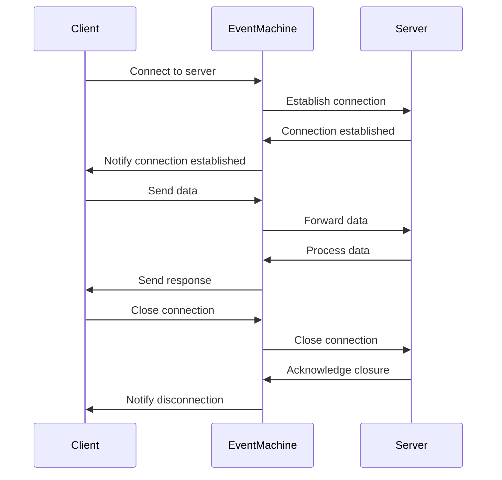

## 9.7 EventMachine and Event-Driven IO

In the realm of Ruby programming, handling concurrent operations efficiently is crucial for building scalable and high-performance applications. Event-driven programming, a paradigm that focuses on responding to events or changes in state, is a powerful approach to achieve this. In this section, we delve into EventMachine, a Ruby library that facilitates event-driven programming and non-blocking IO operations, making it ideal for network servers and clients.

### Understanding Event-Driven Programming and Non-Blocking IO

Event-driven programming is a paradigm where the flow of the program is determined by events such as user actions, sensor outputs, or message passing from other programs. This approach is particularly useful in applications that require high concurrency and responsiveness, such as web servers and real-time applications.

**Non-blocking IO** is a key concept in event-driven programming. It allows a program to initiate an IO operation and continue executing other tasks while waiting for the IO operation to complete. This is in contrast to blocking IO, where the program halts execution until the IO operation finishes.

### Introducing EventMachine

[EventMachine](https://github.com/eventmachine/eventmachine) is a Ruby library designed to handle event-driven IO operations efficiently. It provides an event loop that listens for IO events and dispatches them to appropriate handlers. This makes it possible to build applications that can handle thousands of simultaneous connections without the overhead of managing threads.

#### Key Features of EventMachine

- **Event Loop**: Central to EventMachine is its event loop, which continuously checks for IO events and triggers corresponding callbacks.
- **Non-Blocking IO**: EventMachine supports non-blocking IO operations, allowing applications to handle multiple connections concurrently.
- **Scalability**: Designed for high-performance network applications, EventMachine can manage thousands of connections with minimal resource usage.
- **Flexibility**: It can be used to build both TCP and UDP servers and clients.

### Building a Simple TCP Server with EventMachine

Let's explore how to create a simple TCP server using EventMachine. This example will demonstrate the basic structure and functionality of an EventMachine-based server.

```ruby
require 'eventmachine'

module EchoServer
  def post_init
    puts "Client connected"
  end

  def receive_data(data)
    send_data ">>> You sent: #{data}"
    close_connection if data =~ /quit/i
  end

  def unbind
    puts "Client disconnected"
  end
end

EventMachine.run do
  EventMachine.start_server "127.0.0.1", 8081, EchoServer
  puts "Echo server running on 127.0.0.1:8081"
end
```

**Explanation:**

- **`post_init`**: This method is called when a client connects to the server. It can be used to initialize connection-specific data.
- **`receive_data`**: This method is triggered whenever data is received from the client. In this example, it echoes the received data back to the client.
- **`unbind`**: This method is called when the connection is closed, either by the client or the server.

### EventMachine vs. Threads

EventMachine handles concurrency differently from traditional threading models. In a threaded model, each connection might be handled by a separate thread, which can lead to significant overhead and complexity in managing thread safety. EventMachine, on the other hand, uses a single-threaded event loop to manage multiple connections, reducing the overhead and complexity associated with thread management.

#### Benefits of EventMachine's Approach

- **Reduced Overhead**: By avoiding the creation of multiple threads, EventMachine reduces the overhead associated with context switching and memory usage.
- **Simplified Concurrency**: Developers do not need to worry about thread safety and synchronization issues, as the event loop handles concurrency.
- **Scalability**: EventMachine can handle a large number of connections with minimal resource usage, making it ideal for high-performance network applications.

### Building a Simple TCP Client with EventMachine

In addition to servers, EventMachine can also be used to build clients. Let's create a simple TCP client that connects to our echo server.

```ruby
require 'eventmachine'

module EchoClient
  def post_init
    send_data "Hello, server!"
  end

  def receive_data(data)
    puts "Received: #{data}"
    close_connection
  end

  def unbind
    puts "Disconnected from server"
    EventMachine.stop_event_loop
  end
end

EventMachine.run do
  EventMachine.connect "127.0.0.1", 8081, EchoClient
end
```

**Explanation:**

- **`post_init`**: Sends a message to the server upon establishing a connection.
- **`receive_data`**: Prints the server's response and closes the connection.
- **`unbind`**: Stops the event loop when the connection is closed.

### High-Performance Network Applications

EventMachine is particularly well-suited for high-performance network applications due to its ability to handle numerous connections concurrently with minimal resource usage. Applications such as chat servers, real-time analytics, and web servers can benefit from EventMachine's efficient event-driven architecture.

#### Frameworks Built on EventMachine

Several frameworks build upon EventMachine to provide additional functionality. One notable example is [EM-WebSocket](https://github.com/igrigorik/em-websocket), which facilitates WebSocket communication in Ruby applications. By leveraging EventMachine's event-driven architecture, EM-WebSocket can handle WebSocket connections efficiently, making it ideal for real-time web applications.

### Limitations of EventMachine

While EventMachine offers numerous benefits, it also has some limitations:

- **Complexity of Callback-Based Code**: Event-driven programming often relies on callbacks, which can lead to complex and difficult-to-maintain code, especially in large applications.
- **Single-Threaded Nature**: Although the single-threaded model simplifies concurrency, it can become a bottleneck if a single operation blocks the event loop.
- **Learning Curve**: Developers new to event-driven programming may find the paradigm challenging to grasp initially.

### Visualizing Event-Driven IO with EventMachine

To better understand how EventMachine manages IO events, let's visualize the process using a sequence diagram.



**Diagram Explanation:**

- The client initiates a connection to the server through EventMachine.
- EventMachine establishes the connection and notifies the client.
- Data sent by the client is forwarded to the server, processed, and a response is sent back.
- The connection is closed, and both the client and server are notified.

### Try It Yourself

To deepen your understanding of EventMachine, try modifying the code examples provided:

- **Experiment with Different Ports**: Change the port number in the server and client examples to see how it affects the connection.
- **Add Additional Functionality**: Enhance the echo server to handle different commands or messages from the client.
- **Implement a UDP Server**: Use EventMachine to create a UDP server and client, exploring the differences from TCP.

### Knowledge Check

- What are the key differences between blocking and non-blocking IO?
- How does EventMachine's event loop handle multiple connections concurrently?
- What are the benefits and limitations of using EventMachine for network applications?

### Conclusion

EventMachine is a powerful tool for building scalable, high-performance network applications in Ruby. By leveraging event-driven programming and non-blocking IO, developers can create applications that efficiently handle numerous connections with minimal resource usage. While there are challenges associated with the complexity of callback-based code, the benefits of EventMachine make it a valuable addition to any Ruby developer's toolkit.

Remember, mastering EventMachine and event-driven programming is a journey. As you experiment and build more complex applications, you'll gain a deeper understanding of how to harness the full potential of this powerful paradigm. Keep exploring, stay curious, and enjoy the process!

## Quiz: EventMachine and Event-Driven IO



### What is the primary advantage of non-blocking IO in event-driven programming?

- [x] It allows the program to continue executing other tasks while waiting for IO operations to complete.
- [ ] It simplifies the code by using fewer lines.
- [ ] It ensures that IO operations are executed in a specific order.
- [ ] It increases the security of the application.

> **Explanation:** Non-blocking IO allows the program to initiate an IO operation and continue executing other tasks, improving concurrency and responsiveness.

### How does EventMachine handle multiple connections concurrently?

- [x] By using a single-threaded event loop to manage IO events.
- [ ] By creating a new thread for each connection.
- [ ] By using a multi-threaded approach with locks.
- [ ] By queuing connections and processing them one at a time.

> **Explanation:** EventMachine uses a single-threaded event loop to manage multiple connections, reducing the overhead associated with thread management.

### What method is called when a client connects to an EventMachine server?

- [x] `post_init`
- [ ] `receive_data`
- [ ] `unbind`
- [ ] `connect`

> **Explanation:** The `post_init` method is called when a client connects to the server, allowing for initialization of connection-specific data.

### Which of the following is a limitation of EventMachine?

- [x] Complexity of callback-based code.
- [ ] Inability to handle multiple connections.
- [ ] High memory usage.
- [ ] Lack of support for TCP connections.

> **Explanation:** Event-driven programming often relies on callbacks, which can lead to complex and difficult-to-maintain code.

### What is the role of the `receive_data` method in an EventMachine server?

- [x] It processes data received from the client.
- [ ] It initializes the server.
- [ ] It closes the connection.
- [ ] It sends data to the client.

> **Explanation:** The `receive_data` method is triggered whenever data is received from the client, allowing the server to process it.

### Which framework builds upon EventMachine to facilitate WebSocket communication?

- [x] EM-WebSocket
- [ ] Sinatra
- [ ] Rails
- [ ] Puma

> **Explanation:** EM-WebSocket is a framework that builds upon EventMachine to provide WebSocket communication capabilities.

### What is a benefit of using EventMachine for high-performance network applications?

- [x] It can handle numerous connections with minimal resource usage.
- [ ] It simplifies the user interface design.
- [ ] It guarantees data encryption.
- [ ] It automatically scales the application.

> **Explanation:** EventMachine's efficient event-driven architecture allows it to handle numerous connections concurrently with minimal resource usage.

### What is the purpose of the `unbind` method in an EventMachine client?

- [x] To stop the event loop when the connection is closed.
- [ ] To send data to the server.
- [ ] To initialize the client.
- [ ] To establish a new connection.

> **Explanation:** The `unbind` method is called when the connection is closed, and it can be used to stop the event loop.

### True or False: EventMachine uses a multi-threaded approach to handle concurrency.

- [ ] True
- [x] False

> **Explanation:** EventMachine uses a single-threaded event loop to handle concurrency, avoiding the overhead of managing multiple threads.

### What is a common use case for EventMachine in Ruby applications?

- [x] Building scalable network servers and clients.
- [ ] Designing graphical user interfaces.
- [ ] Performing complex mathematical calculations.
- [ ] Managing database transactions.

> **Explanation:** EventMachine is commonly used to build scalable network servers and clients due to its efficient handling of IO events.


